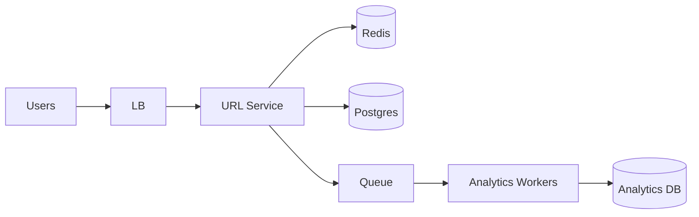

# Case Study 01 — URL Shortener

Design a service like **bit.ly**: turn long URLs into short links and redirect quickly.

## 1. Problem

Users paste a long URL and receive a short URL. Opening the short URL redirects to the original.

## 2. Requirements

### Functional (MVP)

- Create short URL from long URL  
- Redirect short → long  
- Optional expiry  
- Basic click count  

### Out of scope (initially)

- Custom domains, A/B experiments, malware scanning UI  

### Non-functional

- Redirects very fast (cacheable)  
- High read:write ratio (redirects >> creates)  
- Short codes reasonably unique and hard to guess at scale  
- High availability for redirects  

## 3. Back-of-the-envelope

Assumptions:

- 100M new URLs/month  
- Read:write ≈ 100:1  

```text
Write QPS ≈ 100M / 2.5e6 ≈ 40/s (avg), peak ~200/s
Read QPS ≈ 4,000/s avg, peak ~20,000/s
Storage/year ≈ 100M × 12 × ~500B ≈ 600GB (+ indexes)
```

Insight: **optimize the redirect path** with caching.

## 4. High-Level Design (HLD)



### Components

| Component | Role |
|-----------|------|
| URL Service | Create codes, redirect |
| Postgres | Source of truth `code → url` |
| Redis | Hot mapping cache |
| Queue + workers | Async click events |

### Flows

**Create**

1. Validate URL  
2. Generate unique short code  
3. Insert DB  
4. Optionally warm cache  
5. Return short URL  

**Redirect**

1. Lookup code in Redis  
2. On miss, DB → fill cache  
3. HTTP 302 to long URL  
4. Enqueue click event (don’t block redirect)  

### Trade-offs

- 302 (temporary) vs 301 (permanent browser cache) — 302 gives more control/stats  
- Random codes vs counter-based — random avoids enumerable guessing; counter needs coordination  

## 5. Low-Level Design (LLD)

### APIs

```text
POST /api/v1/urls
Body: { "longUrl": "...", "expiresAt": null }
→ { "shortCode": "aZ9kQ2", "shortUrl": "https://short.ly/aZ9kQ2" }

GET /r/:code
→ 302 Location: <longUrl>
→ 404 if missing/expired

GET /api/v1/urls/:code/stats
→ { "clicks": 12345 }
```

### Schema

```text
urls (
  short_code  VARCHAR(10) PRIMARY KEY,
  long_url    TEXT NOT NULL,
  user_id     BIGINT NULL,
  created_at  TIMESTAMPTZ NOT NULL,
  expires_at  TIMESTAMPTZ NULL,
  is_active   BOOLEAN DEFAULT TRUE
)

-- optional aggregated stats
url_stats (
  short_code VARCHAR(10) PRIMARY KEY,
  click_count BIGINT DEFAULT 0
)
```

### Modules

```text
UrlController
UrlService
ShortCodeGenerator
UrlRepository
UrlCache
ClickEventProducer
```

### Algorithm — short code generation

Base62 alphabet: `0-9a-zA-Z` (62 chars).

7 chars → \(62^7 ≈ 3.5 \times 10^{12}\) possibilities.

```text
function createShortUrl(longUrl):
  validate(longUrl)
  for attempt in 1..5:
    code = base62(randomBits(48)).take(7)
    try:
      repo.insert(code, longUrl)
      cache.set(code, longUrl, ttl=1 day)
      return code
    catch DuplicateKey:
      continue
  fail("could not allocate code")
```

Alternative: distribute ranges of a global counter (or Snowflake IDs) then base62-encode — fewer collisions, more coordination.

### Algorithm — redirect

```text
function redirect(code):
  longUrl = cache.get(code)
  if longUrl is null:
    row = repo.findActive(code)
    if row is null: return 404
    if row.expired: return 410
    longUrl = row.longUrl
    cache.set(code, longUrl, ttl)
  enqueueClick(code, timestamp, userAgentHash)
  return 302(longUrl)
```

### Concurrency & correctness

- `PRIMARY KEY (short_code)` prevents duplicates across servers  
- Cache TTL + delete cache on disable/delete  
- Clicks are eventually consistent aggregates  

## 6. Scale evolution

| Stage | Change |
|-------|--------|
| MVP | Single Postgres + Redis |
| Hot keys | Larger Redis cluster; CDN only if using 301 carefully |
| Huge data | Shard `urls` by `hash(short_code)` |
| Global | Regional caches; replicate mappings |

## 7. Recap

- Redirect path is sacred → cache aggressively  
- DB unique constraint is the source of code uniqueness  
- Analytics async so redirects stay fast  

**Practice:** redraw HLD from memory, then implement `create` + `redirect` pseudocode without looking.
