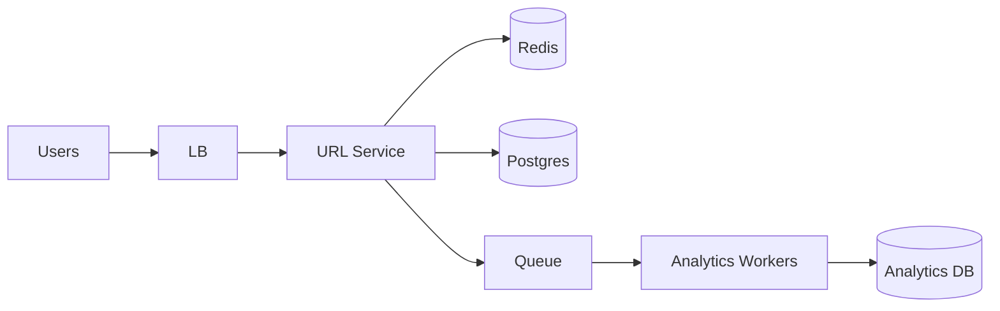

# Case Study 01 — URL Shortener

Design a service like **bit.ly**: turn long URLs into short links and redirect quickly.

> **Practice first:** Read §§1–2 only, then run the [Thinking Loop](../thinking/01-the-thinking-loop.md) for 10–15 minutes before scrolling to estimates/HLD. Self-score with [Practice Without Spoilers](../thinking/04-practice-without-spoilers.md). Hear a sample narration in [First 10 Minutes — Walkthrough A](../thinking/03-first-10-minutes.md).

## 1. Problem

Users paste a long URL and receive a short URL. Opening the short URL redirects to the original.

## 2. Requirements

### Functional (MVP)

- Create short URL from long URL  
- Redirect short → long  
- Optional expiry  
- Basic click count  

### Out of scope (initially)

- Custom domains, A/B experiments, malware scanning UI  

### Non-functional

- Redirects very fast (cacheable)  
- High read:write ratio (redirects >> creates)  
- Short codes reasonably unique and hard to guess at scale  
- High availability for redirects  

## 3. Back-of-the-envelope estimates

We do rough math so we know **what to optimize**. Exact precision is not the goal — **order of magnitude** is.

### Why we estimate (beginner tip)

Ask three questions:
1. **How busy?** → QPS (requests per second)
2. **How much data?** → storage (GB/TB)
3. **How fat is the pipe?** → bandwidth (MB/s) when media matters

Cheat sheet: **1 QPS ≈ 86,400 requests/day**. Peak is often **2–5×** average.

### Assumptions (say these out loud)

- **100M new short URLs per month** (creates / writes)
- Each redirect is a **read**; people click links far more than they create them
- **Read:write ratio ≈ 100:1** (100 redirects for every 1 create)
- Each stored row ≈ **500 bytes** (`short_code`, `long_url`, timestamps, indexes)
- Redirect responses are tiny (HTTP 302 + headers) — bandwidth is not the bottleneck

### Step A — Traffic (QPS)

```text
Seconds per month ≈ 30 days × 86,400 ≈ 2.6 million

Write QPS (creates):
  100M creates / month ÷ 2.6M seconds ≈ 40/s average
  Peak (5× avg)                         ≈ 200/s

Read QPS (redirects):
  40 writes/s × 100 read:write ratio   ≈ 4,000/s average
  Peak (5× avg)                         ≈ 20,000/s

Daily sanity check:
  100M / month ≈ 3.3M creates/day  →  3.3M / 86,400 ≈ 38/s  ✓
  3.3M × 100 ≈ 330M redirects/day  →  ~3,800/s average      ✓
```

### Step B — Storage

```text
New rows per year:
  100M/month × 12 months = 1.2 billion URLs/year

Raw data:
  1.2B rows × 500 bytes ≈ 600 GB/year (mapping data only)

With indexes (+50–100%):
  Plan for ~1 TB/year for URL mappings

Analytics (click events) can grow faster — store separately, not in the hot redirect path
```

### Step C — Bandwidth / other (if relevant)

Redirect responses are **~500 bytes–1 KB** each (302 + `Location` header). At 20,000 peak redirect QPS:

```text
20,000/s × 1 KB ≈ 20 MB/s egress — modest for a load balancer tier
```

Bandwidth is **not** the first problem here. **Read QPS** is.

### Step D — Read:write ratio

| Path | Approx share | Implication |
|------|--------------|-------------|
| **Redirect (GET /r/:code)** | ~99% of traffic | Must be fast; cache aggressively (Redis) |
| **Create (POST /urls)** | ~1% of traffic | Can tolerate slightly higher latency |
| **Stats / admin reads** | Tiny | Async aggregates OK |

### What the numbers tell us

- **~20k peak read QPS** → Redis cache for `code → long_url` is essential; DB should not serve every redirect
- **Only ~200 peak write QPS** → a single Postgres primary can handle creates for a long time
- **~600 GB–1 TB/year** → one DB shard is fine initially; shard by `hash(short_code)` only when rows hit billions
- **Click analytics** are fire-and-forget → queue + workers so redirects never wait on stats writes
- **100:1 read:write** is the classic cache-friendly shape — optimize reads first

### Common mistake for this problem

Beginners put click counting **inside the redirect path** (sync DB write on every click). That turns a 99% read workload into a write-heavy one and kills latency — enqueue clicks asynchronously instead.

## 4. High-Level Design (HLD)



### Components

| Component | Role |
|-----------|------|
| URL Service | Create codes, redirect |
| Postgres | Source of truth `code → url` |
| Redis | Hot mapping cache |
| Queue + workers | Async click events |

### Flows

**Create**

1. Validate URL  
2. Generate unique short code  
3. Insert DB  
4. Optionally warm cache  
5. Return short URL  

**Redirect**

1. Lookup code in Redis  
2. On miss, DB → fill cache  
3. HTTP 302 to long URL  
4. Enqueue click event (don’t block redirect)  

### Trade-offs

- 302 (temporary) vs 301 (permanent browser cache) — 302 gives more control/stats  
- Random codes vs counter-based — random avoids enumerable guessing; counter needs coordination  

## 5. Low-Level Design (LLD)

### APIs

```text
POST /api/v1/urls
Body: { "longUrl": "...", "expiresAt": null }
→ { "shortCode": "aZ9kQ2", "shortUrl": "https://short.ly/aZ9kQ2" }

GET /r/:code
→ 302 Location: <longUrl>
→ 404 if missing/expired

GET /api/v1/urls/:code/stats
→ { "clicks": 12345 }
```

### Schema

```text
urls (
  short_code  VARCHAR(10) PRIMARY KEY,
  long_url    TEXT NOT NULL,
  user_id     BIGINT NULL,
  created_at  TIMESTAMPTZ NOT NULL,
  expires_at  TIMESTAMPTZ NULL,
  is_active   BOOLEAN DEFAULT TRUE
)

-- optional aggregated stats
url_stats (
  short_code VARCHAR(10) PRIMARY KEY,
  click_count BIGINT DEFAULT 0
)
```

### Modules

```text
UrlController
UrlService
ShortCodeGenerator
UrlRepository
UrlCache
ClickEventProducer
```

### Algorithm — short code generation

Base62 alphabet: `0-9a-zA-Z` (62 chars).

7 chars → \(62^7 ≈ 3.5 \times 10^{12}\) possibilities.

```text
function createShortUrl(longUrl):
  validate(longUrl)
  for attempt in 1..5:
    code = base62(randomBits(48)).take(7)
    try:
      repo.insert(code, longUrl)
      cache.set(code, longUrl, ttl=1 day)
      return code
    catch DuplicateKey:
      continue
  fail("could not allocate code")
```

Alternative: distribute ranges of a global counter (or Snowflake IDs) then base62-encode — fewer collisions, more coordination.

### Algorithm — redirect

```text
function redirect(code):
  longUrl = cache.get(code)
  if longUrl is null:
    row = repo.findActive(code)
    if row is null: return 404
    if row.expired: return 410
    longUrl = row.longUrl
    cache.set(code, longUrl, ttl)
  enqueueClick(code, timestamp, userAgentHash)
  return 302(longUrl)
```

### Concurrency & correctness

- `PRIMARY KEY (short_code)` prevents duplicates across servers  
- Cache TTL + delete cache on disable/delete  
- Clicks are eventually consistent aggregates  

## 6. Scale evolution

| Stage | Change |
|-------|--------|
| MVP | Single Postgres + Redis |
| Hot keys | Larger Redis cluster; CDN only if using 301 carefully |
| Huge data | Shard `urls` by `hash(short_code)` |
| Global | Regional caches; replicate mappings |

## 7. Recap

- Redirect path is sacred → cache aggressively  
- DB unique constraint is the source of code uniqueness  
- Analytics async so redirects stay fast  

**Practice:** redraw HLD from memory, then implement `create` + `redirect` pseudocode without looking.
