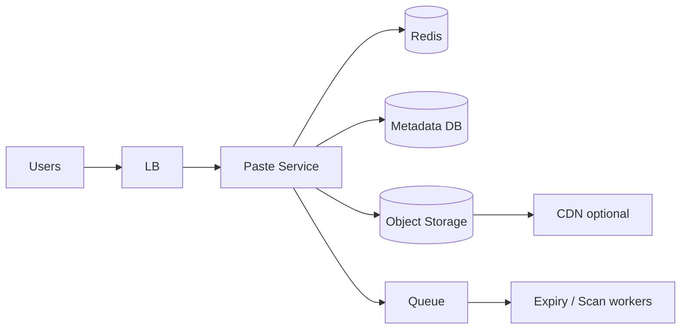

# Case Study 02 — Pastebin

Design a **Pastebin-like** service: users paste text and get a shareable link.

## 1. Problem

Store arbitrary text snippets, return a URL, allow public (or unlisted) reads, support expiry and optional burn-after-read.

## 2. Requirements

### Functional (MVP)

- Create paste (raw text)  
- Read paste by id  
- Optional expiry  
- Optional password  
- List my pastes (if logged in)  

### Out of scope

- Full IDE syntax highlighting pipeline at global scale, collaborative editing  

### Non-functional

- Pastes can be large (e.g., up to 1–10 MB)  
- Read-heavy for viral pastes  
- Durability of content until expiry  

## 3. Estimates

Assume:

- 5M creates/day, 50M reads/day  
- Average paste 10 KB, p99 = 1 MB  

```text
Write QPS ≈ 60, Read QPS ≈ 600 (peak reads thousands)
Storage/year ≈ 5M × 365 × 10KB ≈ 18TB
```

Insight: **don’t store huge blobs only in OLTP DB** — use object storage for content, DB for metadata.

## 4. HLD



### Why this shape

- Metadata (owner, expiry, visibility) → SQL/NoSQL DB  
- Body bytes → S3 key  
- Hot pastes → Redis cache of body or CDN for public large pastes  
- Workers delete expired objects  

### Flows

**Create:** API writes metadata row + puts body to S3 (or inline small bodies in DB).  
**Read:** metadata → authorize → fetch body (cache/S3).  

## 5. LLD

### APIs

```text
POST /api/v1/pastes
{ "content": "...", "expiresInSec": 3600, "visibility": "unlisted", "password": null }
→ { "id": "Xk9mQa", "url": "https://paste.dev/p/Xk9mQa" }

GET /api/v1/pastes/:id
Headers: X-Paste-Password: ... (if needed)
→ { "content": "...", "createdAt": "...", "expiresAt": "..." }

DELETE /api/v1/pastes/:id
```

### Schema

```text
pastes (
  paste_id     VARCHAR(12) PK,
  owner_id     BIGINT NULL,
  s3_key       TEXT NULL,
  content_inline TEXT NULL,  -- for small pastes
  size_bytes   INT,
  visibility   VARCHAR(16),  -- public|unlisted|private
  password_hash TEXT NULL,
  burn_after_read BOOLEAN,
  created_at   TIMESTAMPTZ,
  expires_at   TIMESTAMPTZ NULL,
  is_deleted   BOOLEAN DEFAULT FALSE
)
CREATE INDEX ON pastes(owner_id, created_at DESC);
CREATE INDEX ON pastes(expires_at);
```

### Size policy

```text
if size <= 32KB:
  store inline in content_inline
else:
  put S3 at pastes/{id}
  store s3_key
```

### Modules

```text
PasteService
ContentStore (inline vs S3)
PasteCache
ExpiryWorker
PasswordHasher
```

### Burn-after-read

```text
in transaction:
  read paste
  if burn_after_read: mark deleted
return content
async delete S3 object
```

Use strong consistency on metadata for burn-after-read correctness.

### Caching

```text
key: paste:body:{id}
Do not cache password-protected pastes without auth token binding.
TTL min(10 minutes, time_until_expiry)
```

## 6. Scale evolution

- Shard metadata by `paste_id`  
- Lifecycle rules on S3 for expiry  
- Virus/malware scanning queue for public pastes  
- Rate limit creates per IP/user  

## 7. Recap

- Split **metadata vs content**  
- Viral reads → cache  
- Expiry workers + S3 lifecycle  

**Next practice:** design password-protected paste auth without caching secrets.
