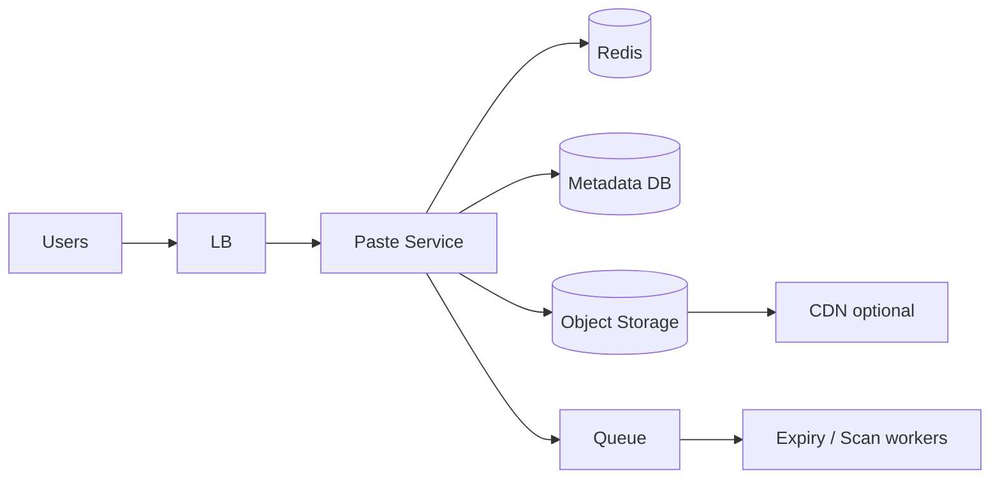

# Case Study 02 — Pastebin

Design a **Pastebin-like** service: users paste text and get a shareable link.

## 1. Problem

Store arbitrary text snippets, return a URL, allow public (or unlisted) reads, support expiry and optional burn-after-read.

## 2. Requirements

### Functional (MVP)

- Create paste (raw text)  
- Read paste by id  
- Optional expiry  
- Optional password  
- List my pastes (if logged in)  

### Out of scope

- Full IDE syntax highlighting pipeline at global scale, collaborative editing  

### Non-functional

- Pastes can be large (e.g., up to 1–10 MB)  
- Read-heavy for viral pastes  
- Durability of content until expiry  

## 3. Back-of-the-envelope estimates

We do rough math so we know **what to optimize**. Exact precision is not the goal — **order of magnitude** is.

### Why we estimate (beginner tip)

Ask three questions:
1. **How busy?** → QPS (requests per second)
2. **How much data?** → storage (GB/TB)
3. **How fat is the pipe?** → bandwidth (MB/s) when media matters

Cheat sheet: **1 QPS ≈ 86,400 requests/day**. Peak is often **2–5×** average.

### Assumptions (say these out loud)

- **5M new pastes per day** (writes)
- **50M paste reads per day** (reads) → read:write ≈ **10:1**
- Average paste body **10 KB**; occasional large pastes up to **1 MB** (p99)
- Metadata row per paste ≈ **300 bytes** (id, owner, expiry, S3 key, etc.)
- Pastes can go viral — a single paste might get millions of reads in hours

### Step A — Traffic (QPS)

```text
Write QPS (creates):
  5M / day ÷ 86,400 seconds ≈ 58/s average
  Peak (5× avg)                ≈ 290/s

Read QPS:
  50M / day ÷ 86,400 seconds ≈ 580/s average
  Peak (5× avg, viral spike)   ≈ 3,000/s for a hot paste

Read:write ratio ≈ 50M / 5M = 10:1
```

### Step B — Storage

```text
Content (bodies) per year:
  5M pastes/day × 365 days × 10 KB avg ≈ 18 TB/year

Metadata in SQL:
  5M × 365 × 300 bytes ≈ 550 GB/year (+ indexes → ~1 TB)

Large pastes (1 MB) are rare but add tail risk — cap upload size (e.g. 10 MB) and reject abuse
```

### Step C — Bandwidth / other (if relevant)

Serving a **10 KB** paste at 580 read QPS average:

```text
580/s × 10 KB ≈ 5.8 MB/s average egress from origin

Viral paste (3,000 read QPS × 1 MB):
  3,000 × 1 MB ≈ 3 GB/s — origin cannot handle this; CDN + cache required for hot pastes
```

Upload bandwidth at peak create (~290/s × 10 KB) ≈ **2.9 MB/s** — manageable.

### Step D — Read:write ratio

| Path | Approx share | Implication |
|------|--------------|-------------|
| **Read paste (GET)** | ~90% of API traffic | Cache hot bodies in Redis; CDN for large public pastes |
| **Create paste (POST)** | ~10% | Write to S3 (or inline if tiny), metadata to DB |
| **Delete / expiry** | Background | Async workers + S3 lifecycle rules |

### What the numbers tell us

- **~18 TB/year of content** → store bodies in **S3**, not Postgres BLOB columns
- **Metadata ~1 TB/year** → SQL/NoSQL for rows is fine; index by `paste_id` and `expires_at`
- **Small pastes (≤ 32 KB)** can live inline in DB for speed; larger ones go to S3
- **Viral reads** need Redis cache (`paste:body:{id}`) with TTL capped by expiry time
- **Expiry workers** must delete both metadata rows and S3 objects — plan for ~5M deletes/day at steady state

### Common mistake for this problem

Storing entire paste content inside the **OLTP database** because "it's simpler." At 18 TB/year, DB storage cost and backup time explode — split metadata (DB) from content (object storage) from day one.

## 4. HLD



### Why this shape

- Metadata (owner, expiry, visibility) → SQL/NoSQL DB  
- Body bytes → S3 key  
- Hot pastes → Redis cache of body or CDN for public large pastes  
- Workers delete expired objects  

### Flows

**Create:** API writes metadata row + puts body to S3 (or inline small bodies in DB).  
**Read:** metadata → authorize → fetch body (cache/S3).  

## 5. LLD

### APIs

```text
POST /api/v1/pastes
{ "content": "...", "expiresInSec": 3600, "visibility": "unlisted", "password": null }
→ { "id": "Xk9mQa", "url": "https://paste.dev/p/Xk9mQa" }

GET /api/v1/pastes/:id
Headers: X-Paste-Password: ... (if needed)
→ { "content": "...", "createdAt": "...", "expiresAt": "..." }

DELETE /api/v1/pastes/:id
```

### Schema

```text
pastes (
  paste_id     VARCHAR(12) PK,
  owner_id     BIGINT NULL,
  s3_key       TEXT NULL,
  content_inline TEXT NULL,  -- for small pastes
  size_bytes   INT,
  visibility   VARCHAR(16),  -- public|unlisted|private
  password_hash TEXT NULL,
  burn_after_read BOOLEAN,
  created_at   TIMESTAMPTZ,
  expires_at   TIMESTAMPTZ NULL,
  is_deleted   BOOLEAN DEFAULT FALSE
)
CREATE INDEX ON pastes(owner_id, created_at DESC);
CREATE INDEX ON pastes(expires_at);
```

### Size policy

```text
if size <= 32KB:
  store inline in content_inline
else:
  put S3 at pastes/{id}
  store s3_key
```

### Modules

```text
PasteService
ContentStore (inline vs S3)
PasteCache
ExpiryWorker
PasswordHasher
```

### Burn-after-read

```text
in transaction:
  read paste
  if burn_after_read: mark deleted
return content
async delete S3 object
```

Use strong consistency on metadata for burn-after-read correctness.

### Caching

```text
key: paste:body:{id}
Do not cache password-protected pastes without auth token binding.
TTL min(10 minutes, time_until_expiry)
```

## 6. Scale evolution

- Shard metadata by `paste_id`  
- Lifecycle rules on S3 for expiry  
- Virus/malware scanning queue for public pastes  
- Rate limit creates per IP/user  

## 7. Recap

- Split **metadata vs content**  
- Viral reads → cache  
- Expiry workers + S3 lifecycle  

**Next practice:** design password-protected paste auth without caching secrets.
