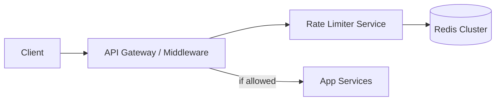

# Case Study 03 — Rate Limiter

Design a **rate limiter** that protects APIs from abuse and overload.

> **Practice first:** Stop after requirements, run the [Thinking Loop](../thinking/01-the-thinking-loop.md), then use [Pattern Choosers](../thinking/02-pattern-choosers.md) (sync path vs Redis counters). Grade with [Practice Without Spoilers](../thinking/04-practice-without-spoilers.md).

## 1. Problem

Allow at most `N` requests per client per time window (e.g., 100 req/min/IP or per API key).

## 2. Requirements

### Functional

- Enforce limits per key (IP, userId, apiKey)  
- Return clear errors (`429 Too Many Requests`) with `Retry-After`  
- Support different rules per endpoint  
- Optional distributed enforcement across many API nodes  

### Non-functional

- Very low latency overhead  
- Correct enough under concurrency  
- Highly available (if limiter fails, define fail-open vs fail-closed)  

## 3. Back-of-the-envelope estimates

We do rough math so we know **what to optimize**. Exact precision is not the goal — **order of magnitude** is.

### Why we estimate (beginner tip)

Ask three questions:
1. **How busy?** → QPS (requests per second)
2. **How much data?** → storage (GB/TB)
3. **How fat is the pipe?** → bandwidth (MB/s) when media matters

Cheat sheet: **1 QPS ≈ 86,400 requests/day**. Peak is often **2–5×** average.

### Assumptions (say these out loud)

- Edge API handles **100k requests/sec at peak** (all endpoints combined)
- Rate limit checked on **every request** before it hits app logic
- Typical rule: **100 requests/min per user** (or per IP / API key)
- **10M active keys** (users/IPs) with limits enforced concurrently
- Limiter must add **< 1 ms** overhead — it sits on the critical path

### Step A — Traffic (QPS)

```text
Limiter check QPS = API QPS (one check per request):
  Average API load (assume 20% of peak)  ≈ 20,000/s
  Peak                                    ≈ 100,000/s

Each check = 1–2 Redis ops (INCR or token-bucket Lua script)
  100k Redis ops/s → well within a Redis cluster's capacity (100k+ ops/s per node)

Per-key update rate (100 req/min limit):
  Max 100 checks/min/key ≈ 1.7 ops/s/key — tiny
```

### Step B — Storage

```text
Memory per key (token bucket or sliding window counter):
  ~50–100 bytes (tokens, last refill timestamp, TTL metadata)

10M active keys × 100 bytes ≈ 1 GB RAM

With 50M keys (generous): ≈ 5 GB — fits comfortably in Redis cluster

Keys expire via TTL — no long-term disk storage needed
```

### Step C — Bandwidth / other (if relevant)

Each limiter check sends/receives **~100 bytes** over the network (if Redis is remote):

```text
100k checks/s × 100 bytes ≈ 10 MB/s Redis traffic — negligible

If limiter is embedded as middleware with local Redis sidecar, latency drops further
```

Not applicable for media bandwidth — this is a **latency + memory** problem.

### Step D — Read:write ratio

| Path | Approx share | Implication |
|------|--------------|-------------|
| **Limiter check (read + write)** | 100% of API traffic | Must be O(1); no DB round trips |
| **Rule config updates** | Rare admin writes | Can use DB; not on hot path |
| **429 responses** | Small fraction when limited | Cheap to generate |

Every API request is both a **read** (get current count/tokens) and a **write** (increment/decrement) — design for atomic ops.

### What the numbers tell us

- **100k peak checks/s** → in-process middleware + **Redis cluster**, not a separate network hop per request if avoidable
- **O(1) per check** — token bucket or fixed window counter; avoid sliding window log (stores every timestamp)
- **~1–5 GB RAM** for counters → Redis is the right tool; Postgres is too slow for this hot path
- **Lua scripts in Redis** for atomic read-modify-write — prevents race conditions across API nodes
- **Fail-open vs fail-closed** must be decided upfront — payments fail-closed; public reads may fail-open

### Common mistake for this problem

Using **per-server in-memory counters** without a shared store. With 10 API nodes, each allows 100 req/min → a client rotating across nodes gets **10× the limit**. Centralize counters in Redis for distributed correctness.

## 4. HLD



Often implemented as **library/middleware** + Redis, not a separate network hop — but conceptually a component.

### Placement options

1. API gateway (Kong, Nginx, Envoy)  
2. Middleware in each service  
3. Sidecar  

## 5. LLD — algorithms

### A) Fixed window counter

```text
key = rate:{user}:{YYYYMMDDhhmm}
INCR key
EXPIRE key 60  # if first
if count > limit: deny
```

Simple, but bursts at window edges (2× limit across boundary).

### B) Sliding window log

Store timestamps of requests in a sorted set; remove old; count.

Accurate, more memory.

### C) Sliding window counter (approx)

Blend previous window + current weighted by overlap — good balance.

### D) Token bucket (common)

Bucket holds tokens; refill at rate `r`; each request costs 1 token.

Allows short bursts up to burst capacity `b`.

```text
# Redis Lua for atomicity (conceptual)
tokens = min(capacity, tokens + refill(now - last))
if tokens < 1: deny
else tokens -= 1; allow
```

### E) Leaky bucket

Smooths outflow to constant rate — great for shaping.

### Recommended default

**Token bucket in Redis** with Lua script for atomic updates.

### API (middleware)

```text
allow, retryAfter = limiter.check(key="user:42", rule="POST:/payments")
if not allow:
  return 429 { "error": "rate_limit", "retryAfterSec": retryAfter }
```

### Rule config

```text
rules (
  name,
  capacity,
  refill_per_sec,
  key_template  -- "user:{userId}" | "ip:{ip}"
)
```

Example rules:

- Login: 5 / 15 min / IP  
- URL create: 30 / min / user  
- Public read: 1000 / min / IP  

### Distributed consistency

All app nodes share Redis → global limit.

Local memory limits alone can be bypassed by hitting different nodes (`N × limit`).

### Fail posture

- **Fail-open:** if Redis down, allow (availability)  
- **Fail-closed:** deny (safety)  

Payments often fail-closed; public marketing pages may fail-open with care.

## 6. Response headers

```text
X-RateLimit-Limit: 100
X-RateLimit-Remaining: 12
X-RateLimit-Reset: 1710000060
```

## 7. Scale evolution

- Redis cluster sharding by key  
- Hierarchical limits (per user + global)  
- Edge rate limits at CDN/WAF for volumetric DDoS  

## 8. Recap

- Pick algorithm based on burst needs (token bucket is a strong default)  
- Centralize counters in Redis for multi-node correctness  
- Always decide fail-open vs fail-closed  

**Interview tip:** draw token bucket and explain edge burst of fixed windows.
