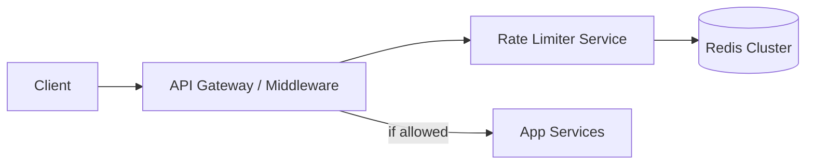

# Case Study 03 — Rate Limiter

Design a **rate limiter** that protects APIs from abuse and overload.

## 1. Problem

Allow at most `N` requests per client per time window (e.g., 100 req/min/IP or per API key).

## 2. Requirements

### Functional

- Enforce limits per key (IP, userId, apiKey)  
- Return clear errors (`429 Too Many Requests`) with `Retry-After`  
- Support different rules per endpoint  
- Optional distributed enforcement across many API nodes  

### Non-functional

- Very low latency overhead  
- Correct enough under concurrency  
- Highly available (if limiter fails, define fail-open vs fail-closed)  

## 3. Estimates

Edge API at 100k RPS peak → limiter must be O(1) memory ops, usually Redis.

## 4. HLD



Often implemented as **library/middleware** + Redis, not a separate network hop — but conceptually a component.

### Placement options

1. API gateway (Kong, Nginx, Envoy)  
2. Middleware in each service  
3. Sidecar  

## 5. LLD — algorithms

### A) Fixed window counter

```text
key = rate:{user}:{YYYYMMDDhhmm}
INCR key
EXPIRE key 60  # if first
if count > limit: deny
```

Simple, but bursts at window edges (2× limit across boundary).

### B) Sliding window log

Store timestamps of requests in a sorted set; remove old; count.

Accurate, more memory.

### C) Sliding window counter (approx)

Blend previous window + current weighted by overlap — good balance.

### D) Token bucket (common)

Bucket holds tokens; refill at rate `r`; each request costs 1 token.

Allows short bursts up to burst capacity `b`.

```text
# Redis Lua for atomicity (conceptual)
tokens = min(capacity, tokens + refill(now - last))
if tokens < 1: deny
else tokens -= 1; allow
```

### E) Leaky bucket

Smooths outflow to constant rate — great for shaping.

### Recommended default

**Token bucket in Redis** with Lua script for atomic updates.

### API (middleware)

```text
allow, retryAfter = limiter.check(key="user:42", rule="POST:/payments")
if not allow:
  return 429 { "error": "rate_limit", "retryAfterSec": retryAfter }
```

### Rule config

```text
rules (
  name,
  capacity,
  refill_per_sec,
  key_template  -- "user:{userId}" | "ip:{ip}"
)
```

Example rules:

- Login: 5 / 15 min / IP  
- URL create: 30 / min / user  
- Public read: 1000 / min / IP  

### Distributed consistency

All app nodes share Redis → global limit.

Local memory limits alone can be bypassed by hitting different nodes (`N × limit`).

### Fail posture

- **Fail-open:** if Redis down, allow (availability)  
- **Fail-closed:** deny (safety)  

Payments often fail-closed; public marketing pages may fail-open with care.

## 6. Response headers

```text
X-RateLimit-Limit: 100
X-RateLimit-Remaining: 12
X-RateLimit-Reset: 1710000060
```

## 7. Scale evolution

- Redis cluster sharding by key  
- Hierarchical limits (per user + global)  
- Edge rate limits at CDN/WAF for volumetric DDoS  

## 8. Recap

- Pick algorithm based on burst needs (token bucket is a strong default)  
- Centralize counters in Redis for multi-node correctness  
- Always decide fail-open vs fail-closed  

**Interview tip:** draw token bucket and explain edge burst of fixed windows.
