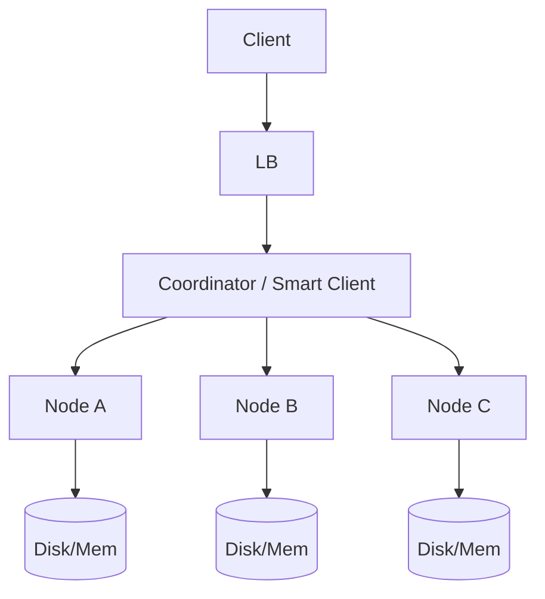

# Case Study 04 — Key-Value Store

Design a simplified **distributed key-value store** (think Redis/Dynamo basics).

## 1. Problem

`PUT key value`, `GET key`, optional `DELETE`, across many nodes with large capacity.

## 2. Requirements

### Functional

- Get / Put / Delete  
- Optional TTL  
- Optional replication factor  

### Non-functional

- Horizontal scale  
- High availability  
- Tunable consistency (quorum)  

## 3. Back-of-the-envelope estimates

We do rough math so we know **what to optimize**. Exact precision is not the goal — **order of magnitude** is.

### Why we estimate (beginner tip)

Ask three questions:
1. **How busy?** → QPS (requests per second)
2. **How much data?** → storage (GB/TB)
3. **How fat is the pipe?** → bandwidth (MB/s) when media matters

Cheat sheet: **1 QPS ≈ 86,400 requests/day**. Peak is often **2–5×** average.

### Assumptions (say these out loud)

- **10 billion keys** total in the cluster
- Average value size **1 KB** (range: bytes to a few KB)
- **500k operations/sec** at peak (GET + PUT + DELETE combined)
- Read:write ratio ≈ **80:20** (reads dominate, like most caches/stores)
- Replication factor **N = 3** (each key on 3 nodes)
- Quorum: **W = 2** writes, **R = 2** reads

### Step A — Traffic (QPS)

```text
Total peak ops:                    500,000/s

Split by read:write (80:20):
  Read QPS  ≈ 400,000/s
  Write QPS ≈ 100,000/s

Per node (assuming 100 nodes, even partition):
  ~5,000 ops/s/node average
  Hot keys can skew — use virtual nodes on consistent hash ring

Replication write amplification:
  Each PUT hits W=2 nodes → 100k logical writes ≈ 200k physical writes/s cluster-wide
```

### Step B — Storage

```text
Logical data:
  10B keys × 1 KB avg value ≈ 10 TB

With overhead (key names, version vectors, metadata +30%):
  ≈ 13 TB logical

Replication factor N=3:
  13 TB × 3 replicas ≈ 39 TB total disk across cluster

Per node (100 nodes):
  ~390 GB/node — fits on modern SSDs; plan for compaction headroom
```

### Step C — Bandwidth / other (if relevant)

Internal replication traffic on writes:

```text
100k writes/s × 1 KB value × (N-1) replica copies ≈ 200 MB/s inter-node replication

Read egress to clients:
  400k reads/s × 1 KB ≈ 400 MB/s — NIC and sharding matter at this scale
```

Not media-heavy, but **inter-node bandwidth** for replication and read repair is real.

### Step D — Read:write ratio

| Path | Approx share | Implication |
|------|--------------|-------------|
| **GET (read)** | ~80% | Quorum read from R=2 replicas; cache hot keys locally |
| **PUT (write)** | ~15% | Write to W=2; async replicate to 3rd |
| **DELETE** | ~5% | Tombstones + compaction; same replication rules |

### What the numbers tell us

- **10B keys, 10 TB logical** → no single machine holds everything; **consistent hashing** partitions keys across ~100 nodes
- **500k peak ops/s** → in-memory memtable + append-only commit log (LSM) for write throughput
- **N=3 replication** → survive 1 node failure; W+R > N gives strong consistency option
- **Write amplification** from replication → budget 2–3× disk I/O vs naive single-copy
- **Hot keys** break even partition — add virtual nodes and optional local cache on coordinators

### Common mistake for this problem

Trying to store **10 billion keys on one Redis/Postgres instance** because "we can add RAM later." At 10 TB + 500k ops/s, you must **partition early** and treat replication/quorum as first-class design choices.

## 4. HLD



### Core ideas

1. **Partition** keys across nodes with consistent hashing  
2. **Replicate** each key to `N` successors  
3. **Quorum** reads/writes (`R`, `W`)  

```text
N = 3 replicas
W = 2 write quorum
R = 2 read quorum
W+R > N → overlapping for stronger consistency
```

## 5. LLD

### API

```text
PUT    /v1/kv/{key}   body: raw bytes / JSON value
GET    /v1/kv/{key}
DELETE /v1/kv/{key}
Headers: X-TTL-Seconds: 60
```

### Consistent hashing ring

```text
hash(key) → position on ring
primary = first node clockwise
replicas = next N-1 nodes
```

Virtual nodes (many tokens per physical server) improve balance.

### Data on a node

Simple approach for learning:

```text
memtable (in memory) + append-only commit log
flush to SSTable segments on disk
compaction merges segments
```

(This is LSM intuition used by Cassandra/RocksDB-style stores.)

### Versioning / conflict

Use vector clocks or timestamp+version:

```text
value record:
  data
  version
  timestamp
```

On concurrent writes (rare with quorum), return conflict or last-write-wins (LWW) by timestamp — trade-off.

### Gossip & membership

Nodes share ring membership via gossip protocol; clients refresh topology.

### Failure handling

- Hinted handoff: if replica down, partner keeps hint and replays later  
- Read repair: on quorum read mismatch, push newest to stale replicas  
- Anti-entropy repair jobs  

### Pseudocode GET with quorum

```text
nodes = replicaSet(key, N)
responses = parallel GET from nodes until R success
return newest(responses)
maybe async read_repair
```

## 6. Trade-offs table

| Choice | Benefit | Cost |
|--------|---------|------|
| LWW | Simple | May lose concurrent updates |
| Strong quorum always | Safer reads | Higher latency |
| More replicas | Durability | Cost, write amp |

## 7. Recap

- Consistent hashing for scale-out  
- Replication + quorum for availability/consistency knobs  
- LSM/commit-log for durable high write throughput  

This case study builds intuition for Dynamo/Cassandra/Riak-style systems.
