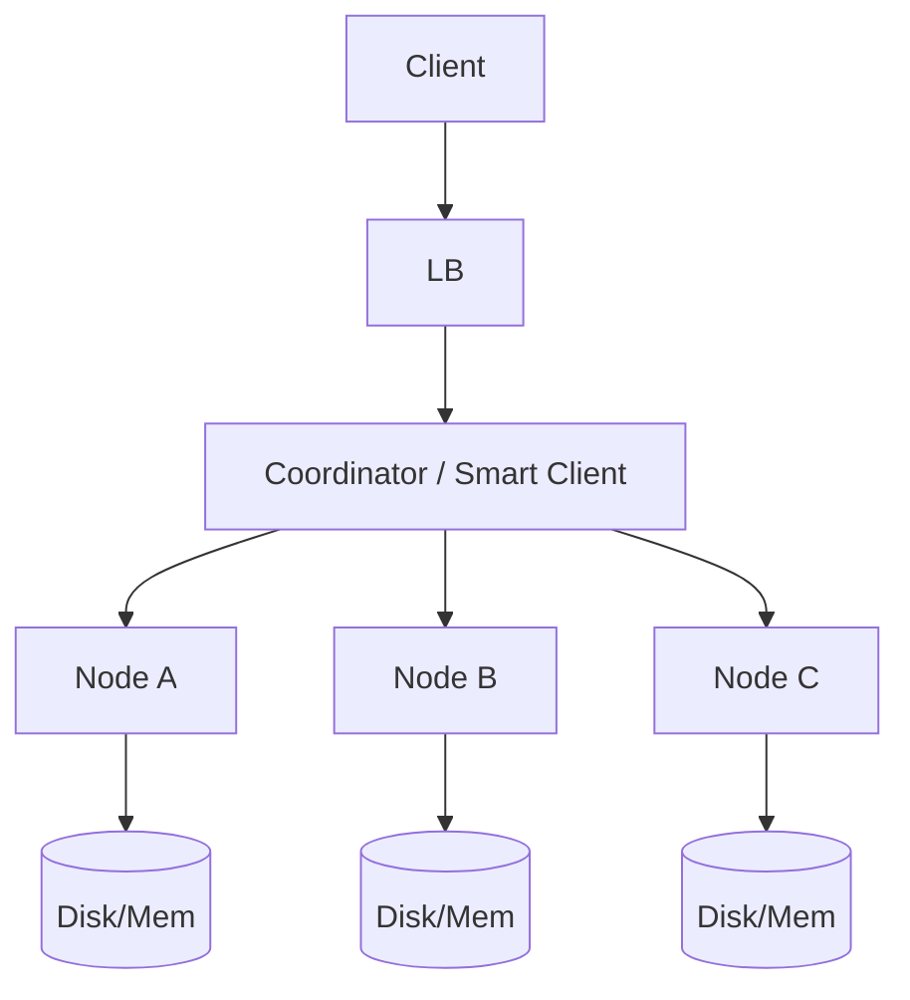

# Case Study 04 — Key-Value Store

Design a simplified **distributed key-value store** (think Redis/Dynamo basics).

## 1. Problem

`PUT key value`, `GET key`, optional `DELETE`, across many nodes with large capacity.

## 2. Requirements

### Functional

- Get / Put / Delete  
- Optional TTL  
- Optional replication factor  

### Non-functional

- Horizontal scale  
- High availability  
- Tunable consistency (quorum)  

## 3. Estimates

Billions of keys, value sizes from bytes to KB, hundreds of thousands of ops/sec.

Single machine won’t hold everything → partition + replicate.

## 4. HLD



### Core ideas

1. **Partition** keys across nodes with consistent hashing  
2. **Replicate** each key to `N` successors  
3. **Quorum** reads/writes (`R`, `W`)  

```text
N = 3 replicas
W = 2 write quorum
R = 2 read quorum
W+R > N → overlapping for stronger consistency
```

## 5. LLD

### API

```text
PUT    /v1/kv/{key}   body: raw bytes / JSON value
GET    /v1/kv/{key}
DELETE /v1/kv/{key}
Headers: X-TTL-Seconds: 60
```

### Consistent hashing ring

```text
hash(key) → position on ring
primary = first node clockwise
replicas = next N-1 nodes
```

Virtual nodes (many tokens per physical server) improve balance.

### Data on a node

Simple approach for learning:

```text
memtable (in memory) + append-only commit log
flush to SSTable segments on disk
compaction merges segments
```

(This is LSM intuition used by Cassandra/RocksDB-style stores.)

### Versioning / conflict

Use vector clocks or timestamp+version:

```text
value record:
  data
  version
  timestamp
```

On concurrent writes (rare with quorum), return conflict or last-write-wins (LWW) by timestamp — trade-off.

### Gossip & membership

Nodes share ring membership via gossip protocol; clients refresh topology.

### Failure handling

- Hinted handoff: if replica down, partner keeps hint and replays later  
- Read repair: on quorum read mismatch, push newest to stale replicas  
- Anti-entropy repair jobs  

### Pseudocode GET with quorum

```text
nodes = replicaSet(key, N)
responses = parallel GET from nodes until R success
return newest(responses)
maybe async read_repair
```

## 6. Trade-offs table

| Choice | Benefit | Cost |
|--------|---------|------|
| LWW | Simple | May lose concurrent updates |
| Strong quorum always | Safer reads | Higher latency |
| More replicas | Durability | Cost, write amp |

## 7. Recap

- Consistent hashing for scale-out  
- Replication + quorum for availability/consistency knobs  
- LSM/commit-log for durable high write throughput  

This case study builds intuition for Dynamo/Cassandra/Riak-style systems.
