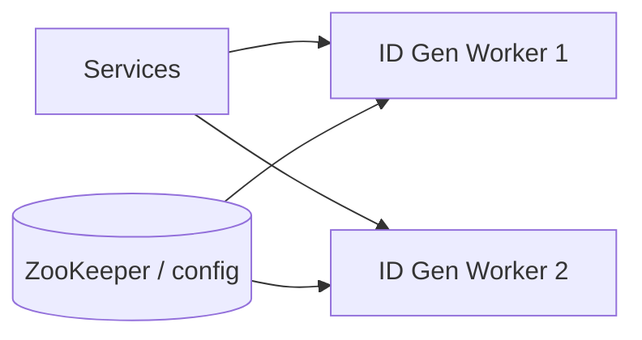

# Case Study 05 — Unique ID Generator

Design a service that generates **unique 64-bit IDs** at huge scale (Twitter Snowflake style).

## 1. Problem

Many services need unique IDs for posts, messages, orders — without a single global DB auto-increment bottleneck.

## 2. Requirements

### Functional

- Generate unique IDs  
- Preferably roughly time-ordered  
- Fit in 64 bits (index-friendly)  

### Non-functional

- Extremely high throughput  
- Low latency  
- Work across many datacenters/nodes  

## 3. Approaches comparison

| Approach | Pros | Cons |
|----------|------|------|
| DB auto-increment | Simple | Single writer bottleneck |
| UUID v4 | Easy | 128-bit, not ordered, bigger indexes |
| Redis `INCR` | Simple | Extra dependency; still centralish |
| **Snowflake** | Ordered, local gen | Needs clock + worker IDs |
| Ticket server (Flickr) | Simple ranges | SPOF unless HA |

## 4. HLD — Snowflake



Each worker generates IDs **locally** with no network call on the hot path (after worker_id assigned).

## 5. LLD — bit layout

Classic Twitter Snowflake 64-bit:

```text
0 | timestamp_ms (41) | datacenter (5) | worker (5) | sequence (12)
```

Meaning:

- 41 bits time → ~69 years from epoch  
- 5+5 bits → 1024 workers  
- 12 bits sequence → 4096 IDs / ms / worker  

### Algorithm

```text
function nextId():
  now = currentTimeMs()
  if now < lastTime: handleClockSkew()
  if now == lastTime:
    sequence = (sequence + 1) % 4096
    if sequence == 0:
      now = waitNextMillis()
  else:
    sequence = 0
  lastTime = now
  return (now - epoch) << 22
       | (datacenterId << 17)
       | (workerId << 12)
       | sequence
```

### Worker ID assignment

- Config map on deploy  
- Or claim lease from ZooKeeper/etcd  

### Clock skew

NTP can move clocks backward.

Strategies:

- Reject / wait if small skew  
- Dual clocks / monotonic clock source  
- Alert hard if large skew  

## 6. API

```text
GET /v1/ids
→ { "id": "1712345678901234567" }

POST /v1/ids/batch { "count": 100 }
→ { "ids": ["...", "..."] }
```

Or embed generator as a **library** inside each service (common).

## 7. HLD alternative — DB range tickets

```text
ID service keeps next_max in MySQL
Worker asks for range [10001, 20000]
Generates locally until exhausted
```

Pros: simple. Cons: ID service HA design still needed; less time-ordered across workers.

## 8. Recap

- Avoid global auto-increment at scale  
- Snowflake = time + worker + sequence  
- Watch clock skew carefully  

**Used by:** message IDs, post IDs, order IDs across later case studies.
