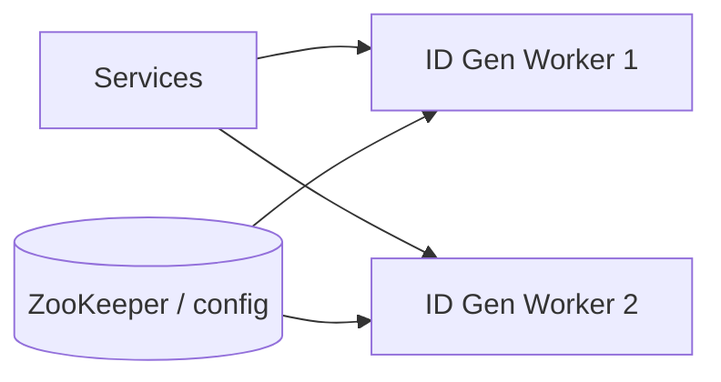

# Case Study 05 — Unique ID Generator

Design a service that generates **unique 64-bit IDs** at huge scale (Twitter Snowflake style).

## 1. Problem

Many services need unique IDs for posts, messages, orders — without a single global DB auto-increment bottleneck.

## 2. Requirements

### Functional

- Generate unique IDs  
- Preferably roughly time-ordered  
- Fit in 64 bits (index-friendly)  

### Non-functional

- Extremely high throughput  
- Low latency  
- Work across many datacenters/nodes  

## 3. Back-of-the-envelope estimates

We do rough math so we know **what to optimize**. Exact precision is not the goal — **order of magnitude** is.

### Why we estimate (beginner tip)

Ask three questions:
1. **How busy?** → QPS (requests per second)
2. **How much data?** → storage (GB/TB)
3. **How fat is the pipe?** → bandwidth (MB/s) when media matters

Cheat sheet: **1 QPS ≈ 86,400 requests/day**. Peak is often **2–5×** average.

### Assumptions (say these out loud)

- **1,000 microservices** each generating IDs locally (Snowflake embedded as library)
- Peak cluster-wide demand: **1M IDs/sec** (posts, messages, orders, events combined)
- Each ID is **64 bits (8 bytes)** — index-friendly, time-sortable
- Snowflake layout: **12-bit sequence** → up to **4,096 IDs/ms per worker**
- **1,024 workers** max (5-bit datacenter + 5-bit worker ID)
- ID generation must be **< 1 ms** with **no network call** on the hot path

### Step A — Traffic (QPS)

```text
Cluster peak ID generation:
  1,000,000 IDs/sec

Per worker (1,024 workers):
  1M / 1,024 ≈ 980 IDs/s/worker average
  Well below Snowflake max of 4,096/ms (4M/s) per worker ✓

If using centralized ID API instead of library:
  1M GET /v1/ids/sec → network + single service becomes bottleneck
  → embed generator in each service (no hot-path RPC)

Daily volume:
  1M/s × 86,400 ≈ 86 billion IDs/day
```

### Step B — Storage

```text
IDs are NOT stored by the generator — consumers store them in their own tables

Downstream storage impact (example: messages table):
  86B IDs/day × 8 bytes (BIGINT key) ≈ 688 GB/day of primary-key data alone
  → time-ordered IDs help B-tree locality (recent IDs cluster in index)

UUID v4 (128-bit) would double key size → 1.4 TB/day for same row count
  → another reason to prefer 64-bit Snowflake over UUID at scale
```

### Step C — Bandwidth / other (if relevant)

Centralized ID service at 1M IDs/sec (if you chose that design):

```text
1M responses/s × ~50 bytes JSON ≈ 50 MB/s — doable but unnecessary latency

Embedded Snowflake: 0 bytes network on hot path — generate in-process
```

Bandwidth is negligible; **throughput and coordination** are the real constraints.

### Step D — Read:write ratio

| Path | Approx share | Implication |
|------|--------------|-------------|
| **Generate ID (write-only)** | ~100% | No reads on hot path; pure local computation |
| **Worker ID lease lookup** | Once at startup | ZooKeeper/etcd config; not per-ID |
| **Batch ID requests** | Optional | Amortize overhead: `POST /ids/batch { count: 100 }` |

This service is **100% write/generate** — optimize for throughput, not caching.

### What the numbers tell us

- **1M IDs/sec cluster-wide** kills DB auto-increment (single writer ~10k/s max) — need **distributed generation**
- **Snowflake** gives ~4M IDs/sec per worker with zero coordination after worker_id assignment
- **64-bit ordered IDs** keep indexes compact vs 128-bit UUID; time component enables range queries
- **1,024 workers** is enough headroom for 1M/s with ~50% utilization per worker
- **Clock skew** is the main failure mode — NTP monitoring and "wait next ms" on sequence overflow
- Alternative **DB range tickets** (Flickr): simpler but ID service still needs HA; less time-ordered across workers

### Common mistake for this problem

Calling a **central ID microservice over HTTP for every row insert**. At 1M/s, network latency and that service become the bottleneck — embed Snowflake (or similar) as a **library** in each app and skip the RPC on the hot path.

### Approaches comparison (quick reference)

| Approach | Pros | Cons |
|----------|------|------|
| DB auto-increment | Simple | Single writer bottleneck |
| UUID v4 | Easy | 128-bit, not ordered, bigger indexes |
| Redis `INCR` | Simple | Extra dependency; still centralish |
| **Snowflake** | Ordered, local gen | Needs clock + worker IDs |
| Ticket server (Flickr) | Simple ranges | SPOF unless HA |

The estimates above explain **why** Snowflake (or range tickets) wins at ~1M IDs/s — the rest of this case study shows **how**.

## 4. HLD — Snowflake



Each worker generates IDs **locally** with no network call on the hot path (after worker_id assigned).

## 5. LLD — bit layout

Classic Twitter Snowflake 64-bit:

```text
0 | timestamp_ms (41) | datacenter (5) | worker (5) | sequence (12)
```

Meaning:

- 41 bits time → ~69 years from epoch  
- 5+5 bits → 1024 workers  
- 12 bits sequence → 4096 IDs / ms / worker  

### Algorithm

```text
function nextId():
  now = currentTimeMs()
  if now < lastTime: handleClockSkew()
  if now == lastTime:
    sequence = (sequence + 1) % 4096
    if sequence == 0:
      now = waitNextMillis()
  else:
    sequence = 0
  lastTime = now
  return (now - epoch) << 22
       | (datacenterId << 17)
       | (workerId << 12)
       | sequence
```

### Worker ID assignment

- Config map on deploy  
- Or claim lease from ZooKeeper/etcd  

### Clock skew

NTP can move clocks backward.

Strategies:

- Reject / wait if small skew  
- Dual clocks / monotonic clock source  
- Alert hard if large skew  

## 6. API

```text
GET /v1/ids
→ { "id": "1712345678901234567" }

POST /v1/ids/batch { "count": 100 }
→ { "ids": ["...", "..."] }
```

Or embed generator as a **library** inside each service (common).

## 7. HLD alternative — DB range tickets

```text
ID service keeps next_max in MySQL
Worker asks for range [10001, 20000]
Generates locally until exhausted
```

Pros: simple. Cons: ID service HA design still needed; less time-ordered across workers.

## 8. Recap

- Avoid global auto-increment at scale  
- Snowflake = time + worker + sequence  
- Watch clock skew carefully  

**Used by:** message IDs, post IDs, order IDs across later case studies.
