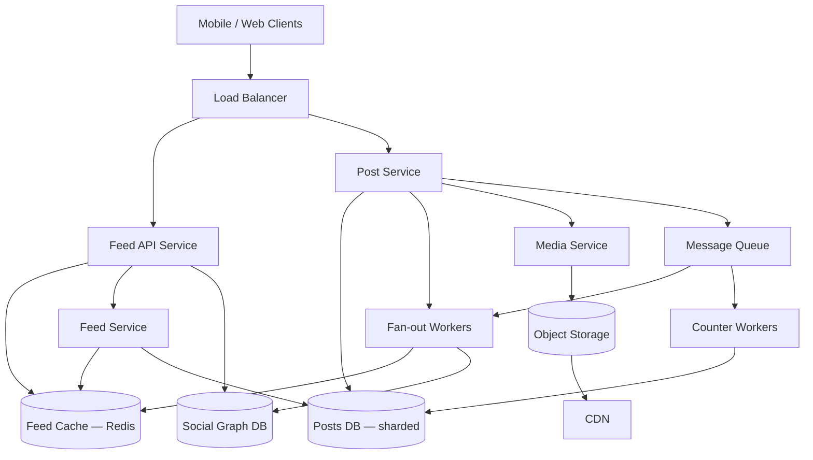

# Case Study 06 — News Feed

Design a **Twitter/X-like news feed**: users post short updates and see a personalized timeline of posts from people they follow.

## 1. Problem

When a user opens the app, they expect a **chronological (or ranked) list of recent posts** from accounts they follow — without waiting several seconds. When someone they follow publishes a new post, followers should see it in their feed soon after.

The hard part is not storing a single tweet — it is **delivering the right posts to millions of users quickly** when some accounts have millions of followers.

## 2. Requirements

### Functional (MVP)

- Users can **create a post** (text, optional media link)
- Users can **follow / unfollow** other users
- Users can **view their home feed** — posts from followed accounts, newest first
- Users can **view a profile feed** — all posts by one user
- Basic **like** count on posts (optional MVP stretch)

### Out of scope (initially)

- Full-text search, trending topics, ads, DMs, replies/threading UI, edit history, verification badges, recommendation ML ranking

### Non-functional

- Feed load **p95 < 300 ms** for typical users
- Post creation feels instant (< 200 ms ack to author)
- **High availability** — stale feed OK briefly; total outage is not
- **Eventually consistent** feed for celebrity posts is acceptable
- Scale to **500M users**, **200M DAU**, heavy read traffic

## 3. Back-of-the-envelope

Assumptions:

- 500M registered users, 200M DAU
- Each DAU reads feed **5×/day** → **1B feed reads/day**
- **10%** of DAU post **1 post/day** → **20M posts/day**
- Average user follows **200** accounts; average post size **~500 bytes** metadata

```text
Feed read QPS  ≈ 1B / 86,400 ≈ 12,000/s avg, peak ~60,000/s
Post write QPS ≈ 20M / 86,400 ≈ 230/s avg, peak ~1,000/s

Per-user fan-out on write (naive):
  200 followers × 20M posts/day ≈ 4B feed-row writes/day ≈ 46,000/s
  → too expensive for everyone; hybrid approach required

Storage (posts only, 5 years):
  20M/day × 365 × 5 × 500B ≈ 18 TB

Feed cache per active user (if precomputed, 500 post IDs × 8B):
  200M DAU × 4KB ≈ 800 GB in Redis (upper bound; trim to top 500–1000)
```

**Insight:** Reads dominate. **Precompute feeds for normal users** (fan-out on write). **Pull at read time for celebrities** (fan-out on read).

## 4. High-Level Design (HLD)



### Components

| Component | Role |
|-----------|------|
| Feed API | `GET /feed`, auth, pagination |
| Post Service | Create post, store metadata |
| Social Graph DB | `follower → followees` relationships |
| Posts DB | Post content, author, timestamp (sharded by `post_id` or `user_id`) |
| Feed Cache (Redis) | Precomputed `user_id → [post_id, …]` sorted lists |
| Fan-out Workers | On new post, push post ID into followers' feed caches |
| Message Queue | Decouple post write from fan-out; retry on failure |
| Media Service + S3 + CDN | Optional images; store blobs in S3, serve via CDN |

### Flows

**Create post (fan-out on write path)**

1. Client `POST /posts` with text (+ media upload separately)
2. Post Service assigns `post_id` (Snowflake), writes row to Posts DB
3. Returns `201` immediately to author
4. Enqueues **fan-out job** `{ post_id, author_id, timestamp }`
5. Worker loads author's followers from Social Graph
6. For each follower (or batch): `ZADD feed:{follower_id} timestamp post_id` in Redis (trim to top 1000)
7. If author is a **celebrity** (> 10k followers), skip fan-out; followers pull at read time

**Read home feed**

1. Client `GET /feed?cursor=…`
2. Fetch `post_id` list from Redis `feed:{user_id}` (sorted set, newest first)
3. If cache miss or user follows celebrities: **merge** cached IDs + **pull recent posts** from celebrity followees
4. Batch `GET posts by IDs` from Posts DB (or post cache)
5. Hydrate author info, like counts; return JSON page

**Read profile feed**

1. Query Posts DB: `WHERE author_id = ? ORDER BY created_at DESC LIMIT 20`
2. No fan-out needed — single user's timeline

### Trade-offs: fan-out on write vs fan-out on read

| Strategy | Pros | Cons |
|----------|------|------|
| **Fan-out on write** | Feed read is O(1) cache lookup — very fast | Expensive for celebrities; wasted work if follower never opens app |
| **Fan-out on read** | Cheap write; no push to millions | Slow read — must query all followees at request time |
| **Hybrid (recommended)** | Fast reads for 99% of users; celebrities don't melt the system | Two code paths; merge logic at read time |

**Other trade-offs**

- **Chronological vs ranked feed** — chronological is simpler; ranking needs ML features and offline jobs
- **Redis sorted sets vs plain lists** — sorted sets give score-based ordering and easy trim
- **Push notifications** — separate notification service subscribed to same post events

## 5. Low-Level Design (LLD)

### APIs

```text
POST /api/v1/posts
Body: { "text": "Hello world", "mediaIds": [] }
→ 201 { "postId": "1234567890", "createdAt": "..." }

GET /api/v1/feed?limit=20&cursor=<opaque>
→ 200 {
     "posts": [ { "postId", "authorId", "text", "likeCount", "createdAt" } ],
     "nextCursor": "..."
   }

GET /api/v1/users/:userId/posts?limit=20&cursor=...
→ 200 { "posts": [...], "nextCursor": "..." }

POST /api/v1/users/:userId/follow
DELETE /api/v1/users/:userId/follow

GET /api/v1/users/:userId/followers?limit=50
GET /api/v1/users/:userId/following?limit=50
```

### Schema / tables

```text
users (
  user_id        BIGINT PRIMARY KEY,
  username       VARCHAR(50) UNIQUE NOT NULL,
  display_name   VARCHAR(100),
  created_at     TIMESTAMPTZ NOT NULL
)

posts (
  post_id        BIGINT PRIMARY KEY,       -- Snowflake ID (time-sortable)
  author_id      BIGINT NOT NULL,
  text           VARCHAR(280) NOT NULL,
  media_urls     JSONB DEFAULT '[]',
  like_count     INT DEFAULT 0,
  created_at     TIMESTAMPTZ NOT NULL,
  INDEX (author_id, created_at DESC)
)
-- shard posts by hash(post_id) or by author_id

follows (
  follower_id    BIGINT NOT NULL,
  followee_id    BIGINT NOT NULL,
  created_at     TIMESTAMPTZ NOT NULL,
  PRIMARY KEY (follower_id, followee_id),
  INDEX (followee_id)   -- for fan-out: "who follows this author?"
)

-- optional: celebrity flag or follower_count cache
user_stats (
  user_id          BIGINT PRIMARY KEY,
  follower_count   INT DEFAULT 0,
  is_celebrity     BOOLEAN GENERATED OR cached threshold
)
```

**Redis structures**

```text
feed:{user_id}           → ZSET  score=timestamp_ms  member=post_id
post:{post_id}           → HASH  text, author_id, created_at (hot cache)
followees:{user_id}      → SET of followee_ids (for read-time merge)
celebrity_followees:{user_id} → SET subset for pull-at-read
```

### Modules

```text
FeedController / PostController / GraphController
FeedService          — merge cache + celebrity pull
PostService          — create, validate, enqueue fan-out
FanOutWorker         — push to follower feeds
GraphService         — follow/unfollow, list followers
PostRepository       — CRUD posts (sharded)
FeedCache            — Redis ZSET operations
CelebrityDetector    — follower_count > THRESHOLD
IdGenerator          — Snowflake
```

### Key algorithms (pseudocode)

**Create post + async fan-out**

```text
function createPost(authorId, text, mediaIds):
  postId = idGen.nextId()
  post = { postId, authorId, text, mediaIds, createdAt: now() }
  postRepo.insert(post)
  queue.publish("fanout", { postId, authorId, createdAt: post.createdAt })
  return post

function fanOutWorker(job):
  authorId = job.authorId
  if userStats.followerCount(authorId) > CELEBRITY_THRESHOLD:
    return   // skip push; readers pull at read time

  followerIds = graphRepo.getFollowers(authorId)   // paginate in batches of 1000
  score = job.createdAt.toEpochMs()
  for batch in chunks(followerIds, 500):
    pipeline = redis.pipeline()
    for followerId in batch:
      key = "feed:" + followerId
      pipeline.zadd(key, score, job.postId)
      pipeline.zremrangeByRank(key, 0, -1001)   // keep newest 1000
      pipeline.expire(key, 7 days)              // cold users rebuild on miss
    pipeline.execute()
```

**Read home feed (hybrid merge)**

```text
function getHomeFeed(userId, limit, cursor):
  cachedIds = feedCache.getRange(userId, cursor, limit)   // from ZSET

  celebrityFollowees = graphRepo.getCelebrityFollowees(userId)
  pulledIds = []
  if celebrityFollowees not empty:
    pulledIds = postRepo.getRecentByAuthors(
      celebrityFollowees,
      since: now() - 24 hours,
      limit: 50
    )

  allIds = mergeSortedByTime(cachedIds, pulledIds)
  allIds = dedupe(allIds).take(limit)

  posts = postRepo.getByIds(allIds)          // batch fetch
  posts = hydrateAuthorsAndLikes(posts)
  nextCursor = encodeCursor(allIds.last)
  return { posts, nextCursor }
```

**Follow / unfollow**

```text
function follow(followerId, followeeId):
  graphRepo.insert(followerId, followeeId)
  userStats.incrementFollowerCount(followeeId)
  // optional: backfill recent posts from followee into follower's feed cache
  recentPosts = postRepo.getRecentByAuthor(followeeId, limit=50)
  for post in recentPosts:
    feedCache.zadd(followerId, post.createdAt, post.postId)
```

### Concurrency notes

- **Fan-out is idempotent** — `ZADD` same `(score, post_id)` twice is safe
- **Follower count** — increment/decrement in DB or async counter; celebrity threshold can lag slightly
- **Post ID from Snowflake** — no coordination on write path across Post Service instances
- **Cache stampede on cold feed** — on miss, single-flight rebuild: one request rebuilds, others wait
- **Trim feed ZSET** — cap size so memory bounded; older posts fall off (acceptable for home feed)

## 6. Scale evolution

| Stage | Users | Change |
|-------|-------|--------|
| MVP | < 100k | Single DB; fan-out on read only (query followees' posts) |
| Growth | 1M | Redis feed cache + fan-out on write for users with < 10k followers |
| Scale | 50M+ | Shard Posts DB; dedicated fan-out worker pool; celebrity hybrid |
| Huge | 500M+ | Multi-region Redis; graph DB sharded; optional Kafka for fan-out; ranking pipeline offline |

## 7. Recap

- **Reads >> writes** — optimize feed load with precomputed Redis timelines
- **Fan-out on write** for normal users; **fan-out on read** (pull) for celebrities — hybrid is industry standard
- **Snowflake post IDs** give time ordering without extra index
- **Async fan-out via queue** keeps post creation fast and allows retries

**Practice:** Draw the hybrid read path from memory. Explain why a user with 50M followers breaks naive fan-out on write.
