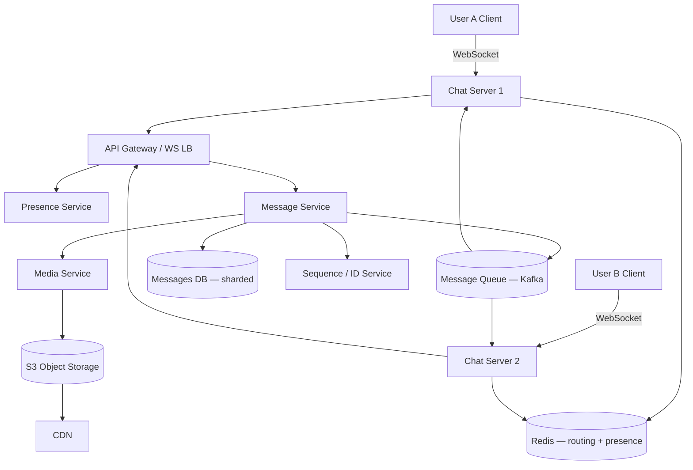

# Case Study 07 — Chat Messaging

Design a **WhatsApp-like chat** system: one-to-one and small group messaging with near-real-time delivery, read receipts, and offline support.

## 1. Problem

Users send text messages (and optionally images) to contacts or groups. Messages should **arrive within seconds** when both parties are online, and **sync reliably** when a user comes back online after being offline.

Unlike a news feed (mostly read-heavy), chat is **write-heavy, latency-sensitive, and connection-oriented**. The server must know who is online and push new messages immediately — HTTP polling alone is too slow and wasteful.

## 2. Requirements

### Functional (MVP)

- **1:1 chat** between two users
- **Send / receive text messages** in near real time
- **Message history** — fetch past messages when opening a conversation
- **Delivery status** — sent → delivered → read (optional MVP: delivered only)
- **Offline sync** — messages stored until recipient fetches them
- **Online presence** — show if contact is online / last seen

### Out of scope (initially)

- End-to-end encryption (mention as future), voice/video calls, message editing, reactions, channels/broadcast lists, full-text search across all chats, bots

### Non-functional

- Message delivery **p95 < 500 ms** when recipient is online
- Support **50M DAU**, **10B messages/day**
- **At-least-once** delivery with client-side dedup (exactly-once is hard over unreliable networks)
- **Durable storage** — messages must not be lost after server ack
- **High availability** — brief disconnects should auto-reconnect

## 3. Back-of-the-envelope estimates

We do rough math so we know **what to optimize**. Exact precision is not the goal — **order of magnitude** is.

### Why we estimate (beginner tip)

Ask three questions:
1. **How busy?** → QPS (requests per second)
2. **How much data?** → storage (GB/TB)
3. **How fat is the pipe?** → bandwidth (MB/s) when media matters

Cheat sheet: **1 QPS ≈ 86,400 requests/day**. Peak is often **2–5×** average.

### Assumptions (say these out loud)

- **50M DAU**, average **200 messages/user/day** → **10B messages/day**
- Average text message **200 bytes**; with metadata ≈ **250 bytes** stored per message
- **20% of messages** include a media pointer (actual bytes in S3, not in message row)
- **10% of traffic** is group chats (1 write → N recipient pushes)
- Reads ≈ **2× writes** (history fetch + sync on reconnect)
- **30% of DAU online concurrently** → long-lived WebSocket connections

### Step A — Traffic (QPS)

```text
Message write QPS:
  10B / day ÷ 86,400 ≈ 115,000/s average
  Peak (5× avg)         ≈ 500,000/s

Read QPS (history + sync):
  2× writes ≈ 230,000/s average, ~1M/s peak

Concurrent WebSocket connections:
  50M DAU × 30% online ≈ 15M simultaneous connections

Connection servers needed:
  15M / 100k connections per server ≈ 150 chat server instances
```

### Step B — Storage

```text
Text messages per year:
  10B/day × 365 × 250 bytes ≈ 900 TB/year

Media (separate, in S3):
  Assume 2B media messages/day × 500 KB avg ≈ 1 PB/day — dominates; tier + CDN

Message retention (1 year text):
  ~900 TB → shard Messages DB by hash(conversation_id)

Inbox metadata (user_inbox rows):
  50M users × 50 conversations × 100 bytes ≈ 250 GB — fits in sharded SQL
```

### Step C — Bandwidth / other (if relevant)

WebSocket push traffic (500k peak message writes, ~1 KB frame each):

```text
500k/s × 1 KB ≈ 500 MB/s push bandwidth across chat servers

Connection state memory:
  15M sessions × ~10 KB/session ≈ 150 GB RAM (routing + buffers, excluding media)
```

Media uploads/downloads go through **S3 + CDN** — not through chat servers.

### Step D — Read:write ratio

| Path | Approx share | Implication |
|------|--------------|-------------|
| **Send message (write + push)** | ~33% | Persist first, then Kafka fan-out to recipient's chat server |
| **History fetch / offline sync (read)** | ~67% | Paginate by `conversation_id + seq`; shard by conversation |
| **Presence / heartbeat** | Overhead | Redis TTL keys; lightweight, high frequency |

Unlike feeds, chat is closer to **1:1 write:read** — both paths are hot.

### What the numbers tell us

- **500k peak message writes/s** → cannot use a single Postgres; shard by `conversation_id`, consider Cassandra/Scylla
- **15M WebSocket connections** → dedicated **connection layer** separate from message persistence
- **Redis route table** (`user_id → chat_server_id`) for cross-server delivery via Kafka
- **Persist before push** — DB is source of truth; WebSocket push is an optimization
- **Client-generated `clientMsgId`** + unique constraint for idempotent retries
- **Per-conversation sequence** (Redis INCR) for ordering within a chat
- **900 TB/year text** → tiered storage; archive old conversations to cold storage

### Common mistake for this problem

Using **HTTP polling** for real-time chat at 50M DAU. Polling every 2 seconds = 25M req/s wasted — use **WebSockets** with a separate connection tier and message queue for cross-server fan-out.

## 4. High-Level Design (HLD)



### Components

| Component | Role |
|-----------|------|
| WebSocket Chat Server | Long-lived connections; push incoming messages |
| API Gateway / WS LB | Sticky routing by `user_id`; TLS termination |
| Message Service | Persist message, assign sequence, publish to queue |
| Presence Service | Track online/offline, last seen in Redis |
| Messages DB | Durable message storage, sharded by `conversation_id` |
| Redis | `user_id → chat_server_id` routing; presence TTL keys |
| Message Queue | Fan-out to correct chat server when recipient elsewhere |
| Media Service + S3 + CDN | Upload images; store blob in S3; serve via CDN URL in message |
| Sequence Service | Per-conversation monotonic message sequence (or Snowflake) |

### Flows

**Send message (both online, same or different server)**

1. User A sends `{ type: "send", conversationId, clientMsgId, text }` over WebSocket
2. Chat Server validates session, forwards to Message Service
3. Message Service: assign `message_id`, `seq`, persist to Messages DB
4. Ack to A: `{ type: "ack", clientMsgId, messageId, seq, status: "sent" }`
5. Lookup B's route: Redis `GET route:user:{B}` → `chat_server_2` (or offline)
6. Publish event to Kafka topic partitioned by `conversation_id`
7. Chat Server 2 consumes event, pushes `{ type: "message", ... }` to B's WebSocket
8. B sends `{ type: "delivered", messageId }`; server updates status

**Offline recipient**

1. Steps 1–4 same; persist with `delivered_at = null`
2. No live route in Redis → skip push (or push fails)
3. When B reconnects: WebSocket auth → fetch `messages WHERE conversation_id AND seq > last_sync_seq`
4. Push pending messages; update delivery timestamps

**Fetch history (REST or WS)**

1. `GET /conversations/:id/messages?before_seq=1000&limit=50`
2. Query Messages DB shard; return page oldest-first or newest-first

### Trade-offs

| Choice | Pros | Cons |
|--------|------|------|
| **WebSockets** | Low latency, bidirectional, efficient | Stateful servers, harder load balancing |
| Long polling | Simpler infra | Higher latency, more HTTP overhead |
| SSE (Server-Sent Events) | Good for server→client push | No client→server on same channel |

| Storage | Pros | Cons |
|---------|------|------|
| Cassandra / Scylla | Write-heavy, time-series friendly | Operational complexity |
| Postgres sharded | Strong consistency, familiar | Needs careful sharding at scale |

| Delivery guarantee | Notes |
|--------------------|-------|
| At-least-once + client dedup | Industry standard for chat |
| Exactly-once | Expensive; usually overkill for MVP |

## 5. Low-Level Design (LLD)

### APIs

**REST (history, setup)**

```text
POST /api/v1/conversations
Body: { "participantIds": ["userA", "userB"] }   // 1:1 or group
→ 201 { "conversationId": "c_abc123" }

GET /api/v1/conversations/:id/messages?beforeSeq=5000&limit=50
→ 200 { "messages": [...], "hasMore": true }

POST /api/v1/media/upload
→ 201 { "mediaId": "m_xyz", "url": "https://cdn.example/..." }

GET /api/v1/users/:id/presence
→ 200 { "status": "online" | "offline", "lastSeenAt": "..." }
```

**WebSocket protocol (JSON frames)**

```text
// Client → Server
{ "type": "send", "conversationId": "c_abc", "clientMsgId": "uuid-1", "text": "Hi" }
{ "type": "delivered", "messageId": "msg_999" }
{ "type": "read", "conversationId": "c_abc", "lastReadSeq": 42 }
{ "type": "ping" }

// Server → Client
{ "type": "ack", "clientMsgId": "uuid-1", "messageId": "msg_999", "seq": 43 }
{ "type": "message", "messageId", "conversationId", "senderId", "text", "seq", "sentAt" }
{ "type": "delivery_receipt", "messageId", "status": "delivered" | "read" }
{ "type": "pong" }
```

### Schema / tables

```text
conversations (
  conversation_id   VARCHAR(36) PRIMARY KEY,
  type              ENUM('direct', 'group') NOT NULL,
  created_at        TIMESTAMPTZ NOT NULL
)

conversation_participants (
  conversation_id   VARCHAR(36) NOT NULL,
  user_id           BIGINT NOT NULL,
  joined_at         TIMESTAMPTZ NOT NULL,
  last_read_seq     BIGINT DEFAULT 0,
  PRIMARY KEY (conversation_id, user_id),
  INDEX (user_id)   -- inbox list
)

messages (
  message_id        BIGINT PRIMARY KEY,        -- Snowflake
  conversation_id   VARCHAR(36) NOT NULL,
  sender_id         BIGINT NOT NULL,
  seq               BIGINT NOT NULL,           -- per-conversation order
  client_msg_id     VARCHAR(36),               -- idempotency from client
  text              TEXT,
  media_url         TEXT NULL,
  sent_at           TIMESTAMPTZ NOT NULL,
  delivered_at      TIMESTAMPTZ NULL,
  UNIQUE (conversation_id, seq),
  UNIQUE (conversation_id, client_msg_id),     -- dedup retries
  INDEX (conversation_id, seq DESC)
)
-- shard by hash(conversation_id)

user_inbox (
  user_id           BIGINT NOT NULL,
  conversation_id   VARCHAR(36) NOT NULL,
  last_message_at   TIMESTAMPTZ,
  unread_count      INT DEFAULT 0,
  PRIMARY KEY (user_id, conversation_id),
  INDEX (user_id, last_message_at DESC)
)
```

**Redis keys**

```text
route:user:{user_id}     → chat_server_instance_id   TTL refreshed on heartbeat
presence:user:{user_id}  → "online" | epoch_last_seen
session:{session_token}  → user_id
```

### Modules

```text
WebSocketHandler       — connect, auth, heartbeat, dispatch frames
ChatServerRegistry     — register server in Redis; route lookup
MessageService         — persist, seq assign, publish Kafka
SequenceGenerator      — per-conversation seq (Redis INCR or DB row)
PresenceService        — set online on connect, offline on disconnect
InboxService           — update user_inbox on new message
MediaUploadService     — presigned S3 URL, virus scan async
SyncService            — catch-up on reconnect
```

### Key algorithms (pseudocode)

**WebSocket connect + route registration**

```text
function onConnect(ws, authToken):
  userId = auth.verify(authToken)
  ws.userId = userId
  serverId = config.instanceId
  redis.set("route:user:" + userId, serverId, ttl=60s)
  presence.setOnline(userId)
  scheduleHeartbeat(userId, every 30s)

function heartbeat(userId):
  redis.expire("route:user:" + userId, 60s)

function onDisconnect(userId):
  redis.delete("route:user:" + userId)   // or let TTL expire
  presence.setLastSeen(userId, now())
```

**Send message with idempotency**

```text
function sendMessage(senderId, conversationId, clientMsgId, text):
  if repo.existsByClientMsgId(conversationId, clientMsgId):
    return repo.getByClientMsgId(...)   // retry from client

  seq = seqGen.next(conversationId)     // Redis INCR conv:{id}:seq
  messageId = snowflake.nextId()
  msg = { messageId, conversationId, senderId, seq, clientMsgId, text, sentAt: now() }
  msgRepo.insert(msg)
  inboxService.bump(conversationId, msg)

  kafka.publish("chat.messages", key=conversationId, value=msg)
  return msg

function onKafkaMessage(msg):
  for participantId in getParticipants(msg.conversationId):
    if participantId == msg.senderId: continue
    route = redis.get("route:user:" + participantId)
    if route is not null:
      chatServer(route).push(participantId, { type: "message", ...msg })
    else:
      // offline — will sync on reconnect; optional push notification
      notificationService.sendPush(participantId, preview(msg))
```

**Reconnect sync**

```text
function onReconnect(userId, ws):
  conversations = inboxRepo.listForUser(userId)
  for conv in conversations:
    lastSyncSeq = ws.getLastAckSeq(conv.id) or 0
    pending = msgRepo.getAfterSeq(conv.id, lastSyncSeq, limit=500)
    for msg in pending:
      ws.send({ type: "message", ...msg })
```

### Concurrency notes

- **Per-conversation sequence** — `Redis INCR` or `UPDATE counters SET seq = seq + 1 RETURNING seq` serializes order within one chat
- **Client message ID** — unique constraint prevents duplicate rows when client retries send
- **WebSocket sticky sessions** — LB routes by `user_id` hash; route table updated on every connect
- **Kafka partition key = conversation_id** — preserves order per conversation for consumers
- **Split-brain on presence** — TTL + heartbeat; "online" is best-effort; last seen is source of truth
- **Group chat fan-out** — one write, N pushes (or N Kafka consumer deliveries to N routes)

## 6. Scale evolution

| Stage | Change |
|-------|--------|
| MVP | Single Message Service + Postgres; WebSocket on same node; REST polling fallback |
| 100k connections | Dedicated chat servers; Redis route table; Kafka for cross-server delivery |
| 1M+ connections | Shard Messages DB by `conversation_id`; separate presence cluster |
| Global | Multi-region with user affinity; cross-region Kafka replication; CRDTs only if needed for offline edits |

## 7. Recap

- **WebSockets** (not polling) for real-time bidirectional chat
- **Persist first, then push** — DB is source of truth; push is optimization
- **Route table in Redis** maps `user_id → chat server` for cross-server delivery
- **Client-generated idempotency keys** + **per-conversation sequence** handle retries and ordering

**Practice:** Walk through sending a message when sender and receiver are on different chat servers. Where does ordering come from?
