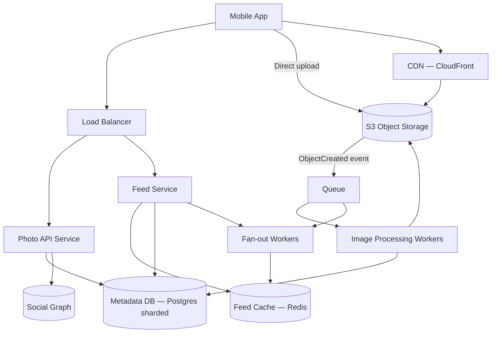

# Case Study 08 — Photo Sharing

Design an **Instagram-like photo sharing** app: users upload photos, apply a caption, and followers see a scrollable feed of images.

## 1. Problem

Users capture moments as **photos** (much larger than text posts) and share them with followers. The system must:

- Accept **large file uploads** reliably from mobile networks
- **Store and serve images fast** worldwide (CDN)
- Show a **feed of recent posts** from followed accounts
- Support **likes and basic comments**

Photos dominate **bandwidth and storage** — the architecture centers on object storage and CDN, not the application database.

## 2. Requirements

### Functional (MVP)

- **Upload photo** with optional caption
- **View home feed** — photos from followed users, newest first
- **View user profile** — grid/list of their photos
- **Follow / unfollow** users
- **Like** a photo; show like count
- **View single photo** detail page

### Out of scope (initially)

- Stories (24h expiry), Reels/video, DMs, explore/discovery ML, filters/editing pipeline, shopping tags, ads

### Non-functional

- Image load **p95 < 1 s** on mobile (CDN cached)
- Upload success rate **> 99%** on flaky networks (resumable upload)
- **500M users**, **100M DAU**, **50M photos/day**
- **Durability** — uploaded photos must not be lost
- Feed read latency similar to news feed case study

## 3. Back-of-the-envelope estimates

We do rough math so we know **what to optimize**. Exact precision is not the goal — **order of magnitude** is.

### Why we estimate (beginner tip)

Ask three questions:
1. **How busy?** → QPS (requests per second)
2. **How much data?** → storage (GB/TB)
3. **How fat is the pipe?** → bandwidth (MB/s) when media matters

Cheat sheet: **1 QPS ≈ 86,400 requests/day**. Peak is often **2–5×** average.

### Assumptions (say these out loud)

- **500M users**, **100M DAU**, **50M photos uploaded/day**
- Average original photo **2 MB**; serve **3 sizes** (thumb 20 KB, feed 200 KB, full 800 KB)
- Metadata row per photo ≈ **500 bytes** (caption, URLs, user_id, timestamps)
- Each DAU scrolls feed **3×/day**, ~**20 images** per scroll
- Feed fan-out reuses news-feed hybrid model (Case Study 06)

### Step A — Traffic (QPS)

```text
Upload QPS (writes):
  50M / day ÷ 86,400 ≈ 580/s average
  Peak (5× avg)         ≈ 3,000/s

Feed read QPS:
  100M DAU × 3 feeds/day = 300M feed loads/day
  300M / 86,400 ≈ 3,500/s average

Single photo view / profile browse (additional reads):
  Roughly same order as feed reads — CDN serves bytes, API serves metadata
```

### Step B — Storage

```text
Originals (1 year):
  50M/day × 365 × 2 MB ≈ 36 PB/year

Derived sizes (thumb + feed + full ≈ 1 MB total per photo):
  50M × 365 × 1 MB ≈ 18 PB/year (often same S3 bucket, different keys)

Metadata DB (1 year):
  50M × 365 × 500 bytes ≈ 9 TB (+ indexes → ~15 TB)

→ At scale: compress, dedupe, tier old originals to cold storage (Glacier)
```

### Step C — Bandwidth / other (if relevant)

CDN egress (feed images — the dominant cost):

```text
100M DAU × 3 feeds × 20 images × 200 KB (feed size)
  = 12 PB/day CDN egress

At 3,500 feed QPS × 20 images × 200 KB ≈ 14 GB/s average CDN throughput
  → CDN is mandatory; target 90%+ cache hit rate

Upload ingress (originals):
  580 uploads/s × 2 MB ≈ 1.2 GB/s average to S3 (presigned direct upload)
```

**Bandwidth dominates** this system — not QPS.

### Step D — Read:write ratio

| Path | Approx share | Implication |
|------|--------------|-------------|
| **Image bytes (CDN GET)** | ~95% of bandwidth | Never serve from app servers; S3 + CloudFront |
| **Feed metadata API (read)** | ~99% of API calls | Redis feed cache + batch metadata fetch |
| **Upload + publish (write)** | ~1% of API calls | Presigned S3 upload; async image processing |
| **Like / comment** | Small writes | Redis counter + async DB flush |

### What the numbers tell us

- **36 PB/year originals** → **S3 for blobs**, Postgres only for metadata — never store image bytes in SQL
- **12 PB/day CDN egress** → client loads images from CDN URLs returned by feed API
- **Presigned direct upload** keeps app servers off the 1.2 GB/s upload path
- **Async transcoding worker** generates thumb/feed/full after S3 upload event
- **~3k peak upload QPS** → queue + worker pool for resize; don't block API on ImageMagick
- **Feed fan-out** same hybrid as news feed — precompute for normal users, pull for celebrities

### Common mistake for this problem

Proxying photo bytes **through the API server** ("upload to our backend, we forward to S3"). At 3,000 uploads/s × 2 MB, app servers become a bandwidth bottleneck — use **presigned URLs** for client → S3 direct upload.

## 4. High-Level Design (HLD)



### Components

| Component | Role |
|-----------|------|
| Photo API | Create post metadata, presigned upload URLs, likes |
| Feed Service | Home feed (reuse news feed hybrid fan-out pattern) |
| S3 | Durable blob storage for originals + derived sizes |
| CDN | Edge cache for `thumb`, `feed`, `full` URLs |
| Image Processing Workers | Resize, strip EXIF, WebP/JPEG encode |
| Metadata DB | Posts, users, likes, comments — not the image bytes |
| Feed Cache | Precomputed timelines (same as Case Study 06) |
| Queue | S3 upload events → processing; post created → fan-out |

### Flows

**Upload photo (presigned URL pattern)**

1. Client `POST /photos/init` → `{ uploadId, presignedPutUrl, photoId }`
2. Client **PUT** file directly to S3 (multipart for large files)
3. S3 triggers event → Queue → Image Worker
4. Worker downloads original, generates 3 sizes, uploads to `s3://bucket/photos/{id}/thumb|feed|full`
5. Worker updates metadata: `status = ready`, sets CDN URLs
6. Client polls `GET /photos/:id/status` or receives push when ready
7. Client `POST /photos/:id/publish` with caption → creates feed post, triggers fan-out

**View home feed**

1. Same as news feed: Redis `feed:{user_id}` → list of `photo_id`
2. Batch fetch metadata (caption, author, CDN URLs, like count)
3. Client loads images from **CDN URLs** (not API server)

**Like photo**

1. `POST /photos/:id/like` → idempotent insert into likes table
2. Increment counter async (Redis `INCR` + periodic flush to DB)

### Trade-offs

| Upload path | Pros | Cons |
|-------------|------|------|
| **Direct to S3 (presigned)** | App servers don't touch bytes; scalable | Client must handle retry/multipart |
| Through API server | Simpler client | Bottleneck; expensive egress |

| Image format | Notes |
|--------------|-------|
| WebP | Smaller; good for mobile |
| JPEG | Universal fallback — serve both via `Accept` header or URL variant |

| Processing | Sync vs async |
|------------|---------------|
| **Async (recommended)** | Fast API response; user sees "processing" briefly |
| Sync | Simple MVP for tiny images only |

| Feed fan-out | Same hybrid as news feed — fan-out on write for normal users, pull for celebrities |

## 5. Low-Level Design (LLD)

### APIs

```text
POST /api/v1/photos/init
Body: { "contentType": "image/jpeg", "contentLength": 2048000 }
→ 201 {
     "photoId": "p_abc123",
     "uploadId": "u_xyz",
     "presignedPutUrl": "https://s3...",
     "expiresIn": 3600
   }

POST /api/v1/photos/:photoId/complete
Body: { "caption": "Sunset", "etag": "..." }
→ 202 { "status": "processing" }

GET /api/v1/photos/:photoId/status
→ 200 { "status": "ready", "urls": { "thumb", "feed", "full" } }

GET /api/v1/feed?limit=20&cursor=...
→ 200 {
     "items": [{
       "photoId", "authorId", "caption",
       "urls": { "thumb": "https://cdn.../t.jpg", "feed": "..." },
       "likeCount", "createdAt"
     }],
     "nextCursor": "..."
   }

POST /api/v1/photos/:photoId/like
DELETE /api/v1/photos/:photoId/like

GET /api/v1/users/:userId/photos?limit=30&cursor=...
```

### Schema / tables

```text
users (
  user_id       BIGINT PRIMARY KEY,
  username      VARCHAR(50) UNIQUE,
  avatar_url    TEXT
)

photos (
  photo_id      VARCHAR(36) PRIMARY KEY,
  user_id       BIGINT NOT NULL,
  caption       VARCHAR(2200),
  status        ENUM('uploading', 'processing', 'ready', 'failed') NOT NULL,
  s3_key_orig   TEXT NOT NULL,
  url_thumb     TEXT,
  url_feed      TEXT,
  url_full      TEXT,
  width         INT,
  height        INT,
  like_count    INT DEFAULT 0,
  created_at    TIMESTAMPTZ NOT NULL,
  INDEX (user_id, created_at DESC)
)

likes (
  user_id       BIGINT NOT NULL,
  photo_id      VARCHAR(36) NOT NULL,
  created_at    TIMESTAMPTZ NOT NULL,
  PRIMARY KEY (user_id, photo_id),
  INDEX (photo_id)
)

follows (
  follower_id   BIGINT NOT NULL,
  followee_id   BIGINT NOT NULL,
  PRIMARY KEY (follower_id, followee_id),
  INDEX (followee_id)
)

comments (
  comment_id    BIGINT PRIMARY KEY,
  photo_id      VARCHAR(36) NOT NULL,
  user_id       BIGINT NOT NULL,
  text          VARCHAR(1000) NOT NULL,
  created_at    TIMESTAMPTZ NOT NULL,
  INDEX (photo_id, created_at)
)
```

**S3 key layout**

```text
/uploads/{uploadId}/original.jpg          -- transient until processed
/photos/{photoId}/original.jpg
/photos/{photoId}/thumb_320.webp
/photos/{photoId}/feed_1080.webp
/photos/{photoId}/full_2048.jpg
```

### Modules

```text
PhotoController / FeedController
UploadService         — presigned URLs, multipart init
PhotoMetadataService  — CRUD, publish
ImageProcessor        — resize pipeline (ImageMagick / libvips / Lambda)
FeedService           — hybrid fan-out (reuse Case 06)
LikeService           — idempotent like + counter
CdnUrlBuilder         — signed URLs optional for private photos
S3EventConsumer       — trigger processing
```

### Key algorithms (pseudocode)

**Init presigned upload**

```text
function initUpload(userId, contentType, contentLength):
  assert contentLength <= MAX_SIZE
  assert contentType in ALLOWED_TYPES
  photoId = uuid()
  s3Key = "uploads/" + photoId + "/original"
  presignedUrl = s3.presignPut(s3Key, contentType, ttl=1h)
  photoRepo.insert({
    photoId, userId, status: "uploading", s3KeyOrig: s3Key, createdAt: now()
  })
  return { photoId, presignedUrl }
```

**Image processing pipeline**

```text
function onS3UploadComplete(event):
  photoId = parsePhotoId(event.key)
  original = s3.download(event.key)
  meta = imageProbe(original)
  thumb = resize(original, maxWidth=320, format=WEBP, quality=80)
  feed  = resize(original, maxWidth=1080, format=WEBP, quality=85)
  full  = resize(original, maxWidth=2048, format=JPEG, quality=90)
  stripExif(full); stripExif(feed); stripExif(thumb)

  keys = uploadVariants(photoId, { thumb, feed, full })
  urls = cdn.mapKeysToUrls(keys)
  photoRepo.update(photoId, {
    status: "ready",
    urlThumb: urls.thumb, urlFeed: urls.feed, urlFull: urls.full,
    width: meta.width, height: meta.height
  })
  notifyUser(photoRepo.get(photoId).userId, photoId)
```

**Publish to feed + fan-out**

```text
function publishPhoto(userId, photoId, caption):
  photo = photoRepo.get(photoId)
  assert photo.userId == userId && photo.status == "ready"
  photoRepo.updateCaption(photoId, caption)
  fanOutQueue.publish({ photoId, authorId: userId, createdAt: photo.createdAt })
  return photo
```

**Like (idempotent)**

```text
function likePhoto(userId, photoId):
  inserted = likeRepo.insertIgnore(userId, photoId)
  if inserted:
    redis.incr("likes:" + photoId)
    asyncFlushCounterToDb(photoId)
  return { likeCount: redis.get("likes:" + photoId) }
```

### Concurrency notes

- **Presigned upload** — only owner can write to key (IAM + short TTL)
- **Processing idempotency** — check `status != ready` before reprocessing S3 retry events
- **Like dedup** — `PRIMARY KEY (user_id, photo_id)` prevents double likes
- **Like counter** — Redis atomic incr; eventual sync to `photos.like_count`
- **CDN cache invalidation** — rare (immutable URLs with content hash in path); new size = new URL
- **Feed consistency** — photo appears in feed only after `publish`; URLs may 404 until `status=ready` if client races

## 6. Scale evolution

| Stage | Change |
|-------|--------|
| MVP | API + Postgres + local disk or single S3 bucket; sync resize on small images |
| Growth | S3 + async Lambda/worker resize; CloudFront CDN; Redis feed cache |
| Scale | Shard metadata DB; multipart upload; fan-out workers; separate like counter service |
| Huge | Multi-region S3 + CDN; cold tier for old originals; ML ranking feed offline |

## 7. Recap

- **S3 for blobs, DB for metadata** — never store image bytes in Postgres
- **Presigned direct upload** keeps app servers off the hot path
- **Async transcoding** generates thumb/feed/full; **CDN** serves all reads
- **Feed fan-out** reuses the hybrid model from the news feed case study

**Practice:** Trace one photo from camera roll to appearing in a follower's feed. Which steps are sync vs async?
