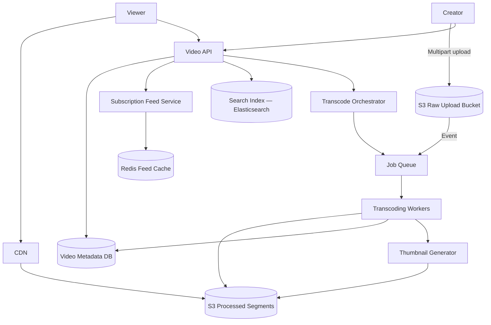

# Case Study 09 — Video Streaming

Design a **YouTube-like video streaming** platform: creators upload videos, the system transcodes them into multiple qualities, and viewers watch with adaptive playback.

## 1. Problem

Video files are **orders of magnitude larger** than photos (a 10-minute 1080p upload might be **500 MB–2 GB**). Viewers expect:

- **Smooth playback** with quality adapting to their bandwidth
- **Fast start** — playback begins within a few seconds (not after full download)
- **Global reach** — low latency via CDN edge caches

The core challenge is the **upload → transcode → distribute** pipeline, plus **metadata and discovery** (search, subscriptions feed).

## 2. Requirements

### Functional (MVP)

- **Upload video** (title, description, thumbnail)
- **Process / transcode** to multiple resolutions (360p, 720p, 1080p)
- **Stream playback** with adaptive bitrate (ABR)
- **Video detail page** — watch, view count
- **Channel page** — list creator's videos
- **Subscribe** to channels; **home feed** of new uploads from subscriptions
- Basic **search** by title (optional MVP stretch)

### Out of scope (initially)

- Live streaming, DRM/studio content, monetization/ads, comments moderation ML, Shorts, 4K/HDR, offline download

### Non-functional

- **Time to first frame < 3 s** for cached popular content
- Upload pipeline completes in **minutes** (not hours) for 1080p 10-min video
- **1B hours watched/month**, **500k uploads/day**
- **99.9% availability** for playback (CDN + multi-origin)
- **Cost-efficient** storage tiering for long-tail videos

## 3. Back-of-the-envelope

Assumptions:

- 500k uploads/day; average **5 GB** raw upload
- Transcode to **4 renditions** averaging **30%** of original size total
- 1B watch hours/month ≈ **385k concurrent streams** average (peak **~2M**)
- Average watch bitrate **2 Mbps** (adaptive)

```text
Upload ingress:
  500k × 5 GB/day ≈ 2.5 PB/day ingress to object storage
  Upload QPS ≈ 500k / 86,400 ≈ 6/s avg (large concurrent multipart)

Transcode cluster:
  10-min 1080p ≈ 5–15 min on 1 worker → need thousands of parallel workers / spot instances

CDN egress (peak):
  2M streams × 2 Mbps ≈ 4 Tbps peak
  → major CDN; 95%+ edge hit rate for popular content

Storage (transcoded, 1 year, no dedupe):
  500k × 1.5 GB × 365 ≈ 270 PB/year
  → lifecycle policies: S3 Standard → IA → Glacier for old long-tail

Metadata DB:
  500k/day × 365 × 2KB ≈ 365 GB/year ( manageable with sharding )
```

**Insight:** **Separate upload ingestion, transcoding farm, and CDN delivery.** Playback uses **HLS/DASH** segments from CDN — not a single MP4 download from API servers.

## 4. High-Level Design (HLD)



### Components

| Component | Role |
|-----------|------|
| Video API | Upload session, metadata CRUD, playback manifest URLs |
| S3 Raw Bucket | Original uploads (multipart) |
| Transcode Orchestrator | Split job into renditions; track state machine |
| Transcoding Workers | FFmpeg fleet: H.264/H.265 → HLS segments per resolution |
| S3 Processed Bucket | `{videoId}/360p/seg_001.ts`, manifests `.m3u8` |
| CDN | Cache segments and manifests at edge |
| Metadata DB | Video info, processing status, view counts |
| Subscription Feed | New uploads from subscribed channels |
| Search Index | Title, description, tags (async index on publish) |
| Thumbnail Generator | Sprite / poster frame at 10% timestamp |

### Flows

**Upload video**

1. Creator `POST /videos/upload/init` → `{ videoId, uploadId, presignedMultipartUrls[] }`
2. Client uploads parts to S3; `POST /videos/upload/complete` with part ETags
3. API creates metadata row `status = uploaded`; Orchestrator enqueues transcode job
4. Return `202` — processing async

**Transcode pipeline**

1. Worker pulls job, downloads raw from S3 (or S3 → worker in same region)
2. Probe: duration, codec, resolution
3. For each profile (360p, 720p, 1080p): FFmpeg → HLS segments (6s each) + `.m3u8` playlist
4. Upload segments to `s3://processed/{videoId}/{profile}/`
5. Generate master playlist `.m3u8` listing all renditions (ABR)
6. Generate thumbnail; update metadata `status = ready`, CDN URLs
7. Index in search; fan-out to subscribers' feeds

**Playback (viewer)**

1. Client `GET /videos/:id/play` → `{ masterManifestUrl, title, ... }`
2. CDN URL: `https://cdn.example/videos/{id}/master.m3u8`
3. Video player (hls.js / native) fetches master → picks rendition → downloads segments adaptively
4. **API server never streams bytes** — only metadata + signed CDN URLs

**View count**

1. Player beacons `POST /videos/:id/view` every 30s or on start
2. Aggregate via Kafka → counter workers → DB (approximate counts OK)

### Trade-offs

| Streaming protocol | Pros | Cons |
|--------------------|------|------|
| **HLS** | Apple/mobile friendly; CDN standard | Higher latency than LL-HLS |
| DASH | Codec agnostic | Slightly more complex |
| Progressive MP4 | Simple | No ABR; bad for long videos |

| Transcoding | Notes |
|-------------|-------|
| **Batch FFmpeg workers** | Flexible; industry standard |
| Managed (MediaConvert) | Less ops; higher $/minute |
| Per-title encoding | Better quality/size; expensive |

| Storage tier | Hot new uploads on Standard; long-tail → IA/Glacier after 90 days |

| Popular vs long-tail | CDN caches hot videos; origin fetch for rare views acceptable |

## 5. Low-Level Design (LLD)

### APIs

```text
POST /api/v1/videos/upload/init
Body: { "title": "...", "contentType": "video/mp4", "fileSize": 500000000 }
→ 201 {
     "videoId": "v_abc",
     "uploadId": "mpu_xyz",
     "partSize": 10485760,
     "presignedUrls": [ "..." ]
   }

POST /api/v1/videos/upload/:uploadId/complete
Body: { "parts": [ { "partNumber": 1, "etag": "..." } ] }
→ 202 { "videoId": "v_abc", "status": "processing" }

GET /api/v1/videos/:videoId
→ 200 {
     "videoId", "title", "description", "status": "ready",
     "durationSec": 600,
     "thumbnailUrl": "https://cdn.../thumb.jpg",
     "playManifestUrl": "https://cdn.../master.m3u8",
     "viewCount": 1234567
   }

GET /api/v1/videos/:videoId/play
→ 200 { "manifestUrl": "...", "expiresAt": "..." }   // optional signed URL

GET /api/v1/feed/subscriptions?limit=20&cursor=...
GET /api/v1/channels/:channelId/videos?limit=20

POST /api/v1/channels/:channelId/subscribe
POST /api/v1/videos/:videoId/view
Body: { "watchTimeSec": 30, "sessionId": "..." }
```

### Schema / tables

```text
channels (
  channel_id     BIGINT PRIMARY KEY,
  owner_user_id  BIGINT NOT NULL,
  name           VARCHAR(100),
  subscriber_count INT DEFAULT 0
)

videos (
  video_id       VARCHAR(36) PRIMARY KEY,
  channel_id     BIGINT NOT NULL,
  title          VARCHAR(200) NOT NULL,
  description    TEXT,
  status         ENUM('uploading','processing','ready','failed') NOT NULL,
  s3_raw_key     TEXT NOT NULL,
  duration_sec   INT,
  thumbnail_url  TEXT,
  manifest_url   TEXT,
  view_count     BIGINT DEFAULT 0,
  created_at     TIMESTAMPTZ NOT NULL,
  published_at   TIMESTAMPTZ,
  INDEX (channel_id, published_at DESC)
)

transcode_jobs (
  job_id         VARCHAR(36) PRIMARY KEY,
  video_id       VARCHAR(36) NOT NULL,
  status         ENUM('queued','running','done','failed'),
  profiles       JSONB,              -- ["360p","720p","1080p"]
  progress_pct   INT DEFAULT 0,
  error_message  TEXT,
  created_at     TIMESTAMPTZ NOT NULL,
  INDEX (video_id)
)

subscriptions (
  user_id        BIGINT NOT NULL,
  channel_id     BIGINT NOT NULL,
  created_at     TIMESTAMPTZ NOT NULL,
  PRIMARY KEY (user_id, channel_id),
  INDEX (channel_id)
)

video_renditions (
  video_id       VARCHAR(36) NOT NULL,
  profile        VARCHAR(10) NOT NULL,   -- 360p, 720p, 1080p
  playlist_url   TEXT NOT NULL,
  bandwidth_bps  INT,
  PRIMARY KEY (video_id, profile)
)
```

**S3 layout**

```text
raw/{videoId}/source.mp4
processed/{videoId}/master.m3u8
processed/{videoId}/360p/index.m3u8
processed/{videoId}/360p/segment_00001.ts
processed/{videoId}/720p/...
processed/{videoId}/thumb_1280.jpg
```

### Modules

```text
UploadController / VideoController / FeedController
MultipartUploadService    — S3 MPU init/complete
TranscodeOrchestrator     — state machine, enqueue profiles
FfmpegWorker              — run transcode, upload segments
ManifestBuilder           — master.m3u8 generation
PlaybackService           — signed CDN URLs, geo restrictions
ViewCounterAggregator     — Kafka consumer
SubscriptionFeedService   — fan-out on new publish (reuse feed patterns)
SearchIndexer             — Elasticsearch sync
```

### Key algorithms (pseudocode)

**Transcode orchestrator**

```text
function onUploadComplete(videoId):
  video = videoRepo.get(videoId)
  jobId = uuid()
  profiles = selectProfiles(video.probeMetadata)   // skip 1080p if source is 720p
  jobRepo.insert({ jobId, videoId, status: "queued", profiles })
  for profile in profiles:
    queue.publish("transcode", { jobId, videoId, profile, s3RawKey: video.s3RawKey })

function transcodeWorker(task):
  rawPath = s3.download(task.s3RawKey)
  outDir = tempDir()
  if task.profile == "360p":
    scale = "640:360"
  else if task.profile == "720p":
    scale = "1280:720"
  else:
    scale = "1920:1080"

  ffmpeg.run(
    input: rawPath,
    output: outDir + "/segment_%05d.ts",
    scale: scale,
    codec: "libx264",
    hlsTime: 6,
    hlsListSize: 0
  )
  s3.uploadDir(outDir, "processed/" + task.videoId + "/" + task.profile + "/")
  playlistUrl = cdn.url("processed/" + task.videoId + "/" + task.profile + "/index.m3u8")
  renditionRepo.upsert(task.videoId, task.profile, playlistUrl, bandwidth)
  jobRepo.markProfileDone(task.jobId, task.profile)

  if jobRepo.allProfilesDone(task.jobId):
    masterUrl = manifestBuilder.buildMaster(task.videoId)
    thumbUrl = thumbnailGenerator.generate(task.videoId, rawPath, atSec=10)
    videoRepo.update(task.videoId, { status: "ready", manifestUrl: masterUrl, thumbnailUrl: thumbUrl })
    searchIndex.index(videoRepo.get(task.videoId))
    subscriptionFeed.fanOut(task.videoId)
```

**Master playlist (ABR)**

```text
#EXTM3U
#EXT-X-VERSION:3
#EXT-X-STREAM-INF:BANDWIDTH=800000,RESOLUTION=640x360
360p/index.m3u8
#EXT-X-STREAM-INF:BANDWIDTH=2500000,RESOLUTION=1280x720
720p/index.m3u8
#EXT-X-STREAM-INF:BANDWIDTH=5000000,RESOLUTION=1920x1080
1080p/index.m3u8
```

**Adaptive playback (client-side)**

```text
function playVideo(manifestUrl):
  player.load(manifestUrl)
  loop every segment:
    bandwidth = measureDownloadRate()
    player.selectRendition(maxBitrate: bandwidth * 0.8)
    // player automatically switches up/down between HLS variants
```

**View count aggregation**

```text
function onViewEvent(videoId, watchTimeSec, sessionId):
  if watchTimeSec < 10: return   // ignore accidental clicks
  kafka.publish("views", { videoId, sessionId, ts: now() })
  // dedupe by sessionId per day in Flink/Spark
  aggregatedCounts.flushToDb(every 5 min)
```

### Concurrency notes

- **Multipart upload** — parts upload in parallel; complete call is atomic in S3
- **Transcode job idempotency** — check rendition exists before re-running worker retry
- **Status state machine** — `uploading → processing → ready`; illegal transitions rejected
- **View counts** — approximate; dedupe by `(videoId, sessionId, day)` in stream processor
- **CDN signed URLs** — short TTL (1–4 h); manifest refresh during long playback
- **Hot video** — single origin path; CDN shield prevents S3 overload

## 6. Scale evolution

| Stage | Change |
|-------|--------|
| MVP | Single S3 bucket; one FFmpeg worker; progressive MP4 + CDN (no ABR) |
| Growth | HLS ABR; transcode queue + worker pool; CloudFront; subscription feed |
| Scale | Regional upload buckets; spot transcode fleet; ES search; view counter pipeline |
| Huge | Per-title encoding; multi-CDN; peer-assisted delivery research; Glacier for archives |

## 7. Recap

- **S3 + CDN + transcoding** — the holy trinity for video; API only serves metadata and manifest URLs
- **HLS/DASH segments** enable **adaptive bitrate** and fast start via CDN edge caches
- **Async transcode pipeline** with job queue; upload ack is immediate, `ready` comes later
- **View counts and search** are async aggregates — don't block playback path

**Practice:** Explain why serving one giant MP4 from your API server fails at YouTube scale. What does the client download instead?
