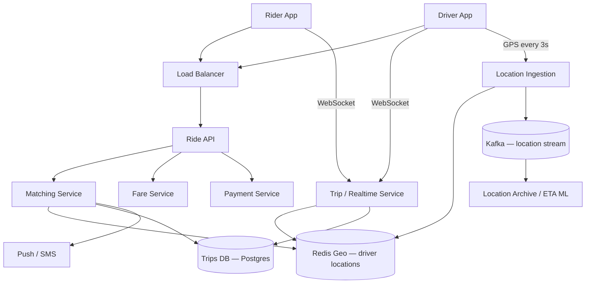

# Case Study 10 — Ride Sharing

Design an **Uber-like ride matching** system: riders request trips, nearby drivers are matched, and both track the ride in real time until drop-off and payment.

## 1. Problem

A **rider** opens the app and requests a ride from point A to B. The system must:

- Find **available drivers near the pickup** within seconds
- **Match** rider and driver and show ETA
- Track **live location** during the trip
- Handle **state transitions**: requested → matched → in progress → completed → paid

This is a **geospatial + real-time** problem: location updates are frequent, matching must be fast, and correctness (no double-assigning a driver) matters.

## 2. Requirements

### Functional (MVP)

- **Rider**: set pickup/dropoff, request ride, see matched driver, track on map, complete trip
- **Driver**: go online/offline, accept/reject ride offers, navigate, mark arrived / start / end trip
- **Matching**: assign nearest available driver to rider request
- **Fare estimate** before confirm (simple distance × rate)
- **Trip history** for rider and driver
- **Real-time location** updates on map (both parties)

### Out of scope (initially)

- Surge pricing ML, pool/shared rides, scheduled rides, multi-stop, in-app chat, fraud ML, split payment, driver onboarding/KYC UI

### Non-functional

- Match offer to driver **p95 < 5 s** in dense cities
- Location update latency **< 2 s** on map
- **10M rides/day**, **500k concurrent online drivers**
- **Strong consistency** for driver assignment — one driver, one active trip
- **99.9% availability** in supported cities

## 3. Back-of-the-envelope estimates

We do rough math so we know **what to optimize**. Exact precision is not the goal — **order of magnitude** is.

### Why we estimate (beginner tip)

Ask three questions:
1. **How busy?** → QPS (requests per second)
2. **How much data?** → storage (GB/TB)
3. **How fat is the pipe?** → bandwidth (MB/s) when media matters

Cheat sheet: **1 QPS ≈ 86,400 requests/day**. Peak is often **2–5×** average.

### Assumptions (say these out loud)

- **10M rides/day** completed; average trip **20 minutes**, **8 km**
- **500k drivers online at peak**; each sends GPS **every 3 seconds**
- Match search radius **3 km**; ~**20 candidate drivers** per request in dense cities
- Trip metadata row ≈ **2 KB** (pickup, dropoff, status, fare, timestamps)
- Location pings ≈ **100 bytes** each (lat, lng, heading, timestamp)
- Rush hour creates **5×** average ride-request load

### Step A — Traffic (QPS)

```text
Ride request QPS:
  10M / day ÷ 86,400 ≈ 115/s average
  Peak (5× avg, rush hour) ≈ 500/s

Location update QPS (the big number):
  500k drivers / 3 sec interval ≈ 167,000 writes/s
  → cannot write every GPS ping to SQL

Geospatial match queries:
  500 match requests/s × 20 candidates ≈ 10,000 driver lookups/s
  Redis GEORADIUS handles this in sub-millisecond per query

Concurrent active trips:
  10M rides × 20 min avg / 1,440 min/day ≈ 140k concurrent (peak fraction lower)
```

### Step B — Storage

```text
Trip metadata (1 year):
  10M/day × 365 × 2 KB ≈ 7 TB

Location history (24h retention for disputes):
  167k pings/s × 100 bytes × 86,400 sec ≈ 1.4 TB/day
  → stream to Kafka with short retention; NOT permanent SQL rows

Redis geospatial index (hot):
  500k drivers × ~100 bytes ≈ 50 MB — trivial in memory
  Driver metadata hashes: 500k × 200 bytes ≈ 100 MB
```

### Step C — Bandwidth / other (if relevant)

WebSocket location broadcast during active trips:

```text
140k active trips × 1 ping/3s × 100 bytes ≈ 4.7 MB/s realtime push

Kafka location stream (all drivers, for analytics/ETA):
  167k/s × 100 bytes ≈ 16.7 MB/s ingest — manageable with partitioning
```

Ride matching is **latency-sensitive**, not bandwidth-heavy.

### Step D — Read:write ratio

| Path | Approx share | Implication |
|------|--------------|-------------|
| **GPS location write** | ~99.7% of write ops | Redis GEOADD hot path; Kafka archive; skip SQL per ping |
| **GEORADIUS match read** | ~500/s at peak | Sub-ms in Redis; filter by `available` status |
| **Trip state transitions** | ~115/s avg | Strong consistency in Postgres with row locks |
| **WebSocket push (read to client)** | Per active trip | Broadcast driver location to rider map |

Location writes dominate — trip CRUD is tiny by comparison.

### What the numbers tell us

- **167k location writes/s** → **Redis GEORADIUS** for hot driver positions; never sync every ping to Postgres
- **500 peak ride requests/s** → greedy nearest-driver match is fine for MVP; GEORADIUS + filter in <5 ms
- **Strong assignment semantics** → DB `SELECT FOR UPDATE` + Redis assign lock so one driver can't accept two rides
- **Kafka for location stream** → analytics, ETA ML, 24h dispute archive with TTL
- **WebSockets** for live map updates to rider and driver during trip
- **City sharding** → separate Redis cluster per metro; matching stays local

### Common mistake for this problem

Writing **every GPS ping to Postgres** for durability. At 167k inserts/s, the DB melts — keep hot locations in **Redis Geo**, stream to Kafka for analytics, and only persist trip state transitions to SQL.

## 4. High-Level Design (HLD)



### Components

| Component | Role |
|-----------|------|
| Ride API | Create request, cancel, trip history REST |
| Matching Service | Find nearby drivers, send offers, assign winner |
| Location Ingestion | High-throughput GPS writes → Redis Geo |
| Redis Geo | `GEORADIUS` for nearby available drivers |
| Trips DB | Trip state machine, rider/driver IDs, fare |
| Trip / Realtime Service | WebSockets for live location + status to both apps |
| Fare Service | Distance/time estimate from map provider or haversine |
| Payment Service | Charge on trip complete (stub in MVP) |
| Kafka | Location stream for analytics, ETA refinement, audit |
| Push Service | Notify driver of ride offer |

### Flows

**Driver goes online**

1. Driver `POST /drivers/status { online: true }` with current lat/lng
2. Location Ingestion: `GEOADD drivers:city:{id} lng lat driverId`
3. Set `driver:{id}:status = available` in Redis hash
4. Open WebSocket for offers and trip updates

**Rider requests ride**

1. Rider `POST /rides/estimate { pickup, dropoff }` → `{ fareEstimate, etaMinutes }`
2. Rider `POST /rides/request { pickup, dropoff }` → `{ rideId, status: "searching" }`
3. Matching Service:
   - `GEORADIUS drivers:city:{id} pickupLng pickupLat 3 km`
   - Filter: status=`available`, vehicle type match, not in active trip
   - Rank by distance (and optional rating)
   - Send offer to top N drivers via push/WebSocket (30 s timeout)
4. First driver `POST /rides/:rideId/accept` wins
5. DB transaction: set trip `matched`, driver `busy`; remove from available geo set or mark busy
6. Both clients receive match via WebSocket; show driver/rider location

**During trip**

1. Driver app sends GPS every 3 s → Location Ingestion → update Redis + broadcast on trip WebSocket channel
2. Rider map renders driver marker from stream
3. State: `driver_arrived` → `in_progress` → `completed`

**Complete + pay**

1. Driver `POST /rides/:rideId/complete`
2. Fare Service computes final fare from route distance/duration
3. Payment Service charges rider
4. Trip archived; driver status → `available`; re-add to geo index

### Trade-offs

| Geospatial index | Pros | Cons |
|------------------|------|------|
| **Redis GEO** | Sub-ms radius queries; in-memory | RAM bound; need sharding by city |
| PostGIS | Rich queries; durable | Harder at 167k writes/s |
| Geohash + DB | Simple | Hot cells; slower |

| Matching | Pros | Cons |
|----------|------|------|
| **Greedy nearest** | Simple, fast | Suboptimal globally; OK for MVP |
| Batch optimization | Better utilization | Slow; complex |

| Location storage | Redis hot path + Kafka archive vs writing every ping to SQL |

| Offer model | Broadcast to top 3 drivers vs sequential — parallel reduces wait, may annoy drivers |

## 5. Low-Level Design (LLD)

### APIs

```text
POST /api/v1/rides/estimate
Body: { "pickup": { "lat", "lng" }, "dropoff": { "lat", "lng" }, "vehicleType": "economy" }
→ 200 { "fareEstimateCents": 1250, "distanceKm": 8.2, "etaMinutes": 4 }

POST /api/v1/rides/request
Body: { "pickup": { "lat", "lng", "address" }, "dropoff": { ... }, "vehicleType": "economy" }
→ 201 { "rideId": "r_abc", "status": "searching" }

POST /api/v1/rides/:rideId/cancel
→ 200 { "status": "cancelled" }

POST /api/v1/drivers/status
Body: { "online": true, "lat", "lng", "heading" }

POST /api/v1/drivers/location
Body: { "lat", "lng", "heading", "timestamp" }   // high frequency

POST /api/v1/rides/:rideId/accept
POST /api/v1/rides/:rideId/reject
POST /api/v1/rides/:rideId/arrived
POST /api/v1/rides/:rideId/start
POST /api/v1/rides/:rideId/complete

GET /api/v1/rides/:rideId
→ 200 { "rideId", "status", "driver", "rider", "pickup", "dropoff", "fareCents" }

GET /api/v1/rides/history?limit=20
WebSocket: wss://.../trips/:rideId/stream
```

### Schema / tables

```text
users (
  user_id       BIGINT PRIMARY KEY,
  role          ENUM('rider', 'driver', 'both'),
  name          VARCHAR(100),
  phone         VARCHAR(20)
)

drivers (
  driver_id     BIGINT PRIMARY KEY REFERENCES users(user_id),
  vehicle_type  ENUM('economy', 'xl') NOT NULL,
  license_plate VARCHAR(20),
  rating        DECIMAL(3,2) DEFAULT 5.0
)

rides (
  ride_id           VARCHAR(36) PRIMARY KEY,
  rider_id          BIGINT NOT NULL,
  driver_id         BIGINT NULL,
  status            ENUM('searching','offered','matched','arrived','in_progress','completed','cancelled') NOT NULL,
  pickup_lat        DECIMAL(9,6) NOT NULL,
  pickup_lng          DECIMAL(9,6) NOT NULL,
  dropoff_lat       DECIMAL(9,6) NOT NULL,
  dropoff_lng       DECIMAL(9,6) NOT NULL,
  vehicle_type      VARCHAR(20) NOT NULL,
  estimated_fare_cents INT,
  final_fare_cents  INT,
  city_id           VARCHAR(50) NOT NULL,
  created_at        TIMESTAMPTZ NOT NULL,
  matched_at        TIMESTAMPTZ,
  completed_at      TIMESTAMPTZ,
  INDEX (rider_id, created_at DESC),
  INDEX (driver_id, created_at DESC),
  INDEX (status, city_id)
)

ride_offers (
  ride_id       VARCHAR(36) NOT NULL,
  driver_id     BIGINT NOT NULL,
  status        ENUM('pending','accepted','rejected','expired') NOT NULL,
  offered_at    TIMESTAMPTZ NOT NULL,
  PRIMARY KEY (ride_id, driver_id)
)

payments (
  payment_id    VARCHAR(36) PRIMARY KEY,
  ride_id       VARCHAR(36) UNIQUE NOT NULL,
  amount_cents  INT NOT NULL,
  status        ENUM('pending','captured','failed') NOT NULL,
  created_at    TIMESTAMPTZ NOT NULL
)
```

**Redis structures**

```text
drivers:geo:{city_id}              → GEOSET  member=driver_id  (lng, lat)
driver:{driver_id}:status          → "available" | "busy" | "offline"
driver:{driver_id}:meta            → HASH vehicle_type, rating, current_ride_id
ride:{ride_id}:lock                → SETNX matching lock
trip:{ride_id}:locations           → STREAM or pub/sub for live GPS (short TTL)
```

### Modules

```text
RideController / DriverController
MatchingService       — GEORADIUS, offer, accept with lock
LocationIngestService — validate, GEOADD, publish Kafka
TripStateMachine      — legal transitions, DB updates
FareCalculator        — haversine + rate table + map API optional
RealtimeTripService   — WebSocket fan-out to rider + driver
DriverAvailability    — sync Redis status with Trips DB on crash recovery
PaymentClient         — charge on complete
CitySharding          — route to city-specific Redis cluster
```

### Key algorithms (pseudocode)

**Geospatial matching**

```text
function requestRide(riderId, pickup, dropoff, vehicleType):
  rideId = uuid()
  cityId = geohashToCity(pickup.lat, pickup.lng)
  estimate = fareCalc.estimate(pickup, dropoff, vehicleType)
  rideRepo.insert({
    rideId, riderId, status: "searching", pickup, dropoff,
    vehicleType, estimatedFareCents: estimate, cityId, createdAt: now()
  })
  matchingService.start(rideId)
  return { rideId, status: "searching" }

function findNearbyDrivers(cityId, pickup, vehicleType, radiusKm=3):
  candidates = redis.georadius("drivers:geo:" + cityId, pickup.lng, pickup.lat, radiusKm, "km", withDist=true)
  available = []
  for (driverId, distanceKm) in candidates:
    status = redis.hget("driver:" + driverId + ":status")
    meta = redis.hgetall("driver:" + driverId + ":meta")
    if status == "available" && meta.vehicleType == vehicleType:
      available.append({ driverId, distanceKm, rating: meta.rating })
  return sortBy(available, key=distanceKm)   // optional secondary: rating
```

**Offer and accept (atomic assign)**

```text
function sendOffers(rideId):
  ride = rideRepo.get(rideId)
  drivers = findNearbyDrivers(ride.cityId, ride.pickup, ride.vehicleType).take(3)
  for d in drivers:
    offerRepo.insert({ rideId, driverId: d.driverId, status: "pending" })
    push.send(d.driverId, { type: "ride_offer", rideId, pickup: ride.pickup, fare: ride.estimatedFareCents })
  scheduleTimeout(rideId, 30s, expirePendingOffers)

function acceptRide(driverId, rideId):
  // prevent double booking
  acquired = redis.set("ride:" + rideId + ":assign_lock", driverId, nx=true, ex=10s)
  if not acquired: return error("already matched")

  tx = db.begin()
  ride = tx.selectForUpdate("rides", rideId)
  if ride.status not in ("searching", "offered"):
    tx.rollback(); return error("ride unavailable")

  if driverHasActiveTrip(tx, driverId):
    tx.rollback(); return error("driver busy")

  tx.update("rides", rideId, { driverId, status: "matched", matchedAt: now() })
  tx.updateOffers(rideId, driverId, "accepted")
  tx.commit()

  redis.hset("driver:" + driverId + ":status", "busy")
  redis.hset("driver:" + driverId + ":meta", "current_ride_id", rideId)
  // optional: GEOREM driver from available index or keep with busy flag

  realtime.broadcast(rideId, { type: "matched", driverId, driverLocation: ... })
  realtime.broadcast(rideId, { type: "matched", riderId: ride.riderId })
  return success
```

**Location update**

```text
function updateDriverLocation(driverId, lat, lng, heading, ts):
  assert ts is recent (within 30s)
  cityId = redis.hget("driver:" + driverId + ":meta", "city_id")
  redis.geoadd("drivers:geo:" + cityId, lng, lat, driverId)
  kafka.publish("locations", { driverId, lat, lng, heading, ts })

  rideId = redis.hget("driver:" + driverId + ":meta", "current_ride_id")
  if rideId is not null:
    realtime.broadcast(rideId, { type: "location", driverId, lat, lng, heading })
```

**Trip state machine**

```text
ALLOWED_TRANSITIONS = {
  "matched":      ["arrived", "cancelled"],
  "arrived":      ["in_progress", "cancelled"],
  "in_progress":  ["completed", "cancelled"],
}

function transition(rideId, actorId, newStatus):
  ride = rideRepo.selectForUpdate(rideId)
  assert newStatus in ALLOWED_TRANSITIONS[ride.status]
  assert actorIsDriverOrRider(ride, actorId, newStatus)
  rideRepo.update(rideId, { status: newStatus })
  if newStatus == "completed":
    fare = fareCalc.final(ride)
    payment.charge(ride.riderId, fare)
    releaseDriver(ride.driverId)
  realtime.broadcast(rideId, { type: "status", status: newStatus })
```

**Fare estimate (simple MVP)**

```text
function estimateFare(pickup, dropoff, vehicleType):
  distanceKm = haversine(pickup, dropoff) * ROAD_FACTOR   // e.g. 1.3
  base = RATE[vehicleType].baseCents
  perKm = RATE[vehicleType].perKmCents
  return base + round(distanceKm * perKm)
```

### Concurrency notes

- **Assign lock** — Redis `SETNX` + DB `SELECT FOR UPDATE` prevents two drivers accepting same ride
- **Driver busy flag** — check both Redis (fast) and DB (authoritative) on accept
- **Location writes** — 167k/s → async Redis GEOADD; batch Kafka writes; don't sync SQL per ping
- **Stale GPS** — ignore updates older than 30 s; remove driver from geo if no ping for 60 s
- **Crash recovery** — on driver reconnect, reconcile Redis status from Trips DB active trip
- **City sharding** — Redis cluster per metro; matching never crosses city boundary in MVP
- **Cancel during search** — stop offer timer; mark offers expired; no driver assigned yet

## 6. Scale evolution

| Stage | Change |
|-------|--------|
| MVP | Single city; Postgres + Redis Geo; greedy nearest match; WebSocket on one service |
| Multi-city | Redis cluster per region; shard rides by `city_id` |
| High load | Location ingestion microservice; Kafka; sequential→parallel offers with limits |
| Advanced | Surge pricing; supply/demand heatmaps; batch matching; ML ETA; PostGIS for complex zones |

## 7. Recap

- **Geospatial matching** via Redis `GEORADIUS` — fast nearby driver lookup at scale
- **Strong assignment semantics** — DB row lock + Redis assign lock so one driver gets one ride
- **High-frequency GPS** on Redis/Kafka, not SQL; WebSockets push live map to rider and driver
- **Explicit trip state machine** — legal transitions prevent chaos (start before accept, etc.)

**Practice:** Two drivers tap Accept at the same millisecond. Walk through which layers prevent double assignment.
