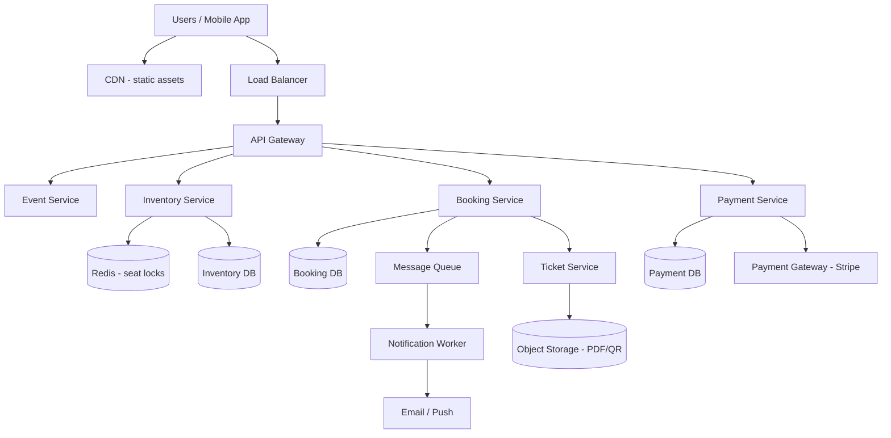

# Case Study 11 — Ticket Booking (Ticketmaster-like)

Design a **concert/event ticket booking** system where thousands of users compete for a limited seat inventory at the same time.

## 1. Problem

Users browse events, pick seats on a venue map, hold them briefly, pay, and receive confirmed tickets. The hard part is **preventing double-booking** when many people click the same seat at once.

## 2. Requirements

### Functional (MVP)

- List events and show available seats on a venue map  
- Search/filter by city, date, artist  
- **Hold** a seat for a short window (e.g., 10 minutes) while user pays  
- **Confirm** booking after successful payment  
- Release held seats if payment fails or timer expires  
- View "My Tickets" with QR/barcode for entry  
- Admin: create events, upload seat maps, set prices by section  

### Out of scope (initially)

- Dynamic pricing / auctions  
- Resale marketplace  
- Waitlists and lottery draws  
- Complex package bundles (hotel + ticket)  
- Real-time seat view sync for every mouse hover (nice-to-have later)  

### Non-functional

- **Strong consistency** for seat inventory (no two confirmed bookings for same seat)  
- Handle **flash sales** — spikes when tickets go on sale  
- Hold path should respond in **< 200 ms** (user expects instant feedback)  
- Payment path can tolerate slightly higher latency  
- Idempotent payment confirmation (retries must not double-charge or double-book)  
- High availability during on-sale windows  

## 3. Back-of-the-envelope estimates

Assumptions:

- 500 popular events/month; 1 hot event sells 20,000 seats in 10 minutes  
- Average event: 5,000 seats, 80% sell-through  
- Peak on-sale: 50,000 concurrent users on one event  

```text
Hot event write QPS (hold attempts):
  50,000 users × ~2 seat clicks/min ≈ 1,700 holds/s peak
  (many will fail fast — seat already taken)

Confirmed bookings:
  20,000 seats / 600 s ≈ 33 confirmations/s peak

Storage (orders + seats):
  500 events × 5,000 seats × ~200B ≈ 500MB seat rows
  + bookings, payments → low TB scale for years

Read QPS (browse, seat map):
  10× write during on-sale → ~17,000 reads/s peak
```

Insight: **seat inventory writes** are the bottleneck, not payment. Optimize holds with fast in-memory locks + DB as source of truth.

## 4. High-Level Design (HLD)



### Components

| Component | Role |
|-----------|------|
| Event Service | Events, venues, schedules, search |
| Inventory Service | Seat map, availability, **holds**, releases |
| Booking Service | Orchestrates hold → pay → confirm lifecycle |
| Payment Service | Charges card, webhooks, idempotency |
| Ticket Service | Generates ticket PDF/QR after confirmation |
| Redis | Short-lived seat locks (fast path) |
| Inventory DB | Authoritative seat state per event |
| Queue + workers | Expire holds, send emails, async cleanup |

### Flows

**Browse & view seats**

1. User opens event → Event Service returns metadata  
2. Inventory Service returns seat map + status (`AVAILABLE`, `HELD`, `SOLD`)  
3. Frontend polls or uses WebSocket for updates (optional at scale)  

**Hold → Pay → Confirm (happy path)**

1. User selects seat `A-12` → `POST /holds`  
2. Inventory Service tries atomic lock in Redis + DB update to `HELD`  
3. Booking Service creates booking in `PENDING_PAYMENT` with `expires_at`  
4. User submits payment → Payment Service charges with **idempotency key**  
5. On success, Booking Service calls Inventory to `CONFIRM` (seat → `SOLD`)  
6. Ticket Service generates QR; notification sent  

**Hold expiry**

1. Timer fires (Redis TTL or scheduled job via queue)  
2. If booking still `PENDING_PAYMENT`, release seat → `AVAILABLE`  
3. Cancel booking record  

### Trade-offs

| Choice | Pros | Cons |
|--------|------|------|
| Redis lock + DB | Fast holds, survives Redis restart if DB is truth | Two layers to keep in sync |
| DB-only pessimistic lock (`SELECT FOR UPDATE`) | Simpler correctness | Slower under extreme contention |
| Optimistic locking (version column) | Good for low contention | Many retries during flash sales |
| Seat-level vs section-level inventory | Seat map UX | More rows, harder to scale |
| 10-min hold vs 5-min | Better conversion | More seats locked, fewer available |

**Interview tip:** Start with **Redis hold + DB confirmation**. Mention DB-only as MVP if team is small.

## 5. Low-Level Design (LLD)

### APIs

```text
GET /api/v1/events?city=NYC&date=2026-08-01
→ { events: [{ eventId, title, venue, startsAt, minPrice }] }

GET /api/v1/events/:eventId/seats
→ { sections: [...], seats: [{ seatId, row, number, price, status }] }

POST /api/v1/holds
Headers: Idempotency-Key: <uuid>   # optional for hold retries
Body: { eventId, seatIds: ["s-101"], userId }
→ 201 { holdId, bookingId, expiresAt, totalAmount }
→ 409 { error: "SEAT_UNAVAILABLE", seatIds: ["s-101"] }

DELETE /api/v1/holds/:holdId
→ 204

POST /api/v1/bookings/:bookingId/pay
Headers: Idempotency-Key: <uuid>   # required
Body: { paymentMethodId, amount }
→ 200 { bookingId, status: "CONFIRMED", ticketIds: [...] }
→ 402 { error: "PAYMENT_FAILED" }
→ 410 { error: "HOLD_EXPIRED" }

GET /api/v1/users/:userId/tickets
→ { tickets: [{ ticketId, event, seat, qrUrl }] }
```

### Schema

```text
events (
  event_id      UUID PRIMARY KEY,
  title         TEXT NOT NULL,
  venue_id      UUID NOT NULL,
  starts_at     TIMESTAMPTZ NOT NULL,
  on_sale_at    TIMESTAMPTZ NOT NULL,
  status        VARCHAR(20)  -- DRAFT, ON_SALE, SOLD_OUT
)

seats (
  seat_id       UUID PRIMARY KEY,
  event_id      UUID NOT NULL,
  section       VARCHAR(20),
  row_label     VARCHAR(10),
  seat_number   INT,
  price_cents   INT NOT NULL,
  status        VARCHAR(20),  -- AVAILABLE, HELD, SOLD
  version       INT DEFAULT 0,  -- optimistic lock
  held_by       UUID NULL,
  hold_expires  TIMESTAMPTZ NULL,
  UNIQUE (event_id, section, row_label, seat_number)
)

bookings (
  booking_id    UUID PRIMARY KEY,
  user_id       UUID NOT NULL,
  event_id      UUID NOT NULL,
  status        VARCHAR(30),  -- PENDING_PAYMENT, CONFIRMED, CANCELLED, EXPIRED
  total_cents   INT NOT NULL,
  hold_expires  TIMESTAMPTZ NOT NULL,
  idempotency_key VARCHAR(64) UNIQUE,
  created_at    TIMESTAMPTZ NOT NULL
)

booking_seats (
  booking_id    UUID REFERENCES bookings,
  seat_id       UUID REFERENCES seats,
  PRIMARY KEY (booking_id, seat_id)
)

payments (
  payment_id    UUID PRIMARY KEY,
  booking_id    UUID NOT NULL,
  idempotency_key VARCHAR(64) UNIQUE NOT NULL,
  amount_cents  INT NOT NULL,
  status        VARCHAR(20),  -- PENDING, SUCCEEDED, FAILED
  gateway_ref   TEXT,
  created_at    TIMESTAMPTZ NOT NULL
)

tickets (
  ticket_id     UUID PRIMARY KEY,
  booking_id    UUID NOT NULL,
  seat_id       UUID NOT NULL,
  qr_payload    TEXT NOT NULL,
  issued_at     TIMESTAMPTZ NOT NULL
)
```

### Modules

```text
EventController / EventService / EventRepository
InventoryController / SeatLockService / SeatRepository
BookingController / BookingOrchestrator / HoldExpiryWorker
PaymentController / PaymentService / PaymentGatewayClient
TicketService / QrGenerator
NotificationProducer
```

### Key algorithm — seat hold (Redis + DB)

```text
function holdSeats(eventId, seatIds, userId, ttlSeconds=600):
  for seatId in seatIds:
    lockKey = "hold:{eventId}:{seatId}"
    acquired = redis.set(lockKey, userId, NX, EX=ttlSeconds)
    if not acquired:
      releaseAnyPartialLocks(eventId, seatIds, userId)
      return SEAT_UNAVAILABLE(seatId)

  # All Redis locks acquired — persist to DB in one transaction
  begin transaction
    for seatId in seatIds:
      row = repo.selectSeatForUpdate(seatId)
      if row.status != AVAILABLE:
        rollback; releaseRedisLocks(); return SEAT_UNAVAILABLE
      repo.updateSeat(seatId, status=HELD, held_by=userId,
                      hold_expires=now()+ttl, version=row.version+1)
    booking = repo.createBooking(userId, eventId, PENDING_PAYMENT, hold_expires)
    repo.linkBookingSeats(booking.id, seatIds)
  commit

  return { holdId, bookingId, expiresAt }
```

Why both Redis and DB?

- **Redis** rejects duplicate holds in microseconds (flash sale UX)  
- **DB** is durable source of truth if Redis evicts or restarts  

### Key algorithm — confirm after payment

```text
function confirmBooking(bookingId, idempotencyKey, paymentPayload):
  existing = payments.findByIdempotencyKey(idempotencyKey)
  if existing: return existing.result  # idempotent replay

  booking = repo.getBooking(bookingId)
  if booking.status == CONFIRMED: return booking  # already done
  if booking.hold_expires < now(): return HOLD_EXPIRED
  if any seat not HELD by this user: return INVALID_STATE

  payment = gateway.charge(paymentPayload)
  if payment.failed:
    repo.savePayment(FAILED, idempotencyKey)
    return PAYMENT_FAILED

  begin transaction
    repo.savePayment(SUCCEEDED, idempotencyKey, payment.ref)
    for seatId in booking.seatIds:
      repo.updateSeat(seatId, status=SOLD, held_by=null, hold_expires=null)
    repo.updateBooking(bookingId, status=CONFIRMED)
    tickets = ticketService.issue(bookingId)
  commit

  for seatId in booking.seatIds:
    redis.del("hold:{eventId}:{seatId}")

  notify(userId, tickets)
  return { status: CONFIRMED, tickets }
```

### Key algorithm — hold expiry (worker)

```text
function expireHolds():
  expiredBookings = repo.findPendingWhere(hold_expires < now(), limit=500)
  for booking in expiredBookings:
    begin transaction
      repo.updateBooking(booking.id, EXPIRED)
      for seatId in booking.seatIds:
        repo.updateSeatIfHeldBy(seatId, booking.userId, status=AVAILABLE)
    commit
    for seatId in booking.seatIds:
      redis.del("hold:{eventId}:{seatId}")
```

Run worker every few seconds + rely on Redis TTL as a safety net.

### Concurrency & correctness

| Risk | Mitigation |
|------|------------|
| Double booking same seat | `UNIQUE (event_id, section, row, seat)` + transactional status checks |
| Two holds same seat | Redis `SET NX` + DB `SELECT FOR UPDATE` |
| Payment retry double-charges | `idempotency_key` unique on `payments` |
| Payment succeeds but confirm crashes | Reconciliation job: poll gateway, complete confirm |
| Partial multi-seat hold | Hold all-or-nothing in one DB transaction |
| Stale seat map in UI | Poll every 5s or push WebSocket on section granularity |

**Virtual waiting room (at extreme scale):** Before on-sale, queue users in FIFO; only N enter checkout at a time. Reduces thundering herd on Inventory Service.

## 6. Scale evolution

| Stage | Change |
|-------|--------|
| MVP | Single Postgres, Redis, monolith; DB row locks |
| Hot event | Redis cluster; shard Inventory DB by `event_id` |
| Flash sale | Virtual waiting room; pre-warm seat cache; CDN for static maps |
| Global tours | Regional read replicas; single writer per event shard |
| Resale (later) | Separate marketplace service; transfer ticket ownership |

## 7. Recap

- Seat inventory needs **strong consistency** — optimistic UI is fine, confirmed booking is not  
- Pattern: **fast lock (Redis) + durable state (DB) + idempotent payment**  
- Hold timer prevents seats being locked forever by abandoned carts  
- Flash sales add **queueing** and **sharding by event**, not just bigger servers  

**Practice:** Draw the hold → pay → confirm sequence diagram from memory. Write pseudocode for `holdSeats` including rollback on partial failure.
