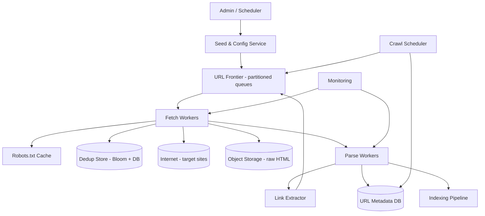

# Case Study 12 — Distributed Web Crawler

Design a **web crawler** that discovers and downloads billions of web pages, respects site policies, and feeds a search index or analytics pipeline.

## 1. Problem

Given seed URLs, the system should continuously fetch pages, extract new links, avoid duplicates, stay polite to websites, and store raw content for downstream processing (indexing, ML, archival).

## 2. Requirements

### Functional (MVP)

- Accept seed URLs and crawl scope (domain, depth limit)  
- Fetch HTML pages over HTTP/HTTPS  
- Parse links and enqueue new URLs  
- **Deduplicate** URLs (never fetch same canonical URL twice)  
- Respect **robots.txt** and per-domain rate limits  
- Store page content + metadata (URL, status, fetch time, checksum)  
- Track crawl status: pending, in-progress, done, failed  
- Retry transient failures with backoff  

### Out of scope (initially)

- JavaScript rendering (headless browser farm)  
- Login-gated / CAPTCHA pages  
- Real-time "instant index" (< 1 min) for entire web  
- Full distributed graph analytics on link structure  
- Image/video binary crawling at scale (can be phase 2)  

### Non-functional

- **Scalable** to billions of URLs  
- **Polite** — don't overload small sites  
- **Fault tolerant** — worker crashes shouldn't lose progress  
- **Extensible** — plug in new parsers (news, products, etc.)  
- Eventual completeness within hours/days, not seconds  
- Cost-efficient storage and bandwidth  

## 3. Back-of-the-envelope estimates

These numbers are **rough order-of-magnitude math** — not a capacity plan. In interviews, the goal is to show you know *what to count* and *which resource breaks first*. A useful shortcut: **1 QPS sustained ≈ 86,400 operations/day**. Crawlers run 24/7, but **peak parallelism** can be much higher than average when you burst to finish a recrawl window.

### Why we estimate

A web crawler is a **throughput pipeline**, not a user-facing latency system. Estimates tell us:

- Whether **storage**, **URL metadata**, or **network bandwidth** is the limiting factor  
- Why a single Redis queue cannot hold billions of URLs  
- How **politeness** (per-domain rate limits) caps theoretical max fetch rate  

### Assumptions

| Assumption | Value | Why it matters |
|------------|-------|----------------|
| Unique pages in corpus | 5 billion | Total work per crawl cycle |
| Recrawl interval | ~30 days | Sets sustained average fetch rate |
| Average HTML page size | 50 KB | Storage and bandwidth |
| Peak crawl rate (large fleet) | 100,000 pages/s | Burst capacity with many workers |
| Metadata per URL | ~500 B | URL state DB sizing |
| Politeness default | ~1 req/s per domain | Real throughput << raw worker count |

### Step A — Traffic (QPS) with labeled arithmetic

**Sustained average fetch rate (refresh entire corpus in 30 days):**

```text
Total pages         = 5,000,000,000
Seconds in 30 days  = 30 × 86,400 = 2,592,000 seconds

Average fetch QPS   = 5,000,000,000 ÷ 2,592,000
                    ≈ 1,930 pages/second (sustained)
```

Round to **~1,900 pages/s** — this is what you must sustain to recrawl monthly.

**Peak fetch rate (parallel fleet):**

```text
Peak fetch QPS ≈ 50,000–100,000 pages/s (design target for large crawl)
```

Peak is **50×+ above average** — you crawl faster when needed, then throttle for politeness.

**Enqueue rate (new URLs discovered while parsing):**

Discovery adds URLs continuously. If each page yields ~10 new links and 90% are duplicates after dedup:

```text
New unique URLs/s ≈ 1,900 × 10 × 10% ≈ 1,900 enqueues/s (order of magnitude)
```

Dedup and frontier design must handle this steady **write** load to metadata.

### Step B — Storage

**Raw HTML in object storage:**

```text
Pages           = 5 billion
Size per page   = 50 KB

Raw HTML        = 5B × 50 KB = 250 TB
With metadata   = 250 TB + indexes → plan for ~300 TB+
```

**URL metadata database:**

```text
URL rows        = 5 billion
Bytes per row   ≈ 500 B (hash, URL, status, timestamps, blob pointer)

Metadata raw    = 5B × 500 B = 2.5 TB
With indexes    ≈ 5–8 TB (several TB total)
```

**Bloom filter for dedup (in memory, approximate):**

```text
5B URLs, 1% false-positive rate → roughly 5–6 GB per filter (varies by implementation)
Often sharded by hash prefix across Redis/cluster nodes
```

### Step C — Bandwidth

**Egress at peak crawl:**

```text
Peak fetch QPS   = 100,000 pages/s
Page size        = 50 KB

Bandwidth        = 100,000 × 50 KB
                 = 5,000,000 KB/s
                 ≈ 5 GB/s download throughput
```

**Sustained average bandwidth:**

```text
1,900 pages/s × 50 KB ≈ 95 MB/s (much lower than peak)
```

Bandwidth and **disk write speed** to object storage matter as much as CPU.

### Step D — Read:write ratio table

| Operation | Type | Rate | Notes |
|-----------|------|------|-------|
| HTTP GET (fetch page) | Read (external) | ~1,900/s avg; 100k/s peak | Politeness caps per domain |
| Dedup check | Read | ~1 per enqueue | Bloom + DB confirm |
| URL enqueue / status update | Write | ~1,900/s+ | Metadata DB hot path |
| Blob store write | Write | ~1,900/s avg | 250 TB total |
| Parse / link extract | CPU | ~1,900/s avg | Emits new URLs to frontier |
| Recrawl scheduler query | Read | Batch / periodic | Scans stale URLs |

**Ratio:** roughly **1:1 fetch to metadata write** on the hot path; dedup reads are cheap compared to HTTP fetches.

### What the numbers tell us

- **250 TB of HTML** → object storage (S3), not a database  
- **Billions of URL rows** → sharded metadata store (Cassandra/DynamoDB), not one Postgres  
- **Frontier cannot be one queue** → partition by `hash(domain)` or Kafka topics  
- **Bloom filters** save billions of DB lookups for dedup  
- **1 req/s per domain** means 100k global QPS requires **100k+ distinct domains** in flight — fair scheduling across domains is critical  
- Fetch workers are **stateless**; all coordination lives in frontier + dedup + metadata  

### Common mistake for this problem

Designing for **maximum HTTP QPS** without **per-domain politeness**. A crawler that ignores robots.txt and hammers one site at 10k req/s will get blocked and is unethical. Another mistake: storing **raw HTML in SQL** — at 250 TB, blobs belong in object storage; SQL holds metadata only.

## 4. High-Level Design (HLD)



### Components

| Component | Role |
|-----------|------|
| Seed Service | Initial URLs, crawl policies, allow/deny lists |
| URL Frontier | Priority queues of URLs to fetch (by domain shard) |
| Fetch Workers | HTTP GET, headers, redirects, timeouts |
| Robots Cache | Cached robots.txt rules per host |
| Dedup Store | "Have we seen this URL?" — Bloom filter + DB confirm |
| Object Storage | Raw page blobs (cheap, durable) |
| Parse Workers | HTML parse, extract links, title, text snippet |
| Metadata DB | URL state, last fetch, HTTP status, content hash |
| Scheduler | Prioritize important domains, recrawl stale pages |
| Index Pipeline | Downstream search index (separate system) |

### Flows

**Add seed & discover**

1. Admin adds `https://news.example.com`  
2. URL normalized → hash → dedup check → enqueue frontier  
3. Fetch worker pulls URL (respecting domain rate limit)  
4. Download page → store blob → emit parse job  
5. Parser extracts links → normalize → dedup → enqueue new URLs  

**Recrawl**

1. Scheduler queries Metadata DB for URLs where `last_fetched_at < now - 30 days`  
2. Re-enqueue with lower priority than fresh discoveries  

**Failure handling**

1. HTTP 5xx / timeout → retry with exponential backoff (max N tries)  
2. HTTP 404 → mark done, don't retry soon  
3. Worker crash mid-fetch → URL lease expires → another worker picks it up  

### Trade-offs

| Choice | Pros | Cons |
|--------|------|------|
| BFS vs priority crawl | BFS simple; priority focuses on important pages | Priority needs ranking signals |
| Per-domain queues | Natural rate limiting | Hot domains need fair scheduling |
| Bloom filter dedup | Tiny memory, fast | False positives need DB confirm |
| Store HTML in blob vs DB | Cheaper at scale | Extra hop to read content |
| Politeness delay 1 req/s/domain | Safe for sites | Slow for large domains — use adaptive limits |

## 5. Low-Level Design (LLD)

### APIs (internal / admin)

```text
POST /api/v1/crawl/seeds
Body: { urls: ["https://example.com"], maxDepth: 5, allowedDomains: ["example.com"] }
→ 202 { crawlJobId }

GET /api/v1/crawl/jobs/:jobId
→ { status, urlsDiscovered, urlsFetched, urlsFailed, progressPct }

GET /api/v1/urls/:urlHash
→ { canonicalUrl, status, lastFetchedAt, httpStatus, contentHash, blobKey }

POST /api/v1/crawl/pause?domain=example.com
→ 200

GET /api/v1/stats
→ { fetchRate, queueDepthByShard, errorRate }
```

### Schema

```text
urls (
  url_hash       BIGINT PRIMARY KEY,  -- hash of normalized URL
  canonical_url  TEXT NOT NULL,
  domain         TEXT NOT NULL,
  status         VARCHAR(20),  -- PENDING, FETCHING, FETCHED, FAILED, SKIPPED
  depth          INT,
  priority       INT DEFAULT 0,
  last_fetched   TIMESTAMPTZ,
  next_fetch_after TIMESTAMPTZ,
  http_status    INT,
  content_hash   VARCHAR(64),
  blob_key       TEXT,
  fail_count     INT DEFAULT 0,
  crawl_job_id   UUID
)

crawl_jobs (
  job_id         UUID PRIMARY KEY,
  seeds          JSONB,
  config         JSONB,
  created_at     TIMESTAMPTZ,
  status         VARCHAR(20)
)

domain_policies (
  domain         TEXT PRIMARY KEY,
  min_delay_ms   INT DEFAULT 1000,
  max_concurrent INT DEFAULT 2,
  robots_txt     TEXT,
  robots_fetched TIMESTAMPTZ,
  is_paused      BOOLEAN DEFAULT FALSE
)

fetch_log (
  id             BIGSERIAL PRIMARY KEY,
  url_hash       BIGINT,
  fetched_at     TIMESTAMPTZ,
  http_status    INT,
  bytes          INT,
  worker_id      TEXT,
  latency_ms     INT
)
```

Shard `urls` by `hash(domain) % N` or by `url_hash` for even spread.

### Modules

```text
SeedController / CrawlJobService
FrontierService / DomainQueueManager / PriorityScheduler
FetchWorker / HttpClient / RateLimiter / RobotsParser
DedupService / BloomFilterManager / UrlNormalizer
ParseWorker / HtmlParser / LinkExtractor
BlobStore / MetadataRepository
RecrawlScheduler
```

### Key algorithm — URL normalization

```text
function normalize(rawUrl):
  url = parse(rawUrl)
  url.scheme = lower(url.scheme)           # https
  url.host = lower(url.host)                 # strip www? policy choice
  url.fragment = null                        # usually ignore #anchor
  url.path = collapseSlashes(url.path)
  if url.path empty: url.path = "/"
  # optional: remove default ports, sort query params, strip tracking params
  return canonicalString(url)

function urlHash(normalizedUrl):
  return murmur128(normalizedUrl)  # 128-bit → store as BIGINT or UUID
```

Consistent normalization prevents `http://ExAmple.com/` and `https://example.com` being treated differently (policy-dependent).

### Key algorithm — enqueue with dedup

```text
function enqueue(url, depth, priority):
  norm = normalize(url)
  h = urlHash(norm)

  if bloom.mightContain(h):
    if db.exists(h): return DUPLICATE
  bloom.add(h)  # may false-positive; DB is final judge

  inserted = db.insertIfAbsent(urls, h, norm, status=PENDING, depth, priority)
  if not inserted: return DUPLICATE

  shard = hash(norm.domain) % NUM_SHARDS
  frontier.push(shard, { urlHash: h, priority, domain: norm.domain })
  return ENQUEUED
```

### Key algorithm — fetch worker loop

```text
function fetchLoop(workerId):
  while true:
    task = frontier.pullBlocking(timeout=5s)  # respects domain fairness
    if task is null: continue

    policy = policyCache.get(task.domain)
    if policy.is_paused: requeue(task); continue

    waitForRateLimit(task.domain, policy.min_delay_ms)

    if not robotsAllowed(task.url, policy.robots_txt):
      db.update(task.urlHash, SKIPPED)
      continue

    lease = db.claimUrl(task.urlHash, workerId, leaseTtl=120s)
    if not lease: continue  # another worker has it

    try:
      response = http.get(task.url, timeout=10s, maxBytes=10MB)
      blobKey = blobStore.put(response.body)
      db.update(task.urlHash, FETCHED, response.status, hash(body), blobKey)
      parseQueue.push({ urlHash: task.urlHash, blobKey })
    catch TransientError:
      db.incrementFailCount(task.urlHash)
      if failCount < MAX_RETRIES:
        frontier.requeueWithBackoff(task, delay=2^failCount seconds)
      else:
        db.update(task.urlHash, FAILED)
```

### Key algorithm — domain-fair frontier

```text
# Round-robin across domain buckets so one huge site doesn't starve others
function pullNext():
  for domain in roundRobin(domainList):
    if domain.isPaused: continue
    if not rateLimiter.canFetch(domain): continue
    url = domainQueue[domain].pop()
    if url: return url
  return null
```

### Concurrency & correctness

| Concern | Approach |
|---------|----------|
| Duplicate fetches | Bloom + `INSERT ... ON CONFLICT DO NOTHING` on `url_hash` |
| Same URL fetched by 2 workers | `claimUrl` sets status `FETCHING` with lease TTL atomically |
| robots.txt race | Cache with TTL; refresh async before bulk crawl |
| Poison URLs (infinite redirects) | Max redirect hops; max depth; max fail count |
| Hot partition (one domain) | Per-domain queues + concurrency cap, not global FIFO |

**Checksum skip:** If `content_hash` unchanged on recrawl, skip re-parse and re-index.

## 6. Scale evolution

| Stage | Change |
|-------|--------|
| MVP | Single machine, Redis queue, SQLite/Postgres metadata, cron fetch |
| Millions URLs | Sharded frontier (Kafka/SQS), Bloom filter in Redis, S3 blobs |
| Billions URLs | Distributed metadata (Cassandra/DynamoDB), hierarchical scheduler |
| JS-heavy sites | Headless Chrome pool (expensive); separate "render queue" |
| Global crawl | Regional fetchers near targets; respect geo robots rules |

## 7. Recap

- Crawler = **frontier queue + dedup + polite fetch + parse loop**  
- Scale bottlenecks are **URL metadata** and **fair scheduling**, not HTTP alone  
- Bloom filters save memory; DB confirms duplicates  
- Always discuss **robots.txt**, rate limits, and retries — interviewers care about ethics and ops  

**Practice:** Draw the crawl loop from seed to new URLs. Explain how you'd prevent one viral domain from blocking the entire crawl.
