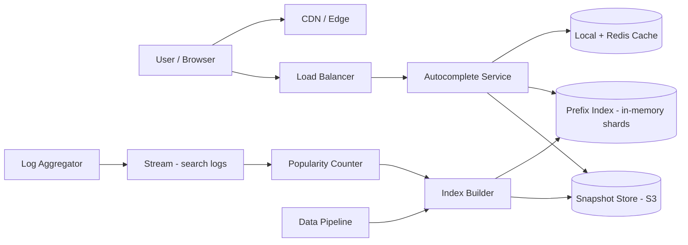

# Case Study 13 — Search Autocomplete (Typeahead)

Design a **search autocomplete / typeahead** system like Google Search suggestions or Amazon product search — as the user types, return relevant completions in milliseconds.

## 1. Problem

On each keystroke (or every few characters), the client sends a prefix query like `"sys"` and expects top-K suggestions (`"system design"`, `"system of a down"`, …) ranked by popularity and relevance, with latency low enough that the UI feels instant.

## 2. Requirements

### Functional (MVP)

- Return top **K** suggestions (e.g., 10) for a query prefix  
- Rank by **popularity** (search frequency) and basic relevance  
- Support **personalization** optionally (user's recent searches) — phase 2  
- Handle prefixes of 1–50 characters  
- Update suggestions as new trending queries emerge (near real-time or daily)  
- Multi-language / locale-aware results  

### Out of scope (initially)

- Full web search results page  
- Spell correction across entire index ("did you mean") — can add fuzzy layer later  
- Rich snippets (images, prices) in dropdown  
- Voice input processing  

### Non-functional

- **Ultra-low latency**: p99 < 50 ms (often < 20 ms)  
- **High read QPS**: every keystroke = 1 request (with debouncing on client)  
- **High availability** — autocomplete is on critical search path  
- Eventually consistent with trending updates (minutes delay OK)  
- Cost-efficient at billions of unique queries stored  

## 3. Back-of-the-envelope estimates

These numbers are **rough order-of-magnitude math** — not a capacity plan. In interviews, the goal is to show you know *what to count* and *which resource breaks first*. A useful shortcut: **1 QPS sustained ≈ 86,400 requests/day**. Autocomplete breaks that rule because **every keystroke can fire a request** — client debounce is essential to cut volume.

### Why we estimate

Autocomplete sits on the **critical search path** with a **p99 < 50 ms** target. Estimates tell us:

- Why you cannot run `LIKE 'prefix%'` on a database at request time  
- How **client debounce** changes QPS by 2–3×  
- Whether the index must live **in memory** (yes, at this scale)  

### Assumptions

| Assumption | Value | Why it matters |
|------------|-------|----------------|
| Daily active search users | 500M | Base traffic volume |
| Keystrokes per search interaction | 8 (before debounce) | Upper bound on raw calls |
| Client debounce | 150 ms | Collapses redundant requests |
| Effective API calls per search | ~3 | After debounce + min prefix length |
| Unique query strings in index | ~500M | Long tail storage |
| Top-K suggestions returned | 10 | Fixed response size |

### Step A — Traffic (QPS) with labeled arithmetic

**Daily autocomplete requests:**

```text
Searches per day        = 500,000,000
Calls per search        = 3 (after debounce)

Daily requests          = 500M × 3 = 1,500,000,000 requests/day
```

**Average QPS:**

```text
Average QPS = 1,500,000,000 ÷ 86,400
            ≈ 17,361 requests/second
            ≈ 17,000/s (round for interview)
```

**Peak QPS (5× average, regional spikes higher):**

```text
Peak QPS ≈ 17,000 × 5 ≈ 85,000/s
```

**Without debounce (why debounce matters):**

```text
Raw calls = 500M searches × 8 keystrokes = 4B requests/day
Raw QPS   = 4B ÷ 86,400 ≈ 46,000/s  → 2.7× worse than debounced
```

**Index update traffic (async, off hot path):**

```text
Search log ingest: high volume, but batched every 1–5 minutes
Write QPS to live trie: effectively 0 at request time — full snapshot rebuild + swap
```

### Step B — Storage

**Unique query strings (raw text):**

```text
Queries         = 500 million
Avg term length ≈ 30 bytes

Raw term text   = 500M × 30 B ≈ 15 GB
```

**In-memory trie with top-K at each node:**

```text
15 GB raw terms + trie structure overhead + top-10 heaps per node
Total in memory ≈ 50–100 GB (sharded across nodes)

Top 1M prefixes serve ~80% of traffic → fits easily in Redis + local LRU
```

**Snapshot files (for rolling reload):**

```text
Serialized trie snapshot ≈ 50–100 GB per locale → stored in S3, loaded at pod start
```

### Step C — Bandwidth

**Response size per suggest call:**

```text
10 suggestions × ~40 B JSON each ≈ 400 B payload + overhead ≈ 1 KB/response

Peak egress ≈ 85,000/s × 1 KB ≈ 85 MB/s (modest — latency, not bandwidth, is the constraint)
```

**Search log ingest (write side):**

```text
500M searches/day × ~100 B log line ≈ 50 GB/day of raw logs → Kafka, not the suggest API
```

### Step D — Read:write ratio table

| Operation | Type | QPS | Notes |
|-----------|------|-----|-------|
| `GET /suggest` | Read | ~17k avg; ~85k peak | Must be < 50 ms p99 |
| Trie lookup | Read | Same | O(prefix length) walk |
| L1/L2 cache hit | Read | ~80% of prefix traffic | Hot prefixes |
| Search log append | Write | ~5,800/s avg | Separate pipeline |
| Index rebuild | Write | Batch every 1–5 min | Zero-downtime pointer swap |

**Ratio:** **millions : 1 read-to-write** on the hot suggest path — classic read-heavy, precompute pattern.

### What the numbers tell us

- **17k–85k read QPS** with **< 50 ms p99** → precomputed **trie + top-K per node**, not database queries  
- **Client debounce cuts QPS ~3×** — mention it proactively in interviews  
- **50–100 GB in memory** → shard tries by first character or hash prefix across servers  
- **80% traffic on top 1M prefixes** → Redis + in-process LRU cache is high ROI  
- **Index updates are async** — batch rebuild from search logs; swap snapshot without downtime  
- Long tail (500M queries) is fine **offline**; hot path only walks a trie  

### Common mistake for this problem

Proposing **Elasticsearch** or **`SELECT ... LIKE 'prefix%'`** on every keystroke. At 85k QPS and 500M rows, that cannot hit p99 < 50 ms. The correct pattern is **offline precomputation + in-memory serve + cache**. Another mistake: forgetting **debounce** and overstating QPS by 2–3×.

## 4. High-Level Design (HLD)



### Components

| Component | Role |
|-----------|------|
| Autocomplete Service | Stateless API; lookup prefix → top-K |
| Prefix Index | Trie or sorted array + binary search per shard |
| Popularity Counter | Count query frequencies from search logs (Flink/Spark) |
| Index Builder | Merges counts, builds new index snapshot periodically |
| Snapshot Store | Versioned index files for rolling reload |
| Cache | Hot prefix results (Redis + in-process LRU) |
| Log pipeline | Ingest raw searches → aggregate top queries |

### Flows

**Query path (read)**

1. User types `"sys"` → client debounces → `GET /suggest?q=sys&limit=10`  
2. Autocomplete Service normalizes query (lowercase, trim)  
3. Check local LRU cache → Redis → in-memory trie shard  
4. Return JSON list in ~5–20 ms  

**Index update path (write, async)**

1. Search logs stream to Kafka  
2. Counter job aggregates `(query, count)` windows  
3. Every N minutes, Builder merges with historical totals  
4. Builds new trie snapshot → uploads to S3  
5. Autocomplete pods reload snapshot with zero-downtime swap  

### Trade-offs

| Approach | Pros | Cons |
|----------|------|------|
| Trie in memory | Fast prefix walk O(prefix len) | Memory heavy; rebuild complexity |
| Elasticsearch completion suggester | Less custom code | Harder to hit <10ms p99 at huge scale |
| DB `LIKE 'prefix%'` | Simple | Too slow at billions of rows |
| Client debounce 150–300 ms | Cuts QPS 3–5× | Slightly less "live" feel |
| Global vs per-locale index | Better relevance | More shards to maintain |

**Interview answer:** Precomputed **trie + top-K heap per node**, sharded by first character or hash prefix.

## 5. Low-Level Design (LLD)

### APIs

```text
GET /api/v1/suggest?q=system&limit=10&locale=en-US
→ 200 {
  "query": "system",
  "suggestions": [
    { "text": "system design interview", "score": 98234 },
    { "text": "system of a down", "score": 45100 },
    ...
  ],
  "latencyMs": 4
}

GET /api/v1/suggest/health
→ 200 { "indexVersion": "20260720-1430", "shardStatus": "OK" }
```

Optional: `POST /internal/index/reload` for controlled rollout.

### Schema (metadata & analytics — not the hot path)

```text
query_stats (
  query_text     TEXT,
  locale         VARCHAR(10),
  daily_count    BIGINT,
  total_count    BIGINT,
  last_seen      TIMESTAMPTZ,
  PRIMARY KEY (locale, query_text)
)

index_snapshots (
  version        VARCHAR(30) PRIMARY KEY,
  locale         VARCHAR(10),
  blob_path      TEXT,
  record_count   BIGINT,
  created_at     TIMESTAMPTZ,
  is_active      BOOLEAN
)

-- Personalization (phase 2)
user_recent_searches (
  user_id        UUID,
  query_text     TEXT,
  searched_at    TIMESTAMPTZ,
  PRIMARY KEY (user_id, query_text)
)
```

The **hot index** lives in memory (trie files), not queried from Postgres per request.

### Modules

```text
SuggestController / SuggestService
PrefixIndex / TrieNode / TopKHeap
IndexLoader / SnapshotManager
QueryNormalizer / LocaleRouter
PopularityAggregator / IndexBuilderJob
SuggestCache (L1 LRU + L2 Redis)
```

### Data structure — trie with top-K at each node

Each trie node stores:

- `children`: map char → node  
- `topK`: fixed-size max-heap or sorted array of `{ phrase, score }` for **full queries** passing through this prefix  

```text
class TrieNode:
  children: Map<char, TrieNode>
  topK: List<Suggestion>  # size ≤ K, sorted by score desc

function insert(phrase, score):
  node = root
  for ch in phrase:
    node = node.child(ch)
    node.topK.addOrUpdate(phrase, score)  # keep only best K
```

Query `"sys"` → walk `s → y → s` → return `node.topK`.

### Key algorithm — suggest

```text
function suggest(rawQuery, limit, locale):
  q = normalize(rawQuery, locale)   # lowercase, NFC unicode, trim
  if len(q) == 0: return trending(locale)  # optional: show trending when empty
  if len(q) > MAX_PREFIX: q = q[0:MAX_PREFIX]

  cached = cache.get(locale, q)
  if cached: return cached

  shard = shardFor(q, locale)       # e.g., first char 's' → shard 18
  node = shardIndex[shard].walk(q)
  if node is null: return []

  results = node.topK.take(limit)
  cache.set(locale, q, results, ttl=60s)
  return results
```

### Key algorithm — build index from logs

```text
function buildIndexSnapshot(locale, windowHours=24):
  counts = aggregateSearchLogs(locale, windowHours)
  # Merge with historical decay: score = 0.7*today + 0.3*yesterday
  merged = mergeWithDecay(counts, historicalStats)

  trie = new Trie()
  for (phrase, score) in merged.sortedByScore():
    if isBlocked(phrase): continue   # profanity, spam
    trie.insert(phrase, score)

  snapshot = serialize(trie)
  uploadToS3(version, locale, snapshot)
  markSnapshotReady(version)
```

### Key algorithm — zero-downtime reload

```text
function reloadIndex():
  meta = snapshotStore.latestActive(locale)
  newTrie = deserialize(download(meta.blob_path))
  atomicSwap(shardIndexes[locale], newTrie)  # pointer swap in memory
  localCache.clear()
```

Use double-buffering: readers always hold ref to current trie; writers build new trie then swap pointer atomically.

### Client-side optimizations (mention in interview)

```text
# Debounce: wait 150ms after last keystroke before API call
# AbortController: cancel in-flight request when user types next char
# Minimum prefix length 2 before calling API
# Cache recent prefixes client-side (sessionStorage)
```

### Concurrency & correctness

| Concern | Approach |
|---------|----------|
| Stale suggestions after reload | Version header in response; client can ignore stale |
| Thundering herd on deploy | Pre-warm cache; gradual pod rollout |
| Unicode normalization | NFC + locale-specific lowercasing (Turkish `I/i`) |
| Spam queries polluting index | Min count threshold; blocklist; rate limit writes to stats |
| Shard imbalance (`a*` hotter than `z*`) | Shard by hash prefix, not only first char |

**Fuzzy matching (bonus):** For typo tolerance, maintain separate n-gram index or use Levenshtein on top-1000 popular queries only — full fuzzy on billions is too slow for p99.

## 6. Scale evolution

| Stage | Change |
|-------|--------|
| MVP | Single trie in memory, nightly batch rebuild, one region |
| 10k QPS | Redis cache, horizontal API replicas, debounced clients |
| 100k QPS | Sharded tries by prefix hash; edge CDN caching for top prefixes |
| Global | Per-locale indexes; geo-routed replicas |
| Personalization | Blend global top-K with user's recent searches (weighted merge) |

## 7. Recap

- Autocomplete is **precomputation + cache**, not ad-hoc DB search at request time  
- Store **top-K at each trie node** for O(prefix length) lookups  
- Cut QPS with **client debounce** and **request cancellation**  
- Update index **async** from search logs; swap snapshots without downtime  

**Practice:** Explain trie vs Elasticsearch for this use case. Write `suggest()` pseudocode including cache and shard routing.
