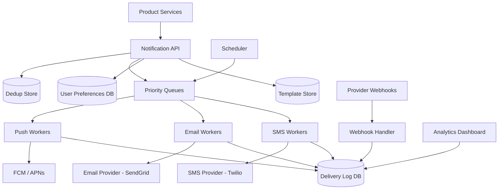

# Case Study 14 — Notification System (Push / Email / SMS)

Design a **multi-channel notification platform** that delivers push, email, and SMS messages reliably at scale — used by many internal product teams (orders, social, marketing).

## 1. Problem

When something happens in the product ("your ticket is confirmed", "friend liked your photo"), the system must notify the right user on the right channel, respect preferences and quiet hours, retry failures, and provide delivery status — without slowing down the main application.

## 2. Requirements

### Functional (MVP)

- Send notifications via **push** (mobile), **email**, and **SMS**  
- Template-based messages with variables (`{{userName}}`, `{{orderId}}`)  
- User **preferences**: opt-in/out per channel and category (marketing vs transactional)  
- **Priority** levels: transactional (high) vs marketing (low)  
- Delivery status: queued, sent, delivered, failed, bounced  
- Retry transient failures with backoff  
- Idempotent send — same event must not spam duplicate notifications  
- Admin API to register templates and trigger test sends  

### Out of scope (initially)

- In-app notification center UI (can consume same events later)  
- A/B testing subject lines at scale  
- Two-way SMS conversations  
- Advanced ML send-time optimization  
- Full campaign builder with segmentation UI  

### Non-functional

- **Decouple** from core apps — async via queue  
- **High throughput**: millions of notifications/hour  
- **At-least-once delivery** with dedup (exactly-once illusion to user)  
- Provider failover (SendGrid down → backup)  
- Compliance: CAN-SPAM, GDPR unsubscribe, SMS opt-in  
- Observability: per-channel success rates, latency percentiles  

## 3. Back-of-the-envelope estimates

Assumptions:

- 100M registered users  
- Average 5 notifications/user/day (mix of push, email, SMS)  
- 20% email, 70% push, 10% SMS  

```text
Total notifications/day ≈ 500M
Average QPS ≈ 500M / 86400 ≈ 5,800/s
Peak ≈ 3× ≈ 17,000/s

Email payload ~50KB HTML → offload to blob/template store
SMS ~160 chars → small
Push payload ~4KB

Provider limits (typical):
  Email: 100–1000/s per account (need multiple accounts / pools)
  SMS: cost-driven; ~$0.01/msg → budget caps
  Push (FCM/APNs): 100k+/s with batching

Storage (delivery logs 90 days):
  500M × 90 × ~300B metadata ≈ 13 TB (+ indexes)
```

Insight: **Queue + workers per channel** with rate limiting to external providers. Core API must only enqueue, not send synchronously.

## 4. High-Level Design (HLD)



### Components

| Component | Role |
|-----------|------|
| Notification API | Validate, dedup, route to queues |
| Template Store | HTML/text templates per channel + locale |
| Preferences Service | User channel/category settings, quiet hours |
| Priority Queues | Separate queues: critical, normal, bulk marketing |
| Channel Workers | Pull jobs, render template, call provider |
| Delivery Log | Audit trail, status, provider message IDs |
| Webhook Handler | Bounces, complaints, delivery receipts |
| Scheduler | Delayed sends, digest batching, quiet hours resume |
| Rate Limiter | Per-provider token buckets |

### Flows

**Send notification (async)**

1. Order Service: `POST /notifications` with `{ userId, templateId, data, channels }`  
2. API checks **idempotency key** / event ID → skip if already processed  
3. Load user preferences → filter channels (no marketing email if opted out)  
4. Render preview hash; enqueue one job per channel  
5. Return `202 Accepted` with `notificationId` immediately  

**Worker delivery**

1. Worker pulls job from priority queue  
2. Rate limiter permits call to provider  
3. Fetch template → substitute variables → send  
4. Update log: `SENT` + provider message ID  
5. On failure: retry with backoff; dead-letter after N tries  

**Webhook update**

1. SendGrid POST bounce event → Webhook Handler  
2. Match provider message ID → update log `BOUNCED`  
3. Disable bad email addresses; alert if spike  

### Trade-offs

| Choice | Pros | Cons |
|--------|------|------|
| Single queue vs per-channel queues | One queue simpler | Slow SMS blocks fast push — **separate queues** |
| Sync send in API | Immediate error to caller | Timeouts, coupling, poor scale |
| Template in DB vs object storage | DB easy for small HTML | Large emails → S3 + cache |
| Fan-out on enqueue vs worker | Faster worker | Heavier API — usually OK at enqueue |
| At-least-once + dedup | Reliable | Must design idempotency keys |

## 5. Low-Level Design (LLD)

### APIs

```text
POST /api/v1/notifications
Headers: Idempotency-Key: order-123-confirmed
Body: {
  "userId": "u-456",
  "templateId": "ORDER_CONFIRMED",
  "category": "TRANSACTIONAL",
  "channels": ["push", "email"],
  "data": { "orderId": "ord-789", "total": "$49.99" },
  "priority": "HIGH"
}
→ 202 { "notificationId": "n-abc", "status": "QUEUED" }

GET /api/v1/notifications/:notificationId
→ { status, channelStatuses: [{ channel, state, sentAt, error }] }

GET /api/v1/users/:userId/preferences
→ { email: { marketing: false, transactional: true }, push: {...}, sms: {...} }

PUT /api/v1/users/:userId/preferences
Body: { email: { marketing: false } }

POST /internal/webhooks/sendgrid
→ 200  # bounce, open, click events

POST /api/v1/templates
Body: { templateId, channel, locale, subject, bodyHtml, bodyText }
```

### Schema

```text
notifications (
  notification_id   UUID PRIMARY KEY,
  idempotency_key   VARCHAR(128) UNIQUE NOT NULL,
  user_id           UUID NOT NULL,
  template_id       VARCHAR(64) NOT NULL,
  category          VARCHAR(30),  -- TRANSACTIONAL, MARKETING, ...
  priority          VARCHAR(20),
  payload           JSONB,
  status            VARCHAR(20),  -- QUEUED, PROCESSING, COMPLETED, FAILED
  created_at        TIMESTAMPTZ NOT NULL
)

notification_deliveries (
  delivery_id       UUID PRIMARY KEY,
  notification_id   UUID REFERENCES notifications,
  channel           VARCHAR(20),  -- PUSH, EMAIL, SMS
  status            VARCHAR(20),  -- QUEUED, SENT, DELIVERED, FAILED, BOUNCED
  provider          VARCHAR(50),
  provider_msg_id   TEXT,
  attempts          INT DEFAULT 0,
  last_error        TEXT,
  sent_at           TIMESTAMPTZ,
  delivered_at      TIMESTAMPTZ,
  UNIQUE (notification_id, channel)
)

user_preferences (
  user_id           UUID PRIMARY KEY,
  email_marketing   BOOLEAN DEFAULT FALSE,
  email_transactional BOOLEAN DEFAULT TRUE,
  push_enabled      BOOLEAN DEFAULT TRUE,
  sms_enabled       BOOLEAN DEFAULT FALSE,
  quiet_hours_start TIME NULL,
  quiet_hours_end   TIME NULL,
  timezone          VARCHAR(50)
)

templates (
  template_id       VARCHAR(64),
  channel           VARCHAR(20),
  locale            VARCHAR(10),
  subject           TEXT,
  body_html         TEXT,
  body_text         TEXT,
  PRIMARY KEY (template_id, channel, locale)
)

device_tokens (
  user_id           UUID,
  platform          VARCHAR(10),  -- IOS, ANDROID
  token             TEXT,
  updated_at        TIMESTAMPTZ,
  PRIMARY KEY (user_id, platform, token)
)
```

### Modules

```text
NotificationController / NotificationService
PreferenceService / TemplateRenderer
DedupStore / IdempotencyFilter
QueueProducer / PushWorker / EmailWorker / SmsWorker
ProviderClients (FcmClient, SendGridClient, TwilioClient)
RateLimiter / RetryPolicy / DeadLetterHandler
WebhookController / DeliveryStatusUpdater
QuietHoursScheduler
```

### Key algorithm — enqueue with idempotency

```text
function sendNotification(request, idempotencyKey):
  existing = repo.findByIdempotencyKey(idempotencyKey)
  if existing: return existing  # safe retry from Order Service

  prefs = preferenceService.get(request.userId)
  channels = filterChannels(request.channels, prefs, request.category)
  if channels empty: return SKIPPED

  if inQuietHours(prefs) and request.priority != HIGH:
    scheduler.schedule(request, afterQuietHours)
    return SCHEDULED

  notification = repo.create(request, idempotencyKey, QUEUED)

  for channel in channels:
    delivery = repo.createDelivery(notification.id, channel, QUEUED)
    queueFor(channel, request.priority).push({
      deliveryId: delivery.id,
      notificationId: notification.id,
      userId: request.userId,
      templateId: request.templateId,
      data: request.data
    })

  return notification
```

### Key algorithm — worker with retry

```text
function processDeliveryJob(job):
  delivery = repo.get(job.deliveryId)
  if delivery.status in [SENT, DELIVERED]: return  # already done

  if not rateLimiter.acquire(job.channel, job.provider):
    queue.requeueWithDelay(job, delayMs=500)
    return

  try:
    rendered = templateRenderer.render(job.templateId, job.channel, job.data, userLocale)
    address = resolveRecipient(job.userId, job.channel)  # email, phone, device tokens

    if job.channel == PUSH:
      result = fcm.send(address.tokens, rendered)
    elif job.channel == EMAIL:
      result = sendgrid.send(address.email, rendered)
    elif job.channel == SMS:
      result = twilio.send(address.phone, rendered.text)

    repo.updateDelivery(job.deliveryId, SENT, result.providerMsgId)
  catch RetryableError as e:
    delivery.attempts += 1
    if delivery.attempts >= MAX_ATTEMPTS:
      repo.updateDelivery(FAILED, e)
      deadLetter.push(job)
    else:
      delay = exponentialBackoff(delivery.attempts)
      queue.requeueWithDelay(job, delay)
  catch PermanentError as e:
    repo.updateDelivery(FAILED, e)  # invalid token, unsubscribed
```

### Key algorithm — template rendering

```text
function render(templateId, channel, data, locale):
  tmpl = templateStore.get(templateId, channel, locale)
  subject = substitute(tmpl.subject, data)   # {{orderId}} → ord-789
  body = substitute(tmpl.body_html, data)
  validateNoMissingVars(body)
  return { subject, body }
```

Use a sandbox: no arbitrary code execution in templates (avoid eval).

### Concurrency & correctness

| Concern | Approach |
|---------|----------|
| Duplicate notifications | `idempotency_key` UNIQUE on `notifications` |
| Double send same delivery | Worker checks status before send; `UPDATE ... WHERE status=QUEUED` claim |
| Provider timeout unknown | Mark SENT; reconcile via webhook; don't auto-retry SENT blindly |
| Push invalid token | Remove from `device_tokens`; don't retry |
| Marketing blast overload | Bulk queue with lower priority + provider rate caps |
| Quiet hours | Scheduler delays non-critical; transactional bypasses |

**Digest mode (bonus):** Instead of 50 push events/day, aggregate into one daily email — separate aggregation window keyed by `(userId, category, date)`.

## 6. Scale evolution

| Stage | Change |
|-------|--------|
| MVP | Monolith + single Redis queue + one SendGrid account |
| 10k/s | Per-channel Kafka topics, worker pools, multiple ESP accounts |
| Global | Regional queues; locale-specific templates; GDPR data residency |
| Marketing | Separate bulk infrastructure; stricter rate limits |
| Observability | Real-time dashboards; auto-pause on bounce rate spike |

## 7. Recap

- Notifications belong on a **queue**, not in the critical path of checkout/social APIs  
- **Idempotency keys** prevent duplicate emails when upstream retries  
- **Separate queues per channel** and priority so SMS slowness doesn't block push  
- Track **delivery state** + webhooks for bounces; respect **preferences and quiet hours**  

**Practice:** Design the payload for `POST /notifications`. Explain how you'd handle SendGrid outage without losing messages.
