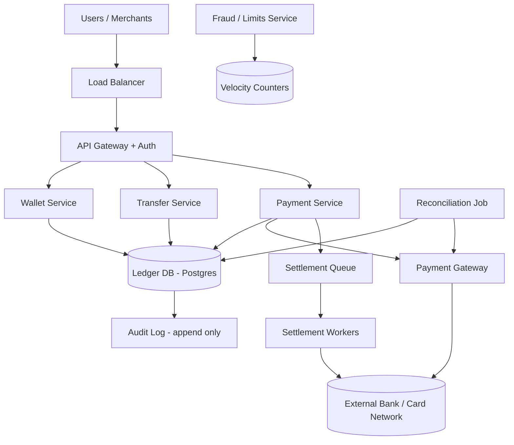

# Case Study 15 — Payment & Wallet System (Simplified)

Design a **simplified digital wallet and payment system** like a lightweight PayPal/Venmo — users hold balance, send money, pay merchants, with strong correctness and auditability.

## 1. Problem

Users can top up a wallet, transfer money to other users or merchants, and view transaction history. The system must never lose or duplicate money, even under retries, crashes, or concurrent transfers.

## 2. Requirements

### Functional (MVP)

- Register user and create **wallet** with balance  
- **Add money** via external payment method (card/bank)  
- **Transfer** (P2P) to another user by username/phone  
- **Pay merchant** for an order (integrate with checkout)  
- **Withdraw** to linked bank account (async settlement)  
- Transaction history with status  
- Idempotent API — client retries must not double-charge  
- Basic fraud checks (velocity limits, max single transfer)  

### Out of scope (initially)

- Multi-currency FX  
- Credit/lending  
- Cryptocurrency  
- Full KYC/AML compliance pipeline (mention hooks only)  
- Chargebacks/dispute workflow (complex; note as follow-up)  
- Interest on balance  

### Non-functional

- **ACID correctness** — money conservation: sum of balances + external = constant  
- **Strong consistency** for balance updates (not eventual for ledger)  
- **Durability** — no lost transactions after ACK  
- **Audit trail** — append-only ledger, reconcilable with bank  
- High availability for reads; writes can use careful locking  
- PCI scope minimized — card data tokenized at payment gateway  

## 3. Back-of-the-envelope estimates

These numbers are **rough order-of-magnitude math** — not a capacity plan. In interviews, the goal is to show you know *what to count* and *which resource breaks first*. A useful shortcut: **1 QPS sustained ≈ 86,400 operations/day**. Payment systems have **moderate QPS** compared to social feeds, but **zero tolerance for correctness errors** — one duplicate credit is worse than a slow response.

### Why we estimate

Wallet systems are **ledger-first**. Estimates tell us:

- Transaction volume is low enough for **single Postgres** early on  
- **Ledger row growth** drives partitioning strategy (by month)  
- **Read QPS** (balance checks, history) exceeds writes — but writes need **strong consistency**  
- Only **~20% of txns** hit external payment gateway — most are internal transfers  

### Assumptions

| Assumption | Value | Why it matters |
|------------|-------|----------------|
| Wallets | 50M | One per user |
| Transactions per day | 10M (transfers + merchant pay + top-ups) | Write volume |
| Average transaction | $25 | Business context (not storage) |
| Ledger entries per txn | 2 (debit + credit) | Double-entry bookkeeping |
| Read:write ratio (balance/history) | 5:1 | Read scaling |
| Top-ups share of txns | ~20% | External gateway load |
| Row size (ledger entry) | ~200 B | Storage math |

### Step A — Traffic (QPS) with labeled arithmetic

**Transaction write QPS:**

```text
Transactions/day    = 10,000,000

Average write QPS   = 10,000,000 ÷ 86,400
                    ≈ 116 transactions/second
                    ≈ 115/s (round)
```

**Peak write QPS (rough 4–5× for pay-day spikes):**

```text
Peak write QPS ≈ 115 × 4 ≈ 460–500/s
```

**Balance / history read QPS:**

```text
Read QPS (avg)  = 115 × 5 ≈ 575/s
Read QPS (peak) = 500 × 5 ≈ 2,500/s
```

**External payment gateway calls (top-ups only):**

```text
Top-up fraction    = 20%
Top-up QPS (avg)   = 115 × 20% ≈ 23/s
Top-up QPS (peak)  = 500 × 20% ≈ 100/s
```

Internal P2P and merchant payments **never leave** your ledger — no Stripe call.

### Step B — Storage

**Ledger entries per year:**

```text
Txns/day            = 10M
Entries per txn     = 2 (debit + credit)

Entries/day         = 10M × 2 = 20M entries/day
Entries/year        = 20M × 365 ≈ 7.3 billion rows/year
```

**Disk per year:**

```text
Row size            ≈ 200 B
Raw data/year       = 7.3B × 200 B ≈ 1.46 TB/year
With indexes        ≈ 2 TB/year → partition by month, archive old partitions
```

**Wallet table:**

```text
50M wallets × ~100 B ≈ 5 GB — tiny; balance reads are cheap with proper indexes
```

### Step C — Bandwidth / other

**API payload size:**

```text
Transfer request/response ≈ 500 B–1 KB — bandwidth is negligible
```

**Reconciliation (daily batch):**

```text
Compare ~2M top-up/withdraw rows/day against gateway settlement CSV
Batch job, not real-time — runs off-peak
```

**Fraud velocity counters (Redis):**

```text
One INCR per txn per wallet per day → 10M keys/day with TTL
Memory ≈ hundreds of MB — trivial
```

### Step D — Read:write ratio table

| Operation | Type | Peak QPS | Consistency |
|-----------|------|----------|-------------|
| P2P transfer / merchant pay | Write | ~400/s | Strong (ACID) |
| Top-up / withdraw | Write | ~100/s external | Strong + async settlement |
| Get balance | Read | ~2,500/s | Strong (same txn as write) |
| Transaction history | Read | ~2,500/s | OK from replica |
| Idempotency check | Read | ~500/s | Must be exact |
| Reconciliation job | Batch read | Nightly | Compares ledger vs gateway |

**Ratio:** **5:1 read:write** — use read replicas for history; **writes stay on primary** with row locks.

### What the numbers tell us

- **115–500 txn/s** fits **single Postgres** for years — sharding by `user_id` is a later problem  
- **Double-entry ledger** (~7.3B rows/year) → immutable append-only entries; partition monthly  
- **Never "read balance, write balance" without locking** — use `SELECT FOR UPDATE` in same transaction  
- **Idempotency keys** on every mutating API — client retries are guaranteed at scale  
- **Top-ups (~23/s avg)** go to Stripe; **internal transfers stay in DB** — different failure modes  
- **Withdrawals are async** — debit ledger immediately, settle to bank via queue (1–3 days)  
- **Reconciliation job** catches orphan gateway charges after crashes  

### Common mistake for this problem

Updating a **`balance_cents` column without a ledger entry**, or doing read-modify-write **without row locks**. Interviewers want **double-entry + single DB transaction + idempotency**. Another mistake: treating wallet balance as **eventually consistent** — money requires **strong consistency** on writes.

## 4. High-Level Design (HLD)



### Components

| Component | Role |
|-----------|------|
| Wallet Service | Create wallet, get balance, list transactions |
| Transfer Service | P2P and merchant payments between wallets |
| Payment Service | Top-up from card, withdraw to bank via gateway |
| Ledger DB | Source of truth — accounts, entries, balances |
| Payment Gateway | Stripe/Adyen — tokenized cards, ACH |
| Fraud Service | Rate limits, blocklists, anomaly flags |
| Reconciliation | Daily match internal vs external settlement |
| Settlement Queue | Async bank payouts (withdrawals) |

### Flows

**Top-up (add money)**

1. User: `POST /wallet/topup` with `amount`, `paymentMethodId`, **idempotency key**  
2. Payment Service creates `PENDING` transaction  
3. Charge gateway → on success, **credit wallet** in ledger (single DB txn)  
4. Return updated balance  

**P2P transfer**

1. User A sends $50 to User B  
2. Fraud check velocity  
3. Single DB transaction: **debit A**, **credit B**, insert transfer record  
4. Notify both users (async notification system)  

**Pay merchant**

1. Checkout calls `POST /payments` with `orderId`, `amount`, `merchantWalletId`, idempotency key  
2. Debit buyer wallet, credit merchant wallet (minus platform fee optional)  
3. Link `orderId` on transaction for refunds later  

**Withdraw**

1. User requests withdrawal → debit wallet immediately (hold funds)  
2. Enqueue settlement job → ACH to bank (1–3 days)  
3. On bank confirm: mark COMPLETED; on fail: **reverse** ledger entry  

### Trade-offs

| Choice | Pros | Cons |
|--------|------|------|
| Balance column vs compute from ledger | Column fast to read | Drift risk — use ledger + cached balance updated in same txn |
| Postgres vs distributed DB | ACID, familiar | Vertical scale limits — shard by user_id later |
| Sync withdraw | Simple UX | Bank is slow — async queue standard |
| Pessimistic vs optimistic locking | Pessimistic safe for money | Contention on hot wallets — optimistic with retry |
| Single ledger vs event sourcing | Double-entry simpler to explain | Event sourcing great audit — more complexity |

**Golden rule:** Never update balance without a matching ledger entry in the **same transaction**.

## 5. Low-Level Design (LLD)

### APIs

```text
POST /api/v1/wallets
Body: { userId, currency: "USD" }
→ 201 { walletId, balance: 0 }

GET /api/v1/wallets/:walletId/balance
→ { walletId, balance: "125.50", currency: "USD", asOf: "..." }

POST /api/v1/wallet/topup
Headers: Idempotency-Key: topup-uuid-1
Body: { walletId, amount: "100.00", paymentMethodId: "pm_xxx" }
→ 200 { transactionId, status: "COMPLETED", newBalance: "225.50" }
→ 402 { status: "FAILED", reason: "CARD_DECLINED" }

POST /api/v1/transfers
Headers: Idempotency-Key: xfer-uuid-2
Body: { fromWalletId, toWalletId, amount: "50.00", note: "dinner" }
→ 200 { transferId, status: "COMPLETED" }
→ 409 { error: "INSUFFICIENT_FUNDS" }

POST /api/v1/payments
Headers: Idempotency-Key: pay-order-789
Body: { payerWalletId, merchantWalletId, amount: "49.99", orderId: "ord-789" }
→ 200 { paymentId, status: "COMPLETED" }

POST /api/v1/wallet/withdraw
Headers: Idempotency-Key: wd-uuid-3
Body: { walletId, amount: "200.00", bankAccountId: "ba_xxx" }
→ 202 { withdrawalId, status: "PENDING_SETTLEMENT" }

GET /api/v1/wallets/:walletId/transactions?cursor=...
→ { transactions: [{ id, type, amount, counterparty, status, createdAt }] }
```

Use **string decimal** amounts in API (`"49.99"`) — never float.

### Schema

```text
wallets (
  wallet_id       UUID PRIMARY KEY,
  user_id         UUID NOT NULL UNIQUE,
  currency        CHAR(3) DEFAULT 'USD',
  balance_cents   BIGINT NOT NULL DEFAULT 0 CHECK (balance_cents >= 0),
  version         INT NOT NULL DEFAULT 0,  -- optimistic locking
  status          VARCHAR(20) DEFAULT 'ACTIVE',
  created_at      TIMESTAMPTZ NOT NULL
)

ledger_entries (
  entry_id        UUID PRIMARY KEY,
  transaction_id  UUID NOT NULL,
  wallet_id       UUID NOT NULL REFERENCES wallets,
  direction       CHAR(6) NOT NULL,  -- DEBIT or CREDIT
  amount_cents    BIGINT NOT NULL CHECK (amount_cents > 0),
  balance_after   BIGINT NOT NULL,
  entry_type      VARCHAR(30),  -- TOPUP, TRANSFER, PAYMENT, WITHDRAW, FEE, REVERSAL
  created_at      TIMESTAMPTZ NOT NULL
)

transactions (
  transaction_id  UUID PRIMARY KEY,
  idempotency_key VARCHAR(128) UNIQUE NOT NULL,
  type            VARCHAR(30) NOT NULL,
  status          VARCHAR(20) NOT NULL,  -- PENDING, COMPLETED, FAILED, REVERSED
  metadata        JSONB,  -- orderId, gatewayRef, counterpartyWalletId
  created_at      TIMESTAMPTZ NOT NULL,
  completed_at    TIMESTAMPTZ
)

transfers (
  transfer_id     UUID PRIMARY KEY,
  transaction_id  UUID UNIQUE REFERENCES transactions,
  from_wallet_id  UUID NOT NULL,
  to_wallet_id    UUID NOT NULL,
  amount_cents    BIGINT NOT NULL
)

withdrawals (
  withdrawal_id   UUID PRIMARY KEY,
  transaction_id  UUID UNIQUE,
  wallet_id       UUID NOT NULL,
  amount_cents    BIGINT NOT NULL,
  bank_account_id TEXT NOT NULL,
  settlement_status VARCHAR(20),  -- PENDING, SENT, COMPLETED, FAILED
  gateway_payout_id TEXT
)

-- Platform float account for money entering/leaving system
system_accounts (
  account_code    VARCHAR(30) PRIMARY KEY,  -- EXTERNAL_IN, EXTERNAL_OUT, FEES
  wallet_id       UUID  -- optional linked wallet for accounting
)
```

Index: `(wallet_id, created_at DESC)` on `ledger_entries` for history.

### Modules

```text
WalletController / WalletService / BalanceReader
TransferController / TransferService
PaymentController / TopupService / WithdrawService
LedgerService / DoubleEntryBookkeeper
IdempotencyMiddleware / TransactionRepository
GatewayClient / SettlementWorker
FraudService / VelocityLimiter
ReconciliationJob
```

### Key algorithm — idempotent request handling

```text
function withIdempotency(idempotencyKey, operation):
  existing = transactions.findByKey(idempotencyKey)
  if existing:
    return existing.responseSnapshot  # same result as first call

  result = operation()
  transactions.save(idempotencyKey, result, COMPLETED)
  return result
```

Store full response body on first success so retries are bit-identical.

### Key algorithm — P2P transfer (double-entry)

```text
function transfer(fromWalletId, toWalletId, amountCents, idempotencyKey):
  return withIdempotency(idempotencyKey, lambda:
    if fromWalletId == toWalletId: fail INVALID
    if amountCents <= 0: fail INVALID
    fraud.check(fromWalletId, amountCents)

    begin transaction
      txnId = uuid()

      fromW = repo.selectWalletForUpdate(fromWalletId)
      toW   = repo.selectWalletForUpdate(toWalletId)

      if fromW.balance_cents < amountCents:
        rollback; return INSUFFICIENT_FUNDS

      newFromBalance = fromW.balance_cents - amountCents
      newToBalance   = toW.balance_cents + amountCents

      repo.updateWallet(fromWalletId, newFromBalance, fromW.version)
      repo.updateWallet(toWalletId, newToBalance, toW.version)

      repo.insertLedger(txnId, fromWalletId, DEBIT,  amountCents, newFromBalance, TRANSFER)
      repo.insertLedger(txnId, toWalletId,   CREDIT, amountCents, newToBalance,   TRANSFER)
      repo.insertTransfer(txnId, fromWalletId, toWalletId, amountCents)
      repo.insertTransaction(txnId, idempotencyKey, TRANSFER, COMPLETED)
    commit

    notifyAsync(fromWalletId, toWalletId, txnId)
    return { transferId: txnId, status: COMPLETED }
  )
```

**Lock ordering:** Always lock wallets in sorted `wallet_id` order to prevent deadlocks on circular transfers.

### Key algorithm — top-up with external gateway

```text
function topup(walletId, amountCents, paymentMethodId, idempotencyKey):
  return withIdempotency(idempotencyKey, lambda:
    begin transaction
      txnId = uuid()
      repo.insertTransaction(txnId, idempotencyKey, TOPUP, PENDING)
    commit

    charge = gateway.charge(paymentMethodId, amountCents, idempotencyKey)

    if charge.failed:
      repo.updateTransaction(txnId, FAILED)
      return charge.error

    begin transaction
      w = repo.selectWalletForUpdate(walletId)
      newBalance = w.balance_cents + amountCents
      repo.updateWallet(walletId, newBalance, w.version)
      repo.insertLedger(txnId, walletId, CREDIT, amountCents, newBalance, TOPUP)
      repo.insertLedger(txnId, SYSTEM_EXTERNAL_IN, DEBIT, amountCents, ..., TOPUP)
      repo.updateTransaction(txnId, COMPLETED, metadata={ gatewayRef: charge.id })
    commit

    return { transactionId: txnId, newBalance }
  )
```

If crash after charge succeeds but before credit: **reconciliation job** finds orphan gateway charge and completes credit.

### Key algorithm — withdrawal with settlement

```text
function withdraw(walletId, amountCents, bankAccountId, idempotencyKey):
  return withIdempotency(idempotencyKey, lambda:
    begin transaction
      w = repo.selectWalletForUpdate(walletId)
      if w.balance_cents < amountCents: return INSUFFICIENT_FUNDS
      newBalance = w.balance_cents - amountCents
      repo.updateWallet(walletId, newBalance, w.version)
      txnId = uuid()
      repo.insertLedger(txnId, walletId, DEBIT, amountCents, newBalance, WITHDRAW)
      repo.insertWithdrawal(txnId, walletId, amountCents, bankAccountId, PENDING)
      repo.insertTransaction(txnId, idempotencyKey, WITHDRAW, PENDING)
    commit

    settlementQueue.push({ withdrawalId, txnId, bankAccountId, amountCents })
    return { withdrawalId, status: PENDING_SETTLEMENT }
  )

function settlementWorker(job):
  payout = gateway.createPayout(job.bankAccountId, job.amountCents, job.idempotencyKey)
  if payout.success:
    repo.updateWithdrawal(job.withdrawalId, COMPLETED, payout.id)
    repo.updateTransaction(job.txnId, COMPLETED)
  else:
    reverseWithdrawal(job.txnId)  # credit wallet back, REVERSAL entries
```

### Concurrency & correctness

| Risk | Mitigation |
|------|------------|
| Double top-up on retry | Idempotency key passed to gateway + DB unique constraint |
| Lost update on balance | `SELECT FOR UPDATE` or optimistic `version` check |
| Deadlock A→B and B→A | Lock wallets in deterministic order |
| Negative balance | CHECK constraint + debit only inside locked transaction |
| Orphan gateway charge | Reconciliation cron matches unsettled charges |
| Hot merchant wallet | Shard not needed until extreme; serial writes acceptable with lock |

**Invariant (interview gold):** Sum of all user balances + system accounts = total money in system. Every transaction has balanced debits and credits.

### Fraud / limits (Redis)

```text
key = velocity:{walletId}:{YYYYMMDD}
INCR key
EXPIRE key 86400
if value > DAILY_LIMIT: reject

if amountCents > SINGLE_TXN_MAX: reject
```

## 6. Scale evolution

| Stage | Change |
|-------|--------|
| MVP | Single Postgres, monolith, Stripe for top-up/withdraw |
| 500 tx/s | Read replicas for history; connection pooling |
| Sharding | Shard wallets by `hash(user_id)`; cross-shard transfers via escrow account (hard) |
| Multi-region | Single primary for ledger (avoid split-brain); or CRDT not suitable for money |
| Event sourcing | Append-only event log + projections for audit-heavy regulators |

Cross-shard transfers are **hard** — prefer single-shard wallet per user or two-phase commit with saga + compensation.

## 7. Recap

- Money systems are **ledger-first**: double-entry, immutable entries, balance updated atomically  
- **Idempotency keys** everywhere — clients, gateway, and internal txn table  
- Use **DB transactions + row locks**, not "read balance then write" without locking  
- Withdrawals are **async**; always plan **reconciliation** and **reversal** paths  

**Practice:** Write double-entry pseudocode for a $50 P2P transfer. Explain what happens if the app crashes after Stripe charges but before wallet credit.
