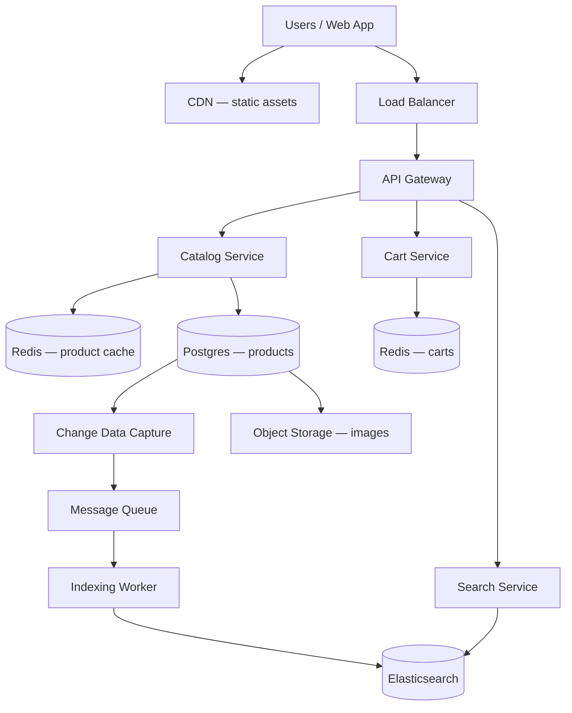

# Case Study 16 — E-commerce Product Catalog + Shopping Cart

Design an online store backend: browse products, search the catalog, and manage a shopping cart before checkout.

## 1. Problem

Users need to discover products (by category, search, filters), view details, and add items to a cart that persists across sessions. The system must stay fast during sales spikes and keep cart state accurate when the same user shops from phone and laptop.

## 2. Requirements

### Functional (MVP)

- Product catalog: list, detail, category browse, text search  
- Inventory display: show “in stock” / “out of stock” (read-only for MVP)  
- Shopping cart: add, update quantity, remove, view cart  
- Cart persistence: logged-in users keep cart across devices; guests use session cookie  
- Merge guest cart into user cart on login  

### Out of scope (initially)

- Payment processing, order fulfillment, shipping labels  
- Product reviews, recommendations, wishlists  
- Seller/admin portal, promotions engine, multi-currency  
- Real-time inventory reservation at checkout (MVP shows stock; checkout is a separate system)  

### Non-functional

- Catalog reads dominate writes (browse >> admin updates)  
- Search latency p99 < 200 ms for common queries  
- Cart writes should feel instant (< 100 ms perceived)  
- High availability for browse + cart during flash sales  
- Eventual consistency acceptable for search index lag (seconds)  

## 3. Back-of-the-envelope estimates

These numbers are **rough order-of-magnitude math** — not a capacity plan. In interviews, the goal is to show you know *what to count* and *which resource breaks first*. A useful shortcut: **1 QPS sustained ≈ 86,400 requests/day**. E-commerce traffic **spikes during sales** — peak is often **3–5×** average on catalog reads and cart writes.

### Why we estimate

E-commerce splits into two workloads with different shapes: **read-heavy catalog browse** vs **write-heavy cart mutations**. Estimates tell us:

- Why catalog and cart should be **separate services** with different storage  
- When **Redis + Elasticsearch** are worth the operational cost  
- That **cart writes can exceed catalog reads** during active shopping sessions  

### Assumptions

| Assumption | Value | Why it matters |
|------------|-------|----------------|
| Monthly active users (MAU) | 10M | User base |
| Product SKUs | 50M | Catalog + search index size |
| Catalog read:write ratio | 100:1 | Admin updates vs browse |
| Sessions per day | 20M | Shopping activity |
| Cart operations per session | 5 | Add/update/remove items |
| Product metadata size | ~2 KB | DB + cache sizing |
| Search share of catalog reads | ~30% | Elasticsearch load |

### Step A — Traffic (QPS) with labeled arithmetic

**Catalog reads per day:**

```text
Daily catalog reads   = 50,000,000 reads/day  (browse, detail, category pages)

Average catalog read QPS = 50,000,000 ÷ 86,400
                         ≈ 579/s
                         ≈ 580/s (round)

Peak catalog read QPS  ≈ 580 × 5 ≈ 2,900/s → round to ~3,000/s
```

**Cart write QPS:**

```text
Cart ops/day          = 20M sessions × 5 ops = 100,000,000 ops/day

Average cart write QPS = 100,000,000 ÷ 86,400
                     ≈ 1,157/s
                     ≈ 1,160/s (round)

Peak cart write QPS  ≈ 1,160 × 5 ≈ 5,800/s → round to ~6,000/s
```

**Search QPS:**

```text
Search QPS (peak) ≈ 30% of catalog read peak
                  ≈ 3,000 × 30% ≈ 900/s
```

### Step B — Storage

**Product catalog (Postgres metadata):**

```text
SKUs            = 50,000,000
Metadata/SKU    ≈ 2 KB

Product data    = 50M × 2 KB = 100 GB
Images          → object storage + CDN (not in Postgres)
```

**Shopping carts (Redis):**

```text
Active carts    ≈ 10M (logged-in + recent guests)
Bytes per cart  ≈ 500 B (few line items average)

Cart data       = 10M × 500 B ≈ 5 GB in Redis
```

**Search index (Elasticsearch):**

```text
50M docs × ~1 KB/doc ≈ 50 GB index size
Facets and analyzers add overhead → plan ~80–100 GB cluster
```

### Step C — Bandwidth

**Product detail API (cached):**

```text
Response size   ≈ 2 KB JSON
Peak catalog QPS ≈ 3,000/s

Egress          ≈ 3,000 × 2 KB ≈ 6 MB/s (API tier — images served from CDN)
```

**Image delivery (CDN, separate from API):**

```text
Dominates user-facing bandwidth — not counted against catalog service
```

### Step D — Read:write ratio table

| Operation | Type | Peak QPS | Storage |
|-----------|------|----------|---------|
| Browse category / product detail | Read | ~3,000/s | Redis cache + Postgres |
| Search | Read | ~900/s | Elasticsearch |
| Add/update/remove cart | Write | ~6,000/s | Redis |
| Admin product update | Write | Very low | Postgres → CDC → ES |
| Cart read (`GET /cart`) | Read | ~3,000/s (est.) | Redis |

**Ratio:** catalog **100:1 read:write**; cart is **write-heavy** (~2:1 write:read during active shopping).

### What the numbers tell us

- **Split catalog and cart** — different QPS shapes and consistency needs  
- **Catalog (3k read/s peak)** → Redis cache-aside + CDN for images; Postgres read replicas  
- **Cart (6k write/s peak)** → Redis hashes with TTL; sub-ms writes, merge-on-login  
- **Search (900/s peak)** → Elasticsearch via async CDC; seconds of index lag is OK  
- **100 GB catalog** fits one Postgres with replicas; **50 GB ES index** needs sharding at 100M+ SKUs  
- MVP **does not reserve inventory** at cart time — stock display is read-only until checkout (separate system)  
- Flash sale on one SKU → **singleflight** + local cache for hot product key  

### Common mistake for this problem

Putting **shopping carts in Postgres** at 6k write/s peak — it works for MVP but Redis is the standard answer for session-scoped, high-churn cart state. Another mistake: **synchronous search indexing** on every admin edit — use **CDC + queue + worker** so catalog writes stay fast.

## 4. High-Level Design (HLD)



### Components

| Component | Role |
|-----------|------|
| Catalog Service | CRUD for products (admin), read APIs for storefront |
| Cart Service | Per-user/session cart in Redis |
| Search Service | Full-text + filters via Elasticsearch |
| Postgres | Source of truth for product metadata |
| Redis (products) | Cache hot product pages and category lists |
| Redis (carts) | Fast cart reads/writes with TTL |
| Elasticsearch | Search index, facets (brand, price range) |
| CDC + Queue + Worker | Keep search index in sync with Postgres |
| Object Storage | Product images (CDN-backed URLs in catalog) |
| CDN | Static JS/CSS and image delivery |

### Flows

**Browse category**

1. Client requests `GET /categories/{id}/products?page=1`  
2. Catalog service checks Redis for category page cache  
3. On miss, query Postgres (indexed by `category_id`, `created_at`)  
4. Return JSON + cache with short TTL (30–60 s)  

**Search**

1. Client sends query + filters to Search service  
2. Elasticsearch returns ranked product IDs + facets  
3. Optional: hydrate top N product details from product cache  

**Add to cart**

1. Client sends `POST /cart/items` with `productId`, `quantity`  
2. Cart service validates product exists (cache lookup) and `quantity > 0`  
3. Update Redis hash `cart:{userId}` or `cart:guest:{sessionId}`  
4. Return updated cart snapshot  

**Login merge**

1. On auth success, Cart service loads guest cart + user cart  
2. Merge line items (same `productId` → sum quantities, cap at max per SKU)  
3. Write merged cart to user key, delete guest key  

### Trade-offs

| Choice | Pros | Cons |
|--------|------|------|
| Redis for carts vs Postgres | Sub-ms writes, simple TTL for abandoned carts | Durability needs AOF/replication; harder to query historically |
| Elasticsearch vs Postgres full-text | Fast search, facets, typo tolerance | Extra system; index lag |
| Cache-aside vs read-through | Simple, explicit invalidation | Stampede risk on hot keys — use singleflight / stale-while-revalidate |
| Show stock from catalog vs inventory service | Simpler MVP | Overselling possible until checkout reserves stock |

## 5. Low-Level Design (LLD)

### APIs

```text
GET  /api/v1/products/:id
→ { "id", "name", "description", "priceCents", "currency", "images", "inStock", "categoryId" }

GET  /api/v1/categories/:id/products?page=1&limit=20
→ { "items": [...], "page", "total" }

GET  /api/v1/search?q=running+shoes&brand=nike&minPrice=50&maxPrice=200
→ { "items": [...], "facets": { "brand": [...], "priceRanges": [...] } }

GET  /api/v1/cart
Headers: Authorization OR X-Guest-Session-Id
→ { "items": [{ "productId", "name", "priceCents", "quantity", "lineTotalCents" }], "subtotalCents" }

POST /api/v1/cart/items
Body: { "productId": "p_123", "quantity": 2 }
→ updated cart

PATCH /api/v1/cart/items/:productId
Body: { "quantity": 3 }

DELETE /api/v1/cart/items/:productId
→ updated cart

POST /api/v1/cart/merge
Body: { "guestSessionId": "..." }   // called after login
→ merged cart
```

### Schema (Postgres — catalog)

```text
categories (
  id          BIGSERIAL PRIMARY KEY,
  name        VARCHAR(255) NOT NULL,
  slug        VARCHAR(255) UNIQUE NOT NULL,
  parent_id   BIGINT NULL REFERENCES categories(id)
)

products (
  id            BIGSERIAL PRIMARY KEY,
  sku           VARCHAR(64) UNIQUE NOT NULL,
  name          VARCHAR(512) NOT NULL,
  description   TEXT,
  price_cents   INT NOT NULL CHECK (price_cents >= 0),
  currency      CHAR(3) DEFAULT 'USD',
  category_id   BIGINT NOT NULL REFERENCES categories(id),
  stock_count   INT NOT NULL DEFAULT 0,
  is_active     BOOLEAN DEFAULT TRUE,
  created_at    TIMESTAMPTZ NOT NULL,
  updated_at    TIMESTAMPTZ NOT NULL
)

CREATE INDEX idx_products_category_active ON products(category_id, is_active, id);
CREATE INDEX idx_products_name_trgm ON products USING gin(name gin_trgm_ops);  -- optional MVP search fallback
```

### Cart data model (Redis)

```text
Key:   cart:user:{userId}     OR   cart:guest:{sessionId}
Type:  Hash
Fields:
  item:{productId} → JSON { "productId", "quantity", "addedAt" }
TTL:   30 days (refresh on each write)

Key:   product:{productId}
Type:  String (JSON snapshot for cache-aside)
TTL:   5–15 minutes
```

### Modules

```text
CatalogController / CatalogService / ProductRepository / ProductCache
SearchController / SearchService / ElasticsearchClient
CartController / CartService / CartRepository(Redis) / CartMerger
IndexingWorker (consumes product change events)
AuthMiddleware (user id vs guest session)
```

### Algorithm — add to cart

```text
function addToCart(cartKey, productId, quantity):
  if quantity <= 0: return error(400)
  if quantity > MAX_QTY_PER_LINE: return error(400)

  product = productCache.get(productId)
  if product is null:
    product = productRepo.findActive(productId)
    if product is null: return error(404)
    productCache.set(productId, product, ttl=10m)

  if not product.inStock and product.stockCount <= 0:
    return error(409, "out of stock")   // MVP: soft check only

  redis.hset(cartKey, "item:" + productId, { productId, quantity, addedAt: now() })
  redis.expire(cartKey, 30 days)
  return buildCartSnapshot(cartKey)
```

### Algorithm — merge carts on login

```text
function mergeCarts(userId, guestSessionId):
  userKey = "cart:user:" + userId
  guestKey = "cart:guest:" + guestSessionId

  userItems = redis.hgetall(userKey)
  guestItems = redis.hgetall(guestKey)

  merged = {}
  for each item in userItems + guestItems:
    pid = item.productId
    merged[pid] = min(merged.get(pid, 0) + item.quantity, MAX_QTY_PER_LINE)

  redis.del(guestKey)
  redis.hmset(userKey, merged)
  return buildCartSnapshot(userKey)
```

### Algorithm — search index update (async)

```text
function onProductChange(event):
  if event.type in (CREATE, UPDATE):
    doc = mapProductToSearchDoc(event.product)
    elasticsearch.index(index="products", id=event.productId, body=doc)
  if event.type == DELETE or not event.product.isActive:
    elasticsearch.delete(index="products", id=event.productId)
```

### Concurrency notes

- Cart updates are **last-write-wins per line item** at the field level in Redis — acceptable for MVP  
- For strict quantity caps during concurrent adds, use `WATCH`/`MULTI` or Lua script:

```text
-- Lua: atomic increment with cap
local qty = redis.call('HGET', key, field)
if tonumber(qty or 0) + delta > MAX then return -1 end
redis.call('HINCRBY', key, field, delta)
return 1
```

- Product cache: invalidate on admin update (`DEL product:{id}`, `DEL category_page:{catId}:*`)  
- Search index lag of 1–5 s is OK; show “results may update shortly” only if needed  

## 6. Scale evolution

| Stage | Traffic | Changes |
|-------|---------|---------|
| MVP | < 100 QPS | Single Postgres, one Redis, optional ES |
| Growth | 1k+ catalog QPS | Redis cluster for carts + product cache; read replicas for Postgres |
| Hot products | Flash sale on one SKU | Local in-process cache + CDN for product detail; singleflight on cache miss |
| Large catalog | 100M+ SKUs | Shard products by `category_id` or hash; ES index sharding |
| Global | Multi-region users | Geo-routed CDN; regional Redis; catalog read replicas per region |
| Checkout integration | Real inventory | Introduce Inventory Service with reservation at checkout (separate case study) |

## 7. Recap

- **Catalog is read-heavy** → cache + search index + CDN for images  
- **Cart is write-heavy and session-scoped** → Redis with TTL and merge-on-login  
- **Search stays eventually consistent** via CDC/async indexing  
- Keep checkout, payments, and inventory reservation out of MVP but design hooks (`productId`, `quantity`) for them  

**Practice:** draw the HLD from memory, then write pseudocode for `addToCart` and `mergeCarts` without looking.
