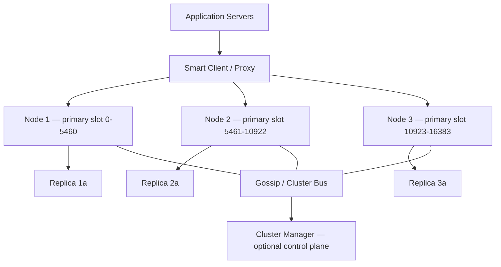

# Case Study 17 — Distributed Cache (Redis Cluster–like)

Design a **horizontally scalable in-memory cache** that many application servers share — similar in spirit to Redis Cluster or Memcached at a high level.

## 1. Problem

A single Redis instance runs out of memory and becomes a bottleneck. You need a cluster that:

- Stores key-value pairs with optional TTL  
- Routes each key to the correct node automatically  
- Survives node failures with replication  
- Scales by adding machines  

## 2. Requirements

### Functional (MVP)

- `GET key`, `SET key value`, `DELETE key`  
- Optional TTL on keys  
- Cluster-aware client OR proxy that hides shard routing  

### Out of scope (initially)

- Rich data types (lists, sorted sets, pub/sub) — treat values as opaque blobs for learning  
- Lua scripting, transactions across keys  
- Auto resharding with zero downtime (advanced ops)  
- Persistence to disk (AOF/RDB) — mention but don’t fully design  

### Non-functional

- Sub-millisecond reads on hot keys (in-memory)  
- Horizontal scale: add nodes to increase total memory and throughput  
- High availability: tolerate single node failure without total outage  
- Tunable consistency: prefer availability + eventual consistency for cache (stale OK)  

## 3. Back-of-the-envelope estimates

Assumptions:

- 500 GB total cached data  
- Average value size 1 KB → ~500M keys  
- 200k ops/sec cluster-wide, 95% reads  
- 3× replication for HA  

```text
Raw data          ≈ 500 GB
With 3 replicas   ≈ 1.5 TB RAM across cluster
Per node (10 nodes) ≈ 150 GB RAM (+ overhead)

Read QPS/node     ≈ 200k × 0.95 / 10 ≈ 19k/s  (well within single-node capability)
Network           ≈ 200k × 1 KB avg × 8% writes ≈ 16 MB/s write payload (rough)
```

Insight: **partition keys across nodes** (sharding) and **replicate each partition** for fault tolerance.

## 4. High-Level Design (HLD)



### Components

| Component | Role |
|-----------|------|
| Cache node | In-memory hash table + TTL heap/timer wheel |
| Smart client / proxy | Computes `slot = hash(key)`, maps slot → node, retries on MOVED/ASK |
| Replication | Each primary has ≥1 replica; async replication |
| Gossip protocol | Nodes exchange membership, slot ownership, health |
| Slot map | Fixed 16,384 slots (Redis Cluster model) assigned to primaries |
| Cluster manager (optional) | Operator tool for add/remove node, rebalance slots |

### Flows

**GET**

1. Client hashes key → slot → primary node  
2. Primary serves from memory; on miss return `NULL` (cache miss — app loads from DB)  
3. If primary down, client tries replica (read-your-replicas policy)  

**SET**

1. Route to primary for key’s slot  
2. Primary writes locally, responds OK to client  
3. Async replicate to replica(s)  

**Node failure**

1. Gossip detects primary timeout  
2. Replica promoted (manual or automatic with quorum)  
3. Slot map updated; clients refresh topology  

**Add node (scale out)**

1. Join empty node to cluster  
2. Migrate subset of slots from existing primaries (live migration, key by key)  
3. Update slot → node mapping  

### Trade-offs

| Choice | Pros | Cons |
|--------|------|------|
| Consistent hashing vs fixed slots | Slots allow incremental migration (Redis model) | More metadata to manage |
| Client-side vs proxy routing | No extra hop; lower latency | Every language needs cluster-aware client |
| Async replication | Fast writes | Brief window of loss on primary crash |
| 1 vs 3 replicas | Cheaper | Less fault tolerance |
| Cache vs source of truth | Simple, fast | Must handle invalidation in app layer |

## 5. Low-Level Design (LLD)

### API (single-node view; cluster adds routing)

```text
GET    /cache/{key}           → 200 value | 404 miss
PUT    /cache/{key}           body: bytes, Header: X-TTL-Seconds: 300
DELETE /cache/{key}           → 204

Cluster protocol (conceptual):
MOVED 5798 192.168.1.12:6379   // permanent redirect — slot moved
ASK 5798 192.168.1.99:6379     // temporary redirect during migration
```

### Slot assignment

```text
SLOT_COUNT = 16384

function slotForKey(key):
  // Redis uses CRC16(key) mod 16384; simplified:
  return crc16(key) % SLOT_COUNT

function primaryForSlot(slot, topology):
  return topology.slotToPrimary[slot]
```

### On-node storage

```text
// In-memory structures per node
HashMap<String, Entry> store

Entry {
  value: byte[]
  expiresAt: epochMs | null
}

// Periodic or lazy expiry
on GET: if entry.expired: delete and return miss
```

### Modules

```text
CacheNode (network IO, command parser)
StorageEngine (get/set/del, TTL)
ReplicationLog (append entries, ship to replicas)
GossipAgent (heartbeat, failure detection)
SlotMigrator (key-by-key move during rebalance)
ClusterClient (slot cache, MOVED handling, pipelining)
```

### Algorithm — cluster GET (smart client)

```text
function clusterGet(key):
  slot = slotForKey(key)
  node = slotCache.primaryFor(slot)

  for attempt in 1..3:
    resp = node.send("GET " + key)
    if resp.ok: return resp.value
    if resp.type == MOVED:
      node = connect(resp.newHost)
      slotCache.update(slot, node)
      continue
    if resp.type == ASK:
      temp = connect(resp.migrateHost)
      return temp.send("GET " + key)   // one-off during migration
    if resp.type == CONNECTION_ERROR:
      node = pickReplica(slot)
      continue
  fail("cluster unavailable")
```

### Algorithm — replication (primary → replica)

```text
// Primary
function set(key, value, ttl):
  store.put(key, Entry(value, now()+ttl))
  replLog.append(SET, key, value, ttl)
  return OK

// Replica
function applyReplEntry(entry):
  if entry.op == SET: store.put(...)
  if entry.op == DEL: store.delete(...)
  // replication offset tracked for partial resync
```

### Algorithm — slot migration (simplified)

```text
function migrateSlot(slot, fromNode, toNode):
  toNode.prepareImport(slot)          // target marks slot IMPORTING
  fromNode.prepareExport(slot)        // source marks slot MIGRATING
  for key in fromNode.keysInSlot(slot):
    value = fromNode.dump(key)
    toNode.restore(key, value)
    fromNode.delete(key)
  cluster.assignSlot(slot, toNode)
  broadcastNewTopology()
```

### Concurrency notes

- Single-threaded event loop per node (Redis model) avoids lock contention on hot keys  
- Hot keys: optional **local read replica** on app server OR duplicate key with `{hashTag}` sharding:

```text
// Same hash tag → same slot; use for intentional co-location
key = "{user:42}:profile"
key = "{user:42}:settings"
```

- Splitting hot key: `key` → `key:1`, `key:2` … `key:N` with random read choice (application-level)  
- During migration, ASK redirects prevent stale reads from wrong node  

## 6. Scale evolution

| Stage | Size | Changes |
|-------|------|---------|
| MVP | < 32 GB | Single Redis instance + app-side cache |
| Vertical limit | Memory bound | Redis primary + read replicas (no sharding yet) |
| Sharded | 100s GB | 3–6 primaries, 16k slots, smart client |
| Large cluster | 1 TB+ | 20+ shards, proxy layer (Envoy/Twemproxy) for non-smart clients |
| Multi-DC | Global apps | Active-active is hard; prefer cache per region + async invalidation |
| Ops maturity | Frequent resharding | Automated slot balancer, monitoring per-slot heat |

## 7. Recap

- **Shard by key hash into fixed slots** — enables incremental migration  
- **Replicate asynchronously** for speed; accept tiny loss window or use sync for critical keys only  
- **Smart clients** must handle topology changes (`MOVED`, `ASK`)  
- A distributed cache is **not** your database — always design cache-aside with TTL and invalidation  

**Practice:** explain consistent hashing vs 16,384 slots to a friend, then sketch what happens when a primary dies mid-write.
