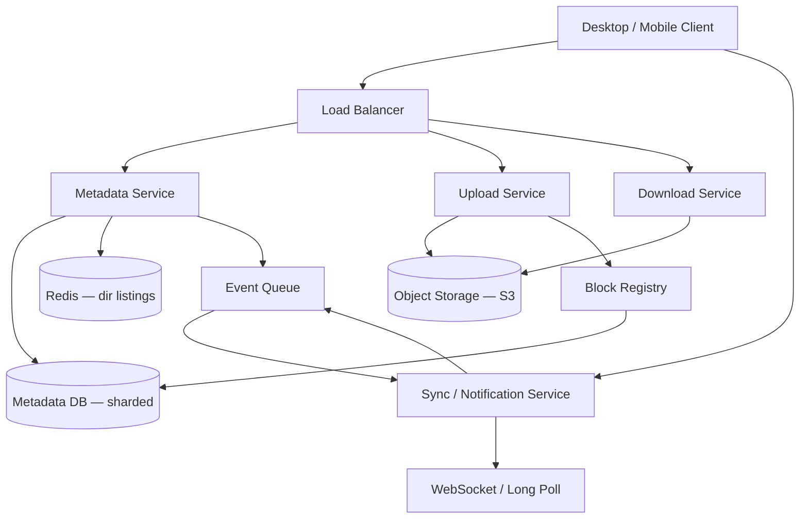

# Case Study 18 — File Storage & Sync (Dropbox-like)

Design a cloud service where users upload files, sync them across devices, and share folders — simplified Dropbox/Google Drive backend.

## 1. Problem

Users store files in the cloud, edit on laptop, and expect phone to show the latest version. Large files must upload reliably; only changed parts should transfer when possible. Storage must scale to billions of files without one giant disk.

## 2. Requirements

### Functional (MVP)

- User accounts with personal file namespaces  
- Upload, download, delete files and folders  
- List directory contents  
- Sync: client polls or receives notifications when remote changes occur  
- Basic sharing: read-only link to a file (optional MVP+)  
- Deduplication of identical file content (same bytes → store once)  

### Out of scope (initially)

- Real-time collaborative editing (see Case Study 19)  
- Full desktop sync client (block-level sync algorithm described, not built)  
- End-to-end encryption (mention as product option)  
- Version history beyond “last modified” (can extend later)  

### Non-functional

- Support files up to 10 GB  
- Resume interrupted uploads  
- Durability: no silent data loss (replicated object storage)  
- Metadata ops (list folder) fast; throughput for large files via chunked upload  
- Availability 99.9%+ for download  

## 3. Back-of-the-envelope estimates

These numbers are **rough order-of-magnitude math** — not a capacity plan. In interviews, the goal is to show you know *what to count* and *which resource breaks first*. A useful shortcut: **1 QPS sustained ≈ 86,400 operations/day**. File sync adds **metadata ops** (cheap) and **blob transfer** (expensive) — count them separately.

### Why we estimate

Dropbox-like systems split **small metadata** from **large blobs**. Estimates tell us:

- Why **10B file records** cannot live in one Postgres instance  
- Why **object storage (S3)** holds petabytes while SQL holds gigabytes of metadata  
- Upload vs download QPS shapes **different services**  
- **Deduplication** changes unique storage, not metadata row count  

### Assumptions

| Assumption | Value | Why it matters |
|------------|-------|----------------|
| Users | 50M | Scale baseline |
| Files per user (avg) | 200 | Metadata row count |
| Average file size | 500 KB | Blob storage (docs + some large files) |
| Dedup savings | ~20% | Unique blocks vs logical size |
| Uploads per day | 10M | Write path |
| Downloads per day | 50M | Read path (5:1 download:upload) |
| Chunk size | 4 MB | Upload resume + dedup unit |
| Metadata per file | ~500 B | DB sizing |

### Step A — Traffic (QPS) with labeled arithmetic

**Upload QPS:**

```text
Uploads/day       = 10,000,000

Average upload QPS = 10,000,000 ÷ 86,400
                   ≈ 116 uploads/second
                   ≈ 115/s (round)

Peak upload QPS  ≈ 115 × 5 ≈ 575/s → round to ~600/s
```

**Download QPS:**

```text
Downloads/day     = 50,000,000

Average download QPS = 50,000,000 ÷ 86,400
                     ≈ 579/s
                     ≈ 580/s (round)

Peak download QPS  ≈ 580 × 5 ≈ 2,900/s → round to ~3,000/s
```

**Sync notification events:**

```text
Assume ~1 file change per user per hour (active subset):

Active users (rough) ≈ 10M/day actively syncing
Changes/day          ≈ 10M × 24 = 240M events/day (upper bound)

Stated simpler estimate:
  1 change/user/hour × 50M users ≈ 50M events/hour
  ≈ 50,000,000 ÷ 3,600 ≈ 14,000 events/s (if all users active — peak)

Realistic average lower — use ~14k/s as peak sync fan-out order of magnitude
```

**Chunk upload sub-ops (per file):**

```text
Avg file 500 KB ÷ 4 MB chunk ≈ 1 chunk per small file (many files are one chunk)
600 uploads/s × ~1–3 chunk PUTs ≈ 600–1,800 chunk writes/s to object store
```

### Step B — Storage

**File metadata records:**

```text
Users × files/user  = 50M × 200 = 10,000,000,000 file records (10B)

Metadata per file   ≈ 500 B

Metadata total      = 10B × 500 B = 5 TB
                      → must shard by user_id (too big for one DB)
```

**Logical blob storage:**

```text
Total files         = 10B
Avg size            = 500 KB

Logical data        = 10B × 500 KB = 5 PB (petabytes)
```

**Unique blocks after dedup:**

```text
Dedup savings       = 20%
Unique storage      = 5 PB × 80% = 4 PB in object storage (S3-like)
```

**Block registry:**

```text
One row per unique 4 MB chunk hash — far fewer rows than files if dedup works
Ref counts per block track garbage collection
```

### Step C — Bandwidth

**Download bandwidth (peak):**

```text
Peak download QPS = 3,000/s
Avg file          = 500 KB

Bandwidth         = 3,000 × 500 KB = 1.5 GB/s
                    (large files stream in parallel chunks — CDN helps)
```

**Upload bandwidth (peak):**

```text
600 uploads/s × 500 KB ≈ 300 MB/s ingress
```

**Sync notifications (WebSocket/long-poll):**

```text
Small JSON payloads (~200 B) × 14k/s ≈ 2.8 MB/s — connection count (150k+) matters more than bytes
```

### Step D — Read:write ratio table

| Operation | Type | Peak QPS | Backend |
|-----------|------|----------|---------|
| Download file / chunk | Read | ~3,000/s | Object storage + CDN |
| Upload / commit file | Write | ~600/s | Object storage + metadata DB |
| List directory | Read | High | Metadata DB + Redis cache |
| Sync changes feed | Read | ~14k/s | Change log |
| Block dedup check | Read | ~600–1,800/s | Block registry |
| Delete (tombstone) | Write | Lower | Metadata + ref count decrement |

**Ratio:** downloads **~5× uploads** by request count; bytes follow the same pattern.

### What the numbers tell us

- **Metadata (5 TB, 10B rows) in sharded SQL**; **bytes (4 PB) in object storage** — never mix them  
- **Content-hash chunks** enable dedup, integrity checks, and resume-after-failure upload  
- **Separate Upload and Download services** — different scaling and CDN placement  
- **Change log + cursor** powers sync; WebSocket push beats polling at 14k events/s  
- **Ref-counted blocks** + async GC — delete is metadata-first, bytes reclaimed later  
- **600 upload/s peak** is modest; **3,000 download/s** benefits from CDN and signed URLs  
- List-folder must be fast → **Redis cache** for hot directories  

### Common mistake for this problem

Storing **file bytes in Postgres or metadata DB**. At 4 PB, blobs belong in **S3** keyed by content hash. Another mistake: **full-file upload on every edit** — chunking + "check which chunks exist" (`POST /uploads/check`) saves bandwidth when only part of a file changed.

## 4. High-Level Design (HLD)



### Components

| Component | Role |
|-----------|------|
| Metadata Service | Files, folders, paths, permissions, block pointers |
| Upload Service | Chunked upload, hash verification, commit |
| Download Service | Signed URLs or streaming from object storage |
| Object Storage | Immutable blobs keyed by content hash |
| Block Registry | Maps `contentHash → storageKey`, ref counts |
| Sync Service | Notifies clients of changes since `cursor` |
| Metadata DB | Sharded SQL or distributed KV for tree metadata |
| Redis | Cache hot directory listings |

### Flows

**Upload file (chunked)**

1. Client splits file into 4 MB chunks, computes SHA-256 per chunk  
2. Client asks which chunks server already has (`POST /uploads/check`)  
3. Client uploads missing chunks only  
4. Client commits file metadata listing chunk hashes in order  
5. Metadata service creates `file` record; block registry increments ref counts  

**Download**

1. Client requests file metadata → ordered list of chunk hashes  
2. For each chunk, download from object storage (parallel)  
3. Reassemble locally  

**Sync**

1. Client stores `syncCursor` (last seen change sequence)  
2. Poll `GET /sync/changes?since=cursor` or maintain WebSocket  
3. Server returns created/updated/deleted paths + new cursor  
4. Client fetches changed files  

**Delete**

1. Mark file deleted in metadata (tombstone)  
2. Decrement block ref counts; if zero, queue block for garbage collection  

### Trade-offs

| Choice | Pros | Cons |
|--------|------|------|
| Content-hash addressing | Dedup, integrity check | Cannot update block in place — new version = new blocks |
| Fixed 4 MB chunks vs content-defined chunking | Simple | CDC (rolling hash) saves bandwidth on inserts but harder |
| Metadata in SQL vs custom tree store | Familiar queries | Deep trees need careful indexing |
| Push (WebSocket) vs poll | Lower latency | More connection state |
| Immediate delete vs GC | Saves space faster | GC simplifies undo/version history |

## 5. Low-Level Design (LLD)

### APIs

```text
POST /api/v1/files/list
Body: { "path": "/Documents" }
→ { "entries": [{ "name", "type", "fileId", "size", "modifiedAt" }] }

POST /api/v1/uploads/check
Body: { "chunks": ["sha256:abc...", "sha256:def..."] }
→ { "missing": ["sha256:def..."] }

PUT  /api/v1/uploads/chunk/{sha256}
Body: raw bytes (4 MB max)
→ 201

POST /api/v1/files/commit
Body: {
  "path": "/Documents/report.pdf",
  "chunks": ["sha256:abc...", "sha256:def..."],
  "sizeBytes": 8000000,
  "clientRev": "local-uuid-7"
}
→ { "fileId", "serverRev", "modifiedAt" }

GET  /api/v1/files/download?fileId=f_123
→ 302 to signed URL OR chunked stream

GET  /api/v1/sync/changes?since=seq_991822
→ { "changes": [...], "cursor": "seq_991900" }

DELETE /api/v1/files?path=/Documents/old.doc
→ 204
```

### Schema

```text
users (
  user_id     BIGINT PRIMARY KEY,
  email       VARCHAR UNIQUE,
  root_id     BIGINT NOT NULL          -- root folder id
)

files (
  file_id       BIGINT PRIMARY KEY,
  user_id       BIGINT NOT NULL,
  parent_id     BIGINT NULL,           -- folder id; null = root
  name          VARCHAR(255) NOT NULL,
  is_folder     BOOLEAN NOT NULL,
  size_bytes    BIGINT DEFAULT 0,
  server_rev    BIGINT NOT NULL,
  is_deleted    BOOLEAN DEFAULT FALSE,
  modified_at   TIMESTAMPTZ NOT NULL,
  UNIQUE (user_id, parent_id, name, is_deleted)  -- simplified
)

file_blocks (
  file_id     BIGINT NOT NULL,
  seq         INT NOT NULL,            -- order within file
  block_hash  CHAR(64) NOT NULL,       -- SHA-256 hex
  PRIMARY KEY (file_id, seq)
)

blocks (
  block_hash    CHAR(64) PRIMARY KEY,
  storage_key   VARCHAR NOT NULL,      -- s3://bucket/ab/cdef...
  size_bytes    INT NOT NULL,
  ref_count     BIGINT NOT NULL DEFAULT 0
)

change_log (
  seq           BIGSERIAL PRIMARY KEY,
  user_id       BIGINT NOT NULL,
  file_id       BIGINT,
  change_type   VARCHAR(16),           -- CREATE | UPDATE | DELETE
  path          TEXT,
  created_at    TIMESTAMPTZ NOT NULL
)

CREATE INDEX idx_files_user_parent ON files(user_id, parent_id) WHERE NOT is_deleted;
CREATE INDEX idx_change_log_user_seq ON change_log(user_id, seq);
```

Shard `files` and `change_log` by `user_id`.

### Modules

```text
MetadataService / PathResolver / FileRepository
UploadService / ChunkStore / CommitHandler
DownloadService / SignedUrlGenerator
BlockRegistry / RefCountWorker / GarbageCollector
SyncService / ChangeLogReader / NotificationPusher
```

### Algorithm — chunked upload with dedup

```text
function commitFile(userId, path, chunkHashes, sizeBytes):
  validatePath(path)
  parent, name = splitPath(path)

  tx.begin()
  for hash in chunkHashes:
    if not blocks.exists(hash):
      fail(400, "missing chunk: " + hash)
  for hash in chunkHashes:
    blocks.incrementRef(hash)

  oldFile = files.findByPath(userId, path)
  if oldFile:
    decrementRefs(oldFile.blockHashes)
    files.markUpdated(oldFile, chunkHashes, sizeBytes)
  else:
    files.create(userId, parent, name, chunkHashes, sizeBytes)

  changeLog.append(userId, path, UPDATE or CREATE)
  tx.commit()
  notifySync(userId)
```

### Algorithm — client sync loop

```text
function syncLoop(localCursor):
  resp = GET /sync/changes?since=localCursor
  for change in resp.changes:
    if change.type == DELETE:
      local.delete(change.path)
    else:
      meta = GET metadata(change.fileId)
      if local.hash(meta) != meta.serverRev:
        downloadAndReplace(change.path, meta)
  localCursor = resp.cursor
  persist(localCursor)
```

### Algorithm — garbage collection

```text
function gcBlocks():
  candidates = blocks.where(ref_count == 0 AND marked_at < now() - 7 days)
  for block in candidates:
    objectStorage.delete(block.storage_key)
    blocks.delete(block.block_hash)
```

### Concurrency notes

- Two clients commit same path: use **optimistic locking** with `server_rev` or `If-Match` header  
- Ref count updates must be transactional with metadata commit  
- Upload chunk PUT is idempotent (same hash → overwrite OK)  
- List-after-write: read your writes from primary DB replica, not stale replica  

## 6. Scale evolution

| Stage | Scale | Changes |
|-------|-------|---------|
| MVP | 1M users | Single region, Postgres + S3, poll-based sync |
| Metadata growth | 100M+ files | Shard metadata by `user_id`; separate change log per shard |
| Large files | 10 GB+ | Multipart upload API, parallel chunk PUT, CDN for download |
| Sync latency | Active users | WebSocket push + regional edge notification service |
| Global | Multi-region | Metadata home region per user; cross-region replication for DR only |
| Enterprise | Sharing & ACLs | Add permission graph; scan links for malware |

## 7. Recap

- **Metadata in DB, bytes in object storage** — never store large blobs in SQL  
- **Content-hash chunks** enable dedup, integrity, and incremental upload  
- **Change log + cursor** powers sync; push beats poll at scale  
- Deletes are **reference-counted**; GC reclaims unreferenced blocks  

**Practice:** walk through uploading a 12 MB file (3 chunks) where 1 chunk already exists on server — what API calls happen?
