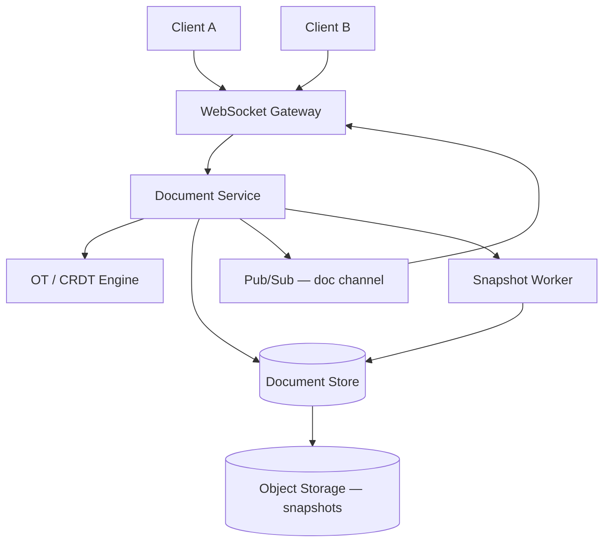

# Case Study 19 — Collaborative Document Editing (Google Docs–like)

Design a simplified **real-time collaborative text editor** where multiple users edit the same document simultaneously and see each other's changes within seconds.

## 1. Problem

Two people edit the same document at once. If you simply send "replace entire file" updates, one person's edits overwrite the other's. You need a way to merge concurrent edits so everyone converges on the same final text without locking the whole document.

## 2. Requirements

### Functional (MVP)

- Create/open/close documents  
- Real-time text editing with cursor presence (who is online)  
- Multiple users edit same doc concurrently  
- Offline edits merge when user reconnects (simplified)  
- Document persistence and load on open  
- Basic auth: only invited users can edit  

### Out of scope (initially)

- Rich formatting (bold, images, comments) — plain text or minimal rich text  
- Full Google Docs feature parity (suggest mode, version history UI)  
- End-to-end encryption  
- Mobile offline-first with complex conflict UI  

### Non-functional

- Latency: local edits feel instant (< 50 ms local); remote edits visible < 200 ms  
- Correctness: all clients converge to identical document state  
- Availability: editing works if one server dies (with replication)  
- Scale: 10 concurrent editors per doc (typical); thousands of idle docs  

## 3. Back-of-the-envelope estimates

These numbers are **rough order-of-magnitude math** — not a capacity plan. In interviews, the goal is to show you know *what to count* and *which resource breaks first*. A useful shortcut: **1 QPS sustained ≈ 86,400 operations/day**. Collaborative editing is unusual: **ops/sec per document** is tiny, but **cluster-wide op throughput** adds up because many docs are open at once.

### Why we estimate

Real-time docs are **message-size bound**, not storage bound. Estimates tell us:

- Why you send **operations** (insert/delete), not full document text on every keystroke  
- WebSocket **connection count** vs **op throughput** — both matter  
- Most documents are **idle**; a few hot docs dominate ops  
- **OT/CRDT** choice affects bytes per op, not just correctness  

### Assumptions

| Assumption | Value | Why it matters |
|------------|-------|----------------|
| Total documents | 5M | Persistent storage |
| Average document size | 10 KB plain text | Snapshot + storage |
| Concurrently open documents | 50k | Active editing sessions |
| Editors per open doc (peak hot doc) | 5 | Contention on one doc |
| Editors per open doc (average) | 1–2 | Typical case |
| Ops per editor per second | 10 (keystrokes + deletes) | Typing speed + bursts |
| Bytes per op (OT) | ~100 B JSON | Bandwidth |

### Step A — Traffic (QPS) with labeled arithmetic

**Operations per second — naive upper bound (every open doc is hot):**

```text
Open docs           = 50,000
Editors per doc     = 3 (average active)
Ops per editor/s    = 10

Cluster op QPS      = 50,000 × 3 × 10
                    = 1,500,000 ops/second
```

**Realistic peak (most docs quiet — Pareto distribution):**

```text
Only ~10% of open docs actively editing at once:
  5,000 hot docs × 5 editors × 10 ops/s = 250,000 ops/s

Round to ~100,000 ops/s cluster-wide peak for interview planning
```

**Per-document op rate (hot doc with 5 editors):**

```text
5 editors × 10 ops/s = 50 ops/s per hot document
Server must serialize + transform + broadcast each op in order (OT) or merge (CRDT)
```

**WebSocket connections:**

```text
Connections ≈ open docs × editors per doc
            ≈ 50,000 × 3 ≈ 150,000 concurrent WebSocket connections
```

Gateway horizontal scaling driven by **connection count**, not CPU alone.

### Step B — Storage

**Document text (current snapshots):**

```text
Documents       = 5,000,000
Avg size        = 10 KB

Text storage    = 5M × 10 KB = 50 GB
```

**Operation log (append-only):**

```text
Assume 1,000 ops before snapshot compaction per active doc
Active docs/day ≈ 500k (10% of corpus touched daily)
Ops/day         ≈ 500k × 1,000 = 500M ops/day

Op row size     ≈ 200 B (position, payload, author, rev)

Daily op log    ≈ 500M × 200 B = 100 GB/day → compact to snapshots, keep tail in DB
```

**Snapshots in object storage:**

```text
Periodic full snapshots (50 GB corpus, versioned) → cheap on S3
Op log in Postgres/DynamoDB for recent revisions
```

### Step C — Bandwidth

**Op broadcast at cluster peak:**

```text
Peak ops          ≈ 100,000 ops/s (realistic) to 1.5M ops/s (worst case)
Bytes per op      ≈ 100 B

Bandwidth         = 100,000 × 100 B = 10 MB/s (realistic peak)
Worst case        = 1.5M × 100 B = 150 MB/s (matches original order-of-magnitude)
```

**Presence/cursor updates (ephemeral, Redis):**

```text
Higher frequency than ops but tiny payload (~50 B)
Not persisted — TTL in Redis
```

### Step D — Read:write ratio table

| Operation | Type | Rate | Notes |
|-----------|------|------|-------|
| Client sends edit op | Write | ~100k ops/s peak | WebSocket inbound |
| Server broadcasts op | Read (fan-out) | ~100k × (N−1) editors | Pub/Sub per doc room |
| Open doc (load snapshot + tail ops) | Read | ~50k opens/session start | One-time burst |
| Persist op to log | Write | ~100k/s | Durable ordering |
| Snapshot compaction | Write | Batch | Every N ops |
| Presence update | Write | High | Ephemeral only |

**Ratio:** editing session is **write-heavy** on ops; **open doc** is a read burst then steady writes.

### What the numbers tell us

- **Never broadcast full 10 KB doc on keystroke** — send ~100 B ops; 100× bandwidth savings  
- **150k WebSocket connections** → dedicated gateway tier with sticky sessions or Pub/Sub fan-out  
- **Hot doc (50 ops/s)** must be **serialized per document** — one ordering point (OT server or CRDT merge)  
- **50 GB text** is tiny — op log growth and **compaction** matter more than raw storage  
- **Snapshot every ~1,000 ops** keeps replay fast on document open  
- Most docs idle → **shard Document Service by doc_id**; idle docs consume no memory  
- **OT** = smaller ops, server transform; **CRDT** = larger ops, easier offline merge  

### Common mistake for this problem

Using **last-write-wins** or **locking the whole document** for collaboration — one editor blocks everyone, or concurrent edits overwrite each other. You need **OT or CRDT** so all clients **converge to identical text**. Another mistake: sending the **full document** over WebSocket on every change — at 10 ops/s × 10 KB, that's 100 KB/s per user vs ~1 KB/s with ops.

## 4. High-Level Design (HLD)



### Components

| Component | Role |
|-----------|------|
| WebSocket Gateway | Long-lived connections, auth, heartbeats |
| Document Service | Session per open doc; routes ops |
| OT/CRDT Engine | Transform or merge concurrent operations |
| Document Store | Current serialized state + op log |
| Pub/Sub | Fan-out ops to all server instances hosting doc users |
| Snapshot Worker | Periodically compact op log to snapshot |
| Presence Service | Who is in doc, cursor positions (ephemeral) |

### Flows

**Open document**

1. Client connects WebSocket, joins `doc:{docId}` room  
2. Server loads latest snapshot + ops since snapshot revision  
3. Client rebuilds local doc; receives pending ops  

**Local edit**

1. User types "X" at position 42  
2. Client applies locally immediately (optimistic UI)  
3. Client sends op `{ type: INSERT, pos: 42, text: "X", clientId, seq: 17 }`  
4. Server assigns global revision, transforms against concurrent ops (OT) or merges (CRDT)  
5. Server persists op, broadcasts to other clients  

**Concurrent edit**

1. User A inserts at pos 10; User B deletes at pos 5 — both in flight  
2. Server orders ops (total order by revision)  
3. OT transforms B's op against A's (or CRDT merges without transform)  
4. All clients apply same ordered ops → identical text  

### OT vs CRDT (beginner level)

Both solve the same problem: **merge edits without locks**.

**Operational Transformation (OT)**

- Represent edits as ops: *insert(pos, text)*, *delete(pos, len)*  
- Server keeps a **total order** of ops (revision 1, 2, 3…)  
- When op B arrives while op A was already applied, **transform** B against A so B's positions still make sense  

```text
Doc: "cat"
A inserts "s" at 0 → "scat"
B deletes 1 char at 0 (thought it was "cat" → delete 'c')

Without transform, B might delete wrong character.
OT adjusts B's delete position because A inserted before it.
```

- Pros: compact ops, mature in Google Docs / Etherpad  
- Cons: transformation rules get complex for rich text; server often central for ordering  

**CRDT (Conflict-free Replicated Data Type)**

- Each character (or run) gets a **unique ID** that determines sort order, not raw index  
- Insert "X" = create ID between neighbors; delete = tombstone flag  
- Any two replicas merge by sorting IDs — **no transform function**  

```text
"cat" → IDs: c1 c2 c3
Insert "s" before c → new ID s0 (s0 < c1 in order) → "scat"
Deletes mark ID tombstoned; merge is union of alive IDs
```

- Pros: easier formal correctness for P2P / offline; no central transform  
- Cons: metadata overhead (IDs per char); garbage collection of tombstones  

**Interview shortcut:** OT = transform ops against each other; CRDT = unique IDs + merge by rule. Many new systems pick **CRDT** (Yjs, Automerge) for offline; **OT** still common server-authoritative.

### Trade-offs

| Choice | Pros | Cons |
|--------|------|------|
| OT (server authoritative) | Smaller messages | Complex transforms for rich text |
| CRDT (RGA / YATA) | Strong offline/P2P story | Larger op size |
| Central server ordering | Simple total order | Server is coordination point |
| Op log + snapshot | Fast recovery | Compaction job needed |
| Last-write-wins | Trivial | Wrong for collaborative editing |

## 5. Low-Level Design (LLD)

### APIs

```text
POST /api/v1/docs
Body: { "title": "Meeting notes" }
→ { "docId": "d_abc", "revision": 0 }

GET  /api/v1/docs/:docId
→ { "title", "revision", "snapshotUrl" OR "content" }

WS   /ws/docs/:docId?token=...
Messages (JSON):
  Client → Server: { "type": "op", "baseRev": 41, "op": { ... } }
  Server → Client: { "type": "ack", "clientSeq": 17, "assignedRev": 42 }
  Server → Client: { "type": "op", "rev": 42, "op": { ... }, "authorId": "u2" }
  Client ↔ Server: { "type": "presence", "cursor": 100, "selection": [100,105] }
```

### Schema

```text
documents (
  doc_id        VARCHAR PRIMARY KEY,
  title         VARCHAR(255),
  head_rev      BIGINT NOT NULL DEFAULT 0,
  snapshot_rev  BIGINT DEFAULT 0,
  snapshot_uri  TEXT NULL,
  created_at    TIMESTAMPTZ,
  updated_at    TIMESTAMPTZ
)

operations (
  doc_id        VARCHAR NOT NULL,
  rev           BIGINT NOT NULL,
  author_id     VARCHAR NOT NULL,
  op_type       VARCHAR(16),     -- INSERT | DELETE
  position      INT,             -- OT style (or JSON CRDT payload)
  payload       JSONB NOT NULL,  -- { "text": "hi" } or CRDT ids
  created_at    TIMESTAMPTZ,
  PRIMARY KEY (doc_id, rev)
)

doc_acl (
  doc_id    VARCHAR,
  user_id   VARCHAR,
  role      VARCHAR,             -- viewer | editor
  PRIMARY KEY (doc_id, user_id)
)
```

### Modules

```text
DocController / DocSessionManager
WebSocketHub / ConnectionRegistry
OTEngine (transformInsertInsert, transformDeleteInsert, ...)
-- OR --
CRDTEngine (RGA / Yjs-compatible merge)
OpLogRepository / SnapshotRepository
PresenceTracker (in-memory Redis)
CompactionWorker
```

### Algorithm — server-side OT (simplified insert-only + delete)

```text
function applyClientOp(docId, clientOp, baseRev, authorId):
  doc = loadDocState(docId)   // snapshot + ops through head_rev
  if baseRev < doc.head_rev:
    // client missed ops — transform clientOp against ops (baseRev+1 .. head_rev)
    for rev in (baseRev+1 .. doc.head_rev):
      clientOp = transform(clientOp, doc.ops[rev])

  newRev = doc.head_rev + 1
  doc.apply(clientOp)
  persistOperation(docId, newRev, clientOp, authorId)
  broadcast(docId, { rev: newRev, op: clientOp, authorId })
  return newRev

function transform(opA, opB):
  // Example: insert vs insert at same region
  if opA.type == INSERT and opB.type == INSERT:
    if opA.pos <= opB.pos:
      return opB with pos = opB.pos + len(opA.text)
    else:
      return opB unchanged
  // ... delete cases (adjust indices)
```

### Algorithm — CRDT insert (conceptual RGA)

```text
function crdtInsert(doc, afterId, newChar, clientId, seq):
  newId = (clientId, seq, hash(newChar))
  doc.chars.insertAfter(afterId, { id: newId, value: newChar, deleted: false })
  broadcast({ type: "CRDT_INSERT", id: newId, after: afterId, value: newChar })

function crdtMerge(local, remoteOps):
  for op in remoteOps:
    apply(op)   // idempotent — same id not inserted twice
  local.sortCharsById()
  return renderVisibleChars()
```

### Algorithm — snapshot compaction

```text
function compact(docId):
  if opCountSinceSnapshot(docId) < 1000: return
  state = replayAllOps(docId)
  uri = objectStorage.put(snapshotBytes(state))
  update documents set snapshot_rev = head_rev, snapshot_uri = uri
  delete operations where doc_id = docId and rev <= head_rev - 100  // keep tail
```

### Concurrency notes

- **Single writer per doc shard** (or per doc mutex) simplifies OT ordering  
- Assign `rev` with DB transaction `SELECT head_rev FOR UPDATE` or per-doc sequence in Redis  
- Idempotent client retries: include `(clientId, clientSeq)`; server dedupes  
- Presence/cursor data is ephemeral — Redis with TTL, not durable op log  
- On reconnect: client sends `baseRev` + pending ops; server replays gap  

## 6. Scale evolution

| Stage | Load | Changes |
|-------|------|---------|
| MVP | 100 docs live | Single server, in-memory doc, OT engine, Postgres op log |
| Growth | 10k connections | WebSocket farm + sticky sessions OR Redis Pub/Sub for cross-node fan-out |
| Hot doc | 50 editors | Serialize ops per doc; optional op batching (50 ms window) |
| Storage | Long op logs | Snapshot every N ops; cold storage for old snapshots |
| Global | Multi-region | Hard — prefer single home region per doc; CRDT helps offline branches |
| Rich text | Formatting | Consider CRDT (Yjs) or commercial OT library; don't hand-roll all transforms |

## 7. Recap

- Collaborative editing needs **operations**, not whole-file overwrites  
- **OT** transforms concurrent ops against each other with a server total order  
- **CRDT** gives every insert a unique ID so replicas merge without transforms  
- Persist **op log + periodic snapshots**; use WebSocket + Pub/Sub for real-time fan-out  

**Practice:** two users insert at position 0 simultaneously — explain how OT transforms one op, and how CRDT would assign IDs so both letters appear consistently.
