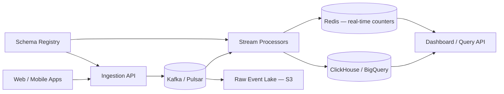

# Case Study 20 — Analytics / Metrics Event Pipeline

Design a pipeline that collects **billions of product analytics events** (page views, clicks, purchases), processes them reliably, and serves dashboards and ad-hoc queries.

## 1. Problem

Product teams need answers like "how many signups per country yesterday?" and "funnel from landing → signup → purchase." Events fire constantly from web and mobile apps. You must ingest high-volume fire-and-forget traffic, never lose critical data, and query aggregates efficiently.

## 2. Requirements

### Functional (MVP)

- Client SDK sends events: `{ eventName, userId, timestamp, properties }`  
- Ingestion API accepts batch events (JSON)  
- Stream processing: dedupe, validate schema, enrich (geo from IP)  
- Store raw events for replay (short retention)  
- Aggregate metrics: counts per event per hour, DAU, simple funnels  
- Query API or SQL interface for dashboards (last 7 days)  

### Out of scope (initially)

- Sub-second real-time alerting (near-real-time OK)  
- ML feature store, session replay, heatmaps  
- Petabyte-scale multi-year retention on hot tier  
- Exactly-once billing-grade accounting (at-least-once + idempotent agg is MVP)  

### Non-functional

- Ingestion: 100k+ events/sec peak, p99 ack < 100 ms  
- Durability: survive broker/node failure (replicated log)  
- Processing lag: minutes acceptable for dashboards  
- Query: interactive for pre-aggregated rollups (< 5 s)  
- Cost-aware tiering: hot vs cold storage  

## 3. Back-of-the-envelope estimates

Assumptions:

- 50M DAU, 20 events/user/day → 1B events/day  
- Average event JSON 500 bytes  
- Peak 3× average  

```text
Avg ingest     ≈ 1B / 86,400 ≈ 11,600 events/s
Peak ingest    ≈ 35,000 events/s
Daily volume   ≈ 1B × 500 B ≈ 500 GB/day raw
Monthly raw    ≈ 15 TB (before compression)

After compression (~5×) ≈ 3 TB/month in object storage
Rollups (1M metric rows/day × 200 B) ≈ 200 MB/day — fits OLAP easily
```

Insight: **decouple fast ingestion from slow analytics** with a durable queue/stream; **pre-aggregate** for dashboards, keep raw in cheap storage for drill-down.

## 4. High-Level Design (HLD)



End-to-end path in words:

```text
Ingestion → Queue/Stream → Processing → Warehouse/OLAP (+ optional real-time layer)
```

### Components

| Component | Role |
|-----------|------|
| Ingestion API | Stateless, validates, assigns `eventId`, produces to Kafka |
| Kafka (or Pulsar) | Durable, partitioned log; buffers spikes |
| Schema Registry | Avro/JSON schema versions; reject bad events |
| Stream processors | Flink / Spark Streaming / Kafka Streams — enrich, aggregate |
| Raw event lake | S3 + Parquet partitioned by `date/hour` |
| OLAP warehouse | ClickHouse, BigQuery, or Redshift for analytics SQL |
| Real-time counters | Redis / Druid for last-hour metrics (optional) |
| Query API | Serves dashboard tiles from OLAP + Redis |
| Orchestrator | Airflow / Dagster for batch backfill jobs |

### Flows

**Event ingestion**

1. Client batches 10 events, `POST /v1/events` with API key  
2. Ingestion validates schema, adds `receivedAt`, `eventId` (UUID)  
3. Partition key = `hash(userId)` for user-scoped ordering  
4. Produce to topic `events.raw`, return 202 Accepted quickly  

**Stream processing**

1. Consumer reads `events.raw`  
2. Filter bots, drop invalid fields  
3. Enrich: IP → country, `userId` → account tier from cache  
4. Fork: (a) write Parquet to S3, (b) increment hourly rollups in OLAP  

**Dashboard query**

1. UI requests "signups by country, last 7 days"  
2. Query API hits pre-aggregated table `metrics.signups_hourly` in OLAP  
3. Return JSON series — no full scan of 1B raw rows  

**Backfill / replay**

1. New metric defined → batch job scans S3 Parquet for last 90 days  
2. Populate new rollup table without re-instrumenting clients  

### Trade-offs

| Choice | Pros | Cons |
|--------|------|------|
| Kafka vs direct to DB | Absorbs spikes, replay | Ops complexity |
| At-least-once vs exactly-once | Simpler, faster | Duplicate events — need idempotent agg |
| Lambda (stream) + batch | Real-time + cheap historical | Two code paths unless unified (Flink) |
| ClickHouse vs BigQuery | Fast, self-host option | Managed BQ less ops |
| Pre-aggregate vs scan raw | Fast dashboards | Must know metrics upfront |
| 7-day hot + cold archive | Cost | Old ad-hoc queries slower |

## 5. Low-Level Design (LLD)

### APIs

```text
POST /v1/events
Headers: X-Api-Key, Content-Type: application/json
Body: {
  "events": [
    {
      "eventName": "page_view",
      "userId": "u_123",
      "timestamp": "2026-07-20T10:00:00Z",
      "properties": { "path": "/pricing", "referrer": "google" }
    }
  ]
}
→ 202 { "accepted": 10, "batchId": "b_991" }

GET /v1/metrics/signups?from=2026-07-13&to=2026-07-20&groupBy=country
→ { "series": [{ "country": "IN", "count": 12000 }, ...] }

GET /v1/metrics/funnel?steps=landing,signup,purchase&from=...&to=...
→ { "steps": [{ "name": "landing", "users": 100000 }, ...] }
```

### Event schema (registered)

```text
Event {
  eventId: string (UUID, server-generated if missing)
  eventName: string (enum or pattern)
  userId: string | null
  anonymousId: string | null
  timestamp: ISO8601 (client clock; server adds receivedAt)
  properties: map<string, string | number | boolean>
  context: {
    ip: string (hashed after geo lookup)
    userAgent: string
    appVersion: string
  }
  receivedAt: ISO8601 (server)
  schemaVersion: int
}
```

### Kafka topics

```text
events.raw          — partitions: 64, key: userId, retention: 7 days
events.enriched     — optional intermediate
metrics.rollup      — compacted or changelog for materialized agg
```

### OLAP tables (ClickHouse-style)

```text
-- Raw (optional in OLAP for recent window)
events_raw (
  event_date Date,
  event_time DateTime,
  event_name LowCardinality(String),
  user_id String,
  country FixedString(2),
  properties JSON
)
ENGINE = MergeTree()
PARTITION BY toYYYYMM(event_date)
ORDER BY (event_name, event_date, user_id)

-- Pre-aggregated hourly
signups_hourly (
  hour DateTime,
  country FixedString(2),
  signup_count AggregateFunction(count)
)
ENGINE = AggregatingMergeTree()
ORDER BY (hour, country)
```

### S3 lake layout

```text
s3://analytics-lake/events/
  year=2026/month=07/day=20/hour=10/
    part-0000.parquet
    part-0001.parquet
```

### Modules

```text
IngestionController / EventValidator / KafkaProducer
SchemaRegistryClient
EnrichmentProcessor (GeoIP, user cache)
AggregationJob (hourly rollups)
LakeWriter (Parquet batch sink)
MetricsQueryService / FunnelCalculator
BackfillOrchestrator
```

### Algorithm — ingestion (fast ack)

```text
function ingestBatch(apiKey, events):
  tenant = auth(apiKey)
  accepted = []
  for e in events:
    if not schemaValid(e): continue
    e.eventId = e.eventId or uuid()
    e.receivedAt = now()
    e.schemaVersion = CURRENT_SCHEMA
    kafka.produce(
      topic = "events.raw",
      key = e.userId or e.anonymousId,
      value = serialize(e)
    )
    accepted.append(e.eventId)
  return 202, { accepted: len(accepted) }
```

### Algorithm — hourly rollup (stream processor)

```text
function processEvent(e):
  country = geoIp.lookup(e.context.ip)
  e2 = enrich(e, country)

  lakeBuffer.add(e2)
  if e2.eventName == "signup":
    key = (hourBucket(e2.timestamp), country)
    state.increment(key, uniqueUser=e2.userId)   // HyperLogLog or set per hour shard

function onWindowClose(hour):
  for key, count in state.flush(hour):
    olap.insert("signups_hourly", key, count)
  lakeBuffer.flushToS3(hour)   // Parquet files
```

### Algorithm — funnel (batch or OLAP query)

```text
-- Simplified SQL idea: distinct users per step in order
WITH step1 AS (
  SELECT DISTINCT user_id FROM events_raw
  WHERE event_name = 'landing' AND event_date BETWEEN ...
),
step2 AS (
  SELECT DISTINCT e.user_id FROM events_raw e
  INNER JOIN step1 s ON e.user_id = s.user_id
  WHERE e.event_name = 'signup' AND e.timestamp >= ...
)
SELECT count(*) FROM step2;
```

### Algorithm — dedupe (at-least-once)

```text
function aggregateWithDedup(event):
  if dedupStore.seen(event.eventId): return   // Redis SET with 48h TTL
  dedupStore.mark(event.eventId)
  applyAggregation(event)
```

### Concurrency notes

- Ingestion servers are **stateless** — scale horizontally  
- Kafka partition count bounds parallel consumers per topic  
- **Idempotent producers** + `eventId` dedup prevents double-count from retries  
- Client clocks skew: trust `receivedAt` for ordering; store client `timestamp` separately  
- Hot partition risk: celebrity user / load test — salt key or use round-robin for anonymous traffic  

## 6. Scale evolution

| Stage | Volume | Changes |
|-------|--------|---------|
| MVP | 1k events/s | POST → single Kafka → Flink → Postgres daily rollup |
| Growth | 10k events/s | More partitions, ClickHouse, S3 lake, schema registry |
| Peak | 100k+ events/s | Dedicated ingest cluster, async produce acks, rate limit per API key |
| Query | Slow ad-hoc | Pre-aggregate top 50 metrics; raw lake for analyst SQL (Trino/Athena) |
| Retention | Years of data | Tier S3 → Glacier; rollup tables kept hot |
| Multi-tenant | SaaS analytics | Namespace topics/tables by `tenantId`; fair scheduling on shared Flink |

## 7. Recap

- Pipeline shape: **ingestion → queue/stream → processing → warehouse/OLAP**  
- Kafka (or similar) **decouples** producers from processors and enables replay  
- Use **at-least-once + idempotent `eventId`** rather than chasing exactly-once everywhere  
- **Pre-aggregate** for dashboards; **data lake** for exploration and backfill  
- Separate **real-time counters** (optional) from **authoritative batch rollups**  

**Practice:** draw the pipeline from memory, then explain what breaks if the stream processor restarts mid-batch and how `eventId` dedup helps.
