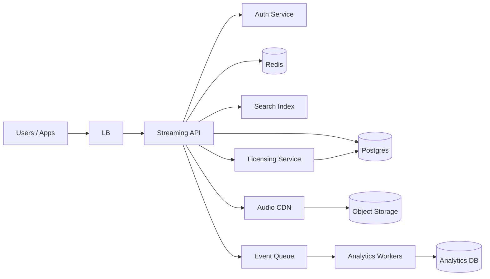

# Case Study 21 — Music Streaming

Design a service like **Spotify**: browse a catalog, stream audio, and manage playlists.

## 1. Problem

Users discover songs, play them with minimal buffering, and build personal playlists. The platform must respect licensing (region, expiry) and serve audio efficiently at global scale.

## 2. Requirements

### Functional (MVP)

- Browse/search catalog (artists, albums, tracks)  
- Stream audio (play, pause, seek within track)  
- User accounts and authentication  
- Create/edit/delete playlists; add/remove tracks  
- Track play history (recently played)  
- Store licensing metadata per track (regions, rights holder, expiry)  

### Out of scope (initially)

- Offline downloads, lyrics sync, social feed, podcast video, live DJ rooms  
- Full recommendation ML pipeline (use simple “related tracks” later)  
- Artist upload portal and royalty payout accounting  

### Non-functional

- Playback starts quickly (< 2 s on good network)  
- High read:write ratio (streams >> playlist edits)  
- CDN-friendly audio delivery; origin shielding  
- Licensing checks before every stream URL is issued  
- High availability for playback path  

## 3. Back-of-the-envelope estimates

These numbers are **rough order-of-magnitude math** — not a capacity plan. In interviews, the goal is to show you know *what to count* and *which resource breaks first*. A useful shortcut: **1 QPS sustained ≈ 86,400 requests/day** (86,400 seconds in a day). Traffic rarely stays flat; **peak is often 2–5× average** (evenings, album drops, commute hours).

### Why we estimate

Music streaming looks like “one app” but is really **two systems**:

- A **metadata path** (search, playlists, licensing) — small JSON, DB/cache friendly  
- An **audio path** (actual bytes) — huge bandwidth, must never flow through app servers  

Estimates tell us whether to optimize Postgres, Redis, CDN, or object storage — and prove that **streams dominate reads** while playlist edits are tiny.

### Assumptions

| Assumption | Value | Why it matters |
|------------|-------|----------------|
| Monthly active users (MAU) | 50M | Base for daily stream volume |
| Streams per user per day | 30 | Each stream triggers play URL + CDN fetch |
| Catalog size | 80M tracks | Metadata DB + cold audio in S3 |
| Average track audio size | 5 MB (128 kbps, ~5 min) | Object storage and CDN egress |
| Metadata per track | ~2 KB | Fits Postgres + search index |
| Users editing playlists | 10% of MAU, 2 edits/day | Write path to DB |

### Step A — Traffic (QPS) with labeled arithmetic

**Stream starts (play URL requests — API path):**

```text
Streams per day     = 50M users × 30 streams/user
                    = 1.5 billion streams/day

Average stream QPS  = 1.5B ÷ 86,400
                    ≈ 17,400 requests/second

Peak stream QPS (3×) ≈ 17,400 × 3
                     ≈ 52,000 requests/second
```

Each “stream” is one `POST /tracks/:id/play` (licensing check + signed CDN URL). The **audio bytes** do not hit your API — the client pulls from CDN separately.

**Search and browse (catalog reads):**

```text
Assume 5 catalog API calls per stream (search, album, artist, playlist load)

Catalog read QPS (avg) = 17,400 × 5 ≈ 87,000/s
Peak (3×)              ≈ 260,000/s
```

Hot slices cache well; search index handles full-text.

**Playlist writes:**

```text
Editing users/day   = 50M × 10% = 5M users
Edits per day       = 5M × 2 = 10M writes/day

Write QPS (avg)     = 10M ÷ 86,400 ≈ 115 writes/second
Peak (3×)           ≈ 350 writes/second
```

### Step B — Storage

**Track metadata (Postgres + indexes):**

```text
Rows              = 80M tracks
Bytes per row     ≈ 2 KB (title, artist, album, duration, storage_key)

Raw metadata      = 80M × 2 KB ≈ 160 GB
With indexes (~2×) ≈ 320 GB — fits a large Postgres cluster or sharded by track_id
```

**Audio (object storage — the big number):**

```text
Audio storage     = 80M tracks × 5 MB/track
                  ≈ 400 TB (cold S3/GCS; lifecycle tiers for archival)
```

**Play events / analytics (append-only, 1 year):**

```text
Events/day        = 1.5B play events
Row size          ≈ 100 B (user_id, track_id, timestamp, region)

Per day           = 1.5B × 100 B ≈ 150 GB/day
Per year          ≈ 55 TB → stream to columnar warehouse; don’t keep all in Postgres
```

**Playlists:**

```text
Assume 20M playlists × ~1 KB metadata + avg 50 tracks × 8 B each
Order of magnitude ≈ tens of GB — negligible vs audio
```

### Step C — Bandwidth and other resources

**CDN egress (where the real bits move):**

```text
Streams/day           = 1.5B
Bytes per full listen ≈ 5 MB (assume most users finish ~80% → use 4 MB effective)

Daily CDN egress      = 1.5B × 4 MB ≈ 6 PB/day average
Average bitrate       ≈ 6 PB ÷ 86,400 s ≈ 70 GB/s ≈ 560 Gbps sustained average
Peak (3× evenings)    ≈ 1.7 TB/s ≈ 1,700 Gbps — must be almost entirely CDN cache hits
```

**API bandwidth (JSON only — small):**

```text
Play URL response     ≈ 500 B JSON
Peak play QPS         ≈ 52,000/s

API egress (play)     = 52,000 × 500 B ≈ 26 MB/s — trivial vs CDN
```

**Licensing checks:** one indexed lookup per play (~52k/s peak) — cache hot track+region pairs in Redis.

### Step D — Read:write ratio table

| Operation | Type | Avg QPS | Peak QPS | Notes |
|-----------|------|---------|----------|-------|
| Start stream (play URL) | Read + license check | ~17,400 | ~52,000 | Gate before CDN URL |
| CDN audio delivery | Read (edge) | N/A (CDN) | ~560 Gbps+ | Never through API |
| Search / browse catalog | Read | ~87,000 | ~260,000 | Cache + search index |
| Edit playlist | Write | ~115 | ~350 | Transactional Postgres |
| Play event log | Write (async) | ~17,400 | ~52,000 | Queue → analytics |

**Overall ratio:** catalog + stream reads **>>** playlist writes (~150:1 on API writes). Audio bandwidth is a separate, much larger dimension.

### What the numbers tell us

- **Never stream audio through app servers** — 400 TB catalog and petabyte-scale daily CDN egress require S3 + CDN with signed URLs  
- **Licensing at play time** (~52k checks/s peak) needs fast lookups (Redis cache of track+region → allowed/denied)  
- **Metadata (~160 GB) is manageable**; shard by `track_id` only when catalog grows past 100M+  
- **Playlist writes (~350/s peak) fit one Postgres** with optimistic locking — don’t over-engineer sharding here  
- **Play analytics (150 GB/day)** belongs in Kafka + warehouse, not blocking the playback path  
- **Peak factor matters** — Friday 6 PM can be 3–5× average; CDN pre-warm new releases

### Common mistake for this problem

Putting **audio files in Postgres or proxying streams through the API** “for control.” At 17k+ plays/sec, origin bandwidth explodes. Another mistake: checking licensing only at browse time — rights expire and vary by region; **every play URL** must re-validate. Finally, treating **playlist writes** as the scaling bottleneck when **CDN + licensing reads** dominate.

## 4. High-Level Design (HLD)



### Components

| Component | Role |
|-----------|------|
| Streaming API | Catalog, playlists, playback session orchestration |
| Auth Service | JWT/session; user identity |
| Postgres | Users, tracks, albums, playlists, licensing rows |
| Redis | Hot catalog slices, session tokens, rate limits |
| Search Index | Full-text search on track/artist/album |
| Licensing Service | Region/expiry checks before signed URL |
| Object Storage (S3) | Master audio files (MP3/AAC) |
| Audio CDN | Edge cache for segments/bytes |
| Queue + workers | Play events, royalty reporting (async) |

### Flows

**Search & browse**

1. Client queries `/search?q=...`  
2. API hits search index (Elasticsearch/OpenSearch)  
3. Returns track IDs + metadata from cache/DB  
4. Client renders catalog UI  

**Start playback**

1. Client requests `POST /tracks/:id/play` with user region  
2. API loads track + licensing metadata  
3. Licensing service validates: region allowed, not expired, not blocked  
4. API mints **short-lived signed CDN URL** (or HLS manifest URL)  
5. Client streams directly from CDN; API enqueues play event async  

**Create playlist**

1. Validate user owns playlist or creates new  
2. Insert/update `playlists` + `playlist_tracks` in transaction  
3. Invalidate user’s playlist cache  
4. Return updated playlist  

### Trade-offs

- **Progressive download vs HLS/DASH** — HLS enables adaptive bitrate and better seek; more encoding pipeline complexity  
- **Signed URLs vs proxy streaming** — signed URLs offload bandwidth to CDN; proxy gives tighter control but costly  
- **Central licensing table vs per-track flags** — table scales with rules; simple flags OK for MVP  
- **Strong consistency on playlists vs eventual** — transactional playlist edits prevent duplicate/conflicting order  

## 5. Low-Level Design (LLD)

### APIs

```text
GET /api/v1/search?q=beatles&limit=20
→ { "tracks": [...], "artists": [...], "albums": [...] }

GET /api/v1/tracks/:trackId
→ { "id", "title", "artist", "album", "durationMs", "previewUrl" }

POST /api/v1/tracks/:trackId/play
Body: { "deviceId": "...", "quality": "high" }
→ {
    "streamUrl": "https://cdn.example.com/...?sig=...&exp=...",
    "expiresAt": "2026-07-20T08:05:00Z",
    "format": "aac"
  }
→ 403 if not licensed in user region

GET /api/v1/playlists/:id
→ { "id", "name", "tracks": [...] }

POST /api/v1/playlists
Body: { "name": "Road Trip" }
→ { "id": "pl_abc", "name": "Road Trip" }

PUT /api/v1/playlists/:id/tracks
Body: { "trackIds": ["t1", "t2", "t3"], "version": 3 }
→ 409 if version conflict (optimistic locking)

GET /api/v1/me/recent
→ { "tracks": [...] }
```

### Schema

```text
users (
  id            BIGSERIAL PRIMARY KEY,
  email         VARCHAR(255) UNIQUE NOT NULL,
  region_code   CHAR(2) NOT NULL,
  created_at    TIMESTAMPTZ NOT NULL
)

tracks (
  id            BIGSERIAL PRIMARY KEY,
  title         VARCHAR(512) NOT NULL,
  album_id      BIGINT REFERENCES albums(id),
  duration_ms   INT NOT NULL,
  storage_key   VARCHAR(512) NOT NULL,
  created_at    TIMESTAMPTZ NOT NULL
)

albums (
  id            BIGSERIAL PRIMARY KEY,
  title         VARCHAR(512) NOT NULL,
  artist_id     BIGINT REFERENCES artists(id)
)

artists (
  id            BIGSERIAL PRIMARY KEY,
  name          VARCHAR(512) NOT NULL
)

track_licenses (
  track_id      BIGINT REFERENCES tracks(id),
  region_code   CHAR(2),          -- 'US', 'IN', or '*' for global
  rights_holder VARCHAR(255),
  valid_from    TIMESTAMPTZ NOT NULL,
  valid_until   TIMESTAMPTZ NULL,
  PRIMARY KEY (track_id, region_code)
)

playlists (
  id            BIGSERIAL PRIMARY KEY,
  user_id       BIGINT REFERENCES users(id),
  name          VARCHAR(255) NOT NULL,
  version       INT DEFAULT 1,
  updated_at    TIMESTAMPTZ NOT NULL
)

playlist_tracks (
  playlist_id   BIGINT REFERENCES playlists(id),
  track_id      BIGINT REFERENCES tracks(id),
  position      INT NOT NULL,
  PRIMARY KEY (playlist_id, track_id),
  UNIQUE (playlist_id, position)
)

play_events (
  id            BIGSERIAL PRIMARY KEY,
  user_id       BIGINT,
  track_id      BIGINT,
  played_at     TIMESTAMPTZ NOT NULL,
  device_id     VARCHAR(64),
  region_code   CHAR(2)
)
```

### Modules

```text
TrackController
PlaylistController
PlaybackService
LicensingService
CatalogRepository
PlaylistRepository
CdnUrlSigner
PlayEventProducer
SearchClient
```

### Algorithm — issue stream URL (with licensing)

```text
function startPlayback(userId, trackId, region):
  track = catalogRepo.findTrack(trackId)
  if track is null: return 404

  license = licensingService.resolve(trackId, region)
  if license is null or license.expired or license.blocked:
    return 403("not available in your region")

  sessionId = uuid()
  exp = now() + 5 minutes
  streamUrl = cdnSigner.sign(
    objectKey = track.storageKey,
    exp = exp,
    claims = { userId, trackId, sessionId }
  )

  playEventProducer.enqueue({ userId, trackId, region, sessionId })
  return { streamUrl, expiresAt: exp }
```

### Algorithm — update playlist (optimistic concurrency)

```text
function updatePlaylistTracks(userId, playlistId, trackIds, clientVersion):
  playlist = repo.findPlaylist(playlistId)
  if playlist.userId != userId: return 403
  if playlist.version != clientVersion: return 409

  begin transaction:
    delete from playlist_tracks where playlist_id = playlistId
    for i, trackId in enumerate(trackIds):
      insert playlist_tracks(playlistId, trackId, position=i)
    update playlists set version = version + 1 where id = playlistId
  commit

  cache.invalidate("playlist:" + playlistId)
  return repo.findPlaylist(playlistId)
```

### Concurrency & correctness

- Licensing checked at **play time**, not only catalog browse — rights can change  
- Signed URLs expire quickly; re-request on seek if needed  
- Playlist `version` prevents lost updates from multiple devices  
- Play events are append-only; analytics aggregates eventually  

## 6. Scale evolution

| Stage | Change |
|-------|--------|
| MVP | Single Postgres + Redis; one CDN bucket; simple search |
| Hot tracks | CDN cache hit ratio > 95%; pre-warm popular releases |
| Global | Multi-region CDN; geo-routing; replicate read-only catalog |
| Huge catalog | Shard metadata by `track_id`; dedicated search cluster |
| Personalization | Offline feature store + recommendation service (async) |

## 7. Recap

- **Metadata in DB/cache; bytes on CDN** — never stream audio through app servers at scale  
- **Licensing gate on every play URL** — region and expiry are first-class  
- **Playlists are transactional writes** — streams are read-heavy and cache-friendly  
- **Analytics async** — don’t block playback for royalty/event logging  

**Practice:** redraw HLD from memory, then write `startPlayback` + playlist update pseudocode without looking.
