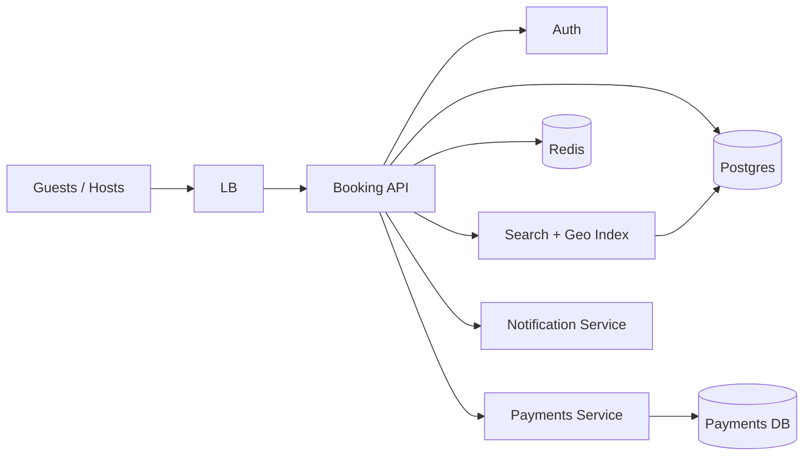

# Case Study 22 — Hotel / Home Booking

Design a service like **Airbnb**: hosts list properties; guests search, check availability, and book date ranges without double-booking.

## 1. Problem

Travelers need to find lodging for specific check-in/check-out dates. Hosts manage calendars and pricing. The system must prevent two guests from booking the same property for overlapping nights.

## 2. Requirements

### Functional (MVP)

- Host creates listing (title, location, photos, base price)  
- Host blocks/unblocks dates on availability calendar  
- Guest searches listings by location + date range + guests  
- Guest views listing detail and price breakdown  
- Guest creates booking (pending → confirmed)  
- Guest cancels booking (policy-dependent refund rules simplified)  
- Host views upcoming bookings  

### Out of scope (initially)

- Instant Book vs request-to-book workflow, messaging, reviews  
- Dynamic pricing ML, multi-currency FX, tax/VAT engines  
- Payment disputes, host payouts, identity verification  
- Experiences, long-term leases  

### Non-functional

- Search results feel fast (< 500 ms P95 for MVP)  
- **No double-booking** — correctness over eventual consistency on reservations  
- Handle peak booking spikes (holidays)  
- Idempotent booking API (retries safe)  

## 3. Back-of-the-envelope estimates

These numbers are **rough order-of-magnitude math** — not a capacity plan. In interviews, the goal is to show you know *what to count* and *which resource breaks first*. A useful shortcut: **1 QPS sustained ≈ 86,400 requests/day**. Traffic rarely stays flat; **peak is often 2–5× average** (holiday weekends, summer travel, city-wide events).

### Why we estimate

Hotel booking is **read-heavy for discovery** but **write-critical for reservations**. One double-booked night destroys trust. Estimates tell us:

- Whether search or booking confirmation is the bottleneck  
- How much calendar/availability data we store per listing  
- When we need **strong consistency** (per listing) vs cache (search results)

### Assumptions

| Assumption | Value | Why it matters |
|------------|-------|----------------|
| Active listings | 2M | Search index size + calendar rows |
| Confirmed bookings per day | 500K | Core write path |
| Average stay length | 3 nights | Booking row size and revenue |
| Search attempts per booking | ~10 | Users browse before committing |
| Listing metadata size | ~5 KB | Photos live in object storage |
| Booking row size | ~500 B | History table growth |

### Step A — Traffic (QPS) with labeled arithmetic

**Confirmed bookings (successful writes):**

```text
Bookings per day    = 500,000
Average booking QPS = 500,000 ÷ 86,400
                    ≈ 5.8 writes/second

Peak booking QPS (5× holiday) ≈ 5.8 × 5
                              ≈ 29 writes/second
```

Only ~30 confirmed bookings/sec at peak — the DB can handle this **if** each write is fast and contention is scoped per listing.

**Booking attempts (includes failures, retries, abandoned carts):**

```text
Attempt multiplier  ≈ 3× (users retry dates, payment fails, etc.)
Attempt QPS (avg)   ≈ 5.8 × 3 ≈ 17/s
Peak attempts       ≈ 17 × 5 ≈ 85/s
```

**Search queries (discovery path):**

```text
Search per day      = 500K bookings × 10 searches each
                    = 5M searches/day

Search QPS (avg)    = 5M ÷ 86,400 ≈ 58 reads/second
Peak search (5×)    ≈ 290 reads/second
```

**Availability checks (date picker — hot path during search):**

```text
Assume 5 availability API calls per search
Availability QPS (avg) = 58 × 5 ≈ 290/s
Peak                 ≈ 1,450/s
```

### Step B — Storage

**Listing metadata:**

```text
Listings          = 2M
Bytes per listing ≈ 5 KB (title, geo, price, host_id — not photos)

Listing data      = 2M × 5 KB ≈ 10 GB
Photos (S3)       = 2M × 10 photos × 300 KB ≈ 6 TB (object storage, CDN)
```

**Bookings (historical):**

```text
Bookings per year = 500K × 365 ≈ 182M rows
Row size          ≈ 500 B

Year-1 bookings   = 182M × 500 B ≈ 91 GB/year
5-year retention  ≈ 450 GB — manageable; archive cold rows
```

**Availability calendar (per listing, per night):**

```text
Slot rows         = 2M listings × 365 nights ≈ 730M slot-rows/year
Bytes per slot    ≈ 20 B (date, status bitmap or enum)

Calendar data     ≈ 730M × 20 B ≈ 15 GB/year
Compressed bitmaps per listing can shrink this further
```

### Step C — Bandwidth and other resources

**Search API responses:**

```text
Results per search  ≈ 20 listings × 500 B summary ≈ 10 KB JSON
Peak search QPS     ≈ 290/s

Search egress       = 290 × 10 KB ≈ 2.9 MB/s — modest; Elasticsearch cluster is the cost center
```

**Listing detail page:**

```text
Assume 2M detail views/day × 50 KB (with cached photos metadata)
≈ 1.2 GB/day API JSON — negligible
```

**Contention, not bandwidth, is the story:** two guests booking the **same listing + overlapping dates** at the same second — that’s a **few writes/sec per hot listing**, not global QPS.

### Step D — Read:write ratio table

| Operation | Type | Avg QPS | Peak QPS | Notes |
|-----------|------|---------|----------|-------|
| Search listings | Read | ~58 | ~290 | Elasticsearch + geo filter |
| Check availability | Read | ~290 | ~1,450 | Must reflect recent blocks |
| View listing detail | Read | ~23 | ~115 | Cacheable |
| Create booking | Write | ~6 | ~29 | **Must be atomic per listing** |
| Block/unblock dates (host) | Write | ~1 | ~10 | Low volume |
| Cancel booking | Write | ~1 | ~5 | Updates calendar + refund |

**Ratio:** reads ~50× writes on average — but **correctness on writes** matters more than read scale.

### What the numbers tell us

- **~29 confirmed bookings/s peak is small globally** — but **one popular listing** can see many concurrent attempts; scope locks by `listing_id`  
- **Availability reads (~1,450/s peak)** should be cached briefly, but **never cache stale availability** across the booking transaction  
- **10 GB of listing metadata** fits one DB; photos belong in S3 + CDN  
- **91 GB/year of bookings** is fine in Postgres; index by `listing_id` and `guest_id`  
- **Search (~290/s peak)** needs Elasticsearch with geo + date filters, not SQL `LIKE`  
- Use **DB constraints or SELECT FOR UPDATE** on the date range — eventual consistency causes double-booking

### Common mistake for this problem

Optimizing **search QPS** while ignoring **per-listing write contention**. Two users booking the last night must serialize — use a transaction, unique constraint on `(listing_id, check_in, check_out)`, or short-lived Redis hold. Another mistake: **caching availability** without invalidating at booking time. Finally, assuming **500K bookings/day** means 500K writes/sec — it’s only ~6/s average.

## 4. High-Level Design (HLD)



### Components

| Component | Role |
|-----------|------|
| Booking API | Listings CRUD, search orchestration, bookings |
| Postgres | Listings, availability, bookings (source of truth) |
| Search + Geo Index | Location/date-filtered listing discovery |
| Redis | Search result cache, idempotency keys, short locks |
| Payments Service | Authorize/capture charges (async confirm) |
| Notification Service | Email/push on confirm/cancel |

### Flows

**Search**

1. Guest submits city + check-in + check-out + guest count  
2. API queries geo index for listings in bounding box  
3. Filter candidates where **every night in range is available**  
4. Return ranked results with total price estimate  

**Book (critical path)**

1. Guest selects listing + dates; client sends idempotency key  
2. API validates listing active and guest count within capacity  
3. **Begin transaction**: lock listing row or date range  
4. Re-check availability for each night (no overlapping confirmed booking)  
5. Insert booking row `status=pending`; hold inventory  
6. Call payment authorize; on success → `status=confirmed`  
7. Commit; invalidate search cache for listing; notify host/guest  

**Host blocks dates**

1. Host selects blocked range on calendar  
2. Verify no confirmed booking overlaps  
3. Insert `blocked_nights` or update availability bitmap  
4. Invalidate cached availability for listing  

### Trade-offs

- **Pessimistic lock (row/range) vs optimistic (version + retry)** — pessimistic simpler for double-booking prevention; optimistic better under low contention  
- **Night-granularity vs hourly** — nights match hotels/Airbnb MVP; hourly adds complexity  
- **Sync payment in booking TX vs saga** — sync TX is simpler; saga needed if payment is slow/unreliable  
- **Materialized availability vs compute on read** — materialized speeds search; must update on every booking/block  

## 5. Low-Level Design (LLD)

### APIs

```text
GET /api/v1/search?city=Paris&checkIn=2026-08-01&checkOut=2026-08-04&guests=2
→ { "listings": [{ "id", "title", "nightlyPrice", "totalPrice", "photos" }] }

GET /api/v1/listings/:id?checkIn=...&checkOut=...
→ { "listing", "available": true, "priceBreakdown": {...} }

POST /api/v1/bookings
Headers: Idempotency-Key: <uuid>
Body: {
  "listingId": "lst_123",
  "checkIn": "2026-08-01",
  "checkOut": "2026-08-04",
  "guests": 2,
  "paymentMethodId": "pm_abc"
}
→ 201 { "bookingId", "status": "confirmed", "totalAmount": 45000 }
→ 409 if dates unavailable
→ 200 same body if idempotency key replayed

POST /api/v1/bookings/:id/cancel
→ { "status": "cancelled", "refundAmount": 30000 }

PUT /api/v1/host/listings/:id/availability
Body: { "blockedRanges": [{ "from": "2026-12-24", "to": "2026-12-26" }] }
→ 409 if overlaps confirmed booking
```

### Schema

```text
users (
  id            BIGSERIAL PRIMARY KEY,
  email         VARCHAR(255) UNIQUE NOT NULL,
  role          VARCHAR(16) NOT NULL  -- 'guest' | 'host'
)

listings (
  id            BIGSERIAL PRIMARY KEY,
  host_id       BIGINT REFERENCES users(id),
  title         VARCHAR(255) NOT NULL,
  city          VARCHAR(128) NOT NULL,
  lat           DECIMAL(9,6),
  lng           DECIMAL(9,6),
  max_guests    INT NOT NULL,
  nightly_price_cents INT NOT NULL,
  is_active     BOOLEAN DEFAULT TRUE,
  version       INT DEFAULT 1
)

-- one row per listing per night (materialized calendar)
listing_nights (
  listing_id    BIGINT REFERENCES listings(id),
  night_date    DATE NOT NULL,
  status        VARCHAR(16) NOT NULL,  -- 'available' | 'booked' | 'blocked'
  booking_id    BIGINT NULL,
  PRIMARY KEY (listing_id, night_date)
)

bookings (
  id            BIGSERIAL PRIMARY KEY,
  listing_id    BIGINT REFERENCES listings(id),
  guest_id      BIGINT REFERENCES users(id),
  check_in      DATE NOT NULL,
  check_out     DATE NOT NULL,         -- exclusive end (hotel convention)
  guests        INT NOT NULL,
  status        VARCHAR(16) NOT NULL,  -- pending | confirmed | cancelled
  total_cents   INT NOT NULL,
  idempotency_key VARCHAR(64) UNIQUE,
  created_at    TIMESTAMPTZ NOT NULL
)

-- prevents overlapping confirmed bookings (alternative to listing_nights)
CREATE UNIQUE INDEX no_overlap_confirmed ON bookings (listing_id)
  WHERE status = 'confirmed';  -- use EXCLUDE constraint in Postgres for real overlap
```

Postgres overlap prevention (preferred):

```sql
ALTER TABLE bookings ADD CONSTRAINT no_date_overlap
  EXCLUDE USING gist (
    listing_id WITH =,
    daterange(check_in, check_out, '[)') WITH &&
  ) WHERE (status IN ('pending', 'confirmed'));
```

### Modules

```text
SearchController
ListingController
BookingController
AvailabilityService
BookingService
ListingRepository
BookingRepository
PaymentClient
IdempotencyStore
SearchIndexClient
```

### Algorithm — search with availability

```text
function search(city, checkIn, checkOut, guests):
  candidateIds = searchIndex.geoQuery(city, filters={ guests, price })
  available = []
  for listingId in candidateIds:
    nights = eachNight(checkIn, checkOut)  -- [in, out) half-open
    if availabilityService.allNightsAvailable(listingId, nights):
      price = pricingService.total(listingId, nights)
      available.append({ listingId, price })
  return sortByRelevance(available)
```

### Algorithm — create booking (double-booking safe)

```text
function createBooking(guestId, listingId, checkIn, checkOut, guests, idempotencyKey):
  existing = idempotencyStore.get(idempotencyKey)
  if existing: return existing.response

  nights = eachNight(checkIn, checkOut)
  listing = repo.findListing(listingId)
  if guests > listing.maxGuests: return 400

  begin transaction:
    -- lock listing to serialize concurrent bookings
    repo.lockListingForUpdate(listingId)

    for night in nights:
      row = repo.getNight(listingId, night)
      if row.status != 'available':
        rollback; return 409("dates unavailable")

    booking = repo.insertBooking({
      listingId, guestId, checkIn, checkOut, guests,
      status: 'pending', idempotencyKey
    })

    for night in nights:
      repo.updateNight(listingId, night, status='booked', bookingId=booking.id)

  payment = paymentClient.authorize(guestId, booking.totalCents)
  if payment.failed:
    rollbackBooking(booking.id)  -- release nights
    return 402

  repo.confirmBooking(booking.id)
  idempotencyStore.save(idempotencyKey, booking)
  notifyHostAndGuest(booking)
  return 201(booking)
```

### Algorithm — cancel booking

```text
function cancelBooking(guestId, bookingId):
  booking = repo.find(bookingId)
  if booking.guestId != guestId: return 403
  if booking.status != 'confirmed': return 400

  refund = policyService.refundAmount(booking)
  begin transaction:
    repo.updateBookingStatus(bookingId, 'cancelled')
    for night in eachNight(booking.checkIn, booking.checkOut):
      repo.updateNight(booking.listingId, night, status='available', bookingId=null)
  paymentClient.refund(booking, refund)
  return { status: 'cancelled', refundAmount: refund }
```

### Concurrency & correctness

- **Half-open date ranges** `[check_in, check_out)` avoid off-by-one on last night  
- DB exclusion constraint or locked `listing_nights` rows prevent overlap  
- Idempotency key dedupes client retries  
- Pending bookings should expire (TTL job) to release held nights if payment stalls  

## 6. Scale evolution

| Stage | Change |
|-------|--------|
| MVP | Single Postgres; nightly materialized calendar; basic geo search |
| Search load | Elasticsearch + Redis cache for popular city/date queries |
| Hot listings | Shard bookings by `listing_id`; queue writes per listing |
| Global | Regional read replicas; currency display only (single settlement region) |
| Peak events | Precompute availability bitmaps; rate-limit booking attempts per user |

## 7. Recap

- **Correctness beats speed on booking** — one successful reservation per night per listing  
- **Materialized nights or exclusion constraints** make overlap checks fast and safe  
- **Idempotent booking API** handles network retries without duplicate charges  
- **Search is read-heavy** — cache and index; booking path is transactional  

**Practice:** redraw HLD from memory, then write `createBooking` with lock + night updates without looking.
