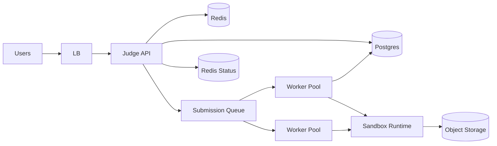

# Case Study 23 — Online Code Judge

Design a service like **LeetCode**: users submit code; the system runs it against test cases in isolation and returns verdict, runtime, and memory usage.

## 1. Problem

Developers write solutions to programming problems. On submit, code must execute safely in a sandbox, produce correct output within time/memory limits, and return a clear result (Accepted, Wrong Answer, TLE, etc.).

## 2. Requirements

### Functional (MVP)

- Problem catalog (statement, constraints, sample I/O)  
- User submits source code + language  
- Judge runs against hidden test cases  
- Verdict: Accepted, Wrong Answer, Time Limit Exceeded, Memory Limit Exceeded, Runtime Error, Compile Error  
- Report runtime (ms) and memory (KB) on Accepted  
- Submission history per user/problem  

### Out of scope (initially)

- Live contests, plagiarism detection, editorials with video  
- Interactive problems, custom checkers (floating point) — use exact match MVP  
- Multi-file projects, package managers in sandbox  
- Real-time collaborative IDE  

### Non-functional

- **Strong isolation** — untrusted code must not escape sandbox  
- Fair resource limits (CPU time, memory, output size)  
- Handle submission bursts (contest spikes) via queue  
- At-least-once execution with idempotent result writes  
- P95 queue wait acceptable; execution time bounded by problem limit  

## 3. Back-of-the-envelope estimates

These numbers are **rough order-of-magnitude math** — not a capacity plan. In interviews, the goal is to show you know *what to count* and *which resource breaks first*. A useful shortcut: **1 QPS sustained ≈ 86,400 requests/day**. Traffic rarely stays flat; **peak is often 2–5× average** — and **contest endings can spike 10×+** for minutes.

### Why we estimate

An online judge has a **fast API path** (accept code, return submission ID) and a **slow worker path** (compile, run 20 test cases in sandbox). Estimates tell us:

- How many **worker machines** we need at peak  
- Whether storage for code + logs is the long-term cost  
- Why an **async queue** is mandatory (never run user code on the API thread)

### Assumptions

| Assumption | Value | Why it matters |
|------------|-------|----------------|
| Daily active users (DAU) | 1M | Submission volume |
| Submissions per user per day | 5 | Includes practice + retries |
| Problem catalog | 5K problems | Metadata + test case storage |
| Hidden test cases per problem | ~20 avg | Worker execution time |
| Average execution time | 2 s wall clock | Worker pool sizing |
| Source code size per submit | ~10 KB | Cold storage growth |

### Step A — Traffic (QPS) with labeled arithmetic

**Code submissions (API accept → queue):**

```text
Submissions per day  = 1M users × 5 submissions/user
                     = 5M submissions/day

Submit QPS (avg)     = 5M ÷ 86,400
                     ≈ 58 submissions/second

Peak submit QPS (5× contest) ≈ 58 × 5
                             ≈ 290 submissions/second
```

The API only validates, stores code, and enqueues — **must respond in < 100 ms**.

**Status polling / result reads:**

```text
Assume 10 polls per submission until done
Poll QPS (avg)       = 58 × 10 ≈ 580 reads/second
Peak                 ≈ 2,900 reads/second
```

Use WebSockets or long-polling to reduce blind polling.

**Problem catalog reads (browse):**

```text
Assume 2M problem page views/day
Browse QPS (avg)     = 2M ÷ 86,400 ≈ 23 reads/second
```

Low compared to submission path.

### Step B — Storage

**Source code archive:**

```text
Submissions per year = 5M × 365 ≈ 1.8B submissions
Bytes per submit     ≈ 10 KB (code + language + metadata)

Per year             = 1.8B × 10 KB ≈ 18 TB/year
→ Tier to S3 cold storage after 90 days; DB keeps only pointer + verdict
```

**Verdict / results metadata:**

```text
Rows per year        = 1.8B
Row size             ≈ 200 B (verdict, runtime_ms, memory_kb, timestamps)

Results storage      = 1.8B × 200 B ≈ 360 GB/year — fits Postgres with partitioning by month
```

**Test cases (static, per problem):**

```text
Problems             = 5,000
Tests per problem    = 20
Input+output size    ≈ 5 KB avg per test

Test case storage    = 5K × 20 × 5 KB ≈ 500 MB — tiny; load into worker memory at job start
```

### Step C — Bandwidth and other resources

**Worker pool capacity (the real bottleneck):**

```text
Peak jobs arriving   = 290 submissions/second
Average run time     = 2 seconds per job

Concurrent workers needed = 290 jobs/s × 2 s
                          ≈ 580 workers running simultaneously

With 50% utilization buffer → ~1,200 worker containers at contest peak
```

Each worker is an isolated container (Docker/gVisor) — **CPU and memory**, not network, dominate.

**Queue depth during spike:**

```text
If workers handle 580 concurrent but 290/s keep arriving:
  queue grows when arrival > completion rate
  → scale workers horizontally + priority queue for paid/contest tiers
```

**API bandwidth:**

```text
Submit payload       ≈ 10 KB code upload
Peak upload          = 290 × 10 KB ≈ 2.9 MB/s — trivial
Result JSON          ≈ 500 B; poll peak ≈ 2,900 × 500 B ≈ 1.5 MB/s
```

### Step D — Read:write ratio table

| Operation | Type | Avg QPS | Peak QPS | Notes |
|-----------|------|---------|----------|-------|
| Submit code | Write (enqueue) | ~58 | ~290 | Fast API; no execution here |
| Poll submission status | Read | ~580 | ~2,900 | WebSocket reduces this |
| Worker execute + write result | Write | ~58 | ~290 | 2 s each; needs ~580 concurrent workers |
| Browse problems | Read | ~23 | ~115 | Cacheable catalog |
| View submission history | Read | ~50 | ~250 | Paginated per user |

**Ratio:** status **reads ~10× submit writes** on API; workers mirror submit rate but take seconds each.

### What the numbers tell us

- **Never run sandboxed code on the API server** — 290 submits/s × 2 s = 580 concurrent executions; queue + worker fleet is mandatory  
- **~1,200 workers at contest peak** — auto-scale on queue depth, pre-warm before scheduled contests  
- **18 TB/year of source code** → object storage + TTL; Postgres stores metadata only  
- **360 GB/year of verdicts** → partition by `(user_id, month)` or `(problem_id, month)`  
- **Polling (~2,900/s peak)** is wasteful — push results via WebSocket when job completes  
- **Strong isolation** matters more than QPS — one escaped sandbox is catastrophic

### Common mistake for this problem

Sizing the **API tier** for execution load. The API handles ~290 QPS easily; **workers** need hundreds of concurrent sandboxes. Another mistake: **synchronous submit** (“wait 2 s and return verdict”) — timeouts and connection exhaustion kill this. Finally, storing **full stdout logs forever** in Postgres — offload to S3 with a summary row in DB.

## 4. High-Level Design (HLD)



### Components

| Component | Role |
|-----------|------|
| Judge API | Problems, submissions, status polling |
| Postgres | Problems, test metadata, submission results |
| Submission Queue | Kafka/SQS/RabbitMQ buffer for run jobs |
| Worker Pool | Pull jobs, compile, run, grade |
| Sandbox Runtime | Docker/gVisor/Firecracker isolated containers |
| Object Storage | Large test inputs, stdout/stderr logs |
| Redis | Submission status cache, rate limits |

### Flows

**Submit**

1. User POSTs code + `problemId` + `language`  
2. API validates language allowed, code size limits  
3. Insert submission row `status=queued`  
4. Enqueue job `{ submissionId, problemId, language, codeRef }`  
5. Return `202 { submissionId, status: "queued" }`  

**Execute (worker)**

1. Worker pulls job; sets status `running`  
2. Fetch problem tests (small in DB, large from object storage)  
3. Compile in sandbox (if compiled language)  
4. For each test case: run with limits, capture exit code/output  
5. Early exit on WA/TLE/MLE  
6. Persist verdict + metrics; set status `completed`  
7. Push result to cache for fast poll  

**Poll result**

1. Client GET `/submissions/:id`  
2. Read Redis; on miss read Postgres  
3. Return verdict when complete  

### Trade-offs

- **Containers vs VMs vs WASM** — containers + gVisor balance isolation and density; WASM safer but limited language support  
- **Per-test process vs batch all tests in one run** — per-test gives accurate TLE; one-run faster but coarse limits  
- **Sync run for “Run” button vs async for “Submit”** — MVP can async both; sync only for tiny samples with strict timeout  
- **Store code in DB vs object storage** — DB fine under size cap; S3 for large files  

## 5. Low-Level Design (LLD)

### APIs

```text
GET /api/v1/problems/:id
→ { "id", "title", "statement", "timeLimitMs", "memoryLimitKb", "samples": [...] }

POST /api/v1/submissions
Body: {
  "problemId": "p_two_sum",
  "language": "python3",
  "sourceCode": "class Solution: ..."
}
→ 202 { "submissionId": "sub_789", "status": "queued" }

GET /api/v1/submissions/:submissionId
→ {
    "status": "completed",
    "verdict": "accepted",
    "runtimeMs": 42,
    "memoryKb": 14336,
    "passedTests": 20,
    "totalTests": 20
  }

GET /api/v1/users/me/submissions?problemId=p_two_sum&limit=20
→ { "submissions": [...] }
```

### Schema

```text
problems (
  id              VARCHAR(64) PRIMARY KEY,
  title           VARCHAR(255) NOT NULL,
  statement_md    TEXT NOT NULL,
  time_limit_ms   INT NOT NULL,
  memory_limit_kb INT NOT NULL,
  created_at      TIMESTAMPTZ NOT NULL
)

test_cases (
  id              BIGSERIAL PRIMARY KEY,
  problem_id      VARCHAR(64) REFERENCES problems(id),
  input_ref       VARCHAR(512) NOT NULL,   -- S3 key or inline
  expected_ref    VARCHAR(512) NOT NULL,
  is_sample       BOOLEAN DEFAULT FALSE,
  ordinal         INT NOT NULL
)

submissions (
  id              BIGSERIAL PRIMARY KEY,
  user_id         BIGINT NOT NULL,
  problem_id      VARCHAR(64) REFERENCES problems(id),
  language        VARCHAR(32) NOT NULL,
  source_code     TEXT NOT NULL,
  status          VARCHAR(16) NOT NULL,  -- queued | running | completed | failed
  verdict         VARCHAR(32) NULL,
  runtime_ms      INT NULL,
  memory_kb       INT NULL,
  passed_tests    INT NULL,
  total_tests     INT NULL,
  created_at      TIMESTAMPTZ NOT NULL,
  completed_at    TIMESTAMPTZ NULL
)

submission_runs (
  submission_id   BIGINT PRIMARY KEY REFERENCES submissions(id),
  worker_id       VARCHAR(64),
  stderr_ref      VARCHAR(512) NULL,
  log_ref         VARCHAR(512) NULL
)
```

### Modules

```text
ProblemController
SubmissionController
SubmissionService
JobProducer
JudgeWorker
SandboxRunner
Compiler
Grader
SubmissionRepository
StatusCache
```

### Algorithm — enqueue submission

```text
function submit(userId, problemId, language, sourceCode):
  problem = repo.findProblem(problemId)
  if not languageSupported(language): return 400
  if len(sourceCode) > MAX_CODE_BYTES: return 413

  rateLimit.check(userId, problemId)

  submission = repo.insert({
    userId, problemId, language, sourceCode,
    status: 'queued'
  })

  jobProducer.publish({
    submissionId: submission.id,
    problemId,
    language,
    timeLimitMs: problem.timeLimitMs,
    memoryLimitKb: problem.memoryLimitKb
  })

  statusCache.set(submission.id, { status: 'queued' })
  return 202(submission.id)
```

### Algorithm — worker grade loop

```text
function processJob(job):
  submissionId = job.submissionId
  if not claimSubmission(submissionId): return  -- idempotent skip

  repo.updateStatus(submissionId, 'running')
  tests = repo.loadTests(job.problemId)
  sandbox = sandboxRunner.create(job.language, job.memoryLimitKb)

  try:
    compileResult = sandbox.compile(job.sourceCode)
    if compileResult.error:
      finish(submissionId, verdict='compile_error', details=compileResult)
      return

    passed = 0
    maxTime = 0
    maxMem = 0

    for test in tests:
      input = loadInput(test.inputRef)
      expected = loadExpected(test.expectedRef)

      result = sandbox.run(
        input,
        timeLimitMs=job.timeLimitMs,
        memoryLimitKb=job.memoryLimitKb
      )

      if result.timedOut:
        finish(submissionId, verdict='time_limit_exceeded', passedTests=passed)
        return
      if result.memoryExceeded:
        finish(submissionId, verdict='memory_limit_exceeded', passedTests=passed)
        return
      if result.exitCode != 0:
        finish(submissionId, verdict='runtime_error', passedTests=passed)
        return
      if normalize(result.stdout) != normalize(expected):
        finish(submissionId, verdict='wrong_answer', passedTests=passed)
        return

      passed += 1
      maxTime = max(maxTime, result.runtimeMs)
      maxMem = max(maxMem, result.memoryKb)

    finish(submissionId, verdict='accepted',
           runtimeMs=maxTime, memoryKb=maxMem,
           passedTests=passed, totalTests=len(tests))

  finally:
    sandbox.destroy()
```

### Algorithm — claim submission (at-least-once safety)

```text
function claimSubmission(submissionId):
  -- only one worker moves queued → running
  updated = repo.updateWhere(
    id=submissionId,
    expectedStatus='queued',
    newStatus='running'
  )
  return updated.rowCount == 1
```

### Concurrency & correctness

- Workers may redeliver jobs — claim pattern prevents double grading  
- Sandbox **always destroyed** in `finally`  
- Network egress disabled in sandbox; read-only problem files  
- Wall-clock vs CPU time — document which TLE measures (CPU preferred for fairness)  

## 6. Scale evolution

| Stage | Change |
|-------|--------|
| MVP | Single queue, fixed worker pool, Docker sandbox |
| Contest spike | Auto-scale workers; priority queue (paid vs free) |
| Many languages | Language-specific runner images; warm pools |
| Cost control | Spot instances for workers; cap concurrent runs/user |
| Global | Regional workers near object storage for test data |

## 7. Recap

- **Accept fast, judge async** — never block HTTP on code execution  
- **Sandbox isolation is non-negotiable** — limits on CPU, memory, time, output  
- **Idempotent workers** — queue at-least-once delivery is normal  
- **Verdict early exit** saves compute on WA/TLE  

**Practice:** redraw HLD from memory, then write worker `processJob` loop without looking.
