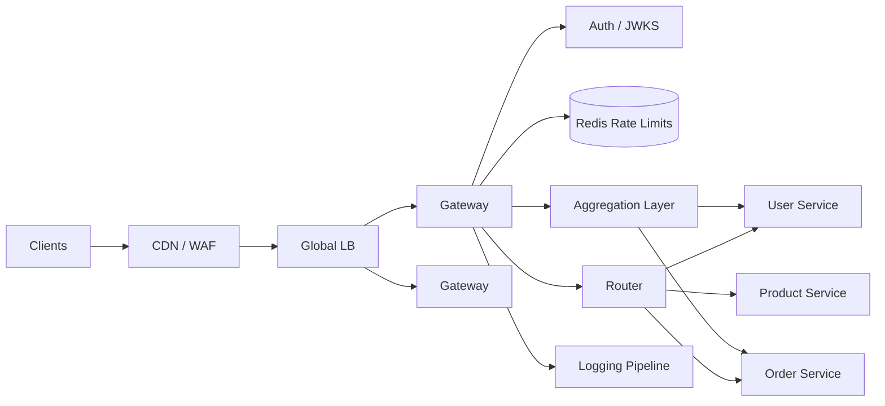

# Case Study 24 — API Gateway

Design an **API Gateway** in front of microservices: single entry point for clients with routing, authentication, rate limiting, and optional response aggregation.

## 1. Problem

Mobile and web clients should not call dozens of internal services directly. A gateway terminates TLS, validates identity, enforces quotas, routes to the correct backend, and can combine multiple backend calls into one client response.

## 2. Requirements

### Functional (MVP)

- Route requests by path/host to backend services  
- Authenticate requests (JWT validation)  
- Rate limit per user/API key/IP  
- Request/response logging and correlation IDs  
- Optional **aggregation**: one endpoint calls multiple services and merges JSON  
- Health-aware routing (skip unhealthy backends)  

### Out of scope (initially)

- Full GraphQL federation, WebSocket gateway for all products  
- WAF/DDoS at L7 (assume CDN/WAF upstream)  
- Developer portal and API key self-service UI  
- Complex transformation (XML ↔ JSON)  

### Non-functional

- Low added latency (< 10–20 ms P95 at gateway itself)  
- Stateless gateway instances — horizontal scale  
- Fail closed on auth failures  
- Rate limits accurate enough for abuse prevention (not perfect global sync required for MVP)  
- High availability — gateway is on every request path  

## 3. Back-of-the-envelope estimates

These numbers are **rough order-of-magnitude math** — not a capacity plan. In interviews, the goal is to show you know *what to count* and *which resource breaks first*. A useful shortcut: **1 QPS sustained ≈ 86,400 requests/day**. The gateway sits on **every request path** — **peak is often 2–5× average**, and a bad gateway takes down all services.

### Why we estimate

An API gateway is **pure infrastructure** — it adds latency to every call but offloads cross-cutting work (auth, rate limits, routing) from backends. Estimates tell us:

- How many **stateless gateway instances** we need  
- Whether **Redis** can hold rate-limit counters at our key cardinality  
- How much **log volume** we generate (often the hidden cost)

### Assumptions

| Assumption | Value | Why it matters |
|------------|-------|----------------|
| Aggregate traffic through gateway | 50K RPS | All client traffic enters here |
| Backend services | 10 | Routing table complexity |
| Gateway processing overhead | ~5 ms P95 | Must stay thin |
| Average backend latency | ~100 ms | Gateway is small fraction of total |
| Active API keys / users for rate limiting | 1M | Redis memory for counters |
| Log sampling rate | 1% of requests | Cost control |

### Step A — Traffic (QPS) with labeled arithmetic

**Total gateway throughput:**

```text
Aggregate RPS       = 50,000 requests/second (given peak design point)

Daily requests      = 50,000 × 86,400
                    ≈ 4.3 billion requests/day
```

This is already a **peak-ish** number in many designs; average might be 15–20K RPS with 50K at peak.

**Per-backend share (uniform rough split):**

```text
RPS per backend     = 50,000 ÷ 10 services
                    ≈ 5,000 RPS each (varies — one hot service may get 20K)
```

**Auth validation (JWT verify — every request):**

```text
JWT validations/s   = 50,000/s (same as ingress — no skip on authenticated routes)
CPU cost            ≈ 0.1–0.5 ms per verify — must use local JWKS cache
```

**Rate-limit checks:**

```text
Counter lookups/s   = 50,000 Redis GET/INCR operations/second
→ Redis cluster or local token bucket with async sync for MVP
```

### Step B — Storage

**Rate-limit state (Redis):**

```text
Active API keys     = 1M
Bytes per key state ≈ 100 B (token count, window expiry, metadata)

Redis memory        = 1M × 100 B ≈ 100 MB — trivial; even 10M keys ≈ 1 GB
```

**Routing config:**

```text
Routes              = ~200 path → backend mappings
Config size         ≈ 50 KB — loaded at startup, hot-reloaded from etcd/Consul
```

**Access logs (if stored 30 days):**

```text
Requests/day        ≈ 4.3B (at 50K RPS sustained — upper bound)
Log row size        ≈ 500 B (timestamp, path, status, latency, trace_id)

Full logs/day       = 4.3B × 500 B ≈ 2 TB/day — too expensive
Sampled 1%          ≈ 20 GB/day → ~600 GB/month to log pipeline (Elasticsearch/S3)
```

### Step C — Bandwidth and other resources

**Gateway instance capacity:**

```text
Each gateway node    ≈ 5,000–10,000 RPS (depends on TLS, JWT, aggregation)
Required instances   = 50,000 ÷ 5,000 = 10 instances
Add N+1 for HA       → 11–12 instances minimum
```

**Latency budget:**

```text
Client total budget  ≈ 200 ms (typical mobile API)
Gateway overhead     ≈ 5 ms (routing + auth + rate limit)
Backend              ≈ 100 ms
Network + client     ≈ 95 ms remaining
```

Gateway must stay **under 10–20 ms P95** — no heavy aggregation in hot path unless cached.

**Aggregation endpoints (optional):**

```text
One aggregated call  = 3 backend hops × 100 ms = 300 ms sequential (bad)
Parallel fan-out     = max(100 ms) + 5 ms gateway ≈ 105 ms (good)
Peak aggregated RPS  ≈ 5,000/s → 15,000 internal backend calls/s
```

### Step D — Read:write ratio table

| Operation | Type | QPS @ 50K ingress | Notes |
|-----------|------|-------------------|-------|
| Route + proxy request | Read (pass-through) | ~45,000 | Simple path → backend |
| JWT validation | Read (crypto) | ~50,000 | Cache JWKS keys |
| Rate-limit counter | Read/write | ~50,000 | Redis INCR |
| Aggregation (multi-backend) | Read | ~5,000 | Fan-out parallel |
| Config / route reload | Read | ~1/min | Not per-request |
| Access log emit | Write (async) | ~50,000 events | Sample 1% to storage |

**Ratio:** gateway is **~100% read/proxy** — it should almost never write business data.

### What the numbers tell us

- **~10–12 stateless gateway instances** at 50K RPS — scale horizontally behind a load balancer  
- **Keep gateway thin** — auth, route, rate limit, log; business logic stays in services  
- **Redis ~100 MB** for 1M rate-limit keys — use sliding window or token bucket per `(user_id, route)`  
- **Full logging at 50K RPS = ~2 TB/day** — sample, structured logs, ship to async pipeline  
- **JWT verify at 50K/s** — cache public keys; avoid introspection call per request  
- **Aggregation** multiplies backend load — cache merged responses where possible (e.g., home feed)

### Common mistake for this problem

Putting **business logic in the gateway** (discount calculation, DB queries) — adds latency and couples deployment. Another mistake: **synchronous global rate limit** with perfect accuracy — local counters + Redis sync is enough for MVP. Finally, sizing gateway for **average RPS** when **50K is already peak** — always leave headroom for 2× spikes.

## 4. High-Level Design (HLD)



### Components

| Component | Role |
|-----------|------|
| Gateway (Envoy/Kong/custom) | HTTP proxy + plugins/middleware chain |
| Router | Path → upstream service mapping |
| Auth middleware | JWT verify, scopes, API key lookup |
| Rate limiter | Token bucket / sliding window in Redis |
| Service registry | Consul/K8s DNS/upstream health |
| Aggregation layer | Parallel backend fan-out + merge |
| Logging pipeline | Access logs, trace IDs, metrics |

### Flows

**Simple proxied request**

1. Client `GET /api/v1/users/me` with `Authorization: Bearer <jwt>`  
2. Gateway assigns `X-Request-Id`  
3. Auth middleware validates JWT signature + expiry  
4. Rate limiter checks key `user:{sub}`  
5. Router forwards to User Service with internal headers  
6. Response streamed back; access log emitted  

**Aggregated request**

1. Client `GET /api/v1/dashboard`  
2. After auth, aggregation handler fans out:  
   - `GET user-service/profile`  
   - `GET order-service/recent?limit=5`  
   - `GET product-service/recommendations`  
3. Wait for all (or partial with timeout policy)  
4. Merge JSON `{ profile, orders, recommendations }`  
5. Return single response  

**Rate limit exceeded**

1. Limiter returns 429 with `Retry-After`  
2. Request never hits backend  

### Trade-offs

- **Central gateway vs sidecar per service** — central simpler for clients; sidecar better per-team isolation at scale  
- **Sync JWT verify vs introspection** — JWT local verify is fast; introspection handles instant revocation  
- **Global vs local rate limits** — Redis cluster ≈ global; per-node counters are faster but uneven  
- **Aggregation in gateway vs BFF service** — gateway OK for small merges; complex BFF deserves its own service  

## 5. Low-Level Design (LLD)

### Route configuration (declarative)

```text
routes:
  - match: { pathPrefix: "/api/v1/users" }
    upstream: user-service
    auth: jwt
    rateLimit: { key: userId, rpm: 600 }

  - match: { pathPrefix: "/api/v1/orders" }
    upstream: order-service
    auth: jwt
    rateLimit: { key: userId, rpm: 300 }

  - match: { path: "/api/v1/dashboard" }
    handler: aggregateDashboard
    auth: jwt
    rateLimit: { key: userId, rpm: 120 }
```

### APIs (client-facing)

```text
GET /api/v1/users/me
Authorization: Bearer <jwt>
→ proxied to user-service

GET /api/v1/orders?status=open
→ proxied to order-service

GET /api/v1/dashboard
→ 200 {
    "profile": { "name": "Ada", "tier": "pro" },
    "recentOrders": [...],
    "recommendations": [...]
  }

GET /health
→ 200 { "status": "ok" }
```

Internal headers added by gateway:

```text
X-Request-Id: req_abc123
X-User-Id: 42
X-User-Scopes: orders:read,users:read
X-Forwarded-For: <client-ip>
```

### Schema (API keys — optional)

```text
api_keys (
  id            BIGSERIAL PRIMARY KEY,
  key_hash      VARCHAR(64) UNIQUE NOT NULL,
  owner_id      BIGINT NOT NULL,
  tier          VARCHAR(32) NOT NULL,
  rpm_limit     INT NOT NULL,
  is_active     BOOLEAN DEFAULT TRUE,
  created_at    TIMESTAMPTZ NOT NULL
)

rate_limit_buckets (
  bucket_key    VARCHAR(128) PRIMARY KEY,  -- e.g. "user:42" or "ip:1.2.3.4"
  tokens        INT NOT NULL,
  last_refill   TIMESTAMPTZ NOT NULL
)
```

### Modules

```text
GatewayServer
MiddlewareChain
  - RequestIdMiddleware
  - LoggingMiddleware
  - AuthMiddleware
  - RateLimitMiddleware
  - RouterMiddleware
UpstreamClient
AggregateHandlers
  - DashboardHandler
RouteConfigLoader
HealthCheckPoller
MetricsExporter
```

### Algorithm — middleware chain

```text
function handle(request):
  ctx = newContext(request)
  for mw in middlewareChain:
    result = mw.process(ctx)
    if result.shortCircuit:
      return result.response   -- e.g. 401, 429
  upstreamResponse = router.forward(ctx)
  return upstreamResponse
```

### Algorithm — JWT auth (fail closed)

```text
function authMiddleware(ctx):
  token = parseBearer(ctx.headers.Authorization)
  if token is null:
    return shortCircuit(401, "missing token")

  try:
    claims = jwt.verify(token, jwksUrl, audience="api")
  catch Expired:
    return shortCircuit(401, "token expired")
  catch InvalidSignature:
    return shortCircuit(401, "invalid token")

  ctx.userId = claims.sub
  ctx.scopes = claims.scope.split(" ")
  return continue
```

### Algorithm — token bucket rate limit (Redis)

```text
function rateLimitMiddleware(ctx):
  key = "rl:user:" + ctx.userId
  limit = tierLimit(ctx.userId)      -- e.g. 600 requests/minute
  refillRate = limit / 60            -- tokens per second

  -- Lua script in Redis for atomicity
  allowed, remaining, retryAfter = redis.tokenBucket(
    key, capacity=limit, refillRate, cost=1
  )

  if not allowed:
    return shortCircuit(429, headers={ Retry-After: retryAfter })

  ctx.headers["X-RateLimit-Remaining"] = remaining
  return continue
```

### Algorithm — dashboard aggregation

```text
function aggregateDashboard(ctx):
  userId = ctx.userId
  timeout = 2 seconds

  results = parallelWithTimeout(timeout, [
    () => upstream.get("user-service", "/users/" + userId + "/profile"),
    () => upstream.get("order-service", "/orders/recent?userId=" + userId),
    () => upstream.get("product-service", "/recommendations?userId=" + userId)
  ])

  if results.profile.failed and results.orders.failed:
    return 503("critical upstream unavailable")

  return 200({
    profile: results.profile.value or null,
    recentOrders: results.orders.value or [],
    recommendations: results.recommendations.value or []
  })
```

### Concurrency & correctness

- Gateway instances are **stateless**; shared state only in Redis/JWKS cache  
- Circuit breaker per upstream avoids cascade failures  
- Aggregation uses bounded thread pool + per-upstream timeouts  
- Propagate same `X-Request-Id` to all backends for distributed tracing  

## 6. Scale evolution

| Stage | Change |
|-------|--------|
| MVP | Single region; NGINX/Envoy; Redis rate limits; static routes |
| Many services | Dynamic config from control plane; K8s service discovery |
| Global | Regional gateways; geo-routing; JWT keys cached locally |
| High security | mTLS gateway→service; OAuth2 introspection for sensitive routes |
| Heavy aggregation | Extract BFF services; gateway routes only |

## 7. Recap

- Gateway = **cross-cutting edge**: route, auth, limit, observe  
- **Fail closed** on bad/missing credentials  
- Rate limits in **Redis** with atomic token bucket  
- Keep aggregation **simple**; push complex orchestration to BFF  

**Practice:** redraw HLD from memory, then write middleware chain + token bucket pseudocode without looking.
