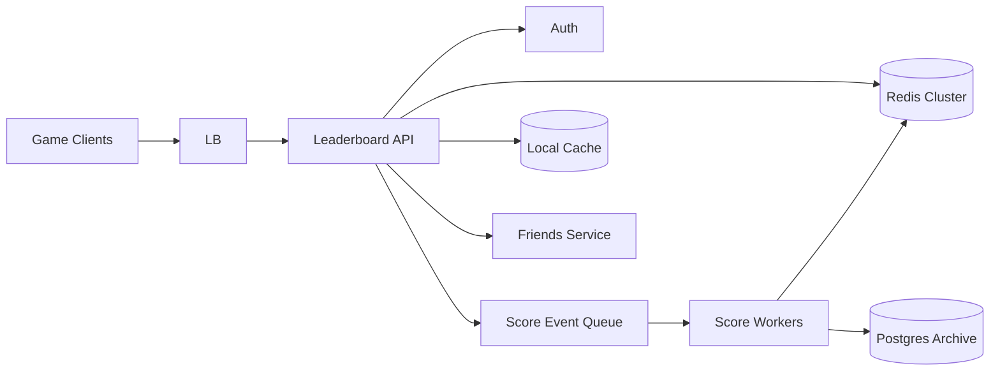

# Case Study 25 — Gaming Leaderboard

Design a **real-time gaming leaderboard**: players earn scores; ranks update quickly and can be queried globally, per game, or among friends.

## 1. Problem

After each game session, a player's score should reflect on leaderboards within seconds. Users expect to see their rank, top N players, and neighbors around their position without slow full-table scans.

## 2. Requirements

### Functional (MVP)

- Submit score after game ends  
- Global leaderboard per game (top N)  
- Get rank for a specific player  
- Get players around a user (“rank window”: ±5 neighbors)  
- Optional: weekly/monthly reset boards  
- Optional: friends-only leaderboard  

### Out of scope (initially)

- Anti-cheat ML, replay verification  
- Prize fulfillment, tournaments with brackets  
- Cross-game unified ranking  
- Historical rank graphs  

### Non-functional

- Rank reads low latency (< 50 ms P95)  
- Score updates high throughput (many concurrent games)  
- Approximate tie-breaking rules documented (same score → earlier timestamp wins)  
- Available during game peaks; degrade gracefully (slightly stale OK for non-critical views)  

## 3. Back-of-the-envelope

Assumptions:

- 5M DAU; 20 games/user/day  
- 10 leaderboard partitions (games/modes)  
- Read:write ≈ 50:1 for rank lookups vs score posts  

```text
Score writes/day ≈ 5M × 20 = 100M
Write QPS ≈ 100M / 86400 ≈ 1,160/s avg, peak ~10,000/s

Read QPS ≈ 50 × 1,160 ≈ 58,000/s avg, peak ~500,000/s

Redis sorted set memory (per board):
  1M players × ~40 B ≈ 40 MB per active board (score + member)
  10 boards ≈ 400 MB hot data — fits Redis cluster easily
```

Insight: **Redis sorted sets (ZSET)** give O(log N) rank updates and range queries — ideal for this workload.

## 4. High-Level Design (HLD)



### Components

| Component | Role |
|-----------|------|
| Leaderboard API | Submit scores, query ranks and top-N |
| Redis Cluster | Live ZSET per board; primary rank store |
| Score Event Queue | Buffer spikes; optional async path |
| Score Workers | Consume events, update Redis, archive to DB |
| Postgres | Historical scores, audits, cold storage |
| Friends Service | Resolve friend IDs for scoped boards |
| Local cache | Cache top-100 snapshots per board |

### Flows

**Submit score**

1. Game server POSTs `{ gameId, playerId, score }` with service token  
2. API validates score bounds (sanity check)  
3. Compute composite score for tie-break (see LLD)  
4. `ZADD` Redis key `lb:{gameId}`  
5. Optionally enqueue event for archive/analytics  
6. Return `{ newRank, bestScore }`  

**Get top 100**

1. Client GET `/leaderboards/:gameId/top?limit=100`  
2. Check local/Redis cache of snapshot (TTL 1–5 s)  
3. On miss: `ZREVRANGE lb:{gameId} 0 99 WITHSCORES`  
4. Hydrate player display names from profile cache  
5. Return ranked list  

**Get my rank + neighbors**

1. `ZREVRANK lb:{gameId} playerId` → rank (0-based)  
2. `ZREVRANGE lb:{gameId} rank-5 rank+5 WITHSCORES`  
3. Return window centered on player  

**Weekly reset**

1. Cron copies current ZSET to archive key `lb:{gameId}:2026-W29`  
2. Delete or rotate live key  
3. Publish “season ended” event  

### Trade-offs

- **Redis ZSET vs DB ORDER BY** — ZSET scales to millions with fast rank; SQL scans are too slow at peak  
- **Sync ZADD vs async queue** — sync gives instant rank for MVP; queue smooths spikes but adds lag  
- **Composite score encoding vs separate tie-break map** — composite in one ZSET score is simpler  
- **Exact friend board vs precomputed** — compute on read with friend ID filter for MVP; precompute if hot  

## 5. Low-Level Design (LLD)

### APIs

```text
POST /api/v1/leaderboards/:gameId/scores
Headers: Authorization: Bearer <service-or-user-jwt>
Body: { "playerId": "p_123", "score": 9840, "matchId": "m_456" }
→ 200 {
    "playerId": "p_123",
    "score": 9840,
    "rank": 42,
    "previousBest": 9100
  }

GET /api/v1/leaderboards/:gameId/top?limit=100
→ {
    "entries": [
      { "rank": 1, "playerId": "p_1", "displayName": "Neo", "score": 12000 },
      ...
    ]
  }

GET /api/v1/leaderboards/:gameId/players/:playerId/rank?window=5
→ {
    "rank": 42,
    "score": 9840,
    "window": [
      { "rank": 37, "playerId": "...", "score": 9900 },
      ...
    ]
  }

GET /api/v1/leaderboards/:gameId/friends/top?limit=50
→ { "entries": [...] }   -- only friend IDs
```

### Schema

Redis (primary):

```text
Key: lb:{gameId}                    -- ZSET member=playerId, score=composite
Key: lb:{gameId}:meta               -- HASH lastReset, seasonId
Key: profile:{playerId}             -- cached displayName (optional)
```

Postgres (archive / audit):

```text
score_events (
  id            BIGSERIAL PRIMARY KEY,
  game_id       VARCHAR(64) NOT NULL,
  player_id     VARCHAR(64) NOT NULL,
  raw_score     INT NOT NULL,
  match_id      VARCHAR(64) NOT NULL,
  created_at    TIMESTAMPTZ NOT NULL
)

leaderboard_snapshots (
  id            BIGSERIAL PRIMARY KEY,
  game_id       VARCHAR(64) NOT NULL,
  season_id     VARCHAR(32) NOT NULL,
  snapshot_ref  VARCHAR(512) NOT NULL,  -- S3 or JSON blob
  created_at    TIMESTAMPTZ NOT NULL
)

player_best (
  game_id       VARCHAR(64),
  player_id     VARCHAR(64),
  best_score    INT NOT NULL,
  updated_at    TIMESTAMPTZ NOT NULL,
  PRIMARY KEY (game_id, player_id)
)
```

### Modules

```text
LeaderboardController
ScoreService
RankQueryService
CompositeScoreEncoder
RedisLeaderboardStore
ScoreEventProducer
SnapshotJob
FriendsClient
TopNCache
```

### Algorithm — composite score (tie-break)

Store integer in Redis ZSET such that **higher raw score wins**; ties broken by **earlier achievement ranks higher** (lower timestamp → higher composite).

```text
MAX_RAW = 1_000_000_000
MAX_TIME = 4_102_444_800  -- unix seconds far future anchor

function encodeComposite(rawScore, achievedAtUnix):
  -- invert time so older timestamps produce larger composite tail
  timeComponent = MAX_TIME - achievedAtUnix
  return rawScore * MAX_TIME + timeComponent

function decodeRaw(composite):
  return floor(composite / MAX_TIME)
```

Only **increase** a player's best score (typical game rule):

```text
function submitScore(gameId, playerId, rawScore, achievedAt):
  key = "lb:" + gameId
  composite = encodeComposite(rawScore, achievedAt)

  currentComposite = redis.zscore(key, playerId)
  if currentComposite is not null:
    if rawScore <= decodeRaw(currentComposite):
      rank = redis.zrevrank(key, playerId)
      return { rank: rank + 1, bestScore: decodeRaw(currentComposite), improved: false }

  redis.zadd(key, composite, playerId)
  rank = redis.zrevrank(key, playerId)

  scoreEvents.archive({ gameId, playerId, rawScore, achievedAt })
  topNCache.invalidate(gameId)

  return { rank: rank + 1, bestScore: rawScore, improved: true }
```

### Algorithm — top N with cache

```text
function getTop(gameId, limit):
  cacheKey = "top:" + gameId + ":" + limit
  cached = topNCache.get(cacheKey)
  if cached: return cached

  rows = redis.zrevrange("lb:" + gameId, 0, limit - 1, withScores=true)
  entries = []
  for i, (playerId, composite) in enumerate(rows):
    entries.append({
      rank: i + 1,
      playerId,
      score: decodeRaw(composite),
      displayName: profileCache.getName(playerId)
    })

  topNCache.set(cacheKey, entries, ttl=2 seconds)
  return entries
```

### Algorithm — rank window

```text
function getRankWindow(gameId, playerId, windowSize):
  key = "lb:" + gameId
  rank0 = redis.zrevrank(key, playerId)
  if rank0 is null: return 404

  start = max(0, rank0 - windowSize)
  end = rank0 + windowSize
  rows = redis.zrevrange(key, start, end, withScores=true)

  return {
    rank: rank0 + 1,
    score: decodeRaw(redis.zscore(key, playerId)),
    window: buildEntries(rows, startRank=start + 1)
  }
```

### Algorithm — friends leaderboard (MVP)

```text
function getFriendsTop(gameId, userId, limit):
  friendIds = friendsClient.listFriendIds(userId)
  friendIds.append(userId)

  pipe = redis.pipeline()
  for fid in friendIds:
    pipe.zscore("lb:" + gameId, fid)
  scores = pipe.execute()

  entries = sortByScoreDesc(friendIds, scores).take(limit)
  return hydrateNames(entries)
```

For large friend lists, use `ZMSCORE` (Redis 6.2+) in one round trip.

### Concurrency & correctness

- `ZADD` is atomic per member — concurrent submits last-write-wins on composite; use “only if better” logic above  
- Rank is **dynamic** — always computed from ZSET, never stored separately  
- Weekly reset must be atomic: `RENAME` live key → archive, then create fresh key  
- Service-to-service auth on score POST prevents client tampering  

## 6. Scale evolution

| Stage | Change |
|-------|--------|
| MVP | Single Redis primary; sync ZADD; top-100 cache |
| Peak writes | Async queue + worker batch ZADD; coalesce multiple updates/player |
| Huge boards | Redis Cluster hash-tag `{gameId}`; shard by game |
| Global | Regional boards + optional global merge job (not real-time) |
| Anti-cheat | Validate scores in game server; anomaly detection async |

## 7. Recap

- **Redis ZSET** is the core — O(log N) updates and rank queries  
- Encode **tie-break into composite score** to keep one sorted structure  
- Cache **top-N snapshots**; personalize rank windows with `ZREVRANK` + range  
- Archive to Postgres for history; Redis stays lean and fast  

**Practice:** redraw HLD from memory, then write `submitScore` + composite encoding without looking.
