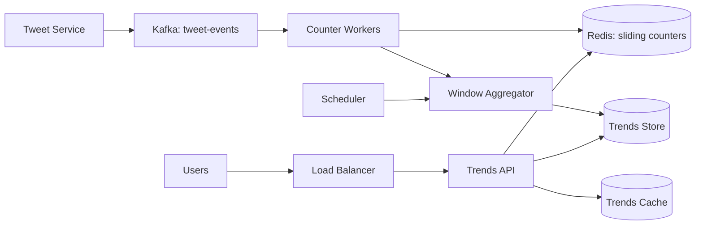

# Case Study 26 — Trending Topics (Hashtags)

Design a service like **Twitter/X Trending**: show the top hashtags in a region over a sliding time window (e.g., last 15 minutes).

## 1. Problem

When users post tweets with hashtags, the platform must **count mentions in real time** and surface the **top K trending tags** per region (country, city, or global).

Users expect trends to update every few minutes and reflect sudden spikes (breaking news, viral memes).

## 2. Requirements

### Functional (MVP)

- Ingest tweet events containing one or more hashtags  
- Aggregate counts per hashtag per region per time window  
- Return top K trending hashtags for a region (e.g., K = 10)  
- Support multiple window sizes (15 min, 1 hour, 24 hours)  
- Filter spam / banned hashtags  

### Out of scope (initially)

- Personalized trends per user  
- Sentiment analysis or topic clustering (e.g., grouping `#covid` and `#coronavirus`)  
- Trend explanations ("Why is this trending?")  

### Non-functional

- Near real-time updates (trends refresh every 1–5 minutes)  
- High write throughput (millions of tweets/day)  
- Low latency reads for the trends page (< 200 ms)  
- Approximate counts are acceptable; exact counts not required  
- Graceful degradation during traffic spikes  

## 3. Back-of-the-envelope estimates

These numbers are **rough order-of-magnitude math** — not a capacity plan. In interviews, the goal is to show you know *what to count* and *which resource breaks first*. A useful shortcut: **1 QPS sustained ≈ 86,400 requests/day**. Trending spikes during breaking news can hit **5–10× average** for minutes in one region.

### Why we estimate

Trending hashtags sit between **firehose ingestion** (millions of tweets) and **cheap reads** (top-10 list per region). Estimates tell us:

- Whether we can count in memory or need streaming aggregation  
- Why we **precompute top-K** instead of sorting all hashtags on every read  
- How many **unique tags per window** fit in RAM per region

### Assumptions

| Assumption | Value | Why it matters |
|------------|-------|----------------|
| Tweets per day | 500M | Ingestion volume |
| Hashtags per tweet (avg) | 1.5 | Counter increments per tweet |
| Regions (countries + cities) | 50 | Partition trending by geo |
| Top K displayed | 10 | Output size per region |
| Window sizes | 15 min, 1 hr, 24 hr | Multiple counter maps |
| Trend page refreshes | 10K QPS peak | Read path |

### Step A — Traffic (QPS) with labeled arithmetic

**Hashtag counter increments (writes to aggregation layer):**

```text
Hashtag events/day  = 500M tweets × 1.5 hashtags/tweet
                    = 750M counter increments/day

Write QPS (avg)     = 750M ÷ 86,400
                    ≈ 8,700 increments/second

Peak write QPS (3× viral event) ≈ 8,700 × 3
                                ≈ 26,000 increments/second
```

Each tweet may bump 1–3 hashtag counters in 1–2 regions (user geo + global).

**Trending page reads:**

```text
Assume 200M trend page views/day across all regions
Read QPS (avg)        = 200M ÷ 86,400 ≈ 2,300 reads/second
Peak (5×)             ≈ 11,500 reads/second
Design for            ≈ 10K QPS peak (given assumption)
```

Reads must be **< 200 ms** — serve precomputed top-10 from cache.

**Per-region write share:**

```text
Global + 50 regions — not every tweet hits every region
Effective counters per tweet ≈ 1.2 region updates avg
Regional write QPS (peak)  ≈ 26,000 × (1.2/51) ≈ 600/s per hot region
US region might get 30% alone → ~8,000/s during viral US news
```

### Step B — Storage

**In-memory counters (15-minute sliding window, per region):**

```text
Unique hashtags in 15-min window (per region) ≈ 100K active tags
Bytes per entry     ≈ 28 B (tag string ~20 B + count 8 B)

Memory per region   = 100K × 28 B ≈ 2.8 MB
50 regions          ≈ 140 MB for 15-min window

Three window sizes (15m, 1h, 24h):
  24h window may hold ~2M unique tags/region → ~56 MB/region → ~2.8 GB total — still RAM-friendly
```

**Historical trend snapshots (optional):**

```text
Snapshots every 5 min × 50 regions × 10 tags × 100 B
Per day ≈ 288 × 50 × 1 KB ≈ 14 MB/day — store in Postgres or S3 for “trends over time”
```

**Tweet stream (Kafka — not long-term storage for counters):**

```text
750M events/day × 200 B event ≈ 150 GB/day through Kafka
Retention 24–48 hr → ~150–300 GB Kafka disk
```

### Step C — Bandwidth and other resources

**Trend API response (read path):**

```text
Top-10 payload       ≈ 10 tags × 50 B (tag + count + rank) ≈ 500 B
Peak read QPS        ≈ 10,000/s

Egress               = 10,000 × 500 B ≈ 5 MB/s — trivial if precomputed
```

**Ingestion from tweet service:**

```text
Tweet events peak    ≈ 26,000 hashtag updates/s (same as counter writes)
Event size           ≈ 200 B (tweet_id, hashtags[], region, timestamp)

Kafka ingest         ≈ 26,000 × 200 B ≈ 5.2 MB/s — modest
```

**Top-K maintenance (avoid full sort):**

```text
Don't sort 100K tags on every read
Use min-heap of size K per region — update O(log K) per increment
Or batch recompute top-10 every 30–60 seconds in background worker
```

### Step D — Read:write ratio table

| Operation | Type | Avg QPS | Peak QPS | Notes |
|-----------|------|---------|----------|-------|
| Ingest tweet → increment counters | Write | ~8,700 | ~26,000 | Stream processing |
| Fetch top-K trends (region) | Read | ~2,300 | ~10,000 | **Precomputed cache** |
| Ban/spam filter check | Read | ~8,700 | ~26,000 | Bloom filter or blocklist |
| Publish snapshot (worker) | Write | ~17/s | ~17/s | 50 regions / 3 windows every 60 s |
| Admin override / block tag | Write | ~0.01 | ~1 | Rare |

**Ratio:** counter **writes ~3× trend reads** on average — but reads must be instant; writes can lag 30–60 s.

### What the numbers tell us

- **~26K counter increments/s peak** → Kafka + stream processors (Flink/Storm/custom), not synchronous DB increments  
- **~140 MB RAM** for 15-min counters across 50 regions — in-memory aggregation works  
- **Precompute top-10 every 30–60 s** — reads hit Redis/ CDN cache, never sort 100K tags live  
- **Multiple windows (15m/1h/24h)** — separate counter maps or time-bucketed keys with TTL  
- **Spam/banned hashtags** — filter at ingest; one viral bot tag shouldn’t pollute trends  
- **Regional partitioning** — US breaking news doesn’t require recomputing Iceland’s trends

### Common mistake for this problem

Running **`SELECT hashtag, COUNT(*) GROUP BY hashtag ORDER BY count`** on a SQL database for every trend refresh. At 750M events/day, that’s impossible. Another mistake: **exact counts** — approximate streaming counts (HyperLogLog or lossy counters) are fine for display. Finally, **global sort of all hashtags** on every tweet — use incremental top-K heaps per region.

## 4. High-Level Design (HLD)



### Components

| Component | Role |
|-----------|------|
| Kafka | Durable stream of tweet-created events |
| Counter Workers | Parse hashtags, increment per-region counters |
| Redis | Fast sliding-window counters (sorted sets or time-bucketed keys) |
| Window Aggregator | Periodically roll up buckets, compute top-K, write snapshot |
| Trends Store | Persisted top-K snapshots per region/window |
| Trends Cache | Serve precomputed lists (CDN-friendly) |
| Trends API | `GET /trends?region=US&window=15m` |

### Flows

**Ingest**

1. Tweet service publishes `{ tweetId, region, hashtags[], timestamp }`  
2. Counter worker normalizes hashtags (lowercase, strip `#`)  
3. Increment counters in Redis using time buckets (e.g., 1-minute buckets for 15-min window)  
4. Optionally filter banned/spam tags before counting  

**Compute top-K (every 1–5 min)**

1. Scheduler triggers aggregator per region  
2. Sum last N minute-buckets → score per hashtag  
3. Run top-K selection (min-heap of size K or approximate Heavy Hitters)  
4. Write snapshot to Trends Store + invalidate Trends Cache  

**Read**

1. Client requests trends for region  
2. API returns cached snapshot (stale up to refresh interval is OK)  
3. On cache miss, read from Trends Store  

### Trade-offs

- **Exact counts vs approximate** — Count-Min Sketch or Heavy Hitters save memory; exact Redis counters are simpler for MVP  
- **Push vs pull compute** — Precompute top-K on a schedule (pull) vs update on every tweet (push); precompute scales better for reads  
- **Global vs regional** — Separate counter namespaces per region avoid cross-shard joins  

## 5. Low-Level Design (LLD)

### APIs

```text
GET /api/v1/trends?region=US&window=15m&limit=10
→ {
     "region": "US",
     "window": "15m",
     "updatedAt": "2026-07-20T12:05:00Z",
     "trends": [
       { "hashtag": "worldcup", "score": 18420, "rank": 1 },
       { "hashtag": "ai",       "score": 9210,  "rank": 2 }
     ]
   }

POST /internal/v1/events/tweet-created   (internal only)
Body: {
  "tweetId": "t_123",
  "region": "US",
  "hashtags": ["WorldCup", "USA"],
  "createdAt": "2026-07-20T12:04:31Z"
}
→ 202 Accepted

GET /api/v1/trends/:hashtag?region=US&window=15m
→ { "hashtag": "worldcup", "score": 18420, "rank": 1 }
```

### Schema

```text
-- Precomputed snapshots (source for reads)
trend_snapshots (
  id           BIGSERIAL PRIMARY KEY,
  region       VARCHAR(8) NOT NULL,
  window_name  VARCHAR(16) NOT NULL,   -- '15m', '1h', '24h'
  computed_at  TIMESTAMPTZ NOT NULL,
  payload      JSONB NOT NULL          -- ordered list of {hashtag, score, rank}
)
CREATE INDEX idx_snapshots_region_window_time
  ON trend_snapshots (region, window_name, computed_at DESC);

-- Optional: historical archive for analytics
trend_history (
  region       VARCHAR(8),
  window_name  VARCHAR(16),
  hashtag      VARCHAR(256),
  score        BIGINT,
  bucket_start TIMESTAMPTZ,
  PRIMARY KEY (region, window_name, hashtag, bucket_start)
);

banned_hashtags (
  hashtag     VARCHAR(256) PRIMARY KEY,
  reason      TEXT,
  banned_at   TIMESTAMPTZ NOT NULL
)
```

Redis key patterns:

```text
cnt:{region}:{minute_epoch}:{hashtag}  → INCR (expires after window + buffer)
trends:{region}:15m                   → cached JSON snapshot (TTL 60s)
```

### Modules

```text
TrendsController
TrendsReadService
TweetEventConsumer
HashtagNormalizer
SlidingWindowCounter
TopKAggregator
TrendSnapshotRepository
BannedHashtagFilter
```

### Algorithm — sliding window with minute buckets

Divide the 15-minute window into 15 one-minute buckets. Each tweet increments the bucket for its event minute.

```text
function incrementHashtag(region, hashtag, eventTime):
  tag = normalize(hashtag)                    // lowercase, unicode normalize
  if bannedTags.contains(tag): return
  minute = floorToMinute(eventTime)
  key = "cnt:" + region + ":" + minute + ":" + tag
  redis.incr(key)
  redis.expire(key, 20 minutes)               // window + safety margin

function scoreInWindow(region, hashtag, now, windowMinutes=15):
  total = 0
  for m in last N minute keys:
    total += redis.get("cnt:" + region + ":" + m + ":" + hashtag) ?? 0
  return total
```

### Algorithm — top-K with min-heap

For each region, scan active hashtags in the window (from Redis key scan or a secondary "active set") and keep only top K.

```text
function computeTopK(region, windowMinutes, K):
  candidates = getActiveHashtags(region, windowMinutes)  // from Redis SCAN or HyperLogLog set
  heap = MinHeap(size=K)                                 // stores (score, hashtag)

  for tag in candidates:
    score = scoreInWindow(region, tag, now(), windowMinutes)
    if score == 0: continue
    if heap.size < K:
      heap.push((score, tag))
    else if score > heap.peek().score:
      heap.pop()
      heap.push((score, tag))

  return heap.sortedDescending()
```

**Optimization:** Use **Space-Saving** or **Count-Min Sketch + min-heap** when candidate set is huge (millions of tags) — tracks heavy hitters in O(1) memory per stream.

### Algorithm — velocity / spike detection (optional)

Trending is not just high count — it's **acceleration**:

```text
velocity(tag) = count(last 5 min) / max(count(previous 5 min), 1)
finalScore = count × log(1 + velocity)
```

This surfaces sudden spikes even if absolute count is lower than evergreens.

### Concurrency & correctness

- Counters are **eventually consistent** — acceptable for trends  
- Idempotent consumer: dedupe by `tweetId` in Kafka (at-least-once → safe INCR if processed once)  
- Snapshot writes are monotonic: only publish if `computed_at` is newer  
- Banned hashtag list cached locally with short TTL  

## 6. Scale evolution

| Stage | Change |
|-------|--------|
| MVP | Single Redis + Postgres snapshots; one aggregator cron |
| Write spike | Partition Kafka by region; scale counter workers horizontally |
| Huge hashtag cardinality | Count-Min Sketch per region; Space-Saving for top-K |
| Global scale | Shard Redis by `hash(region)`; regional aggregators |
| Sub-minute freshness | Stream processing (Flink) with tumbling windows instead of cron |
| Personalization | Separate ranking layer using user interests (out of MVP scope) |

## 7. Recap

- Trends = **high write, low read freshness** — precompute top-K on a schedule  
- Use **time buckets** for sliding windows instead of storing every event  
- **Top-K** via min-heap; approximate algorithms when cardinality explodes  
- Reads serve **snapshots from cache** — don't compute rankings on the hot path  

**Practice:** redraw the HLD from memory, then write pseudocode for `incrementHashtag` and `computeTopK` without looking.
