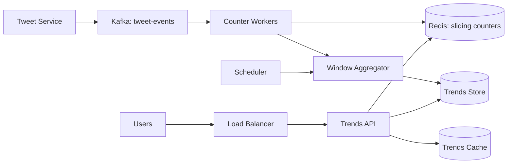

# Case Study 26 — Trending Topics (Hashtags)

Design a service like **Twitter/X Trending**: show the top hashtags in a region over a sliding time window (e.g., last 15 minutes).

## 1. Problem

When users post tweets with hashtags, the platform must **count mentions in real time** and surface the **top K trending tags** per region (country, city, or global).

Users expect trends to update every few minutes and reflect sudden spikes (breaking news, viral memes).

## 2. Requirements

### Functional (MVP)

- Ingest tweet events containing one or more hashtags  
- Aggregate counts per hashtag per region per time window  
- Return top K trending hashtags for a region (e.g., K = 10)  
- Support multiple window sizes (15 min, 1 hour, 24 hours)  
- Filter spam / banned hashtags  

### Out of scope (initially)

- Personalized trends per user  
- Sentiment analysis or topic clustering (e.g., grouping `#covid` and `#coronavirus`)  
- Trend explanations ("Why is this trending?")  

### Non-functional

- Near real-time updates (trends refresh every 1–5 minutes)  
- High write throughput (millions of tweets/day)  
- Low latency reads for the trends page (< 200 ms)  
- Approximate counts are acceptable; exact counts not required  
- Graceful degradation during traffic spikes  

## 3. Back-of-the-envelope

Assumptions:

- 500M tweets/day globally  
- Average 1.5 hashtags per tweet  
- 50 regions (countries + major cities)  
- Top K = 10 per region  

```text
Hashtag events/day ≈ 500M × 1.5 ≈ 750M
Write QPS ≈ 750M / 86400 ≈ 8,700/s avg, peak ~30,000/s

Unique hashtags in 15-min window (per region): ~50K–200K active
Trend reads: ~10K QPS (many users refresh trends page)

Memory per region (15-min counter map):
  ~100K hashtags × (tag ~20B + count 8B) ≈ 3 MB → 50 regions ≈ 150 MB (hot set)
```

Insight: **don't sort the entire hashtag universe on every read** — maintain top-K incrementally and precompute results.

## 4. High-Level Design (HLD)



### Components

| Component | Role |
|-----------|------|
| Kafka | Durable stream of tweet-created events |
| Counter Workers | Parse hashtags, increment per-region counters |
| Redis | Fast sliding-window counters (sorted sets or time-bucketed keys) |
| Window Aggregator | Periodically roll up buckets, compute top-K, write snapshot |
| Trends Store | Persisted top-K snapshots per region/window |
| Trends Cache | Serve precomputed lists (CDN-friendly) |
| Trends API | `GET /trends?region=US&window=15m` |

### Flows

**Ingest**

1. Tweet service publishes `{ tweetId, region, hashtags[], timestamp }`  
2. Counter worker normalizes hashtags (lowercase, strip `#`)  
3. Increment counters in Redis using time buckets (e.g., 1-minute buckets for 15-min window)  
4. Optionally filter banned/spam tags before counting  

**Compute top-K (every 1–5 min)**

1. Scheduler triggers aggregator per region  
2. Sum last N minute-buckets → score per hashtag  
3. Run top-K selection (min-heap of size K or approximate Heavy Hitters)  
4. Write snapshot to Trends Store + invalidate Trends Cache  

**Read**

1. Client requests trends for region  
2. API returns cached snapshot (stale up to refresh interval is OK)  
3. On cache miss, read from Trends Store  

### Trade-offs

- **Exact counts vs approximate** — Count-Min Sketch or Heavy Hitters save memory; exact Redis counters are simpler for MVP  
- **Push vs pull compute** — Precompute top-K on a schedule (pull) vs update on every tweet (push); precompute scales better for reads  
- **Global vs regional** — Separate counter namespaces per region avoid cross-shard joins  

## 5. Low-Level Design (LLD)

### APIs

```text
GET /api/v1/trends?region=US&window=15m&limit=10
→ {
     "region": "US",
     "window": "15m",
     "updatedAt": "2026-07-20T12:05:00Z",
     "trends": [
       { "hashtag": "worldcup", "score": 18420, "rank": 1 },
       { "hashtag": "ai",       "score": 9210,  "rank": 2 }
     ]
   }

POST /internal/v1/events/tweet-created   (internal only)
Body: {
  "tweetId": "t_123",
  "region": "US",
  "hashtags": ["WorldCup", "USA"],
  "createdAt": "2026-07-20T12:04:31Z"
}
→ 202 Accepted

GET /api/v1/trends/:hashtag?region=US&window=15m
→ { "hashtag": "worldcup", "score": 18420, "rank": 1 }
```

### Schema

```text
-- Precomputed snapshots (source for reads)
trend_snapshots (
  id           BIGSERIAL PRIMARY KEY,
  region       VARCHAR(8) NOT NULL,
  window_name  VARCHAR(16) NOT NULL,   -- '15m', '1h', '24h'
  computed_at  TIMESTAMPTZ NOT NULL,
  payload      JSONB NOT NULL          -- ordered list of {hashtag, score, rank}
)
CREATE INDEX idx_snapshots_region_window_time
  ON trend_snapshots (region, window_name, computed_at DESC);

-- Optional: historical archive for analytics
trend_history (
  region       VARCHAR(8),
  window_name  VARCHAR(16),
  hashtag      VARCHAR(256),
  score        BIGINT,
  bucket_start TIMESTAMPTZ,
  PRIMARY KEY (region, window_name, hashtag, bucket_start)
);

banned_hashtags (
  hashtag     VARCHAR(256) PRIMARY KEY,
  reason      TEXT,
  banned_at   TIMESTAMPTZ NOT NULL
)
```

Redis key patterns:

```text
cnt:{region}:{minute_epoch}:{hashtag}  → INCR (expires after window + buffer)
trends:{region}:15m                   → cached JSON snapshot (TTL 60s)
```

### Modules

```text
TrendsController
TrendsReadService
TweetEventConsumer
HashtagNormalizer
SlidingWindowCounter
TopKAggregator
TrendSnapshotRepository
BannedHashtagFilter
```

### Algorithm — sliding window with minute buckets

Divide the 15-minute window into 15 one-minute buckets. Each tweet increments the bucket for its event minute.

```text
function incrementHashtag(region, hashtag, eventTime):
  tag = normalize(hashtag)                    // lowercase, unicode normalize
  if bannedTags.contains(tag): return
  minute = floorToMinute(eventTime)
  key = "cnt:" + region + ":" + minute + ":" + tag
  redis.incr(key)
  redis.expire(key, 20 minutes)               // window + safety margin

function scoreInWindow(region, hashtag, now, windowMinutes=15):
  total = 0
  for m in last N minute keys:
    total += redis.get("cnt:" + region + ":" + m + ":" + hashtag) ?? 0
  return total
```

### Algorithm — top-K with min-heap

For each region, scan active hashtags in the window (from Redis key scan or a secondary "active set") and keep only top K.

```text
function computeTopK(region, windowMinutes, K):
  candidates = getActiveHashtags(region, windowMinutes)  // from Redis SCAN or HyperLogLog set
  heap = MinHeap(size=K)                                 // stores (score, hashtag)

  for tag in candidates:
    score = scoreInWindow(region, tag, now(), windowMinutes)
    if score == 0: continue
    if heap.size < K:
      heap.push((score, tag))
    else if score > heap.peek().score:
      heap.pop()
      heap.push((score, tag))

  return heap.sortedDescending()
```

**Optimization:** Use **Space-Saving** or **Count-Min Sketch + min-heap** when candidate set is huge (millions of tags) — tracks heavy hitters in O(1) memory per stream.

### Algorithm — velocity / spike detection (optional)

Trending is not just high count — it's **acceleration**:

```text
velocity(tag) = count(last 5 min) / max(count(previous 5 min), 1)
finalScore = count × log(1 + velocity)
```

This surfaces sudden spikes even if absolute count is lower than evergreens.

### Concurrency & correctness

- Counters are **eventually consistent** — acceptable for trends  
- Idempotent consumer: dedupe by `tweetId` in Kafka (at-least-once → safe INCR if processed once)  
- Snapshot writes are monotonic: only publish if `computed_at` is newer  
- Banned hashtag list cached locally with short TTL  

## 6. Scale evolution

| Stage | Change |
|-------|--------|
| MVP | Single Redis + Postgres snapshots; one aggregator cron |
| Write spike | Partition Kafka by region; scale counter workers horizontally |
| Huge hashtag cardinality | Count-Min Sketch per region; Space-Saving for top-K |
| Global scale | Shard Redis by `hash(region)`; regional aggregators |
| Sub-minute freshness | Stream processing (Flink) with tumbling windows instead of cron |
| Personalization | Separate ranking layer using user interests (out of MVP scope) |

## 7. Recap

- Trends = **high write, low read freshness** — precompute top-K on a schedule  
- Use **time buckets** for sliding windows instead of storing every event  
- **Top-K** via min-heap; approximate algorithms when cardinality explodes  
- Reads serve **snapshots from cache** — don't compute rankings on the hot path  

**Practice:** redraw the HLD from memory, then write pseudocode for `incrementHashtag` and `computeTopK` without looking.
