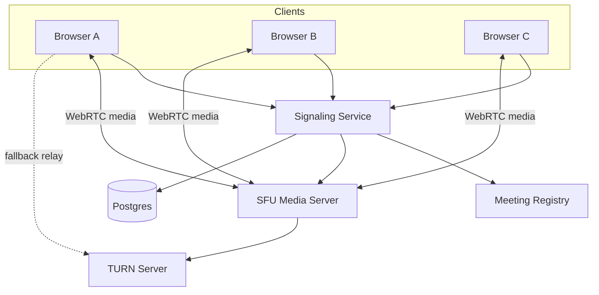
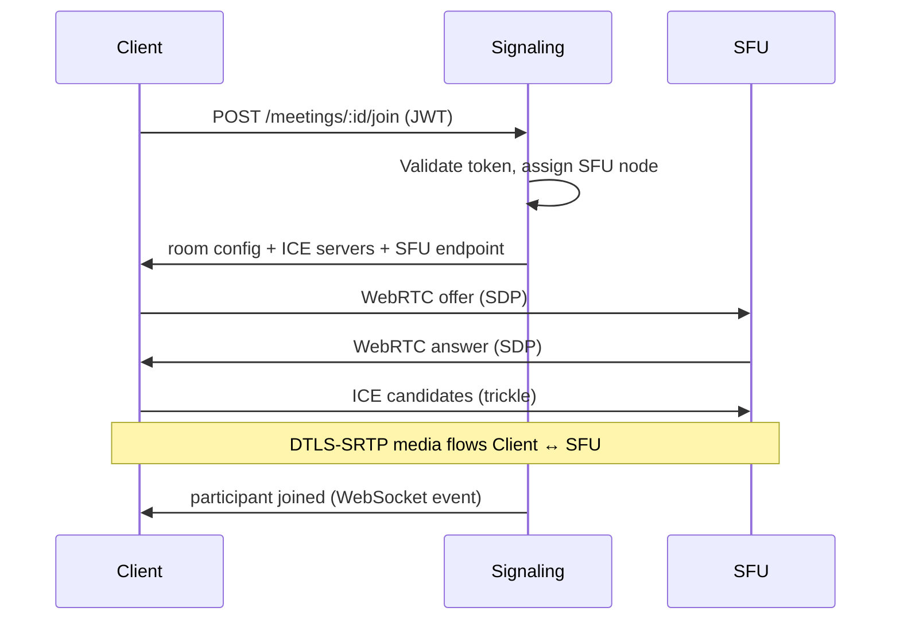

# Case Study 27 — Video Conferencing

Design a service like **Zoom**: multi-party video calls with screen sharing, mute/unmute, and stable quality on typical home networks.

## 1. Problem

Users join a virtual **meeting room** from browsers or mobile apps. Each participant sends audio/video to others with acceptable latency (< 300 ms one-way ideally) and without melting the server or the client's CPU.

Direct peer-to-peer works for 2 people but breaks down at 5+ participants — you need a **Selective Forwarding Unit (SFU)** architecture.

## 2. Requirements

### Functional (MVP)

- Create / join meeting by ID or link  
- Multi-party video and audio (up to ~50 participants per room)  
- Mute/unmute audio, enable/disable camera  
- Screen sharing (one active sharer at a time)  
- Participant list and host controls (mute all, remove participant)  
- Chat messages in-meeting (optional MVP+)  

### Out of scope (initially)

- End-to-end encryption with server-blind routing (complex key management)  
- Live transcription and AI summaries  
- Recording to cloud storage  
- Webinar mode (1-to-many broadcast with RTMP)  

### Non-functional

- Low latency media path (< 300 ms)  
- Adaptive bitrate — degrade gracefully on bad Wi-Fi  
- High availability for signaling; media servers regional  
- Scale horizontally by meeting room  
- Privacy: only invited users join (tokens, waiting room)  

## 3. Back-of-the-envelope estimates

These numbers are **rough order-of-magnitude math** — not a capacity plan. In interviews, the goal is to show you know *what to count* and *which resource breaks first*. **1 QPS ≈ 86,400 events/day** applies to signaling; media is measured in **Mbps per participant**, not requests alone. Peak hours (workday mornings) often **2–3× average** concurrent meetings.

### Why we estimate

Video conferencing has two paths:

- **Signaling** (join, ICE, mute) — low QPS, must be reliable  
- **Media** (audio/video bytes) — enormous bandwidth; dominates cost  

Estimates prove why **SFU (Selective Forwarding Unit)** beats MCU mixing and why P2P fails beyond ~4 participants.

### Assumptions

| Assumption | Value | Why it matters |
|------------|-------|----------------|
| Concurrent meetings at peak | 100K | Horizontal scale unit = room |
| Average participants per meeting | 8 | SFU fan-out multiplier |
| Video quality | 720p | ~1.5 Mbps uplink per active sender |
| Audio bitrate | ~50 Kbps | Always-on alongside video |
| SFU selective forward | ~2 Mbps down per participant | Simulcast — not full N×N mesh |
| Signaling events per join | ~10 (SDP, ICE candidates) | WebSocket load |

### Step A — Traffic (QPS) with labeled arithmetic

**Concurrent participants:**

```text
Participants peak   = 100K meetings × 8 participants/meeting
                    = 800,000 concurrent users
```

**Meeting join/leave (signaling writes):**

```text
Assume average meeting duration 30 min
Meetings started per hour ≈ 100K (steady state at peak concurrency)

Join events per hour    ≈ 800K participants joining (rough turnover)
Join QPS (avg)          ≈ 800,000 ÷ 3,600
                        ≈ 220 joins/second

With ICE renegotiations (10× per session):
Signaling QPS (peak)    ≈ 2,000–5,000 messages/second — WebSocket cluster, not the bottleneck
```

**In-meeting control (mute, camera toggle):**

```text
Assume 2 control events/user/minute
Control QPS           = 800K × 2 ÷ 60
                      ≈ 27,000 events/second — still small JSON on WebSocket
```

Signaling is **low thousands of QPS** — media bandwidth is the real scale problem.

### Step B — Storage

**Meeting metadata (Postgres/Redis):**

```text
Active meetings     = 100K
Row size            ≈ 500 B (meeting_id, host, tokens, created_at)

Active meeting state ≈ 100K × 500 B ≈ 50 MB — trivial in Redis
```

**Participant state:**

```text
Participants        = 800K
State per user      ≈ 200 B (mute, video on, connection_id)

Participant state   = 800K × 200 B ≈ 160 MB in Redis
```

**Recording (out of scope for MVP but for scale context):**

```text
If recording 10% of meetings:
  8 Mbps stream × 100K × 10% ≈ 80 Gbps ingest to storage — separate pipeline
MVP: no recording → storage negligible
```

**Chat messages (optional):**

```text
Assume 1 msg/participant/minute × 800K ≈ 13K msg/s
~200 B each → 2.6 MB/s → Kafka + short retention
```

### Step C — Bandwidth and other resources

**Per-participant media (SFU model):**

```text
Upload (to SFU)       ≈ 1.5 Mbps video + 0.05 Mbps audio ≈ 1.55 Mbps per sender
Download (from SFU)   ≈ 2 Mbps (selective layers, not full 7× streams)
```

**Per 8-person room:**

```text
Upload into SFU       = 8 × 1.55 Mbps ≈ 12.4 Mbps
SFU egress (forward)  ≈ 8 participants × 2 Mbps ≈ 16 Mbps
Total room bandwidth  ≈ 28 Mbps (SFU sees 12 in + 16 out)
```

**Global peak (100K concurrent meetings):**

```text
SFU egress peak       = 100K rooms × 16 Mbps
                      ≈ 1.6 Tbps

Distributed across ~20 regions:
  Per region          ≈ 80 Gbps — dedicated media servers + Anycast routing
```

**Why not mesh P2P for 8 users:**

```text
Each user uploads to 7 peers = 7 × 1.5 Mbps ≈ 10.5 Mbps uplink
Many home connections fail → SFU centralizes upload once
```

### Step D — Read:write ratio table

| Operation | Type | Volume @ peak | Notes |
|-----------|------|---------------|-------|
| WebRTC media (audio/video) | Read/write (UDP) | ~1.6 Tbps egress | SFU forwarding |
| Join meeting / ICE signaling | Write + read | ~2K–5K msg/s | WebSocket |
| Mute / camera control | Write | ~27K events/s | Broadcast to room |
| Participant list fetch | Read | ~220/s | On join + refresh |
| TURN relay (fallback) | Relay | ~10–20% of users | When UDP blocked |

**Ratio:** signaling is **tiny** vs media — don’t optimize WebSocket before SFU capacity.

### What the numbers tell us

- **Media (~1.6 Tbps peak) dominates** — SFU per region, simulcast (multiple quality layers), adaptive bitrate  
- **800K concurrent participants** → scale by **meeting room** (shard SFU by `meeting_id`)  
- **Signaling (~5K msg/s)** is easy — separate signaling cluster from media servers  
- **~160 MB Redis** for participant state — ephemeral; no need for durable DB on hot path  
- **TURN servers** for ~10–20% of users behind strict NAT — budget extra bandwidth  
- **720p @ 1.5 Mbps** — disable video on congested links; audio-only ≈ 50 Kbps

### Common mistake for this problem

Using **MCU (mix all streams into one)** at 800K participants — CPU to decode/re-encode explodes. Another mistake: **full mesh P2P** for 8+ users — uplink requirements kill mobile clients. Finally, running **media through the same API servers** as REST — signaling and media must be separate tiers.

## 4. High-Level Design (HLD)





### Components

| Component | Role |
|-----------|------|
| Signaling Service | WebSocket/HTTP — SDP offers/answers, ICE candidates, room events |
| Meeting Registry | Maps `meetingId → sfuNode, participants, host` |
| SFU Media Server | Receives streams, forwards selected layers to subscribers |
| TURN Server | Relays media when UDP blocked (symmetric NAT, corporate firewalls) |
| Auth Service | Issues short-lived JWT for join |
| Postgres | Meetings metadata, users, schedules |

### Flows

**Create meeting**

1. Host authenticates → `POST /meetings`  
2. System generates meeting ID + host token  
3. Store meeting record (optional password, waiting room flag)  

**Join meeting**

1. Client sends join request with JWT  
2. Signaling validates, picks nearest SFU node (geo + load)  
3. Client opens WebSocket to signaling  
4. WebRTC negotiation: offer/answer exchange via signaling  
5. Media flows **directly to SFU** (not through signaling)  

**During call**

- Signaling carries control: mute, raise hand, screen share start/stop  
- SFU forwards audio always; video layers based on subscriber bandwidth  
- Host "mute all" → signaling event → clients stop sending audio  

### Trade-offs

- **Mesh vs SFU vs MCU** — Mesh: no server media cost, O(N²) connections; MCU: heavy CPU mixing; **SFU: best balance** for group calls  
- **UDP vs TCP** — WebRTC prefers UDP (SRTP); TCP (TURN-TLS) as fallback adds latency  
- **Simulcast vs SVC** — Simulcast (multiple encodings) widely supported; SVC (single scalable stream) more efficient but codec-dependent  

## 5. Low-Level Design (LLD)

### APIs

```text
POST /api/v1/meetings
Headers: Authorization: Bearer <host-jwt>
Body: { "title": "Standup", "waitingRoom": true, "maxParticipants": 50 }
→ { "meetingId": "abc-123", "joinUrl": "https://meet.app/abc-123", "hostToken": "..." }

POST /api/v1/meetings/:id/join
Body: { "displayName": "Alice", "token": "..." }
→ {
     "meetingId": "abc-123",
     "participantId": "p_456",
     "signalingUrl": "wss://signal.us-east.meet.app/ws",
     "sfuUrl": "https://sfu-us-east-1.meet.app",
     "iceServers": [
       { "urls": "stun:stun.meet.app:3478" },
       { "urls": "turn:turn.meet.app:443", "username": "...", "credential": "..." }
     ]
   }

WebSocket wss://signal.../ws?meetingId=abc-123&participantId=p_456

Client → Server messages:
  { "type": "offer",  "sdp": "..." }
  { "type": "answer", "sdp": "...", "targetParticipantId": "p_789" }
  { "type": "ice",    "candidate": {...}, "targetParticipantId": "p_789" }
  { "type": "mute",   "audio": false }
  { "type": "screen-share-start" }

Server → Client messages:
  { "type": "participant-joined", "participant": {...} }
  { "type": "participant-left", "participantId": "p_789" }
  { "type": "offer",  "sdp": "...", "fromParticipantId": "p_789" }
  { "type": "host-muted-all" }
```

### Schema

```text
meetings (
  id              UUID PRIMARY KEY,
  host_user_id    BIGINT NOT NULL,
  title           VARCHAR(256),
  password_hash   VARCHAR(128) NULL,
  waiting_room    BOOLEAN DEFAULT FALSE,
  max_participants INT DEFAULT 50,
  status          VARCHAR(16) DEFAULT 'scheduled',  -- scheduled, active, ended
  created_at      TIMESTAMPTZ NOT NULL,
  started_at      TIMESTAMPTZ NULL,
  ended_at        TIMESTAMPTZ NULL
)

meeting_participants (
  id              UUID PRIMARY KEY,
  meeting_id      UUID REFERENCES meetings(id),
  user_id         BIGINT NULL,
  display_name    VARCHAR(128) NOT NULL,
  role            VARCHAR(16) DEFAULT 'guest',       -- host, co-host, guest
  sfu_node_id     VARCHAR(64) NULL,
  joined_at       TIMESTAMPTZ NULL,
  left_at         TIMESTAMPTZ NULL
)

sfu_nodes (
  id              VARCHAR(64) PRIMARY KEY,
  region          VARCHAR(32) NOT NULL,
  public_url      TEXT NOT NULL,
  capacity_score  INT NOT NULL,                    -- remaining slots
  last_heartbeat  TIMESTAMPTZ NOT NULL
)
```

### Modules

```text
MeetingController
MeetingService
SignalingGateway          (WebSocket hub)
SfuAllocator              (pick node by region + load)
WebRtcNegotiationHandler
ParticipantSessionManager
TurnCredentialService     (time-limited TURN credentials)
MediaQualityController    (simulcast layer selection — SFU-side)
```

### Algorithm — SFU selective forwarding

Each publisher sends **simulcast layers** (low/medium/high resolution). Each subscriber receives one layer based on bandwidth.

```text
function onPublisherTrack(publisherId, track, layers):
  sfu.registerPublisher(meetingId, publisherId, track, layers)

function onSubscriberJoin(subscriberId, publisherId):
  // Start with medium layer
  sfu.forwardLayer(meetingId, publisherId, subscriberId, layer="medium")

function onBandwidthEstimate(subscriberId, bps):
  for each publisherId subscribed by subscriberId:
    layer = pickLayer(bps, publisherSimulcastLayers)
    sfu.forwardLayer(meetingId, publisherId, subscriberId, layer)

function pickLayer(bps, layers):
  if bps > 1_500_000: return "high"
  if bps > 500_000:   return "medium"
  return "low"
```

### Algorithm — SFU node selection

```text
function assignSfu(meetingId, participantRegion):
  meeting = registry.get(meetingId)
  if meeting.sfuNodeId exists:
    node = sfuPool.get(meeting.sfuNodeId)
    if node.healthy and node.capacity > 0:
      return node

  candidates = sfuPool.filter(region ≈ participantRegion, healthy=true)
  node = argmin(candidates, loadScore)
  registry.setSfu(meetingId, node.id)
  return node
```

Sticky assignment: once a meeting binds to an SFU node, new participants prefer the same node to avoid cross-server media routing.

### Algorithm — signaling (offer/answer relay)

```text
function handleOffer(fromId, sdp):
  broadcast to meeting except fromId:
    send { type: "offer", fromParticipantId: fromId, sdp }

function handleAnswer(fromId, toId, sdp):
  send to toId:
    { type: "answer", fromParticipantId: fromId, sdp }

function handleIce(fromId, toId, candidate):
  send to toId:
    { type: "ice", fromParticipantId: fromId, candidate }
```

In SFU architecture, clients typically send **one offer to SFU** (not mesh pairwise). Signaling simplifies to client ↔ SFU negotiation per participant.

### Concurrency & correctness

- Meeting state in Redis for fast participant lookups; Postgres as source of truth  
- JWT join tokens expire in 5–15 minutes; single-use optional for guest links  
- SFU node heartbeats; reassign if node dies (participants reconnect)  
- Idempotent join by `participantId` session token  

## 6. Scale evolution

| Stage | Change |
|-------|--------|
| MVP | Single SFU node + signaling; STUN only; ≤ 10 participants |
| NAT issues | Add TURN cluster; geographic TURN anycast |
| More participants | SFU horizontal scale; cap active videos (audio-only mode) |
| Multi-region | Regional SFU pools; geo-DNS routes clients to nearest edge |
| Large webinars | Separate broadcast path (RTMP/HLS) instead of full-mesh SFU |
| Recording | Sidecar subscriber on SFU composes to object storage |

## 7. Recap

- Group video = **SFU**, not mesh — each client sends one uplink, SFU forwards selectively  
- **Signaling** (WebSocket) is separate from **media** (WebRTC UDP)  
- **Simulcast + adaptive layer selection** handles variable bandwidth  
- **TURN** is required for real-world NAT/firewall coverage  
- Scale by **meeting room** and **region**, not one global media server  

**Practice:** draw the signaling sequence diagram from memory, then explain why SFU beats MCU for 10-person calls.
