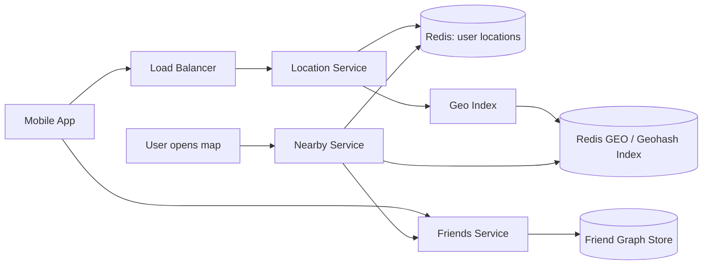
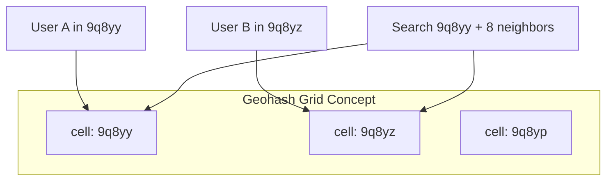

# Case Study 28 — Nearby Friends

Design a feature like **Facebook Nearby Friends** or **Snap Map**: show friends who are close to you on a map, updated every few minutes while location sharing is enabled.

## 1. Problem

Users opt in to share their **approximate location** with friends. The app must:

- Accept periodic location updates from millions of mobile clients  
- Answer "who among my friends is near me?" quickly  
- Respect privacy (fuzzing, opt-out, expiration)  

Naive approach — compare every friend pair — does not scale.

## 2. Requirements

### Functional (MVP)

- User enables/disables location sharing  
- Client sends location updates every N minutes (e.g., 5 min) or on significant movement  
- Show nearby friends on a map (within radius R, e.g., 5 km)  
- Friend list only — no strangers  
- Location staleness indicator ("updated 12 min ago")  

### Out of scope (initially)

- Live continuous tracking (second-by-second)  
- Place check-ins and venue recommendations  
- Background geofencing alerts  
- Public location broadcast  

### Non-functional

- Write-heavy (constant location pings)  
- Read latency < 300 ms for nearby query  
- Privacy: coarse location by default; precise only with consent  
- Battery-friendly — batch updates, adaptive frequency  
- Scale to 100M users with ~10% sharing at once  

## 3. Back-of-the-envelope estimates

These numbers are **rough order-of-magnitude math** — not a capacity plan. In interviews, the goal is to show you know *what to count* and *which resource breaks first*. A useful shortcut: **1 QPS sustained ≈ 86,400 requests/day**. Location systems are **write-heavy** — peak is often **2–3× average** when many users commute or attend events.

### Why we estimate

Nearby Friends is inverted from most apps: **many location writes**, relatively **few map reads**. Naive O(friends²) pairwise distance checks fail at scale. Estimates tell us:

- Why writes (~33K/s) dominate reads (~350/s)  
- That **current location storage is tiny** (~640 MB) but **update rate is high**  
- Why **geohash indexing** beats brute-force friend comparison

### Assumptions

| Assumption | Value | Why it matters |
|------------|-------|----------------|
| Daily active users (DAU) | 100M | Total user base |
| Users sharing location | 10% = 10M | Active writers + index size |
| Update interval | Every 5 minutes | Write frequency |
| Average friends per user | 200 | Read path filters by friend list |
| Nearby query radius | 5 km | Geohash cell neighbors |
| Map opens per sharer per day | 3 | Read QPS |

### Step A — Traffic (QPS) with labeled arithmetic

**Location updates (writes):**

```text
Active sharers      = 100M × 10% = 10M users
Update interval     = 5 minutes = 300 seconds

Write QPS (avg)     = 10M ÷ 300
                    ≈ 33,300 location updates/second

Peak write QPS (3×) ≈ 33,300 × 3
                    ≈ 100,000 updates/second
```

Each update: `(user_id, lat, lng, timestamp, geohash)` → Redis/GEORADIUS index.

**Nearby friends queries (reads):**

```text
Map opens per day   = 10M sharers × 3 opens/day
                    = 30M reads/day

Read QPS (avg)      = 30M ÷ 86,400
                    ≈ 350 reads/second

Peak read QPS (3×)  ≈ 1,000 reads/second
```

**Write:read ratio:**

```text
Updates vs map reads ≈ 33,300 : 350 ≈ 95:1 write-heavy
```

### Step B — Storage

**Current location (hot — Redis GEO or geohash hash):**

```text
Active sharers      = 10M
Bytes per record    ≈ 64 B (user_id 8B + lat/lng 16B + geohash 8B + timestamp 8B + metadata)

Total hot storage   = 10M × 64 B ≈ 640 MB — fits Redis easily
```

**Location history (if stored — usually NOT for MVP):**

```text
If storing every ping 30 days:
  10M users × (30 days × 288 updates/day) ≈ 86B rows — too much
MVP: **current location only**; optional last-known for staleness badge
```

**Friend graph (for filtering candidates):**

```text
100M users × 200 friends avg × 8 B edge ≈ 160 GB — social graph service, not location store
Store adjacency list or pull friend IDs then batch-check distances
```

### Step C — Bandwidth and other resources

**Location update payload:**

```text
Update size         ≈ 100 B JSON (lat, lng, accuracy, timestamp)
Peak write QPS      ≈ 100,000/s

Ingress bandwidth   = 100,000 × 100 B ≈ 10 MB/s — modest
```

**Nearby query response:**

```text
Assume 5 nearby friends returned × 200 B each ≈ 1 KB
Peak read QPS       ≈ 1,000/s

Egress              ≈ 1 MB/s — reads are cheap; geohash lookup CPU matters more
```

**Geohash query pattern:**

```text
Precision-6 geohash cell ≈ 1.2 km × 0.6 km
5 km radius → search 9–25 neighboring cells
Candidates per query   ≈ 50–500 users in dense cities
Filter to friend list  ≈ 200 friend IDs → O(candidates) intersection, not O(all users)
```

### Step D — Read:write ratio table

| Operation | Type | Avg QPS | Peak QPS | Notes |
|-----------|------|---------|----------|-------|
| Push location update | Write | ~33,300 | ~100,000 | Every 5 min per sharer |
| Query nearby friends | Read | ~350 | ~1,000 | Geohash + friend filter |
| Enable/disable sharing | Write | ~10 | ~50 | Rare toggle |
| Fetch friend list | Read | ~350 | ~1,000 | Cache per user |
| Expire stale locations (worker) | Write | ~100 | ~300 | TTL on inactive sharers |

**Ratio:** **~95:1 writes to reads** — optimize write path (batch, adaptive frequency); reads are geohash-bounded.

### What the numbers tell us

- **~100K location writes/s peak** — Redis GEO or geohash buckets; don’t write every ping to Postgres  
- **Only ~640 MB** for 10M current locations — memory is not the bottleneck; **update rate** is  
- **Reads (~1K/s peak) are low** — but each query must finish in < 300 ms via geohash neighbors, not full scan  
- **Friend filter after geo candidate retrieval** — never compare all 200 friends with haversine if they’re globally distributed  
- **Adaptive update interval** — stationary users ping every 15 min; moving users every 1–2 min (saves writes)  
- **Privacy fuzzing** — round coords to ~100 m; store coarse geohash for display

### Common mistake for this problem

**O(n²) all-pairs** friend distance checks or scanning **all 10M sharers** per query. Another mistake: storing **full location history forever** in SQL — 86B rows/year. Finally, ignoring **battery** — second-by-second GPS would 10× write QPS; batch and adapt frequency.

## 4. High-Level Design (HLD)





### Components

| Component | Role |
|-----------|------|
| Location Service | Ingest `POST /location` updates |
| Redis GEO / Geohash index | Spatial index for range queries |
| Friend Graph Store | Bidirectional friend lists (cached) |
| Nearby Service | Orchestrates geo query ∩ friends |
| Location Cache | Latest coords per user with TTL |

### Flows

**Update location**

1. Client sends `{ lat, lng, accuracy, timestamp }` every 5 min  
2. Server validates session + sharing enabled  
3. Optionally fuzz location (grid snap to ~500 m)  
4. Write to Redis: `SET user:{id}:loc` + `GEOADD geo_index {lng lat} userId`  
5. Set TTL — auto-expire if client stops sending  

**Find nearby friends**

1. Client requests nearby friends  
2. Load user's friend IDs where `sharing_enabled = true` (cached set)  
3. Query geo index: all users in radius R around user  
4. **Intersect** geo candidates with friend set  
5. Return friend profiles + distance + last updated  

### Trade-offs

- **Geohash vs Quadtree vs Redis GEO** — Redis GEO uses geohash internally; good MVP. Quadtree better for skewed density  
- **Push vs pull updates** — Pull on map open is simpler; push (WebSocket) for live map optional  
- **Precise vs fuzzy** — Fuzzy protects privacy and reduces update churn  
- **Update interval vs accuracy** — 5 min saves battery; show staleness in UI  

## 5. Low-Level Design (LLD)

### APIs

```text
PUT /api/v1/location/sharing
Body: { "enabled": true, "visibility": "friends" }
→ { "enabled": true, "updateIntervalSec": 300 }

POST /api/v1/location
Body: {
  "lat": 37.7749,
  "lng": -122.4194,
  "accuracyMeters": 25,
  "capturedAt": "2026-07-20T12:00:00Z"
}
→ 204 No Content

GET /api/v1/friends/nearby?radiusKm=5&limit=50
→ {
     "center": { "lat": 37.7749, "lng": -122.4194 },
     "radiusKm": 5,
     "friends": [
       {
         "userId": "u_42",
         "displayName": "Bob",
         "lat": 37.78,
         "lng": -122.41,
         "distanceKm": 1.2,
         "updatedAt": "2026-07-20T11:58:00Z",
         "stale": false
       }
     ]
   }

DELETE /api/v1/location
→ 204   (stop sharing, purge location)
```

### Schema

```text
user_location_settings (
  user_id           BIGINT PRIMARY KEY,
  sharing_enabled   BOOLEAN DEFAULT FALSE,
  visibility        VARCHAR(16) DEFAULT 'friends',
  fuzz_level_meters INT DEFAULT 500,
  updated_at        TIMESTAMPTZ NOT NULL
)

-- Optional Postgres backup / history (not hot path)
user_locations (
  user_id     BIGINT PRIMARY KEY,
  lat         DOUBLE PRECISION NOT NULL,
  lng         DOUBLE PRECISION NOT NULL,
  geohash     VARCHAR(12) NOT NULL,
  accuracy_m  INT,
  captured_at TIMESTAMPTZ NOT NULL,
  received_at TIMESTAMPTZ NOT NULL
)
CREATE INDEX idx_locations_geohash ON user_locations (geohash);

friendships (
  user_id     BIGINT NOT NULL,
  friend_id   BIGINT NOT NULL,
  status      VARCHAR(16) DEFAULT 'accepted',
  PRIMARY KEY (user_id, friend_id)
)
```

Redis structures:

```text
GEOADD locations:geo <lng> <lat> <userId>
HSET user:loc:<userId> lat lng geohash updatedAt sharingEnabled
EXPIRE user:loc:<userId> 900          -- 15 min without update → gone

SET friends:sharing:<userId> → {friendId1, friendId2, ...}  (only friends who share back)
```

### Modules

```text
LocationController
LocationIngestService
GeohashEncoder
LocationFuzzer
NearbyFriendsService
FriendGraphClient
GeoIndexRepository
SharingSettingsService
```

### Algorithm — geohash indexing

Geohash encodes `(lat, lng)` into a string where **nearby places share a prefix**.

```text
function encodeGeohash(lat, lng, precision=6):
  // precision 6 ≈ ±0.61 km × ±1.22 km cell
  return geohashLibrary.encode(lat, lng, precision)

function getNeighborCells(geohash):
  return [geohash] + geohashLibrary.neighbors(geohash)  // 8 adjacent cells
```

For radius R, choose precision so cell size ≈ R/2, then search center + neighbors (may need 2 rings for large R).

### Algorithm — nearby friends query

```text
function getNearbyFriends(userId, radiusKm, limit):
  me = locationCache.get(userId)
  if me is null or not me.sharingEnabled:
    return forbidden()

  friends = friendGraph.getSharingFriends(userId)   // pre-filtered set
  if friends.isEmpty(): return []

  // Redis GEO radius query
  candidates = redis.geoRadius(
    key="locations:geo",
    lng=me.lng, lat=me.lat,
    radiusKm=radiusKm,
    withDist=true,
    count=limit * 10                    // over-fetch before friend filter
  )

  results = []
  friendSet = Set(friends)
  for (candidateId, distanceKm) in candidates:
    if candidateId not in friendSet: continue
    if candidateId == userId: continue
    loc = locationCache.get(candidateId)
    if loc is null: continue
    results.append({ userId: candidateId, distanceKm, ...loc })
    if results.size >= limit: break

  sort results by distanceKm
  return results
```

### Algorithm — location fuzzing

```text
function fuzzLocation(lat, lng, fuzzMeters):
  // Snap to grid or add random offset within cell
  cell = metersToDegrees(fuzzMeters)
  latF = round(lat / cell) * cell
  lngF = round(lng / cell) * cell
  return (latF, lngF)
```

### Algorithm — adaptive update interval (client-side)

```text
function shouldSendUpdate(lastSent, currentPos, speed):
  elapsed = now() - lastSent.time
  distance = haversine(lastSent.pos, currentPos)

  if elapsed > 5 minutes: return true
  if distance > 500 meters: return true
  if speed > 30 km/h and elapsed > 2 minutes: return true
  return false
```

### Concurrency & correctness

- Last-write-wins for location (timestamp compare discard stale updates)  
- TTL auto-clears ghost users who uninstalled app  
- `DELETE /location` removes from GEO index immediately  
- Friend intersection enforces **mutual opt-in** — both must share  

## 6. Scale evolution

| Stage | Change |
|-------|--------|
| MVP | Redis GEO + friend list in Redis; single region |
| Write spike | Shard Redis by `hash(userId)`; separate GEO shards by geohash prefix |
| Global | Partition geo index by country/region; cross-region friends = harder (pick home region) |
| Denser cities | Quadtree or S2 cells instead of flat geohash; dynamic precision |
| Live map | WebSocket push on friend cell change; geohash watch subscriptions |
| Privacy tiers | Multiple fuzz levels; hide exact distance ("nearby" bucket) |

## 7. Recap

- Nearby friends = **geo index query ∩ friend set** — never O(friends × users) brute force  
- **Geohash / Redis GEO** makes radius search practical  
- **Periodic updates + TTL** balance battery, freshness, and storage  
- **Fuzz coordinates** for privacy; show staleness in the UI  
- Writes dominate — optimize ingest; reads are relatively cheap  

**Practice:** redraw the HLD from memory, then write pseudocode for `getNearbyFriends` including the friend-set intersection step.
