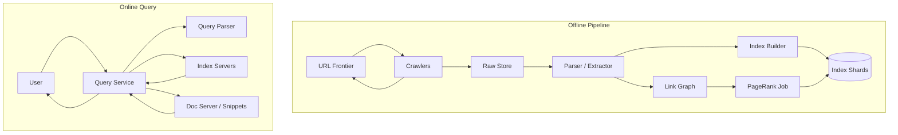
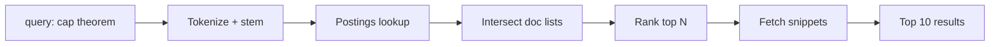

# Case Study 29 — Web Search Engine (Simplified)

Design a simplified **Google-like web search**: crawl the web, build an index, and return ranked results for a query in milliseconds.

## 1. Problem

Given a search query like `"distributed systems cap theorem"`, return the most relevant web pages from billions of documents — **fast** ( < 300 ms) and **fresh** (recent pages indexed within days).

This case study covers a **minimal but realistic** pipeline: crawler → indexer → inverted index → ranking → query service.

## 2. Requirements

### Functional (MVP)

- Crawl known seed URLs; discover new links  
- Parse HTML; extract text, title, links  
- Build inverted index: `term → list of docIds`  
- Query: return top 10 URLs with titles and snippets  
- Basic ranking: term frequency + PageRank-style authority  
- Avoid duplicate content (URL normalization, simhash)  

### Out of scope (initially)

- Image/video/news verticals  
- Personalized ranking (search history)  
- Full natural-language understanding (BERT reranking)  
- Ads auction  
- Real-time index (minutes-level freshness for all web)  

### Non-functional

- Index billions of documents (web scale simplified to 100M–1B docs)  
- Query latency p99 < 300 ms  
- Crawl politeness (rate limits per domain)  
- Fault tolerance — crawler and indexer are distributed  
- Storage efficiency — compression, sharding  

## 3. Back-of-the-envelope estimates

These numbers are **rough order-of-magnitude math** — not a capacity plan. In interviews, the goal is to show you know *what to count* and *which resource breaks first*. A useful shortcut: **1 QPS sustained ≈ 86,400 requests/day**. Search peaks (breaking news, product launches) often hit **3–4× average** query rate.

### Why we estimate

A search engine splits into **offline** (crawl + index — batch, huge storage) and **online** (query — low latency, in-memory). Estimates tell us:

- Whether **query QPS** or **index size** drives architecture  
- Why the **inverted index must live in RAM** (or SSD with hot shards)  
- Minimum **crawl throughput** to keep 500M pages fresh

### Assumptions

| Assumption | Value | Why it matters |
|------------|-------|----------------|
| Indexed web pages | 500M | Corpus size |
| Average extracted text per page | 5 KB | Raw text + index input |
| Average HTML fetched | 20 KB | Crawl bandwidth |
| Unique vocabulary (terms) | 10M | Dictionary size |
| Searches per day | 5B | Query path load |
| Index refresh target | 30 days | Crawl rate floor |
| Top results returned | 10 | Query response size |

### Step A — Traffic (QPS) with labeled arithmetic

**Search queries (online path — latency critical):**

```text
Searches per day    = 5 billion
Query QPS (avg)     = 5B ÷ 86,400
                    ≈ 58,000 queries/second

Peak query QPS (3×) ≈ 58,000 × 3
                    ≈ 174,000 queries/second
```

Each query: tokenize → lookup postings lists → score → return top-10. Target **p99 < 300 ms**.

**Crawl fetches (offline path — throughput critical):**

```text
Pages to refresh in 30 days = 500M
Seconds in 30 days          = 30 × 86,400 = 2,592,000

Minimum crawl QPS           = 500M ÷ 2,592,000
                            ≈ 193 pages/second (steady refresh only)

With discovery + dead links + deep web:
Target crawl cluster        ≈ 1,000–10,000 pages/second
```

**Index build (batch jobs):**

```text
If re-indexing 500M pages daily (aggressive):
  Indexer throughput needed ≈ 500M ÷ 86,400 ≈ 5,800 pages/second
MVP: incremental indexing on crawl completion — thousands of docs/s per indexer shard
```

### Step B — Storage

**Raw extracted text:**

```text
Text storage        = 500M pages × 5 KB/page
                    ≈ 2.5 TB uncompressed
Compressed (~3×)    ≈ 750 GB — S3/HDFS for crawl store
```

**Inverted index (postings lists):**

```text
Terms               = 10M unique
Avg postings/term   ≈ 50 KB (doc IDs + frequencies, delta-encoded)

Index size (rough)  = 10M × 50 KB ≈ 500 GB
Compressed          ≈ 150–300 GB — must shard across index servers
```

**Document metadata (title, URL, PageRank, snippet):**

```text
500M docs × 500 B   ≈ 250 GB — colocated with index shards or separate KV store
```

**Link graph (for PageRank — offline):**

```text
Assume 50 links/page avg × 8 B = 400 B/page
500M × 400 B        ≈ 200 GB — processed offline, not on query hot path
```

### Step C — Bandwidth and other resources

**Crawl ingress (fetching web pages):**

```text
Crawl rate (target) = 5,000 pages/second
Page size (avg)     = 20 KB HTML

Crawl bandwidth     = 5,000 × 20 KB ≈ 100 MB/s ≈ 800 Mbps
Peak with retries   ≈ 1–2 Gbps — politeness rate limits per domain cap this
```

**Query response egress:**

```text
Results payload     ≈ 10 results × 2 KB (title + URL + snippet) ≈ 20 KB
Peak query QPS      ≈ 174,000/s

Egress (if uncached) = 174,000 × 20 KB ≈ 3.5 GB/s — CDN for static assets; API JSON from query tier
```

**Index shard memory (query hot path):**

```text
500 GB index ÷ 20 shards ≈ 25 GB/shard
Each shard serves   ≈ 174,000 ÷ 20 ≈ 8,700 QPS
→ RAM or NVMe SSD with mmap; hot terms cached in memory
```

### Step D — Read:write ratio table

| Operation | Type | Avg rate | Peak rate | Notes |
|-----------|------|----------|-----------|-------|
| User search query | Read | ~58K QPS | ~174K QPS | **Sub-300 ms** |
| Crawl page fetch | Write (store) | ~193–5K/s | ~10K/s | Politeness per domain |
| Index update (incremental) | Write | ~1K docs/s | ~5K docs/s | Async from crawl pipeline |
| PageRank (offline batch) | Read/write | N/A | Periodic | Not on query path |
| Autocomplete (optional) | Read | ~10K QPS | ~40K QPS | Prefix index in Redis |

**Ratio:** online path is **read-only at massive QPS**; offline crawl/index is **write-heavy but latency-forgiving**.

### What the numbers tell us

- **~174K query QPS peak** → shard inverted index by `term_hash` or `doc_id`; replicate hot shards  
- **~500 GB inverted index** must sit on **index servers with RAM/NVMe** — disk-only query path is too slow  
- **Crawl ~193 pages/s minimum** for 30-day refresh; real systems crawl 1K–10K/s with distributed frontier  
- **750 GB compressed text** in object store — query path never reads raw HTML  
- **Precompute PageRank offline** — store score in doc metadata; query-time scoring uses precomputed + BM25  
- **Politeness** — rate limit per domain (1–2 req/s) → huge URL frontier queue, many crawler workers

### Common mistake for this problem

Scanning **500M documents linearly** per query. Inverted index lookup is O(postings for matched terms), not O(corpus). Another mistake: **crawling without politeness** — you get blocked and skew freshness. Finally, storing the **full index on spinning disk** for 174K QPS — hot shards need memory or SSD.

## 4. High-Level Design (HLD)





### Components

| Component | Role |
|-----------|------|
| URL Frontier | Priority queue of URLs to crawl (BFS-ish with politeness) |
| Crawlers | Fetch HTTP pages; respect robots.txt |
| Raw Store | Blob storage for HTML (S3/HDFS) |
| Parser | Extract text, title, outbound links, metadata |
| Index Builder | Builds inverted index + forward index |
| Index Shards | Partitioned by term range or document ID |
| PageRank Job | Offline compute authority scores |
| Query Service | Parse query, merge shard results, return ranked list |
| Doc Server | Map docId → URL, title, snippet text |

### Flows

**Crawl loop**

1. Frontier dequeues URL for domain D (respect per-domain rate limit)  
2. Crawler fetches page → store raw HTML  
3. Parser extracts text + links  
4. New links enqueued to frontier (dedupe by normalized URL)  
5. Index builder consumes parsed doc → update inverted index  

**Query**

1. Tokenize query → stem → remove stop words  
2. Lookup postings for each term on index shards  
3. Intersect / merge posting lists (AND for multi-term)  
4. Score candidates (TF-IDF + PageRank)  
5. Fetch top N doc metadata for snippets  
6. Return JSON results  

### Trade-offs

- **Freshness vs crawl cost** — prioritize popular/changing pages  
- **Index sharding by term vs doc** — term shard: single-term lookup easy; multi-term needs merge. Doc shard: update easy; query hits all shards  
- **Exact PageRank vs approximation** — offline batch OK for MVP  
- **Snippets precomputed vs at query time** — precompute first 160 chars per doc  

## 5. Low-Level Design (LLD)

### APIs

```text
GET /api/v1/search?q=cap+theorem+distributed&limit=10
→ {
     "query": "cap theorem distributed",
     "tookMs": 42,
     "results": [
       {
         "url": "https://example.com/cap",
         "title": "CAP Theorem Explained",
         "snippet": "...Consistency, Availability, Partition tolerance...",
         "score": 0.92
       }
     ],
     "totalEstimate": 1250000
   }

POST /internal/v1/crawl/enqueue
Body: { "urls": ["https://example.com/"] }
→ 202 Accepted

GET /internal/v1/doc/:docId
→ { "docId": "d_991", "url": "...", "title": "...", "text": "..." }
```

### Schema

```text
documents (
  doc_id       BIGINT PRIMARY KEY,
  url          TEXT NOT NULL UNIQUE,
  url_hash     BIGINT NOT NULL,
  title        TEXT,
  text_blob_id TEXT,              -- pointer to object storage
  pagerank     FLOAT DEFAULT 0,
  indexed_at   TIMESTAMPTZ NOT NULL,
  content_hash VARCHAR(64)        -- simhash for dedup
)

-- Forward index (metadata by doc)
-- Inverted index is mostly custom binary on index servers, not row-per-posting in SQL

url_frontier (
  url          TEXT PRIMARY KEY,
  domain       VARCHAR(256) NOT NULL,
  priority     INT DEFAULT 0,
  last_crawled TIMESTAMPTZ NULL,
  crawl_delay_ms INT DEFAULT 1000
)

links (
  from_doc_id  BIGINT,
  to_doc_id    BIGINT,
  anchor_text  TEXT,
  PRIMARY KEY (from_doc_id, to_doc_id)
)
```

Inverted index file format (per shard):

```text
term → [docFreq, [docId, tf, positions...], [docId, tf, positions...], ...]
       postings sorted by docId with delta + varint compression
```

### Modules

```text
SearchController
QueryParser               (tokenize, stem, stop words)
IndexShardClient            (fan-out to shards)
PostingsMerger              (intersect / union)
RankingService              (BM25 + PageRank blend)
SnippetGenerator
CrawlScheduler
RobotsTxtCache
DocumentRepository
```

### Algorithm — build inverted index

```text
function indexDocument(docId, terms[], positions[]):
  for each term in terms:
    shard = shardForTerm(term)           // e.g., hash(term) mod numShards
    shard.appendPosting(term, docId, tf, positions)

function shardForTerm(term):
  return hash(term) % NUM_TERM_SHARDS
```

### Algorithm — query execution (multi-term AND)

```text
function search(query):
  terms = stem(tokenize(query)) - stopWords
  if terms.isEmpty(): return []

  lists = []
  for term in terms:
    lists.append(indexShard.lookup(term))   // parallel fan-out

  candidates = intersectSortedPostings(lists)   // merge join on docId

  scored = []
  for doc in candidates:
    score = bm25(doc, terms) + alpha * doc.pagerank
    scored.append((doc.id, score))

  top = partialSort(scored, k=100)
  return fetchSnippets(top, k=10)

function intersectSortedPostings(lists):
  // Simultaneous scan — doc must appear in ALL lists
  pointers = [0] * len(lists)
  results = []
  while all pointers valid:
    maxDoc = max(lists[i][pointers[i]].docId for i)
    if all lists[i][pointers[i]].docId == maxDoc:
      results.append(combine(lists, pointers))
      advance all pointers
    else:
      advance pointers where docId < maxDoc
  return results
```

### Algorithm — BM25 scoring (simplified)

```text
function bm25(doc, queryTerms):
  score = 0
  for term in queryTerms:
    tf = termFrequency(doc, term)
    df = documentFrequency(term)
    idf = log((N - df + 0.5) / (df + 0.5))
    score += idf * (tf * (k1 + 1)) / (tf + k1 * (1 - b + b * doc.length / avgDocLength))
  return score
```

### Algorithm — crawler politeness

```text
function crawlNext():
  url = frontier.dequeueHighestPriority()
  domain = extractDomain(url)
  if not robotsAllowed(domain, url): return skip
  if timeSinceLastFetch(domain) < crawlDelay(domain): requeue(url); return
  html = httpGet(url)
  storeRaw(url, html)
  enqueueOutlinks(parseLinks(html))
  markCrawled(url, now())
```

### Concurrency & correctness

- URL normalization before dedup (`http/https`, trailing slash, lowercase host)  
- Simhash near-duplicate detection avoids indexing same content twice  
- Index updates are **segment-based** — new segments built offline, swapped atomically  
- Crawl idempotency by URL hash in frontier  

## 6. Scale evolution

| Stage | Change |
|-------|--------|
| MVP | Single-machine index; crawl 1M pages; BM25 only |
| Sharding | Term-based index shards; query fan-out + merge |
| Freshness | Tiered crawl priorities; delta index for recent docs |
| Ranking | Offline PageRank; optional ML reranker on top 100 |
| Global | Geo-distributed index replicas; CDN for static assets only |
| Scale query | Result caching for head queries; autocomplete separate index |

## 7. Recap

- Search = **offline indexing** + **online postings lookup**  
- **Inverted index** maps term → documents; compressed postings lists are core  
- Multi-term queries = **intersect sorted postings** across shards  
- **Crawler politeness** and URL frontier prevent overload and bans  
- Ranking blends **relevance (BM25)** and **authority (PageRank)**  

**Practice:** draw the offline/online split diagram from memory, then write pseudocode for `intersectSortedPostings` without looking.
