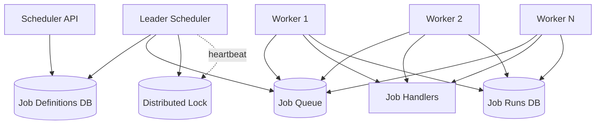
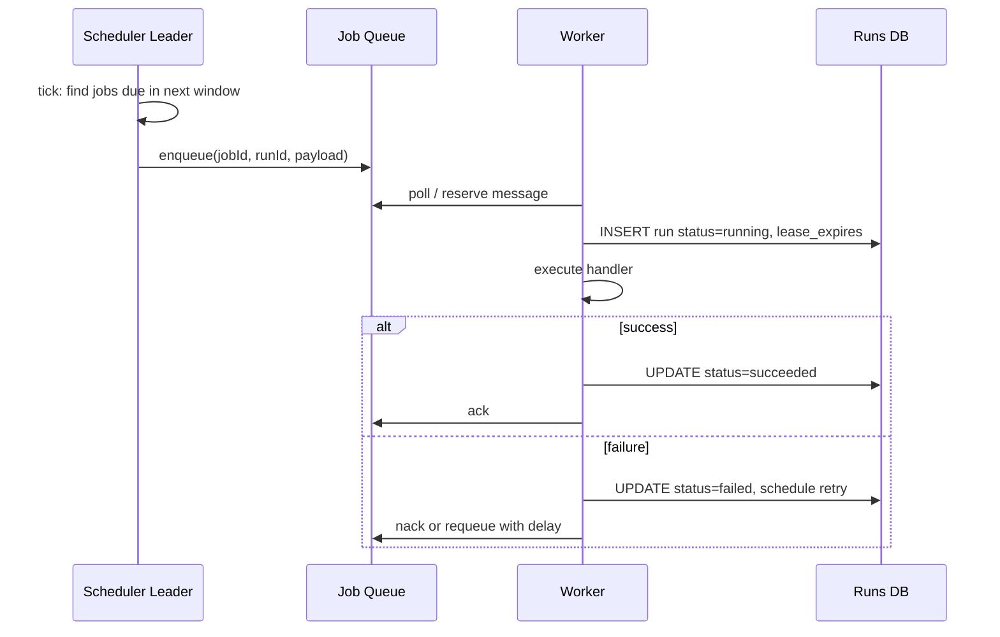

# Case Study 30 — Distributed Task Scheduler

Design a **distributed cron / job scheduler** like a simplified **Kubernetes CronJob + Sidekiq** or **AWS EventBridge + worker fleet**: run tasks at scheduled times or on demand, reliably, across many machines.

## 1. Problem

Applications need to run background jobs:

- `"Send digest email every day at 9:00 AM UTC"`  
- `"Reconcile payments every 5 minutes"`  
- `"Generate report once, now"`  

A single server's `crontab` fails when that server dies. You need **distributed scheduling** with **at-most-once or exactly-once execution**, horizontal workers, and visibility into job status.

## 2. Requirements

### Functional (MVP)

- Register scheduled jobs (cron expression or fixed interval)  
- Enqueue one-off jobs immediately  
- Workers pull jobs and execute handlers  
- Job states: pending → running → succeeded / failed  
- Retries with backoff on failure  
- Pause / resume / cancel scheduled jobs  
- Lease-based execution — if worker dies, job can be reassigned  

### Out of scope (initially)

- Complex DAG workflows (job A then B then C)  
- Sub-second scheduling precision  
- Multi-tenant fair-share quotas UI  
- Global clock synchronization to microsecond level  

### Non-functional

- Schedule accuracy within ~1–5 seconds  
- Horizontal scale of workers  
- No double execution for critical jobs (exactly-once semantics)  
- Durable — schedules survive scheduler restarts  
- At-least-once by default; exactly-once where configured  

## 3. Back-of-the-envelope estimates

These numbers are **rough order-of-magnitude math** — not a capacity plan. In interviews, the goal is to show you know *what to count* and *which resource breaks first*. A useful shortcut: **1 QPS sustained ≈ 86,400 operations/day**. Job triggers often **spike 2–3×** at minute boundaries (cron aligned to `:00`).

### Why we estimate

A distributed scheduler splits **scheduling** (what runs when?) from **execution** (workers doing the work). Estimates tell us:

- Whether the **scheduler tick** or **worker pool** is the bottleneck  
- Why scanning 1M cron rules every second fails  
- How **job history** explodes without TTL/archival

### Assumptions

| Assumption | Value | Why it matters |
|------------|-------|----------------|
| Registered job schedules | 1M | Scheduler index size |
| Jobs triggered per minute | 50K | Enqueue rate |
| Average job duration | 30 seconds | Concurrent worker demand |
| Worker processes | 500 | Execution capacity |
| Job definition row size | ~500 B | Metadata DB |
| Job run history retention | 30 days | Storage explosion risk |

### Step A — Traffic (QPS) with labeled arithmetic

**Job triggers (scheduler → queue):**

```text
Triggers per minute  = 50,000
Triggers per second  = 50,000 ÷ 60
                     ≈ 833 jobs/second (average)

Peak at minute boundary (3×) ≈ 833 × 3
                             ≈ 2,500 triggers/second
```

Many cron expressions fire at `:00` — **thundering herd** unless staggered.

**One-off immediate jobs (API enqueue):**

```text
Assume 10K ad-hoc jobs/day
Ad-hoc QPS (avg)     = 10,000 ÷ 86,400 ≈ 0.1/s — negligible vs scheduled
```

**Worker job completions (writes back to status store):**

```text
Completion rate (steady) ≈ trigger rate ≈ 833/s when system balanced
Peak completions         ≈ 2,500/s
```

**Scheduler tick evaluation:**

```text
1M schedules — cannot scan all every second
Bucket by next_run_at (minute-level index):
  Schedules due this minute ≈ 50K → evaluate only those
  Tick work per second      ≈ 50K ÷ 60 ≈ 833 evaluations/s — manageable with time-index
```

### Step B — Storage

**Job definitions (Postgres/metadata DB):**

```text
Schedules           = 1M
Row size            ≈ 500 B (cron expr, handler, payload, next_run, owner)

Definition storage  = 1M × 500 B ≈ 500 MB — trivial
Index on next_run_at for due-job queries
```

**Job run history (30 days — the danger zone):**

```text
Runs per day        = 50K/min × 1,440 min ≈ 72M runs/day
Row size            ≈ 300 B (job_id, status, started_at, finished_at, error)

30-day history      = 72M × 30 × 300 B ≈ 650 GB
→ TTL after 30 days; archive to S3 cold storage or aggregate metrics only
```

**Queue (in-flight + pending):**

```text
Concurrent jobs (steady) ≈ arrival rate × duration
                       = 833/s × 30 s
                       ≈ 25,000 jobs in-flight

Queue message size     ≈ 1 KB (job_id, payload, lease, retry_count)
In-flight storage      ≈ 25K × 1 KB ≈ 25 MB in Redis/SQS — small
```

### Step C — Bandwidth and other resources

**Worker capacity check:**

```text
Workers             = 500 processes
Avg job duration    = 30 seconds
Throughput/worker   = 1 job ÷ 30 s ≈ 0.033 jobs/s

Cluster capacity    = 500 × 0.033
                    ≈ 16.7 jobs/second sustained

Required rate       ≈ 833 jobs/s at average
→ **500 workers is far too few** for 30s jobs; need ~25,000 concurrent worker slots
   OR average job duration is much lower for most jobs, OR 50K/min is peak not sustained
```

**Reconcile with assumption (honest interview move):**

```text
If 50K/min is peak burst and average is 5K/min ≈ 83/s:
  Concurrent jobs = 83 × 30 ≈ 2,500 → 500 workers × 5 threads = 2,500 capacity ✓

State the assumption: most minutes trigger ~5K jobs; 50K is peak minute
```

**Lease renewal traffic:**

```text
25K in-flight jobs, lease renew every 10s
Renewal QPS         = 25,000 ÷ 10 ≈ 2,500 lease updates/s — Redis SET with TTL
```

### Step D — Read:write ratio table

| Operation | Type | Avg rate | Peak rate | Notes |
|-----------|------|----------|-----------|-------|
| Scheduler: find due jobs | Read | ~833/s | ~2,500/s | Time-indexed query |
| Enqueue triggered job | Write | ~833/s | ~2,500/s | Push to queue |
| Worker pull / lease job | Read+write | ~833/s | ~2,500/s | Competing consumers |
| Update job status | Write | ~833/s | ~2,500/s | succeeded/failed |
| Register/update schedule (API) | Write | ~1/s | ~10/s | Low admin traffic |
| Query job history (UI) | Read | ~100/s | ~500/s | Paginated, indexed |

**Ratio:** steady state **~1:1 enqueue to completion**; scheduler reads are bounded by indexing `next_run_at`, not full table scan.

### What the numbers tell us

- **Separate scheduler leader from workers** — scheduler enqueues; workers pull with leases  
- **Index 1M schedules by `next_run_at`** — evaluate ~833/s due jobs, never scan 1M rows/sec  
- **Stagger cron** — `:00` minute boundaries cause 2,500/s spikes; add random jitter  
- **~650 GB for 30-day run history** — TTL, partition by day, archive old runs  
- **Worker math: concurrent jobs = rate × duration** — 833/s × 30s = 25K slots needed at full load  
- **Leases + heartbeat** — if worker dies, job returns to queue after lease expiry (avoid double-run for critical jobs with idempotency keys)

### Common mistake for this problem

**Scanning all 1M cron rules every second** — O(schedules) per tick doesn't scale. Use a **min-heap or time bucket index**. Another mistake: **no TTL on job history** — 72M rows/day becomes petabytes. Finally, ignoring **thundering herd** at minute zero — 50K jobs enqueued instantly overwhelms workers without jitter and backpressure.

## 4. High-Level Design (HLD)





### Components

| Component | Role |
|-----------|------|
| Scheduler API | CRUD job definitions |
| Leader Scheduler | Single active instance via distributed lock; ticks and enqueues |
| Job Definitions DB | Cron rules, payload, retry policy |
| Job Queue | Durable queue (Kafka, SQS, Redis Streams) |
| Workers | Stateless executors; extend lease while running |
| Job Runs DB | Audit log + idempotency keys |
| Distributed Lock | etcd / Redis Redlock — one scheduler leader |

### Flows

**Register schedule**

1. `POST /jobs` with cron `"0 9 * * *"`, handler name, payload  
2. Store `next_run_at` computed from cron  
3. Index job in "due bucket" for efficient tick  

**Scheduler tick (every 1 s)**

1. Leader acquires / renews lock  
2. Query jobs where `next_run_at <= now + lookahead`  
3. For each: create `runId`, enqueue message, advance `next_run_at`  
4. Use idempotency key `(jobId, scheduledTime)` to avoid duplicate enqueue on retry  

**Worker execute**

1. Poll queue with visibility timeout (lease)  
2. Check idempotency — skip if run already succeeded  
3. Mark running; heartbeat lease during long jobs  
4. Execute handler; record result  
5. On failure, requeue with exponential backoff up to max attempts  

### Trade-offs

- **Push vs pull** — Pull (workers poll queue) scales better and buffers spikes  
- **At-least-once vs exactly-once** — At-least-once is default (queue + retry); exactly-once needs idempotency keys + dedup store  
- **Single leader scheduler vs partitioned** — Leader + DB index is simpler; partition schedules by hash for huge scale  
- **Cron libraries vs custom** — Use standard cron parsing; store computed `next_run_at`  

## 5. Low-Level Design (LLD)

### APIs

```text
POST /api/v1/jobs
Body: {
  "name": "daily-digest",
  "schedule": "0 9 * * *",
  "timezone": "UTC",
  "handler": "email.sendDigest",
  "payload": { "template": "digest-v2" },
  "retryPolicy": { "maxAttempts": 3, "backoffSec": 60 },
  "exactlyOnce": true
}
→ { "jobId": "j_101", "nextRunAt": "2026-07-21T09:00:00Z" }

POST /api/v1/jobs/:id/run-now
→ { "runId": "r_9001", "enqueued": true }

GET /api/v1/jobs/:id/runs?limit=20
→ {
     "runs": [
       { "runId": "r_9000", "status": "succeeded", "startedAt": "...", "finishedAt": "..." }
     ]
   }

PATCH /api/v1/jobs/:id
Body: { "paused": true }

DELETE /api/v1/jobs/:id
→ 204
```

Internal worker contract:

```text
Queue message:
{
  "jobId": "j_101",
  "runId": "r_9001",
  "idempotencyKey": "j_101:2026-07-21T09:00:00Z",
  "handler": "email.sendDigest",
  "payload": { ... },
  "attempt": 1,
  "leaseUntil": "2026-07-21T09:05:00Z"
}
```

### Schema

```text
jobs (
  id              UUID PRIMARY KEY,
  name            VARCHAR(256) UNIQUE NOT NULL,
  schedule_cron   VARCHAR(64) NULL,          -- null for manual-only jobs
  timezone        VARCHAR(64) DEFAULT 'UTC',
  handler         VARCHAR(128) NOT NULL,
  payload         JSONB NOT NULL,
  retry_max       INT DEFAULT 3,
  retry_backoff_s INT DEFAULT 60,
  exactly_once    BOOLEAN DEFAULT FALSE,
  paused          BOOLEAN DEFAULT FALSE,
  next_run_at     TIMESTAMPTZ NULL,
  created_at      TIMESTAMPTZ NOT NULL,
  updated_at      TIMESTAMPTZ NOT NULL
)
CREATE INDEX idx_jobs_next_run ON jobs (next_run_at) WHERE paused = FALSE;

job_runs (
  id               UUID PRIMARY KEY,
  job_id           UUID REFERENCES jobs(id),
  idempotency_key  VARCHAR(256) UNIQUE NOT NULL,
  status           VARCHAR(16) NOT NULL,     -- pending, running, succeeded, failed, cancelled
  attempt          INT DEFAULT 1,
  worker_id        VARCHAR(64) NULL,
  lease_expires_at TIMESTAMPTZ NULL,
  started_at       TIMESTAMPTZ NULL,
  finished_at      TIMESTAMPTZ NULL,
  error_message    TEXT NULL
)
CREATE INDEX idx_runs_job_time ON job_runs (job_id, started_at DESC);
```

Queue: Kafka topic `job-executions` with consumer groups, or SQS with visibility timeout = lease duration.

### Modules

```text
JobController
JobDefinitionService
SchedulerLeader               (cron tick loop)
CronParser
NextRunCalculator
JobEnqueueService
WorkerPoller
LeaseManager
IdempotencyGuard
JobRunRepository
HandlerRegistry               (handler name → function)
RetryPolicy
```

### Algorithm — scheduler tick with idempotent enqueue

```text
function schedulerTick(now):
  if not acquireLeaderLock(): return

  dueJobs = repo.findDueJobs(now, now + 5 seconds, limit=1000)
  for job in dueJobs:
    scheduledSlot = job.next_run_at
    idempotencyKey = job.id + ":" + scheduledSlot.iso()

    if idempotencyStore.exists(idempotencyKey):
      advanceNextRun(job)
      continue

    runId = uuid()
    tx:
      insert job_runs(runId, job.id, idempotencyKey, status='pending')
      enqueue({ jobId, runId, idempotencyKey, handler, payload, attempt: 1 })
      advanceNextRun(job)
    commit tx

function advanceNextRun(job):
  job.next_run_at = cronNext(job.schedule_cron, job.timezone, after=job.next_run_at)
  repo.update(job)
```

### Algorithm — worker execution with lease

```text
function workerLoop(workerId):
  msg = queue.poll(visibilityTimeout=5min)
  if msg is null: return

  run = repo.findRun(msg.runId)
  if run.status == 'succeeded':
    queue.ack(msg)                    // duplicate delivery — safe skip
    return

  if run.exactlyOnce and repo.wasEverSucceeded(msg.idempotencyKey):
    queue.ack(msg)
    return

  if not repo.tryClaimRun(msg.runId, workerId, lease=5min):
    return                            // another worker owns it

  try:
    startHeartbeat(run, extendLeaseEvery=1min)
    result = handlers[msg.handler](msg.payload)
    repo.markSucceeded(msg.runId, result)
    queue.ack(msg)
  catch err:
    if msg.attempt >= job.retry_max:
      repo.markFailed(msg.runId, err)
      queue.ack(msg)
    else:
      repo.markRetry(msg.runId)
      queue.requeue(msg, delay=backoff(msg.attempt))
```

### Algorithm — exactly-once semantics

True exactly-once execution is impossible in distributed systems; **effective exactly-once** = at-least-once delivery + **idempotent handlers**:

```text
function effectiveExactlyOnce(job, handler):
  // 1. Dedup key prevents duplicate enqueue for same scheduled slot
  // 2. Handler must be idempotent (e.g., UPSERT, check external id)
  // 3. Optional: transactional outbox — DB write + enqueue in one tx

function idempotentHandler(payload):
  externalId = payload.orderId
  if payments.alreadyProcessed(externalId):
    return SKIPPED
  return payments.charge(externalId, payload.amount)
```

### Algorithm — lease recovery (worker crash)

```text
function leaseReaper(now):
  stuck = repo.findRuns(status='running', lease_expires_at < now)
  for run in stuck:
    if run.attempt >= job.retry_max:
      repo.markFailed(run, "lease expired")
    else:
      repo.markPending(run)
      enqueue retry with attempt+1
```

### Concurrency & correctness

- **One scheduler leader** via etcd lease — standbys idle  
- `UNIQUE(idempotency_key)` prevents duplicate runs for same cron firing  
- `tryClaimRun` uses optimistic locking (`UPDATE ... WHERE status='pending'`)  
- Queue visibility timeout must exceed max job duration or use heartbeat extend  

## 6. Scale evolution

| Stage | Change |
|-------|--------|
| MVP | Single leader + Postgres + Redis queue; 10 workers |
| More schedules | Minute-bucket index on `next_run_at`; don't scan 1M rows/tick |
| Higher throughput | Partition queue by handler type; dedicated worker pools |
| Multi-region | Regional queues; schedules tied to region; no global leader |
| Workflows | DAG layer (Temporal / Airflow) on top of job runs |
| Strong SLAs | Priority queues; preemption; adaptive worker autoscaling |

## 7. Recap

- Split **scheduler** (when) from **workers** (how) — queue in the middle  
- **Leader election** ensures one cron tick engine advances schedules  
- **Leases + visibility timeout** handle worker crashes without losing jobs  
- **Idempotency keys** turn at-least-once into effective exactly-once  
- Index by `next_run_at` — never brute-force evaluate 1M crons every second  

**Practice:** redraw the HLD from memory, then write pseudocode for `schedulerTick` and `workerLoop` including the idempotency check.
