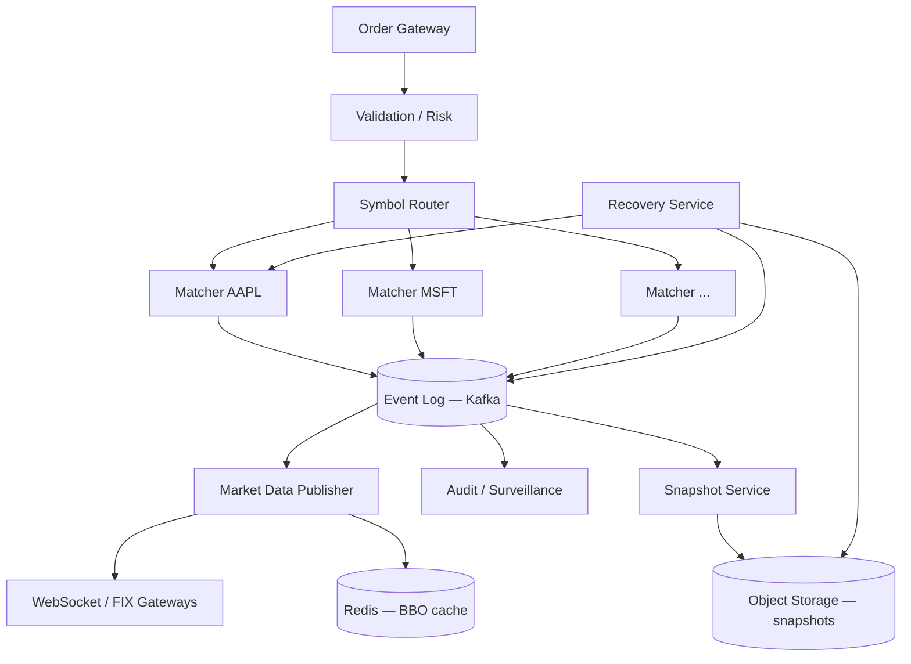
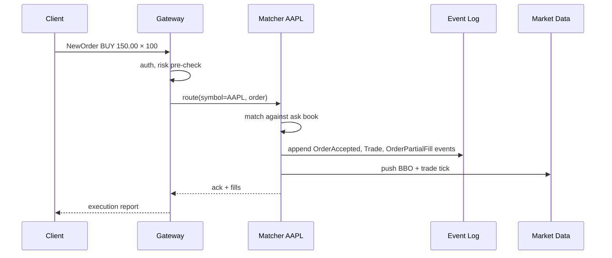

# Case Study 31 — Order Matching Engine

Design a **stock exchange order matching engine** like the core of **NASDAQ matching engine** or **Binance spot matcher**: maintain per-symbol order books, match buy/sell orders by **price-time priority**, and emit fills and market data at microsecond-to-millisecond latency with strict correctness.

## 1. Problem

Traders submit **limit** and **market** orders for symbols (e.g., `AAPL`, `BTC-USD`). The exchange must:

- Accept orders, validate funds/positions, and place them in an **order book**  
- Match incoming orders against resting liquidity using **price-time priority**  
- Emit **trades**, update **best bid/offer (BBO)**, and publish **market data**  
- Guarantee **deterministic ordering** — all participants see the same sequence of events  

A naive database-backed design cannot sustain millions of orders/day with sub-millisecond matching. The engine is a **single-writer per symbol** hot path with extreme correctness requirements.

## 2. Requirements

### Functional (MVP)

- Order types: limit (GTC), market, IOC, FOK  
- Side: buy / sell  
- Price-time priority matching within each symbol  
- Partial fills allowed (except FOK)  
- Cancel and replace (modify price/qty)  
- Trade reporting: price, qty, aggressor side, trade ID  
- Market data: BBO, last trade, depth snapshot (top N levels)  
- Order status API: open, partially filled, filled, cancelled, rejected  

### Out of scope (initially)

- Options, multi-leg spreads, auction opening/closing phases  
- Cross-symbol matching (currency conversion)  
- Retail payment settlement — assume clearing house downstream  
- Colocation / FPGA hardware design  
- Regulatory surveillance (layered separately)  

### Non-functional

- Matching latency p99 < 1 ms per order (in-memory path)  
- Throughput: 100K orders/sec aggregate across symbols; hot symbols 10K/sec  
- **Total ordering** per symbol — no ambiguous fill sequence  
- **No double fills, no lost orders** — crash recovery from durable log  
- Fairness: time priority preserved at same price level  
- Auditability: replay log → identical book state  

## 3. Back-of-the-envelope

These numbers are **rough order-of-magnitude math** — not a trading-floor capacity plan. In interviews, the goal is to show you know *what to count* and *which resource breaks first*. A useful shortcut: **1 QPS sustained ≈ 86,400 requests/day** (86,400 seconds in a day). Exchange traffic is spiky — **peak is often 3–5× average**, and a handful of hot symbols can absorb most of the volume.

### Why we estimate

An order matching engine has two worlds: **calm symbols** (small books, few updates) and **hot symbols** (NASDAQ opening, BTC-USD during volatility). Estimates tell us:

- Whether **matching CPU** or **durable logging** is the real bottleneck  
- If we need **one thread per symbol** vs shared pools  
- How much **in-memory book state** and **market-data fan-out** actually cost  

### Assumptions

| Assumption | Value | Why it matters |
|------------|-------|----------------|
| Listed symbols | 5,000 | Each symbol can be an independent matching shard |
| Orders per day | 500M | Primary write load on the engine |
| Trades per day | 50M | ~10% of orders result in fills (rest cancel/reject/rest) |
| Hot symbols | 200 (drive ~80% of volume) | Tail latency and fan-out concentrate here |
| Avg order message | 200 B | Durable event log sizing |
| Avg trade message | 150 B | Trade reporting + market data |
| Peak multiplier | 5× average | Market open, macro news, crypto volatility |

### Step A — Traffic (QPS / throughput) with labeled arithmetic

**Average order rate (all symbols combined):**

```text
Orders per day     = 500,000,000
Seconds per day    = 86,400

Avg order QPS      = 500M ÷ 86,400
                   ≈ 5,800 orders/second
```

**Peak aggregate order rate:**

```text
Peak order QPS     = 5,800 × 5
                   ≈ 29,000 orders/second (global)
```

**Hot symbol peak (design target from requirements):**

```text
Hot symbol peak    ≈ 10,000 orders/second per symbol
  (200 hot symbols × uneven distribution — a few symbols may hit this ceiling)
```

**Trade rate (fills emitted):**

```text
Trades per day     = 50,000,000
Avg trade QPS      = 50M ÷ 86,400
                   ≈ 580 trades/second

Peak trade QPS     ≈ 580 × 5 ≈ 2,900 trades/second
```

**Market-data updates (BBO + depth changes):**

```text
Each order may touch 1–3 book levels → assume ~2 updates per order on hot symbols

Hot path updates   ≈ 200 symbols × 10,000 orders/s × 2 updates
                   ≈ 4M book updates/s (internal, before filtering to external subscribers)
```

### Step B — Storage

**In-memory order book (per symbol — the hot path lives in RAM, not disk):**

```text
Small book (typical):
  10 price levels × 100 orders/level × 64 B ≈ 64 KB

Deep book (hot symbol during volatility):
  10,000 resting orders × 64 B ≈ 640 KB per symbol

All 5,000 symbols (worst-case deep):
  5,000 × 640 KB ≈ 3.2 GB total in-memory books (usually far less — most symbols are thin)
```

**Durable event log (crash recovery — this is the disk story):**

```text
Orders/day         = 500M × 200 B ≈ 100 GB/day raw order events
Trades/day         = 50M × 150 B ≈ 7.5 GB/day

With 3× replication ≈ 320 GB/day on the log cluster
  → Hourly snapshots + log compaction; replay must restore identical book state
```

### Step C — Bandwidth / other

**Market-data fan-out to internal bus (hot symbols only):**

```text
200 hot symbols × 10,000 updates/s × 100 B per update
  ≈ 200 MB/s to internal pub/sub

External subscribers (filtered multicast / WebSocket gateways):
  Thousands of clients × subset of symbols → edge filtering required;
  unfiltered fan-out would be orders of magnitude larger
```

**Matching latency budget:**

```text
Target p99 < 1 ms per order → entire match path must stay in L3 cache + RAM
  No DB round-trip on hot path; durability is async append to replicated log
```

### Step D — Ratios and capacity table

| Metric | Average | Peak | Notes |
|--------|---------|------|-------|
| Order ingest QPS | ~5,800/s | ~29,000/s | Aggregate across all symbols |
| Per hot symbol QPS | ~230/s avg | ~10,000/s | 80/20 rule — design for tail |
| Trade (fill) QPS | ~580/s | ~2,900/s | Lower than orders — many cancel/reject |
| Order:trade ratio | ~10:1 | ~10:1 | Most orders don't immediately fill |
| In-memory book | 64 KB–640 KB/symbol | — | Hot symbols need deep book structs |
| Durable log/day | ~100 GB raw | — | 3× replicated ≈ 320 GB/day |

### What the numbers tell us

- **Hot symbols (~10K orders/s each) dominate design** → one matching thread (or dedicated shard) per symbol; no cross-symbol locks on the hot path  
- **~580 trades/s average is modest; ~5,800 orders/s is the real throughput problem** → optimize order insert, cancel, and replace in the book  
- **In-memory books are tiny (KB–MB per symbol)** → RAM is not the bottleneck; **CPU + ordering + log durability** are  
- **~100 GB/day event log** → append-only Kafka/Pulsar with snapshots; replay must reproduce identical fill sequence  
- **~200 MB/s internal market-data bus** → filter at the edge; external clients never see raw 4M updates/s  
- **Sub-millisecond p99** → matching stays in-process; persistence is **async after** the match decision  

### Common mistake for this problem

Designing matching around a **shared relational database** with row locks. Interviewers want **single-writer per symbol**, in-memory price-time priority queues, and an **append-only event log** for crash recovery — not `SELECT FOR UPDATE` on a `orders` table. Another mistake: treating **trade QPS** as equal to **order QPS**; most orders cancel, rest, or partially fill without immediately generating a trade.

## 4. High-Level Design (HLD)





### Components

| Component | Role |
|-----------|------|
| Order Gateway | FIX/REST ingress, session mgmt, rate limits |
| Validation / Risk | Buying power, position limits, fat-finger checks |
| Symbol Router | Consistent hash `symbol → matcher partition` |
| Matcher (per symbol shard) | In-memory order book + matching loop |
| Event Log | Durable ordered log of all commands and effects |
| Snapshot Service | Periodic book snapshots + log offset for fast recovery |
| Market Data Publisher | BBO, trades, depth; fans out to subscribers |
| Recovery Service | Replay log from snapshot on restart |
| Audit / Surveillance | Async consumers for compliance |

### Flows

**Submit limit buy**

1. Gateway validates session, assigns `clientOrderId`, checks risk cache  
2. Router sends to matcher partition for symbol  
3. Matcher assigns monotonic `sequenceNumber`, appends `OrderAccepted` to log  
4. Matching loop tries cross with best ask:  
   - If buy price ≥ best ask → trade at resting ask price (price improvement for buyer)  
   - Repeat until order qty exhausted or book empty  
5. Remainder rests in bid book at price level (FIFO queue at that price)  
6. Append `Trade`, `OrderResting` / `OrderFilled` events  
7. Push market data delta; return execution report to client  

**Cancel**

1. Matcher finds order by `orderId` in book index  
2. If found: remove from price level FIFO, append `OrderCancelled`  
3. If already filled → reject cancel  

**Crash recovery**

1. Load latest snapshot for symbol (book state + last sequence)  
2. Replay log entries with `sequence > snapshot.offset`  
3. Rebuild in-memory indexes; resume accepting orders  

### Trade-offs

- **Single-threaded matcher vs lock-free multi-thread** — Single writer per symbol eliminates races; simplest correctness story  
- **Log-first vs match-first** — Synchronous log before ack adds latency but gives strong durability; group commit batches fsync  
- **Price levels as tree vs array** — Tree map (skip list) for sparse prices; array for tick-sized dense prices  
- **Internal FIFO vs pro-rata** — FIFO (price-time) is standard for equities; pro-rata for some futures venues  
- **Colocated binary protocol vs REST** — REST for retail; FIX/binary for HFT gateways  

## 5. Low-Level Design (LLD)

### APIs

Gateway (REST simplified):

```text
POST /api/v1/orders
Body: {
  "symbol": "AAPL",
  "side": "BUY",
  "type": "LIMIT",
  "price": "150.00",
  "qty": 100,
  "timeInForce": "GTC",
  "clientOrderId": "c-88421"
}
→ {
  "orderId": "o-99102",
  "status": "PARTIALLY_FILLED",
  "filledQty": 40,
  "remainingQty": 60,
  "avgPrice": "149.95",
  "trades": [{ "tradeId": "t-1", "price": "149.95", "qty": 40 }]
}

DELETE /api/v1/orders/:orderId
→ { "orderId": "o-99102", "status": "CANCELLED" }

GET /api/v1/orderbook/AAPL?depth=10
→ {
  "bids": [["150.00", 500], ["149.99", 1200]],
  "asks": [["150.01", 300], ["150.02", 800]],
  "sequence": 8840021
}
```

Internal matcher command (single partition):

```text
Command {
  type: NEW_ORDER | CANCEL | REPLACE,
  sequence: int64,           // assigned by matcher
  symbol: string,
  orderId: string,
  ...
}
Event {
  type: ORDER_ACCEPTED | TRADE | ORDER_FILLED | ORDER_CANCELLED | BBO_UPDATE,
  sequence: int64,
  payload: ...
}
```

Market data (WebSocket):

```text
{ "type": "trade", "symbol": "AAPL", "price": "149.95", "qty": 40, "seq": 8840021 }
{ "type": "bbo", "symbol": "AAPL", "bid": "150.00", "ask": "150.01", "seq": 8840022 }
```

### Schema

Durable log (Avro/Protobuf, compacted topics for snapshots):

```text
orders_log (
  partition_key = symbol,
  sequence      BIGINT,
  event_type    VARCHAR,
  payload       BYTES,
  timestamp_ns  BIGINT
)

snapshots (
  symbol        VARCHAR,
  snapshot_id   UUID,
  log_offset    BIGINT,
  book_blob     BYTES,          -- serialized bids/asks + order index
  created_at    TIMESTAMPTZ
)

-- Downstream OLTP for client queries (async projection)
orders_projection (
  order_id        VARCHAR PRIMARY KEY,
  client_order_id VARCHAR,
  symbol          VARCHAR,
  side            VARCHAR,
  status          VARCHAR,
  price           DECIMAL,
  qty             BIGINT,
  filled_qty      BIGINT,
  created_at      TIMESTAMPTZ
)
```

In-memory structures (per symbol):

```text
OrderBook {
  bids: PriceLevelMap            // price → PriceLevel (descending)
  asks: PriceLevelMap            // price → PriceLevel (ascending)
  orderIndex: Map<orderId, OrderLocation>
  sequence: int64
}

PriceLevel {
  price: Decimal
  totalQty: int64
  orders: DoublyLinkedList<Order>   // FIFO — time priority
}

Order {
  orderId, clientOrderId, side, price, remainingQty, timestamp
}
```

### Modules

```text
OrderGateway
SessionManager
RiskChecker
SymbolRouter
MatcherEngine
OrderBook
MatchingLoop
PriceLevel
EventLogWriter
Snapshotter
RecoveryManager
MarketDataPublisher
OrderProjectionConsumer
```

### Algorithm — price-time priority matching

```text
function processNewOrder(order):
  assign order.orderId, order.timestamp
  log.append(ORDER_ACCEPTED, order)
  trades = []

  if order.side == BUY:
    book = askBook
    comparator = order.price >= level.price
  else:
    book = bidBook
    comparator = order.price <= level.price

  while order.remainingQty > 0 and book.bestLevel exists:
    best = book.bestLevel()
    if order.type == LIMIT and not comparator(order, best):
      break

    while order.remainingQty > 0 and best.orders not empty:
      resting = best.orders.head()
      fillQty = min(order.remainingQty, resting.remainingQty)
      tradePrice = resting.price                // resting price wins

      trade = Trade(tradePrice, fillQty, aggressor=order)
      trades.append(trade)
      log.append(TRADE, trade)

      applyFill(order, fillQty)
      applyFill(resting, fillQty)
      if resting.remainingQty == 0:
        best.orders.popHead()
        orderIndex.remove(resting.orderId)

    if best.orders empty:
      book.removeLevel(best.price)

  if order.remainingQty > 0 and order.type == LIMIT and order.timeInForce != IOC:
    insertResting(order)                        // FIFO at price level
    log.append(ORDER_RESTING, order)
  else if order.remainingQty == 0:
    log.append(ORDER_FILLED, order)
  else if order.timeInForce == IOC and order.remainingQty > 0:
    log.append(ORDER_CANCELLED, order, reason=IOC)

  publishBBO()
  return trades
```

### Algorithm — insert resting order (FIFO)

```text
function insertResting(order):
  level = book.side.getOrCreate(order.price)
  level.orders.pushTail(order)                  // time priority
  orderIndex[order.orderId] = { price, nodeRef }
  level.totalQty += order.remainingQty
```

### Algorithm — cancel and replace

```text
function cancel(orderId):
  loc = orderIndex.get(orderId)
  if loc is null: return REJECT_UNKNOWN
  level = book.side[loc.price]
  level.orders.remove(loc.nodeRef)
  orderIndex.remove(orderId)
  log.append(ORDER_CANCELLED, orderId)

function replace(orderId, newPrice, newQty):
  old = orderIndex.get(orderId)
  if old is null: return REJECT
  cancelled = cancel(orderId)
  newOrder = cloneWith(newPrice, newQty)
  return processNewOrder(newOrder)              // loses time priority at new price
```

### Algorithm — deterministic recovery

```text
function recover(symbol):
  snap = snapshotStore.latest(symbol)
  book = deserialize(snap.book_blob)
  seq = snap.log_offset

  for event in log.read(symbol, from=seq+1):
    assert event.sequence == seq + 1
    applyEventToBook(book, event)               // same code as live path
    seq = event.sequence

  return MatcherEngine(book, seq)
```

### Algorithm — group commit to log (latency vs durability)

```text
function matcherLoop():
  batch = []
  loop:
    cmd = inboundQueue.poll(timeout=100µs)
    if cmd: batch.append(cmd)
    if batch not empty and (batch.size >= 64 or timeout elapsed):
      events = []
      for cmd in batch:
        events += execute(cmd)                  // produces events in memory
      log.appendSync(events)                    // fsync or Kafka ack all
      outboundAck(batch)
      batch.clear()
```

### Concurrency & correctness

- **Single thread per symbol partition** — all book mutations serial; no locks  
- **Monotonic sequence** — every event gets `sequence++`; consumers detect gaps  
- **Idempotent clientOrderId** — gateway dedup window prevents double submit  
- **FOK pre-check** — simulate match without mutation; abort if cannot fill entirely  
- **Market orders** — walk book until qty filled; uncross at any price level  
- **Self-trade prevention (STP)** — optional: cancel resting if same `accountId`  
- **Invariant checks** (debug): `sum(level.qty) == sum(orders.qty)`; no negative qty  

### Failure modes

| Failure | Symptom | Mitigation |
|---------|---------|------------|
| Matcher crash mid-batch | Uncommitted orders lost | Log-before-ack; replay uncommitted |
| Log partition unavailable | Cannot accept orders | Halt matching for symbol; fail closed |
| Slow consumer (market data) | Backpressure | Separate log for MD; matcher never blocks on WS |
| Clock skew on timestamps | Display-only issue | Matching uses arrival sequence, not wall clock |
| Duplicate gateway delivery | Double order | Dedup `clientOrderId` at gateway + matcher |
| Snapshot corruption | Bad recovery | Keep N snapshots; verify checksum; replay from older |
| Hot symbol overload | Latency spike | Shard sub-books (rare); colocate; binary protocol |

## 6. Scale evolution

| Stage | Change |
|-------|--------|
| MVP | Single process, all symbols, in-memory + local WAL |
| Production | Partition by symbol hash; dedicated matcher VMs |
| Hot symbols | Isolated partition per mega-cap; CPU pinning |
| HA | Active-passive per partition via leader lease; standby hot replay |
| Global exchange | Symbol locality; matching in one region per listing |
| Ultra-low latency | Kernel bypass NIC, custom binary, snapshot to PMEM |

## 7. Recap

- **Price-time priority** = best price first, then FIFO within level  
- **Single writer per symbol** is the standard correctness pattern  
- **Event log + snapshots** enable crash recovery and audit replay  
- Matching is CPU-bound and in-memory; **don't put the book in Postgres**  
- Market data is a **read-only projection** of the same ordered events  

**Practice:** draw the order book for a sequence of 5 orders (buys/sells/cancels), list resulting trades, then write `processNewOrder` pseudocode including partial fills and IOC behavior.
