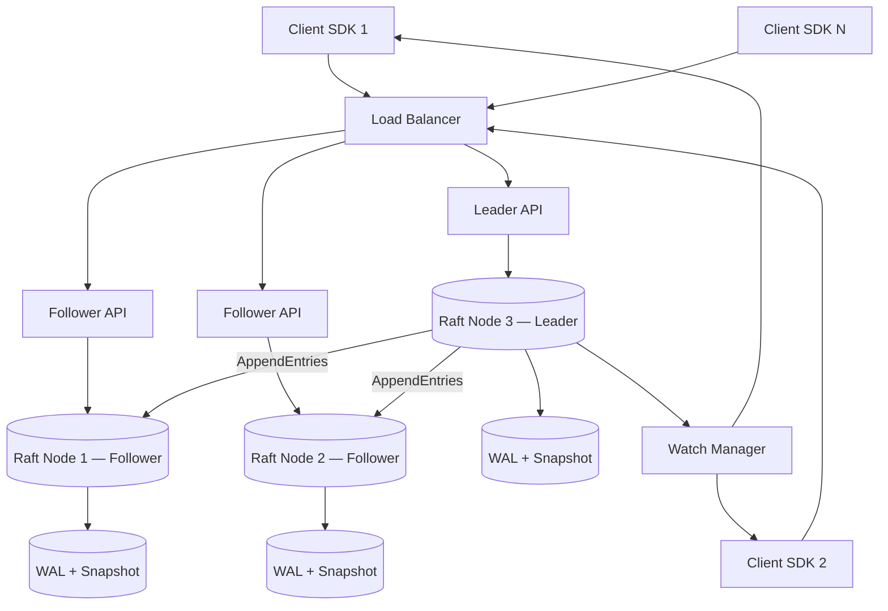
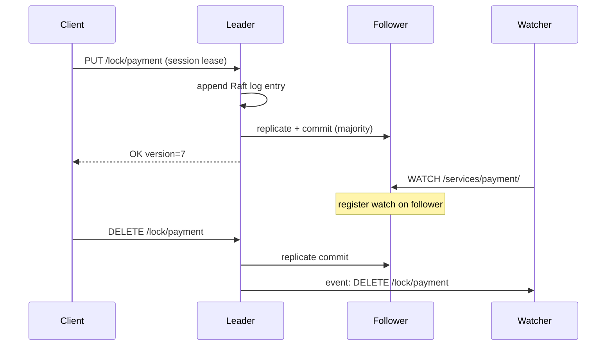
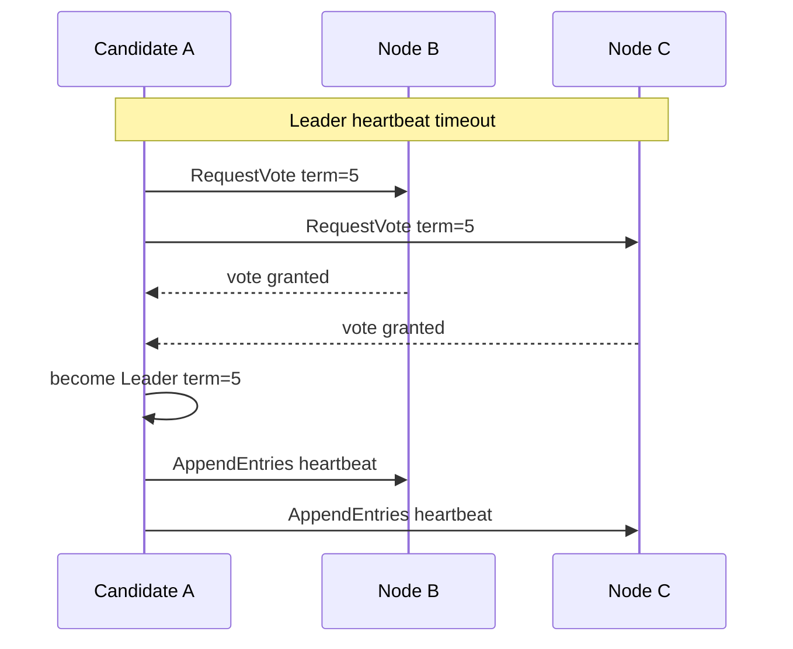

# Case Study 32 — Distributed Coordination Service

Design a **distributed coordination service** like **etcd**, **Apache ZooKeeper**, or **Google Chubby**: strongly consistent metadata, **distributed locks**, **leases**, **watches**, and **leader election** built on **consensus** (Raft).

## 1. Problem

In a distributed system, nodes need a **small, strongly consistent** metadata store to:

- Elect a **leader** (only one scheduler, one primary writer)  
- Hold **configuration** (service registry, feature flags, routing rules)  
- Implement **distributed locks** with fencing  
- Notify clients of changes via **watches** (push-ish notifications)  
- Store **ephemeral nodes** that vanish when a session dies  

Unlike a general database, the data set is **small** (MB–low GB), read/write ratio varies, but **linearizable reads/writes** and **valid watches** are mandatory. CAP trade-off: choose **CP** — partition tolerance + consistency; sacrifice availability during minority partition.

## 2. Requirements

### Functional (MVP)

- Key-value store: `GET`, `PUT`, `DELETE` on hierarchical keys (`/services/payment/leader`)  
- **Linearizable** writes and optional linearizable reads  
- **Ephemeral keys** tied to session lease — auto-delete on session expiry  
- **Watches**: subscribe to key/prefix; receive events on change  
- **Distributed lock**: acquire, release, optional fencing token  
- **Compare-and-swap (CAS)**: `PUT if version == X`  
- **Leader election**: candidates compete via ephemeral sequential keys  
- Session: heartbeat keeps lease alive; client gets session expired callback  

### Out of scope (initially)

- SQL queries, secondary indexes, full-text search  
- Multi-key transactions spanning unrelated subtrees (MVP: single-key CAS)  
- Geo-replicated active-active (single Raft cluster per cell)  
- Petabyte storage — this is coordination, not data lake  

### Non-functional

- Write throughput: 10K ops/s per cluster (typical etcd class)  
- Read throughput: 100K+ ops/s with follower reads (bounded staleness option)  
- Latency: p99 write < 10 ms LAN; watch notification < 100 ms  
- Fault tolerance: survive `(N-1)/2` failures with N=3 or N=5 nodes  
- **Safety**: never lose committed writes; never serve stale leader writes  
- **Liveness**: elect new leader within seconds of leader failure  

## 3. Back-of-the-envelope

Assumptions:

- 5-node Raft cluster  
- 2,000 clients, 5K write ops/s peak, 50K read ops/s peak  
- Average key size 256 B; 500K keys total  
- Watch fan-out: 10K active watches; 1K key changes/s peak  

```text
Storage ≈ 500K × 256 B ≈ 128 MB (+ Raft log overhead — tiny)

Raft log append:
  5K writes/s × ~500 B entry ≈ 2.5 MB/s
  Snapshot every 10K entries → compact old log

Read path (quorum read):
  50K reads/s × 3 RTTs if linearizable → heavy
  → follower reads + lease: most reads local, ~95% reduction in leader load

Watch notifications:
  1K changes/s × avg 10 watchers/key ≈ 10K events/s push
  Batch + coalesce prefix watches

Network between nodes:
  Replication: 2.5 MB/s × 2 followers ≈ 5 MB/s (modest)
  Leader election: rare; 1-2 s timeout typical
```

Insight: **consensus on a small log** is the bottleneck — batch writes, snapshot aggressively, offer **consistent reads** via quorum or **bounded-staleness reads** from followers with leader lease verification.

## 4. High-Level Design (HLD)







### Components

| Component | Role |
|-----------|------|
| Raft module | Leader election, log replication, snapshot |
| State machine (KV tree) | Apply committed log entries to in-memory tree |
| Session manager | Client leases, TTL, ephemeral key GC |
| Watch manager | Register watches; fan-out on apply |
| API server | gRPC/HTTP: get, put, delete, watch, lock helpers |
| WAL | Persistent log segments on each node |
| Snapshotter | Compact log; send InstallSnapshot to slow followers |

### Flows

**Linearizable write**

1. Client sends `PUT` to any node; if not leader, redirect or forward  
2. Leader assigns log index, appends to local WAL  
3. Replicate to followers via `AppendEntries`; wait for majority ack  
4. Commit entry; apply to state machine; respond to client  
5. Trigger watches for affected keys/prefixes  

**Session + ephemeral node**

1. Client `CreateSession(ttl=30s)` → receives `sessionId`  
2. Client sends keep-alive every 10s; leader extends lease  
3. Client `PUT /workers/w1 EPHEMERAL session=sessionId`  
4. If keep-alive stops → session expires → delete all ephemeral keys → watch events fire  

**Distributed lock (correct pattern)**

1. Create ephemeral sequential key `/locks/payment/lock-0000000123`  
2. If lowest sequence among `/locks/payment/*` → hold lock  
3. Else watch previous sequence key; wake on delete  
4. Return **fencing token** = sequence number for downstream resources  

**Watch**

1. Client registers watch on `/services/payment/` (prefix)  
2. On state machine apply of any key under prefix → enqueue event  
3. Server streams event to client; client must **ack/progress** or watch may cancel on disconnect  

### Trade-offs

- **Raft vs Paxos vs Zab** — Raft is easier to teach/implement; etcd/ZK use Raft-ish / Zab  
- **Linearizable read cost** — Quorum read or `ReadIndex` from leader vs stale follower read  
- **Watch on leader vs follower** — Follower watches lag one apply; leader watches add leader load  
- **Ephemeral via session vs TTL key** — Session model (ZK) vs lease per key (etcd)  
- **CP vs AP service discovery** — Coordination is CP; cache reads in clients with watch refresh  

## 5. Low-Level Design (LLD)

### APIs

```text
PUT /v3/kv/put
Body: { "key": "base64...", "value": "base64...", "lease": 123, "prevKv": true }
→ { "header": { "revision": 88421 }, "prevKv": { ... } }

GET /v3/kv/range
Body: { "key": "...", "range_end": "...", "serializable": false }
→ { "kvs": [{ "key", "value", "create_revision", "mod_revision", "version" }] }

DELETE /v3/kv/deleterange
Body: { "key": "...", "range_end": "..." }

POST /v3/lease/grant
Body: { "TTL": 30, "ID": 0 }
→ { "ID": 123, "TTL": 30 }

POST /v3/lease/keepalive
Body: { "ID": 123 }

POST /v3/watch
Body: { "create_request": { "key": "...", "range_end": "...", "prefix": true } }
→ stream of { "events": [{ "type": "PUT|DELETE", "kv": { ... } }] }

POST /v3/lock/acquire
Body: { "name": "payment-processor" }
→ { "key": "/locks/payment-processor/000000042", "header": { "revision": 42 } }
```

Lock helper semantics (client-side recipe):

```text
1. Grant lease
2. Create ephemeral sequential node under lock path
3. List children; if mine is smallest → acquired
4. Else set watch on next smaller node; wait
5. On acquire, pass mod_revision as fencing token to DB/shard
```

### Schema

Raft log entry (on disk):

```text
LogEntry {
  term:      uint64,
  index:     uint64,
  op_type:   PUT | DELETE | CAS | SESSION_EXPIRE,
  key:       bytes,
  value:     bytes,
  lease_id:  uint64,
  cas_version: uint64
}
```

State machine (in memory):

```text
Node {
  value:           bytes,
  create_revision: int64,
  mod_revision:    int64,
  version:         int64,        // per-key change count for CAS
  lease:           uint64 | null
}

Tree = Map<path, Node> + revision counter (global monotonic)
Session {
  id: uint64,
  expiry: timestamp,
  ephemeral_keys: Set<path>
}
WatchRegistration {
  watch_id, client_stream, key_prefix, start_revision
}
```

Applied metadata:

```text
-- Not SQL — conceptual
revisions: global counter incremented each write
leases: id → expiry heap for GC
watches: trie keyed by path prefix → subscriber list
```

### Modules

```text
RaftNode
  ElectionManager
  LogReplicator
  SnapshotManager
  ApplyLoop
KVStateMachine
SessionLeaseManager
WatchManager
LockRecipeHelper
APIFrontEnd
LinearizableReadIndex
SerializableReadHandler
```

### Algorithm — Raft leader write path

```text
function handlePut(key, value, lease):
  if not isLeader(): redirect to leader

  entry = LogEntry{ term, index=nextIndex(), PUT, key, value, lease }
  wal.append(entry)
  replicateToFollowers(entry.index)
  waitUntilCommitIndex >= entry.index        // majority ack

  apply(entry)                               // state machine
  notifyWatches(entry)
  return success(mod_revision)
```

### Algorithm — apply to state machine

```text
function apply(entry):
  global revision++
  switch entry.op_type:
    PUT:
      if entry.cas_version > 0:
        if tree[entry.key].version != entry.cas_version:
          return CAS_FAILED
      tree[entry.key] = Node(value, revision, version++)
      if entry.lease: attachLease(entry.key, entry.lease)
    DELETE:
      tree.delete(entry.key)
    SESSION_EXPIRE:
      for key in session.ephemeral_keys:
        tree.delete(key)
        enqueueWatch(DELETE, key)
```

### Algorithm — linearizable read (ReadIndex)

```text
function linearizableGet(key):
  if not isLeader(): forward

  // Ensure this leader is still valid
  readIndex = appendHeartbeatConfirmation()  // quorum ack of commit index
  if leaderTerm changed: retry

  // Wait for state machine applied through readIndex
  wait(appliedIndex >= readIndex)

  return tree.get(key)
```

### Algorithm — watch delivery with revision

```text
function registerWatch(prefix, startRevision, client):
  watches.add({ prefix, startRevision, client })

function notifyWatches(entry):
  affected = keysMatching(entry.key)
  for watch in watches:
    if entry.mod_revision > watch.startRevision and prefixMatch(watch.prefix, entry.key):
      client.send({ type, key, value, mod_revision })

function catchUpWatch(watch):
  // On reconnect: replay history from startRevision via log or MVCC store
  for rev in (watch.startRevision, currentRevision]:
    emit events from revision log
```

### Algorithm — distributed lock with fencing

```text
function acquireLock(path, session):
  myKey = createEphemeralSequential(path + "/lock-", session)
  children = listChildren(path)
  sort(children)
  if myKey == children[0]:
    token = getModRevision(myKey)
    return ACQUIRED, token

  prev = childBefore(myKey, children)
  watch(prev)
  return WAITING

function useResourceWithLock(db, token):
  // CRITICAL: resource must reject stale lock holders
  db.write("UPDATE shards SET owner=me WHERE fencing_token < ?", token)
```

### Algorithm — session keep-alive and expiry

```text
function keepAliveLoop(sessionId):
  every TTL/3:
    send LeaseKeepAlive(sessionId)

function leaseGC():
  while minHeap.peek().expiry < now:
    session = minHeap.pop()
    apply(SESSION_EXPIRE, session)
    // deletes ephemeral keys atomically in apply
```

### Concurrency & correctness

- **All mutations through Raft** — single ordered apply loop per node  
- **At most one leader per term** — Raft safety proof  
- **Fencing tokens** — lock alone is insufficient; storage layer must validate token  
- **Watch ordering** — events per key ordered by revision; client tracks `startRevision`  
- **Split brain prevention** — old leader steps down when higher term seen  
- **Don't use lock for long work** — hold lock only to elect/assign, not for entire job  

### Failure modes

| Failure | Behavior | Mitigation |
|---------|----------|------------|
| Leader dies | Writes pause until election | 3+ nodes; election timeout ~1s |
| Network partition (minority) | Minority stops accepting writes | CP — minority unavailable |
| Slow follower | Log diverges | Snapshot + InstallSnapshot |
| Client session expires | Ephemeral keys deleted | Heartbeat + jitter |
| Watch flood | Leader CPU spike | Coalesce; watch on followers |
| Lock without fencing | Split-brain writes to DB | Require fencing token at resource |
| Stale leader read | Violates linearizability | ReadIndex or quorum read |
| Huge key space | Memory blowup | Not designed for this — use real DB |

## 6. Scale evolution

| Stage | Change |
|-------|--------|
| MVP | 3-node Raft; single cluster; gRPC API |
| Read scale | Serializable follower reads + watch on followers |
| Multi-tenant | Key prefix quotas; rate limits per client cert |
| Many clusters | One etcd per AZ/cell; higher-level aggregator |
| Large watch count | Sharded watch managers; gRPC streaming backpressure |
| Cross-region | Separate Raft per region; async config replication (not one global Raft) |

## 7. Recap

- Built on **consensus (Raft)** — committed log applied to KV state machine  
- **Sessions + ephemeral nodes** enable crash detection and leader election recipes  
- **Watches** turn poll into push; clients must handle gaps via revision  
- **Distributed locks need fencing** — the lock service alone doesn't prevent split brain  
- Choose **CP**: consistent coordination beats availability during partition  

**Practice:** draw Raft roles during normal operation and after leader failure; write pseudocode for lock acquire with sequential ephemeral keys and explain why fencing tokens matter.
