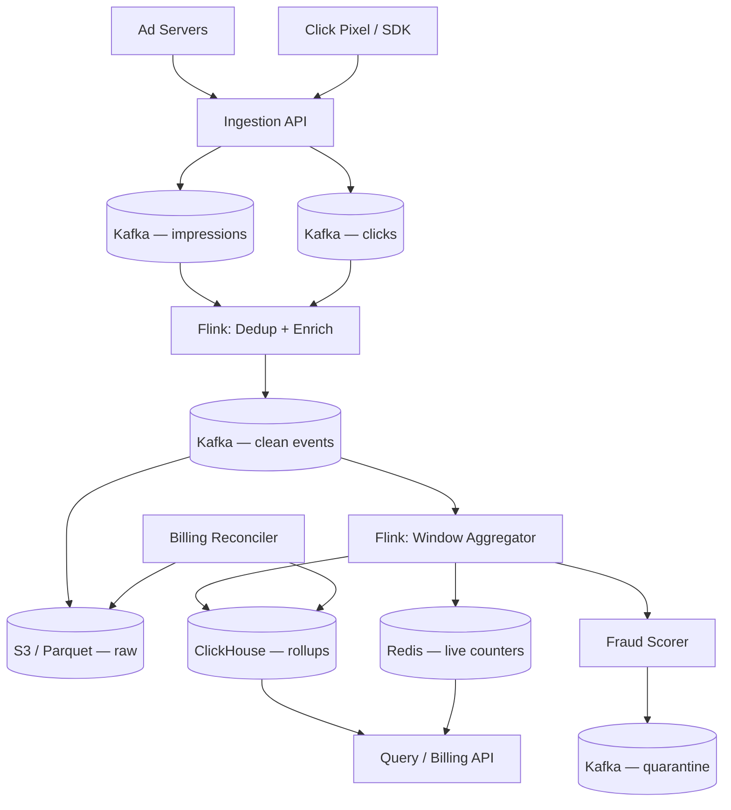
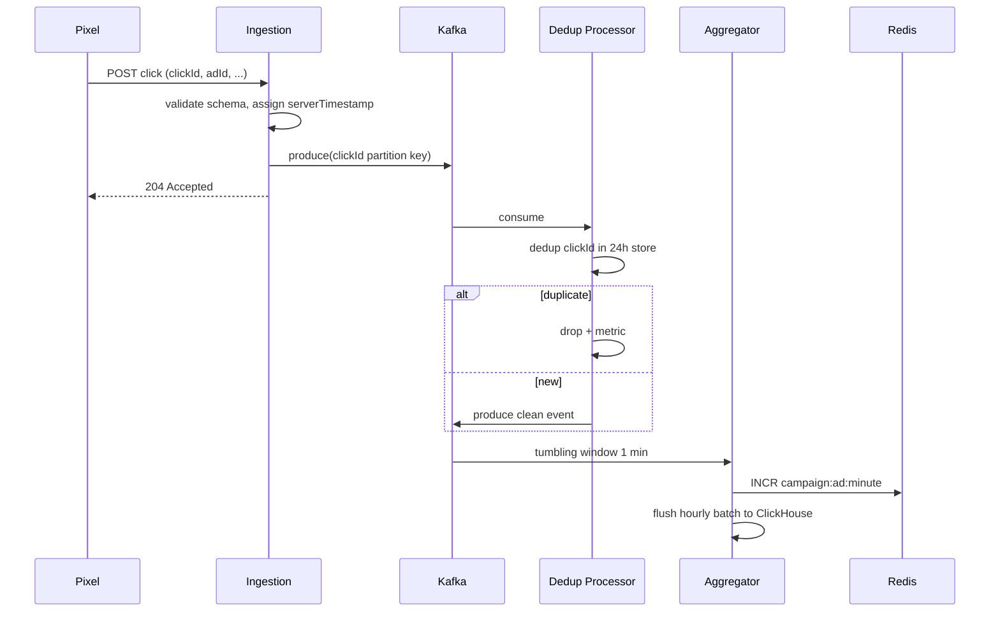
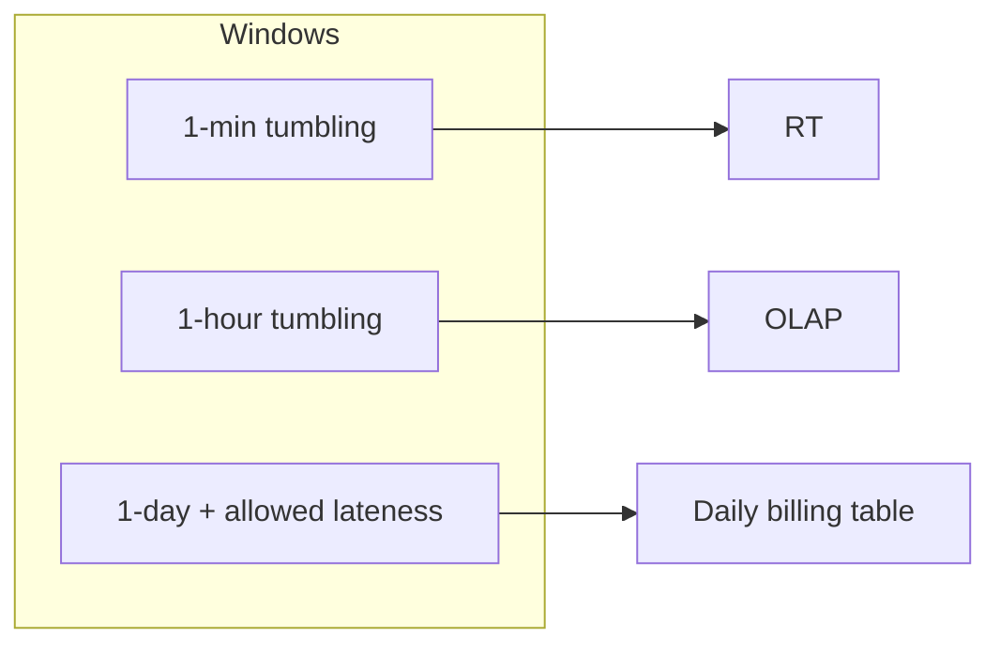

# Case Study 33 — Ad Click / Impression Aggregation

Design a **real-time ad analytics pipeline** like **Google Ads reporting** or **Meta Ads Insights** at **billions of impressions and clicks per day**: ingest high-volume events, **deduplicate**, aggregate in **time windows**, detect **fraud**, and serve billing-grade rollups to advertisers and auction systems.

## 1. Problem

When users view or click ads, the system emits events:

- `impression { adId, campaignId, userId, timestamp, placement, bidId }`  
- `click { adId, clickId, userId, timestamp, referrer }`  

Advertisers need:

- Counts per campaign/ad/creative **per hour and day**  
- **Unique users** (reach) and **CTR**  
- Near-real-time dashboards (minutes lag)  
- **Billing** based on verified impressions/clicks  

Challenges: **extreme volume**, **duplicate events** (retries, client bugs), **late arrivals**, **bot/fraud traffic**, and **exactly-once billing semantics** (or strong idempotent approximations).

## 2. Requirements

### Functional (MVP)

- Ingest impression and click events from ad servers and pixels  
- Dedupe by `(eventType, eventId)` or composite key  
- Rolling aggregates: counts per `(campaignId, hour)` and `(adId, day)`  
- Unique user estimates per campaign (HyperLogLog acceptable for reach)  
- Fraud signals: IP velocity, device fingerprint anomalies → flag or drop  
- Query API: campaign stats for date range; real-time last-hour counters  
- Export to data warehouse for billing reconciliation  

### Out of scope (initially)

- Attribution modeling (multi-touch, view-through conversion windows)  
- ML bid optimization feedback loop (only raw features export)  
- Sub-second alerting on spend caps (near-real-time minute granularity OK)  
- Per-user cross-device identity graph  

### Non-functional

- Ingest: 500K–2M events/sec peak globally  
- Ingestion ack p99 < 50 ms (async pipeline after ack)  
- Aggregation lag: < 5 minutes for dashboards; daily billing by T+1  
- Durability: no silent loss — at-least-once ingest + idempotent agg  
- Accuracy: billed clicks within 0.01% of audited reconciliation  
- Cost-efficient: tier hot vs cold; compress raw events  

## 3. Back-of-the-envelope

Assumptions:

- 10B impressions/day, 200M clicks/day (2% CTR)  
- Average event size 400 bytes  
- Peak 5× average; 3 regions  
- Dedup window: 24 hours  

```text
Impression avg ≈ 10B / 86,400 ≈ 115,700/s
Click avg      ≈ 200M / 86,400 ≈ 2,300/s
Combined avg   ≈ 118,000/s
Peak           ≈ 590,000/s

Daily raw volume ≈ 10.2B × 400 B ≈ 4 TB/day uncompressed
Compressed (~5×) ≈ 800 GB/day in object storage

Dedup store (24h):
  10.2B event IDs × 16 B (UUID hash) ≈ 163 GB
  → Redis Cluster / DynamoDB TTL partitions by hour

Hourly rollup rows:
  100K active ads × 24 h × 30 days ≈ 72M rows/month (manageable in OLAP)

Unique users (HyperLogLog):
  per campaign per day: ~12 KB × 10K campaigns ≈ 120 MB/day
```

Insight: **never block ingestion on aggregation** — durable log first; **idempotent dedup + windowed aggregation** in stream processors; separate **fast counters** (Redis) from **authoritative OLAP** (ClickHouse/BigQuery).

## 4. High-Level Design (HLD)







### Components

| Component | Role |
|-----------|------|
| Ingestion API | Stateless; validate; partition by `campaignId` or `adId` |
| Kafka | Durable buffer; separate topics for raw vs clean |
| Dedup processor | Flink/Streams; TTL store keyed by `eventId` |
| Enrichment | Join geo, device, campaign metadata (async broadcast state) |
| Window aggregator | Tumbling/sliding windows; emit partial + final results |
| Fraud scorer | Rules + ML; route suspicious events to quarantine topic |
| Redis | Sub-minute live counters for dashboards |
| ClickHouse | Authoritative hourly/daily aggregates; fast SQL |
| Data lake | Parquet for audit replay and billing reconciliation |
| Query API | Merges Redis (live) + ClickHouse (historical) |
| Billing reconciler | Batch job compares OLAP vs finance ledger |

### Flows

**Impression path**

1. Ad server fires impression with unique `impressionId`  
2. Ingestion validates, adds `receivedAt`, produces to Kafka  
3. Dedup: if `impressionId` seen in 24h → drop  
4. Enrich with campaign/advertiser from cache  
5. Aggregate into 1-min window → increment Redis  
6. On window close → upsert ClickHouse `impressions_hourly`  

**Click path (billing-sensitive)**

1. Pixel sends click with `clickId` (UUID from redirect)  
2. Dedup strictly on `clickId` — duplicates from retry must not double-count  
3. Fraud check: IP > 10 clicks/min → tag `suspicious`  
4. Clean clicks increment counters; suspicious go to quarantine for review  
5. Daily job produces `billable_clicks` excluding quarantined  

**Late events**

1. Hourly window with **allowed lateness** 2 hours (configurable)  
2. Late event triggers **retraction + correction** or side-output to correction stream  
3. Billing uses **closed day** only after lateness window passes  

### Trade-offs

- **Exact dedup vs Bloom filter** — Exact TTL store (DynamoDB/Redis) for billing; Bloom OK for non-billing metrics  
- **HyperLogLog vs exact unique** — HLL for reach dashboards; exact sets only for small campaigns  
- **Lambda vs Kappa** — Single stream pipeline (Kappa) with replay from lake for backfill  
- **At-least-once + idempotent agg vs exactly-once Flink** — Idempotent upserts simpler ops; EOS Flink reduces correction complexity  
- **Sync fraud vs async** — Async quarantine avoids blocking hot path; pre-bill filter for obvious bots  

## 5. Low-Level Design (LLD)

### APIs

```text
POST /v1/events/impression
Body: {
  "impressionId": "imp-uuid-...",
  "adId": "ad_4421",
  "campaignId": "camp_88",
  "userId": "u_hash_abc",
  "timestamp": "2026-07-20T10:00:01.123Z",
  "placement": "feed",
  "bidId": "bid_991"
}
→ 204 No Content

POST /v1/events/click
Body: {
  "clickId": "clk-uuid-...",
  "impressionId": "imp-uuid-...",
  "adId": "ad_4421",
  "userId": "u_hash_abc",
  "timestamp": "2026-07-20T10:00:05.456Z"
}
→ 204

GET /v1/stats/campaigns/:id?from=2026-07-19&to=2026-07-20
→ {
  "impressions": 12450000,
  "clicks": 249000,
  "ctr": 0.02,
  "uniqueUsersEstimate": 8200000,
  "billableClicks": 248500
}

GET /v1/stats/campaigns/:id/live
→ { "lastHour": { "impressions": 52000, "clicks": 1040 }, "asOf": "..." }
```

Internal aggregation key:

```text
aggKey = hash(campaignId, adId, windowStart, eventType)
```

### Schema

ClickHouse (authoritative rollups):

```text
impressions_hourly (
  campaign_id   UInt64,
  ad_id         UInt64,
  hour          DateTime,
  impressions   UInt64,
  unique_users  AggregateFunction(uniqCombined, userId),
  version       UInt64              -- for ReplacingMergeTree
)
ENGINE = ReplacingMergeTree(version)
PARTITION BY toYYYYMM(hour)
ORDER BY (campaign_id, ad_id, hour)

clicks_hourly (
  campaign_id     UInt64,
  ad_id           UInt64,
  hour            DateTime,
  clicks          UInt64,
  billable_clicks UInt64,
  fraud_clicks    UInt64,
  version         UInt64
)

clicks_daily_billing (
  campaign_id     UInt64,
  day             Date,
  billable_clicks UInt64,
  amount_micros   Int64,
  reconciled      Boolean
)
```

Dedup store (DynamoDB / Redis):

```text
dedup (
  pk = eventType#eventId,
  ttl = epoch + 86400
)
```

Raw lake (Parquet):

```text
s3://ads-events/year=2026/month=07/day=20/hour=10/
  part-000.parquet  -- all fields + ingestMeta
```

Fraud quarantine:

```text
fraud_events (
  event_id, reason_code, score, payload_json, created_at
)
```

### Modules

```text
IngestionController
EventValidator
SchemaRegistryClient
KafkaProducer
DedupFunction                 (Flink ProcessFunction)
EnrichmentBroadcastJoin
WindowAggregator
LateEventHandler
FraudRuleEngine
RedisCounterSink
ClickHouseSink
QueryService
BillingReconciler
BackfillJob
```

### Algorithm — ingestion with partition key

```text
function ingest(event):
  validateSchema(event)
  if event.timestamp skew > 7 days: reject

  key = hash(event.campaignId) mod numPartitions
  kafka.produce(
    topic = event.type,
    key = key,
    value = event,
    headers = { receivedAt: now() }
  )
  return 204
```

### Algorithm — exact dedup (24h TTL)

```text
function dedup(event):
  pk = event.type + "#" + event.eventId

  // atomic set-if-not-exists with TTL
  isNew = dedupStore.setNX(pk, "1", ttl=86400)

  if not isNew:
    metrics.increment("dedup_dropped")
    return DROP

  return EMIT(event)
```

State backend (Flink): `ValueState<Boolean>` keyed by `eventId` with TTL 24h — same semantics.

### Algorithm — tumbling window aggregation with allowed lateness

```text
function aggregateByWindow(event, windowSize=1 hour, allowedLateness=2 hours):
  eventTime = parseTimestamp(event.timestamp)
  windowStart = floor(eventTime, windowSize)

  onElement(event):
    if eventTime < currentWatermark - allowedLateness:
      sideOutput(LATE_CORRECTIONS, event)
      return

    acc = state.get(windowStart, aggKey)
    acc.count += 1
    acc.userHLL.add(event.userId)
    state.put(windowStart, aggKey, acc)

  onWatermark(watermark):
    for window where windowEnd + allowedLateness <= watermark:
      emitFinal(window)
      state.clear(window)
```

### Algorithm — idempotent ClickHouse upsert

```text
function emitFinal(window, aggKey, acc):
  row = {
    campaign_id, ad_id, hour: windowStart,
    impressions: acc.count,
    unique_users: acc.userHLL,
    version: windowStart.epoch + acc.count   // monotonic for ReplacingMergeTree
  }
  clickhouse.insert("impressions_hourly", row)

// Query uses FINAL or argMax by version for correct merge
```

### Algorithm — fraud scoring (rules + rate limit)

```text
function scoreClick(event):
  score = 0
  ipKey = "ip:" + event.ip + ":min:" + floor(now, 60s)
  ipCount = redis.incr(ipKey, ttl=60)
  if ipCount > 10: score += 50

  if event.userAgent matches BOT_PATTERNS: score += 40
  if geoMismatch(event.ipGeo, event.deviceGeo): score += 30
  if duplicateClickSameUserAd(event, window=10s): score += 60

  if score >= 70:
    return QUARANTINE
  if score >= 40:
    return SUSPICIOUS_BUT_COUNT  // or exclude from billing only
  return CLEAN
```

### Algorithm — billing reconciliation (T+1)

```text
function reconcileDay(day):
  olap = clickhouse.query("""
    SELECT campaign_id, sum(billable_clicks)
    FROM clicks_daily_billing FINAL
    WHERE day = ?
  """, day)

  for row in olap:
    ledger = finance.getBilled(row.campaign_id, day)
    if abs(row.clicks - ledger.clicks) / ledger.clicks > 0.0001:
      alert("billing drift", row)
      replayFromLake(day, row.campaign_id)   // audit trail
```

### Algorithm — query merge (live + historical)

```text
function getCampaignStats(campaignId, from, to):
  historical = clickhouse.sum(campaignId, from, to)
  if to includes current hour:
    live = redis.mget(campaignId, currentHourBuckets)
    return merge(historical, live)
  return historical
```

### Concurrency & correctness

- **Idempotent dedup** — same `eventId` always maps to one counted event  
- **Monotonic version** on rollup rows — ReplacingMergeTree resolves duplicates from replay  
- **Watermark lag** — allowed lateness trades freshness vs correction cost  
- **Partition by campaignId** — ordering per campaign; hot campaigns isolated  
- **Billing cutoff** — day closes only after lateness window; immutable billing table  
- **Replay safety** — backfill from lake must use same dedup keys or versioned upserts  

### Failure modes

| Failure | Impact | Mitigation |
|---------|--------|------------|
| Kafka broker down | Ingestion backpressure | Multi-AZ cluster; producer retries |
| Dedup store hot partition | Slow dedup | Shard by hash(eventId); not campaign |
| Flink checkpoint fail | Reprocess window | Idempotent sinks; EOS or upsert |
| Redis loss | Live dashboard wrong | Rebuild from Kafka; OLAP authoritative |
| Clock skew on clients | Wrong window | Use server `receivedAt` for windowing |
| Fraud false positives | Revenue loss | Quarantine not drop; human review queue |
| Duplicate billing job | Double charge | `reconciled` flag + idempotent job key |

## 6. Scale evolution

| Stage | Change |
|-------|--------|
| MVP | Kafka + Flink + ClickHouse + Redis; single region |
| 100K events/s | Increase partitions; scale Flink parallelism = partitions |
| 1M events/s | Regional ingest; dedup store sharded (DynamoDB) |
| Global | Per-region aggregation; merge at query with timezone rules |
| Billing hardening | Exactly-once Flink + audit lake; finance-grade reconciliation |
| Real-time bidding feedback | Sub-second feature store branch (separate from billing path) |

## 7. Recap

- **Ingest fast, process async** — Kafka buffers spikes  
- **Exact dedup** on billing IDs; TTL aligned to retry window  
- **Windowed aggregation** with watermarks handles late data  
- **Redis for live, ClickHouse for truth** — merge at query time  
- **Fraud is a side path** — don't block ingestion; quarantine and reconcile  

**Practice:** compute peak QPS and dedup store size for your own assumptions; draw the dedup → window → sink pipeline and write pseudocode for `dedup` + hourly `emitFinal` with allowed lateness.
