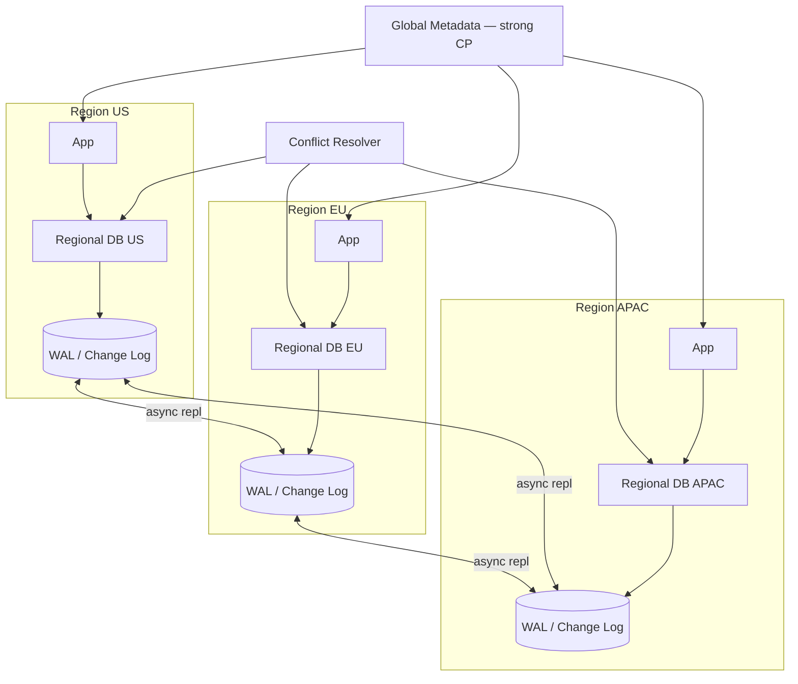
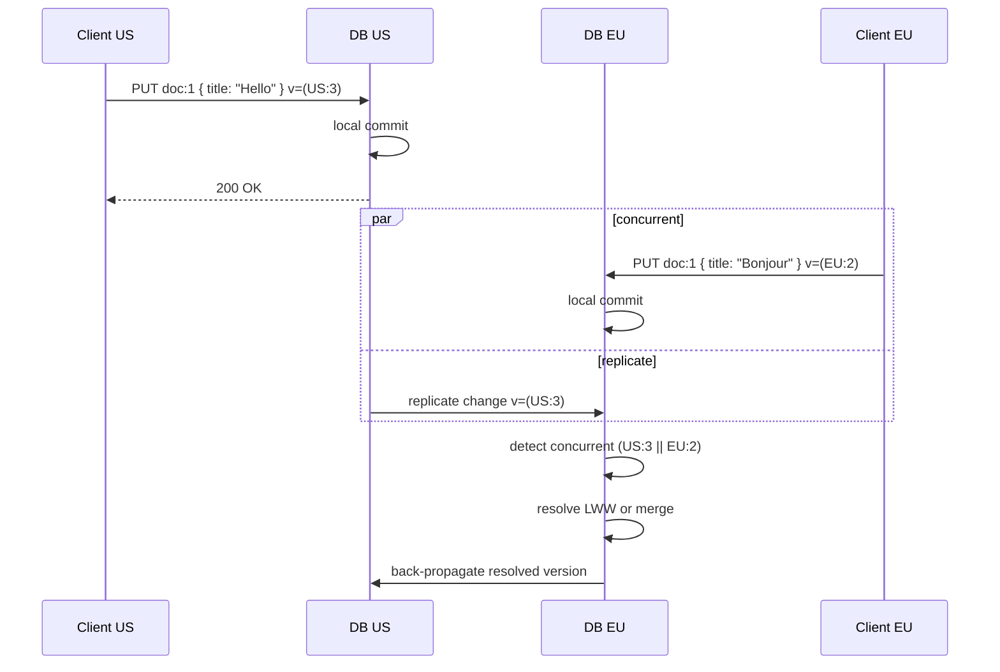
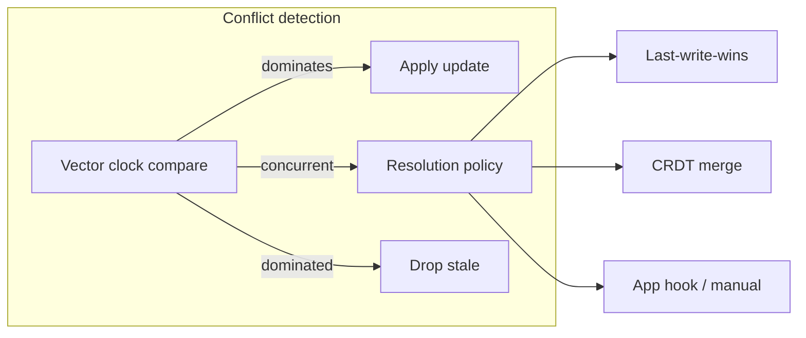

# Case Study 34 — Multi-Region Active-Active Database

Design a **multi-region active-active database** where applications in **US, EU, and APAC** read and write concurrently with **low latency**, accepting that networks partition and clocks skew. Cover **conflict detection**, **vector clocks**, **CRDT basics**, and when to choose **last-write-wins (LWW)** vs **stronger guarantees**.

## 1. Problem

A global SaaS product (notes, shopping carts, user profiles) wants:

- **Local read/write** in each region (< 20 ms to app)  
- **High availability** — region failure doesn't halt global service  
- **No single-region bottleneck** for writes  

Traditional primary-replica replication gives one write region; failover promotes a replica but isn't active-active. True active-active means **concurrent writes to the same logical object** from multiple regions — conflicts become inevitable.

You must define **conflict resolution**, **consistency tiers per entity**, and **replication mechanics** without pretending CAP doesn't apply.

## 2. Requirements

### Functional (MVP)

- Replicate entities: `User`, `Document`, `Cart` across 3 regions  
- CRUD from any region; changes propagate asynchronously  
- Conflict detection on concurrent updates to same field  
- Resolution strategies per entity type: LWW, application merge, CRDT counter  
- Read-your-writes within a region (session stickiness)  
- Admin: list conflict history; manual merge for critical entities  
- Tombstones for deletes (replicate delete, not silent resurrection)  

### Out of scope (initially)

- Serializable global transactions across regions  
- Automatic semantic merge for arbitrary JSON (MVP: field-level or CRDT types)  
- Blockchain-style immutable audit  
- Full Spanner TrueTime external consistency (different design point)  

### Non-functional

- Local write latency p99 < 30 ms (regional quorum or local WAL + async replicate)  
- Cross-region replication lag p99 < 5 s under normal load  
- Survive single region loss with RPO < 1 min, RTO < 5 min  
- **Monotonic reads** per region after write  
- Capacity: 50K regional writes/s aggregate; 500K reads/s  

## 3. Back-of-the-envelope

Assumptions:

- 3 regions: us-east, eu-west, apac  
- 100M active users; 10M DAU write 5 ops/day → 50M writes/day  
- 20% writes touch same logical keys across regions within 5 s (conflict-prone)  
- Average record 2 KB; 500M total records  

```text
Write avg ≈ 50M / 86,400 ≈ 580/s global (~200/s per region)
Read avg  ≈ 10× writes ≈ 5,800/s global

Cross-region replication:
  580 writes/s × 2 KB × 2 remote copies ≈ 2.3 MB/s inter-region (modest)

Conflict rate:
  20% of 580 ≈ 116 concurrent conflicts/s peak → need resolution path

Vector clock size:
  3 regions → 3 integers per write; negligible overhead

Storage × 3 regions ≈ 500M × 2 KB × 3 ≈ 3 TB (before compression)
```

Insight: **classify data** — counters and sets → CRDTs; user profile → LWW + field merge; inventory → **avoid active-active** or use strong leader per SKU; **vector clocks** detect concurrency; **replication log** per region with merge on apply.

## 4. High-Level Design (HLD)







### Components

| Component | Role |
|-----------|------|
| Regional DB node | Local storage + apply loop; serves regional traffic |
| Change log (WAL) | Ordered regional writes with vector metadata |
| Replicator | Pull/push changes cross-region; handles backpressure |
| Conflict resolver | Compare vector clocks; invoke policy |
| Metadata service (CP) | Region registry, shard map, feature flags — etcd/Spanner lite |
| Session router | Pin user to home region; optional sticky writes |
| Tombstone GC | Compact deletes after retention window |
| Conflict audit store | Record concurrent pairs for ops review |

### Flows

**Local write (happy path)**

1. App writes to nearest regional DB  
2. Assign/update **vector clock** `{US:4, EU:1, APAC:0}`  
3. Append to regional WAL; ack client  
4. Async replicate to remote regions  

**Remote apply**

1. EU receives US change for `doc:1` with vector `(US:4, EU:1, APAC:0)`  
2. Compare with local state `(US:3, EU:2, APAC:0)`  
3. Neither dominates → **concurrent conflict**  
4. Run resolver: e.g., field-level merge on `title`, CRDT-G counter for `likes`  
5. Increment EU component → `(US:4, EU:3, APAC:0)`; persist; replicate back  

**Delete**

1. Write tombstone `{ deleted: true, vector, ttl }`  
2. Replicate tombstone; readers treat as absent  
3. GC physical row after 30 days globally synced  

### Trade-offs

- **Active-active vs single-leader** — Active-active: lower latency, conflicts; leader: simpler, higher cross-region write RTT  
- **LWW vs CRDT** — LWW simple but loses data; CRDT preserves intent for commutative types  
- **Vector clocks vs version vectors vs HLC** — VC precise causality; HLC smaller but approximate  
- **Sync cross-region quorum vs async** — Quorum = higher latency; async = conflicts + lag  
- **Home region pinning** — Reduces conflicts; hurts traveling users  

## 5. Low-Level Design (LLD)

### APIs

```text
PUT /v1/objects/{type}/{id}
Headers: { "X-Region": "us-east", "If-Vector": "US:3,EU:1,APAC:0" }
Body: {
  "fields": { "title": "Hello", "likes": { "type": "g-counter", "US": 5 } },
  "clientId": "device-abc"
}
→ {
  "id": "doc:1",
  "vector": { "US": 4, "EU": 1, "APAC": 0 },
  "conflict": false
}

GET /v1/objects/{type}/{id}?consistent=region
→ { "fields": { ... }, "vector": { ... }, "deleted": false }

GET /v1/objects/{type}/{id}/conflicts
→ {
  "conflicts": [
    {
      "detectedAt": "...",
      "local": { "title": "Bonjour" },
      "remote": { "title": "Hello" },
      "resolved": { "title": "Hello" },
      "policy": "LWW"
    }
  ]
}

POST /v1/objects/{type}/{id}/resolve
Body: { "mergedFields": { "title": "Hello / Bonjour" }, "baseVector": "..." }
```

Internal replication message:

```text
ChangeRecord {
  objectKey:   "doc:1",
  region:      "us-east",
  vector:      { US: 4, EU: 1, APAC: 0 },
  fields:      { ... },              // delta or full snapshot
  tombstone:   false,
  timestamp:   HLC,                  // tie-break for LWW only
  recordId:    UUID
}
```

### Schema

Regional store (Postgres/Cockroach-style or custom):

```text
objects (
  object_key     VARCHAR PRIMARY KEY,     -- type:id
  fields         JSONB NOT NULL,
  vector_us      INT NOT NULL,
  vector_eu      INT NOT NULL,
  vector_apac    INT NOT NULL,
  deleted        BOOLEAN DEFAULT FALSE,
  updated_at     TIMESTAMPTZ,
  hlc            VARCHAR(32)              -- hybrid logical clock string
)

change_log (
  seq            BIGSERIAL PRIMARY KEY,
  object_key     VARCHAR,
  payload        JSONB,
  vector         JSONB,
  replicated_to  BITMAP,                -- ack tracking per region
  created_at     TIMESTAMPTZ
)

conflict_audit (
  id             UUID PRIMARY KEY,
  object_key     VARCHAR,
  local_vector   JSONB,
  remote_vector  JSONB,
  local_fields   JSONB,
  remote_fields  JSONB,
  resolution     JSONB,
  policy         VARCHAR(32),
  created_at     TIMESTAMPTZ
)
```

CRDT embedded types (in `fields` JSON):

```text
G-Counter: { "type": "g-counter", "US": 5, "EU": 3, "APAC": 1 }
           merge = per-region max

PN-Counter: { "type": "pn-counter", "p": { ... }, "n": { ... } }

LWW-Register: { "type": "lww-register", "value": "x", "ts": "...", "node": "US" }

OR-Set: { "type": "or-set", "adds": { tag: ts }, "removes": { tag: ts } }
```

### Modules

```text
RegionalAPI
WriteCoordinator
VectorClockService
ReplicationWorker
ChangeLogTailer
ConflictDetector
ResolutionPolicyRegistry
  LWWResolver
  FieldMergeResolver
  CRDTMergeEngine
TombstoneGC
ConflictAuditLogger
SessionAffinityRouter
```

### Algorithm — vector clock compare

```text
function compare(vA, vB):
  // returns: DOMINATES | DOMINATED_BY | CONCURRENT | EQUAL

  aDominates = all i: vA[i] >= vB[i] and exists j: vA[j] > vB[j]
  bDominates = all i: vB[i] >= vA[i] and exists j: vB[j] > vA[j]

  if vA == vB: return EQUAL
  if aDominates: return DOMINATES
  if bDominates: return DOMINATED_BY
  return CONCURRENT
```

### Algorithm — local write with vector increment

```text
function write(objectKey, fields, clientVector, region):
  obj = store.get(objectKey) or empty

  if clientVector provided:
    cmp = compare(clientVector, obj.vector)
    if cmp == DOMINATED_BY:
      return 409 STALE_WRITE

  newVector = increment(obj.vector, region)   // region component++

  record = ChangeRecord(objectKey, fields, newVector, hlc=nowHLC(region))
  store.applyLocal(record)
  changelog.append(record)
  replicateAsync(record)
  return 200, newVector
```

### Algorithm — apply remote change

```text
function applyRemote(record):
  obj = store.get(record.objectKey)

  if record.tombstone and compare(record.vector, obj.vector) != DOMINATED_BY:
    // may still lose to concurrent non-tombstone — resolve below
    pass

  cmp = compare(record.vector, obj.vector)

  if cmp == DOMINATES or cmp == EQUAL:
    store.replace(obj, record)
    return

  if cmp == DOMINATED_BY:
    return                                      // stale — drop

  // CONCURRENT — conflict
  policy = registry.getPolicy(record.objectKey.type)

  merged = policy.resolve(obj.fields, record.fields, obj.vector, record.vector)
  newVector = pointwiseMax(obj.vector, record.vector)
  newVector = increment(newVector, localRegion)

  audit.logConflict(obj, record, merged, policy.name)
  store.replace(objectKey, merged, newVector)
  changelog.append(localResolutionRecord)
  replicateAsync(resolution)
```

### Algorithm — LWW register resolution

```text
function lwwResolve(local, remote):
  if remote.hlc > local.hlc:
    return remote
  if remote.hlc < local.hlc:
    return local
  // tie-break by region id lexicographic — deterministic globally
  return maxByRegionId(local, remote)
```

### Algorithm — G-Counter CRDT merge

```text
function mergeGCounter(a, b):
  result = {}
  for region in allRegions:
    result[region] = max(a[region] or 0, b[region] or 0)
  return { type: "g-counter", ...result }

function incrementGCounter(counter, region, delta):
  counter[region] += delta
  return counter
```

### Algorithm — OR-Set add/remove merge

```text
function mergeORSet(a, b):
  adds = union(a.adds, b.adds)                  // tag → unique add UUID
  removes = union(a.removes, b.removes)
  visible = { t for t in adds if t not in removes
              or adds[t] > removes[t] }       // simplified; use dot clocks in prod
  return ORSet(visible)
```

### Algorithm — hybrid logical clock (HLC) for LWW tie-break

```text
function hlcNow(localHLC, physicalNow, lastSeenRemote):
  l = { pt: physicalNow, lc: 0 }
  if physicalNow > localHLC.pt:
    l.lc = 0
  else:
    l.pt = localHLC.pt
    l.lc = localHLC.lc + 1
  if lastSeenRemote dominates l:
    l = bumpTo(lastSeenRemote)
  return l
```

### Concurrency & correctness

- **Vector clocks** detect true concurrency — not wall clock alone  
- **LWW loses concurrent edits** — acceptable for `lastSeenAt`, bad for `balance`  
- **CRDTs** need **restricted types** — not every JSON field is CRDT-able  
- **Tombstones** prevent delete/resurrect cycles; delay GC until all regions ack  
- **Read-your-writes** — route reads to same region; or read from local WAL tail  
- **Inventory / balances** — use **per-entity leader region** or distributed lock, not blind active-active  

### Failure modes

| Failure | Risk | Mitigation |
|---------|------|------------|
| Region partition | Split brain writes | CP metadata; conflict on reunite; business merge |
| Replication backlog | Stale reads in remote | Monitor lag; shed load; priority tiers |
| LWW on financial field | Silent data loss | Classify: strong leader or CRDT PN-counter |
| Tombstone GC too early | Zombie records | GC only after global ack + retention |
| Vector clock inflation | Large metadata | Periodic downshift if region retired |
| Hot key global | Conflict storm | Shard; home region; split object |

## 6. Scale evolution

| Stage | Change |
|-------|--------|
| MVP | 2 regions; LWW + audit; async repl |
| 3+ regions | Vector per region; CRDT counters for metrics |
| High write rate | Partition change log; dedicated repl workers |
| Stronger guarantees | Spanner/Cockroach geo-partitioning for tier-1 entities |
| CRDT documents | Automerge/Yjs for collaborative fields only |
| Compliance | EU data residency — shard users; repl filtered by jurisdiction |

## 7. Recap

- **Active-active = conflicts are normal** — detect with vector clocks, don't hide them  
- **Pick resolution per type** — CRDT for counters/sets, LWW for low-stakes fields, leader for money  
- **Replicate changes, not queries** — regional WAL + async merge  
- **Deletes need tombstones** — or deleted data comes back  
- CAP: you get **AP across regions** with **eventual consistency**; tighten per object when needed  

**Practice:** two regions concurrently increment a G-Counter and edit a title field — write the vector clock states before/after and show merge results; explain why LWW would lose one title change.
