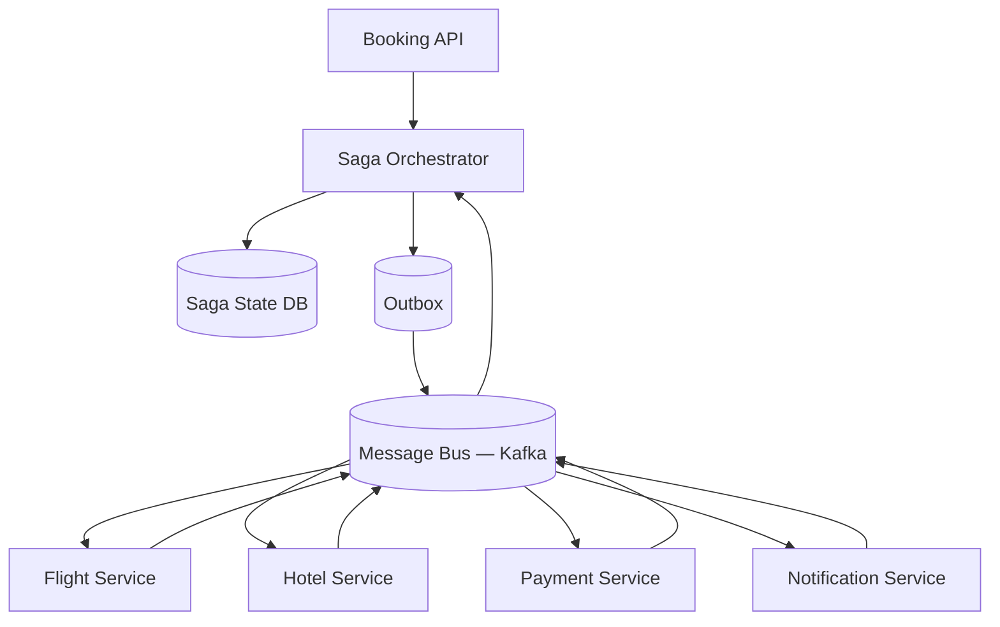
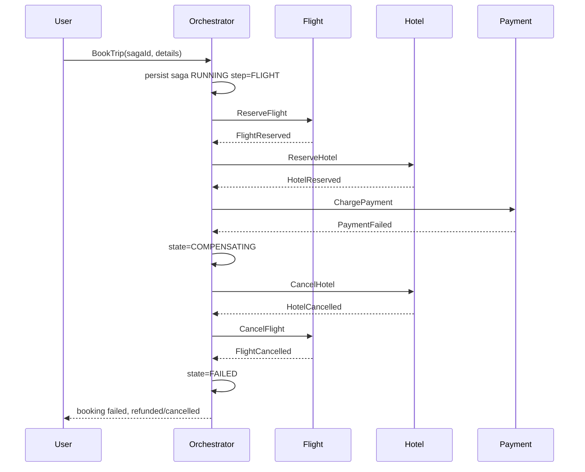
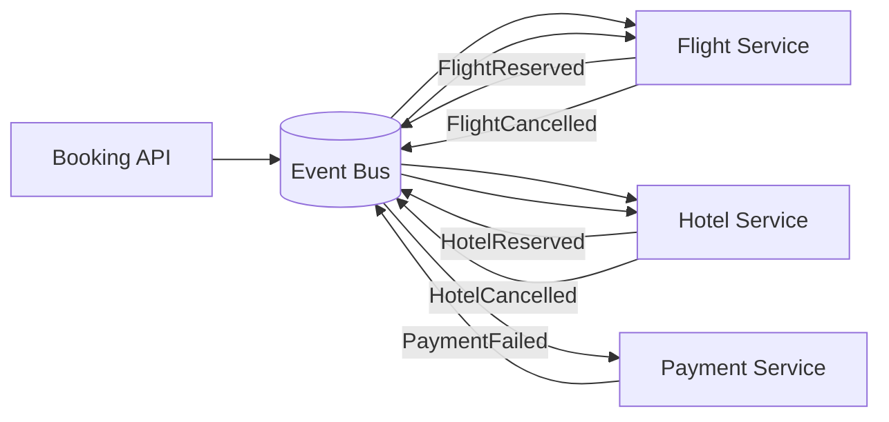

# Case Study 35 — Saga Pattern for Distributed Transactions

Design **distributed transaction orchestration** using the **Saga pattern** for a **flight + hotel + payment** booking flow (or e-commerce checkout): multiple microservices, each with local ACID, **no 2PC across services**, with **compensating transactions** when steps fail.

## 1. Problem

A user books a trip:

1. **Reserve flight** (FlightService)  
2. **Reserve hotel** (HotelService)  
3. **Charge payment** (PaymentService)  
4. **Send confirmation** (NotificationService)  

Each service owns its database. A **single XA/2PC transaction** across four services is fragile (blocking locks, coordinator SPOF, poor availability). Instead, run a **saga**: a sequence of **local transactions** linked by events or an orchestrator; on failure, run **compensations** (semantic undo).

You must handle: **partial failure**, **duplicate messages**, **ordering**, **timeouts**, and **compensation failures**.

## 2. Requirements

### Functional (MVP)

- Start saga on `BookTrip` command  
- Steps: reserve flight → reserve hotel → charge → notify  
- On step failure: compensate completed steps in reverse order  
- Compensations: cancel flight, cancel hotel, refund payment  
- Saga states: pending, running, compensating, completed, failed  
- Query saga status by `sagaId`  
- Idempotent step execution (safe retries)  
- Support **orchestration** and document **choreography** alternative  

### Out of scope (initially)

- Cross-saga isolation (inventory oversell at global level — use reservations + TTL)  
- Long-running human approval steps (extend with timeouts)  
- Visual workflow designer UI  
- Exactly-once side effects without idempotent design (impossible — design for at-least-once)  

### Non-functional

- End-to-end booking p99 < 3 s (happy path)  
- Saga state durable — survive orchestrator crash  
- At-least-once message delivery with **idempotent consumers**  
- Compensation must eventually complete or alert ops  
- Audit trail of every step and compensation attempt  

## 3. Back-of-the-envelope

These numbers are **rough order-of-magnitude math** — not a booking platform SLA. In interviews, the goal is to show you know *what to count* and *which resource breaks first*. A useful shortcut: **1 QPS sustained ≈ 86,400 requests/day** (86,400 seconds in a day). Sagas are **low-QPS orchestration** with **high correctness requirements** — the surprise is message volume during failure paths, not happy-path throughput.

### Why we estimate

A saga coordinates **multiple microservices** without 2PC. Estimates tell us:

- Whether the **orchestrator** or **downstream services** is the real bottleneck  
- How much **durable saga state** and **idempotency storage** actually need  
- Why **compensation latency** matters more than happy-path booking rate  

### Assumptions

| Assumption | Value | Why it matters |
|------------|-------|----------------|
| Bookings/day (peak season) | 50K | Drives saga creation rate |
| Steps per saga (happy path) | 4 | Flight → hotel → payment → notify |
| Max steps (with compensations) | 10 | Failure path runs reverse compensations |
| Avg step latency | 200 ms | External service call + local DB |
| Failure rate | 5% of sagas | Trigger compensation chain |
| Message size | ~2 KB | Commands, replies, state updates |
| Services involved | 4 | Flight, Hotel, Payment, Notification |

### Step A — Traffic (QPS / throughput) with labeled arithmetic

**Saga creation rate:**

```text
Bookings/day      = 50,000
Avg booking rate  = 50K ÷ 86,400
                  ≈ 0.6 sagas/second

Peak (×10 for holiday rush):
  ≈ 6 sagas/second
```

**Happy-path message volume:**

```text
Messages per saga = 4 commands + 4 replies = 8 messages
Peak happy path   = 8 × 6 sagas/s ≈ 48 messages/second
```

**Failure-path message volume (5% of sagas):**

```text
Failed sagas/s    ≈ 6 × 5% ≈ 0.3 sagas/s
Compensation msgs ≈ 3 compensate commands × 0.3 ≈ 1 msg/s average

Worst-case burst (many simultaneous failures):
  +15 compensate messages/second additional
```

**End-to-end latency (happy path):**

```text
4 steps × 200 ms ≈ 800 ms sequential minimum
  + orchestrator overhead + network → target p99 < 3 s
```

### Step B — Storage

**Saga state (durable — must survive orchestrator crash):**

```text
Sagas/day         = 50,000
Retention         = 30 days
Bytes per saga    ≈ 2 KB (state, step history, timestamps)

Monthly storage   = 50K/day × 30 days × 2 KB ≈ 3 GB/month
  → Tiny — saga state is not a storage problem
```

**Outbox + inbox dedup (idempotency keys):**

```text
Step keys × 7-day retention ≈ small Redis/DB table
  Each service stores processed messageId to reject duplicates
  → At 6 sagas/s peak, this is thousands of keys, not millions
```

### Step C — Bandwidth / other

**Orchestrator ↔ service messaging:**

```text
Peak ~48 msg/s × 2 KB ≈ 96 KB/s
  Bandwidth is irrelevant — latency and reliability dominate
```

**Compensation SLA:**

```text
99% compensations complete within 5 minutes
  Stuck compensations → manual ops queue + alert
  Compensation failure is worse than initial failure — user may be double-charged
```

**Transactional outbox:**

```text
Each service write + outbox insert in same local DB transaction
  Separate relay process publishes to message bus
  → Guarantees at-least-once delivery without 2PC across services
```

### Step D — Ratios and capacity table

| Metric | Average | Peak | Notes |
|--------|---------|------|-------|
| Saga starts/s | ~0.6/s | ~6/s | Low QPS — correctness over throughput |
| Happy-path msgs/s | ~5/s | ~48/s | 8 messages per saga |
| Failure-path msgs/s | ~0.3/s | ~15/s | 5% failure + compensation burst |
| Saga state/month | ~3 GB | — | Durable orchestrator DB |
| End-to-end p99 | — | < 3 s | 4 × 200 ms sequential steps |
| Compensation SLA | — | 99% in 5 min | Manual queue for stuck |

### What the numbers tell us

- **~0.6 sagas/s average, ~6/s peak is tiny** → orchestrator is not a throughput bottleneck; **state durability and idempotency** are  
- **3 GB/month saga state** → store full audit trail; replay from any step on orchestrator crash  
- **5% failure rate doubles message complexity** → compensations run in **reverse order**; each must be idempotent  
- **800 ms minimum happy path** → parallelize independent steps where possible; timeout + compensate on slow services  
- **At-least-once delivery is inevitable** → design every forward action and compensation with **business-level idempotency keys**  
- **Transactional outbox** → never publish to bus before local DB commit  

### Common mistake for this problem

Proposing **2PC / XA transactions across microservices** — blocking locks, coordinator SPOF, poor availability under partition. Interviewers want the **Saga pattern**: local ACID per service + orchestrator state machine + compensating transactions. Another mistake: ignoring **compensation failures** — "cancel flight" may fail if the flight already departed; you need retry, manual intervention, and alerting, not infinite automatic retry.

## 4. High-Level Design (HLD)

### Orchestration (central coordinator)





### Choreography (decentralized — comparison)



No central orchestrator — each service subscribes to events and publishes next step or compensation. Harder to visualize global state; good for simple flows.

### Components

| Component | Role |
|-----------|------|
| Booking API | Starts saga; returns `sagaId` |
| Saga Orchestrator | State machine; sends commands; handles replies |
| Saga State DB | Durable saga instance, current step, history |
| Message Bus | Kafka/SQS — at-least-once delivery |
| Transactional Outbox | Atomically persist saga update + outbound message |
| Flight/Hotel/Payment Services | Execute commands; emit success/failure events |
| Inbox / Idempotency store | Dedup processed `(sagaId, step)` per service |
| Compensation worker | Retry stuck compensations; escalate to ops |
| Admin API | Inspect saga timeline; manual retry |

### Flows

**Happy path (orchestration)**

1. API creates `sagaId`, orchestrator writes `RUNNING`, step `RESERVE_FLIGHT`  
2. Outbox publishes `ReserveFlight`  
3. Flight service reserves, replies `FlightReserved`  
4. Orchestrator advances → `RESERVE_HOTEL` → … → `CHARGE` → `NOTIFY` → `COMPLETED`  

**Failure with compensation**

1. Payment returns `PaymentFailed`  
2. Orchestrator transitions to `COMPENSATING`, step `CANCEL_HOTEL`  
3. After hotel cancelled → `CANCEL_FLIGHT`  
4. If flight already ticketed, `CancelFlight` may fail → retry with backoff; alert if non-compensatable  

**Orchestrator crash mid-saga**

1. New leader reads sagas in `RUNNING` / `COMPENSATING`  
2. Resend last command if no reply received (idempotent retry)  
3. Or wait for duplicate reply (idempotent orchestrator)  

### Trade-offs

- **Orchestration vs choreography** — Orchestration: clear state, single place to debug; choreography: fewer coupling points, harder global view  
- **Sync HTTP vs async messaging** — Async + outbox survives crashes; sync simpler but brittle  
- **Semantic vs automatic compensation** — Refund is semantic undo, not DB rollback  
- **Saga vs 2PC** — Saga: availability + local TX; 2PC: strong atomicity, blocks on failure  
- **Parallel steps** — Reserve flight and hotel in parallel cuts latency; compensate both if either fails  

## 5. Low-Level Design (LLD)

### APIs

Booking API:

```text
POST /api/v1/bookings
Body: {
  "userId": "u_101",
  "flightOfferId": "fo_88",
  "hotelOfferId": "ho_42",
  "paymentMethodId": "pm_7"
}
→ { "sagaId": "saga-99102", "status": "RUNNING" }

GET /api/v1/bookings/:sagaId
→ {
  "sagaId": "saga-99102",
  "status": "COMPENSATING",
  "steps": [
    { "name": "RESERVE_FLIGHT", "status": "COMPLETED" },
    { "name": "RESERVE_HOTEL", "status": "COMPLETED" },
    { "name": "CHARGE_PAYMENT", "status": "FAILED", "error": "insufficient_funds" },
    { "name": "CANCEL_HOTEL", "status": "RUNNING" }
  ]
}
```

Orchestrator → service commands (Kafka topics):

```text
Topic: saga.commands.flight
{
  "sagaId": "saga-99102",
  "stepId": "RESERVE_FLIGHT",
  "command": "ReserveFlight",
  "payload": { "offerId": "fo_88", "userId": "u_101" },
  "idempotencyKey": "saga-99102:RESERVE_FLIGHT"
}

Topic: saga.events.flight
{
  "sagaId": "saga-99102",
  "stepId": "RESERVE_FLIGHT",
  "event": "FlightReserved",
  "payload": { "reservationId": "fr_555" }
}
```

Compensation command:

```text
{
  "sagaId": "saga-99102",
  "stepId": "COMPENSATE_HOTEL",
  "command": "CancelHotel",
  "payload": { "reservationId": "hr_777" },
  "idempotencyKey": "saga-99102:COMPENSATE_HOTEL"
}
```

### Schema

Saga orchestrator DB:

```text
sagas (
  saga_id          UUID PRIMARY KEY,
  user_id          BIGINT NOT NULL,
  status           VARCHAR(16),     -- RUNNING, COMPENSATING, COMPLETED, FAILED
  current_step     VARCHAR(32),
  payload          JSONB,
  created_at       TIMESTAMPTZ,
  updated_at       TIMESTAMPTZ
)

saga_steps (
  saga_id          UUID,
  step_id          VARCHAR(32),
  status           VARCHAR(16),     -- PENDING, RUNNING, COMPLETED, FAILED, COMPENSATED
  request_payload  JSONB,
  response_payload JSONB,
  error_message    TEXT,
  attempt          INT DEFAULT 0,
  PRIMARY KEY (saga_id, step_id)
)

outbox (
  id               BIGSERIAL PRIMARY KEY,
  saga_id          UUID,
  topic            VARCHAR(128),
  message          JSONB,
  published        BOOLEAN DEFAULT FALSE,
  created_at       TIMESTAMPTZ
)
CREATE INDEX idx_outbox_unpublished ON outbox (published) WHERE published = FALSE;
```

Per-service inbox:

```text
inbox (
  idempotency_key  VARCHAR(128) PRIMARY KEY,
  saga_id          UUID,
  step_id          VARCHAR(32),
  processed_at     TIMESTAMPTZ,
  result           JSONB
)
```

Service-local reservation tables:

```text
flight_reservations (
  reservation_id   UUID PRIMARY KEY,
  saga_id          UUID UNIQUE,
  offer_id         VARCHAR,
  status           VARCHAR,         -- HELD, CONFIRMED, CANCELLED
  expires_at       TIMESTAMPTZ
)
```

### Modules

```text
BookingController
SagaOrchestrator
SagaStateMachine
StepDefinitionRegistry
OutboxPublisher
InboxDeduper
CommandDispatcher
EventHandler
CompensationPlanner
SagaRecoveryJob
FlightCommandHandler / HotelCommandHandler / PaymentCommandHandler
```

### Saga state machine definition

```text
steps (forward):
  1. RESERVE_FLIGHT
  2. RESERVE_HOTEL
  3. CHARGE_PAYMENT
  4. SEND_NOTIFICATION

compensations (reverse order of completed forward steps):
  CHARGE_PAYMENT  → RefundPayment
  RESERVE_HOTEL   → CancelHotel
  RESERVE_FLIGHT  → CancelFlight

transitions:
  on step SUCCESS → next forward step
  on step FAILURE → COMPENSATING → first pending compensation
  on compensation SUCCESS → next compensation or FAILED (done)
  on all forward done → COMPLETED
```

### Algorithm — orchestrator start (with outbox)

```text
function startSaga(userId, bookingRequest):
  sagaId = uuid()
  tx:
    insert sagas(sagaId, status='RUNNING', current_step='RESERVE_FLIGHT', payload)
    insert saga_steps(sagaId, 'RESERVE_FLIGHT', status='PENDING')
    insert outbox(topic='saga.commands.flight', message=ReserveFlight(...))
  commit tx

  outboxRelay.pollAndPublish()                 // separate worker
  return sagaId
```

### Algorithm — handle service event

```text
function onEvent(event):
  if not inbox.tryMarkProcessed(event.idempotencyKey):
    return                                       // duplicate

  saga = repo.load(event.sagaId)
  step = repo.step(event.sagaId, event.stepId)

  if event.type.endsWith("Failed"):
    step.status = 'FAILED'
    saga.status = 'COMPENSATING'
    next = compensationPlanner.firstPending(saga)
    enqueueCompensation(next)
    return

  step.status = 'COMPLETED'
  step.response = event.payload

  nextForward = stateMachine.nextForward(saga)
  if nextForward is null:
    saga.status = 'COMPLETED'
  else:
    saga.current_step = nextForward
    enqueueCommand(nextForward)

  repo.save(saga, step)
```

### Algorithm — idempotent service handler (Flight)

```text
function handleReserveFlight(cmd):
  if inbox.exists(cmd.idempotencyKey):
    return inbox.result(cmd.idempotencyKey)

  tx:
    existing = repo.findBySagaId(cmd.sagaId)
    if existing:
      result = FlightReserved(existing)
    else:
      resId = reserveInventory(cmd.offerId)    // may fail if sold out
      repo.insert(resId, cmd.sagaId, status='HELD')
      result = FlightReserved(resId)
    inbox.save(cmd.idempotencyKey, result)
  commit tx

  publishEvent(result)
  return result
```

### Algorithm — compensation with retry

```text
function enqueueCompensation(step):
  cmd = buildCompensateCommand(step)
  tx:
    insert outbox(compensate topic, cmd)
    update saga_steps set status='RUNNING' where step=step
  commit tx

function compensationReaper():
  stuck = repo.findCompensations(status='RUNNING', olderThan=5min)
  for s in stuck:
    if s.attempt >= MAX:
      alertOps(s)
      continue
    s.attempt++
    enqueueCompensation(s)                       // idempotent cancel
```

### Algorithm — parallel saga variant (flight + hotel)

```text
function startParallelSaga(request):
  saga.status = 'RUNNING'
  enqueue RESERVE_FLIGHT and RESERVE_HOTEL concurrently

function onParallelEvent(event):
  mark branch complete
  if any branch FAILED:
    enter COMPENSATING (cancel whichever completed)
  if both COMPLETED:
    enqueue CHARGE_PAYMENT
```

Use **join pattern**: orchestrator waits for both replies before payment — reduces charge-then-cancel hotel-only failures.

### Algorithm — choreography alternative (PaymentFailed)

```text
// PaymentService
function onChargeFailed(event):
  publish HotelCancelRequested { sagaId, reservationId }

// HotelService
function onHotelCancelRequested(event):
  cancel(event.reservationId)
  publish HotelCancelled { sagaId }

// FlightService listens HotelCancelled or PaymentFailed
function onCompensate(event):
  cancelFlight(event.sagaId)
  publish FlightCancelled { sagaId }

// Booking read model subscribes to all events and builds status
```

Risk: ** cyclic dependencies** and **missing compensations** without central state — mitigated by event catalog and correlation `sagaId`.

### Concurrency & correctness

- **No global lock** — each service transaction is local  
- **Idempotency key** = `sagaId:stepId` on every command and event  
- **Outbox pattern** — saga state and message publish atomic  
- **Compensation is not rollback** — cancel/reserve release may fail (already flown) → manual saga  
- **Ordering** — partition Kafka by `sagaId` for per-saga ordering  
- **Exactly-once illusion** = at-least-once + idempotent handlers + inbox  

### Failure modes

| Failure | Consequence | Mitigation |
|---------|-------------|------------|
| Payment succeeds, notify fails | User charged, no email | Retry notify; saga stays RUNNING on notify |
| Compensate hotel fails | Orphan hotel hold | Reaper retries; TTL on holds |
| Duplicate ReserveFlight | Double booking | `UNIQUE(saga_id)` in flight service |
| Orchestrator crash after charge | Unknown if charged | Query payment status on recovery; idempotent charge |
| Message reorder | Charge before hotel reserved | Partition by sagaId; state machine guards |
| Non-compensatable step | Partial completion | Manual intervention queue; legal workflow |
| Outbox relay stuck | Commands not sent | Monitor unpublished outbox; multi-worker relay |

## 6. Scale evolution

| Stage | Change |
|-------|--------|
| MVP | Orchestrator + Postgres outbox + Kafka; 4 services |
| Higher volume | Partition sagas; horizontal orchestrator (shard by sagaId) |
| Long workflows | Add timeouts, scheduled steps, human tasks (Temporal) |
| Observability | Saga timeline UI; distributed trace correlation on sagaId |
| Choreography hybrid | Orchestrator for booking; choreography for notifications |
| Strong inventory | Reservation TTL + pessimistic hold at Flight/Hotel separately |

## 7. Recap

- **Saga = sequence of local transactions + compensations** — not distributed 2PC  
- **Orchestration** centralizes the state machine; **choreography** decentralizes via events  
- **Transactional outbox + idempotent inbox** make at-least-once safe  
- Compensations are **business undo** (cancel, refund), not DB ROLLBACK  
- Design **forward and compensate** pairs for every step; plan for **stuck compensations**  

**Practice:** draw the orchestration sequence for a payment failure after flight and hotel succeed; write pseudocode for `onEvent` transitioning to `COMPENSATING` and enqueueing compensations in reverse order.
