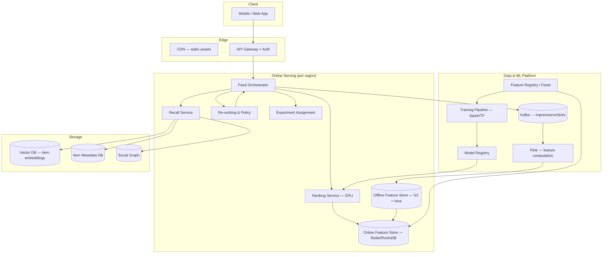
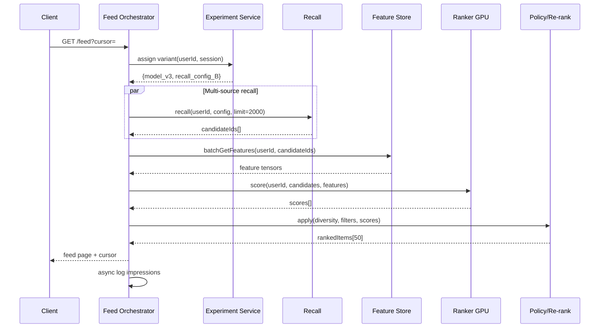

# Case Study 36 — Real-Time ML Recommendation Feed

Design a **TikTok/YouTube Shorts-style recommendation system**: rank millions of candidate items per user in **< 100 ms** using online ML features, handle cold start, and run continuous A/B experiments without breaking the serving path.

## 1. Problem

Users open a feed and expect an endless stream of **personally relevant content**. Behind each scroll, the system must:

1. Recall a large candidate set from billions of items  
2. Score and rank them with ML models using fresh user/context features  
3. Apply business rules (diversity, freshness, safety)  
4. Serve results with strict latency SLOs while experiments run in production  

The hard part is not training a model offline — it is **serving ranked results at scale** with low latency, fresh features, safe rollouts, and graceful degradation when components fail.

## 2. Requirements

### Functional (MVP)

- **Feed API**: return ranked item list for a user session (cursor pagination)  
- **Candidate generation**: multi-source recall (follow graph, collaborative filtering embeddings, trending, exploration bucket)  
- **Ranking**: two-tower or deep ranking model producing relevance score per candidate  
- **Feature lookup**: user, item, and cross features at request time (< 10 ms budget)  
- **Re-ranking**: diversity (MMR), dedupe, freshness boost, policy filters  
- **Impression/click logging** for model training feedback loop  
- **Cold start**: default feeds for new users; content-based fallback for new items  
- **A/B testing**: route % traffic to alternate models/recall configs  

### Out of scope (initially)

- Full real-time model training on every click (batch + near-line refresh is OK)  
- Cross-platform unified ranking for ads + organic in one auction (separate initially)  
- Explainability UI for every recommendation  
- Federated learning on device  

### Non-functional

- **p99 feed latency < 150 ms** end-to-end (mobile on good network)  
- **Ranking stage p99 < 80 ms** after candidates assembled  
- **Feature store read p99 < 5 ms** for hot features  
- **Availability 99.95%** — fallback to heuristic/trending rank on model outage  
- **Scale**: 500M DAU, 10B items catalog, 50B impressions/day  
- **Experiment isolation**: no cross-contamination of metrics between variants  
- **Privacy**: GDPR delete propagates to feature store within 30 days  

## 3. Back-of-the-envelope

Assumptions:

- 500M DAU, average **100 feed requests/user/day** → **50B requests/day**  
- Each request recalls **2,000 candidates**, ranks top **50**  
- Feature vector per (user, item) pair: **~200 floats** (800 B) for ranking  
- Model inference batch: 500 candidates per GPU batch  

```text
Feed QPS        ≈ 50B / 86,400 ≈ 580,000/s avg, peak ~2M/s
Feature reads   ≈ 580k × 2,000 candidates ≈ 1.16B feature lookups/s (not all unique)
  → dedupe + batch: ~50M unique user-item feature fetches/s at peak (still huge)

Ranking compute ≈ 580k req/s × 500 scored items ≈ 290M inferences/s
  → need massive GPU fleet + model distillation to smaller student models

Impression logs  ≈ 50B/day × 50 items × 200B ≈ 500 TB/day raw (compressed ~50 TB/day)
Training data    ≈ 30-day rolling window ≈ 1.5 PB compressed

Feature store hot set:
  500M users × 2 KB user features ≈ 1 TB
  10B items × 1 KB item features ≈ 10 TB (only ~5% hot in memory ≈ 500 GB)
```

**Insight:** You cannot score 2,000 full neural rankers per request naively. Pipeline is **recall wide → prune → rank narrow → re-rank**. Feature store must be **precomputed + online join**, not computed on the fly.

## 4. High-Level Design (HLD)



### Request path (sequence)



### Components

| Component | Role |
|-----------|------|
| Feed Orchestrator | Latency budget owner; parallelizes recall, features, rank |
| Recall Service | ANN on embeddings, graph walk, trending, explore bucket |
| Online Feature Store | Low-latency point + batch reads; versioned features |
| Ranking Service | GPU inference; batching, model warmup, circuit breaker |
| Re-ranking / Policy | MMR diversity, NSFW filter, creator fairness caps |
| Experiment Service | Deterministic bucketing; config overlays per variant |
| Impression Pipeline | Kafka → Flink → training tables + real-time counters |
| Feature Registry | Lineage, TTL, backfill jobs, PIT-correct joins for training |

### Multi-stage ranking funnel

```text
Stage 0 — Candidate generation (2,000 items, ~20 ms)
  Sources: follow graph, ANN (two-tower item tower), trending, random explore

Stage 1 — Lightweight prerank (500 items, ~15 ms)
  Small logistic model or dot-product on precomputed embeddings

Stage 2 — Deep ranker (100 items, ~40 ms)
  Full feature cross, DCN/DeepFM on GPU

Stage 3 — Re-rank (50 items, ~5 ms)
  MMR, dedupe same creator, boost fresh, demote seen
```

### Trade-offs

| Choice | Pros | Cons |
|--------|------|------|
| Precompute user embedding every 5 min | Fast dot-product recall | Stale for breaking interests |
| Compute user embedding online | Fresher | Adds 10–20 ms; GPU cost |
| Monolithic ranker | Simpler ops | Harder A/B at sub-component level |
| Layered ranker + config-driven recall | Flexible experiments | Orchestration complexity |
| Redis feature store | Sub-ms reads | Memory cost; large feature sets need sharding |
| Point-in-time correct offline store | No training leakage | Slower backfills |

## 5. Low-Level Design (LLD)

### APIs

```text
GET /v1/feed
Headers: Authorization: Bearer <token>
Query: cursor=<opaque>, limit=20, tab=for_you
→ 200 {
     "items": [
       { "itemId": "vid_9x2", "score": 0.87, "reason": "similar_to_liked", "cursor": "..." }
     ],
     "nextCursor": "eyJ...",
     "experimentVariant": "rank_v3_recall_b"
   }

POST /v1/events
Body: {
  "sessionId": "...",
  "events": [
    { "type": "impression", "itemId": "vid_9x2", "position": 3, "ts": 1710000000 },
    { "type": "click", "itemId": "vid_9x2", "watchMs": 4200, "ts": 1710000004 }
  ]
}
→ 202 Accepted

GET /v1/features/user/{userId}
→ { "features": { "age_bucket": 3, "country": "IN", "embedding_v2": [...] }, "version": "2024-07-01T12:00:00Z" }

POST /internal/v1/rank
Body: { "userId": "...", "candidateIds": ["..."], "modelId": "rank_v3", "featureSnapshotId": "..." }
→ { "scores": [{ "itemId": "...", "score": 0.91 }] }

POST /internal/v1/experiments/assign
Body: { "userId": "...", "surface": "feed" }
→ { "experiments": { "ranking_model": "v3", "recall_mix": "config_B" } }
```

### Schema

**Item metadata (Cassandra / DynamoDB)**

```text
items (
  item_id          TEXT PRIMARY KEY,
  creator_id       TEXT,
  created_at       TIMESTAMP,
  duration_sec     INT,
  category_ids     SET<TEXT>,
  language         TEXT,
  safety_labels    MAP<TEXT, FLOAT>,
  embedding_v2     BLOB,          -- 128-dim quantized
  stats_7d         MAP<TEXT, BIGINT>  -- views, likes, shares
)
```

**User features (Feature Store — online)**

```text
user_features (
  user_id          TEXT,
  feature_name     TEXT,
  feature_value    BLOB,          -- typed serialization
  updated_at       TIMESTAMP,
  PRIMARY KEY (user_id, feature_name)
)

-- materialized wide row for hot path
user_feature_wide (
  user_id          TEXT PRIMARY KEY,
  embedding_v2     BLOB,
  recent_categories MAP<TEXT, FLOAT>,
  last_active_at   TIMESTAMP,
  version          TIMESTAMP
)
```

**Impression log (Kafka → Iceberg / BigQuery)**

```text
impressions (
  request_id       STRING,
  user_id          STRING,
  session_id       STRING,
  item_id          STRING,
  position         INT,
  rank_score       FLOAT,
  model_id         STRING,
  recall_source    STRING,
  experiment_tags  MAP<STRING, STRING>,
  ts               TIMESTAMP
)

clicks / watch_events (
  request_id       STRING,
  item_id          STRING,
  watch_ms         INT,
  completed        BOOLEAN,
  ts               TIMESTAMP
)
```

**Experiment assignment (Redis + Postgres audit)**

```text
experiment_assignments (
  user_id          BIGINT,
  experiment_id    INT,
  variant          VARCHAR(32),
  assigned_at      TIMESTAMPTZ,
  PRIMARY KEY (user_id, experiment_id)
)
```

### Modules

```text
FeedController
FeedOrchestrator
ExperimentAssigner
RecallAggregator
  ├── GraphRecall
  ├── AnnRecall (VectorDB client)
  ├── TrendingRecall
  └── ExploreRecall
FeatureStoreClient (batchGet, cache-aside)
RankingClient (GPU batching pool)
Reranker (MMR, PolicyEngine)
ImpressionLogger (async Kafka producer)
ColdStartResolver
CircuitBreaker / FallbackRanker
```

### Algorithm — feed orchestration (latency-budget aware)

```text
function getFeed(userId, cursor, limit):
  budget = LatencyBudget(totalMs=150)
  variant = experimentAssigner.assign(userId, "feed")  // cached locally 5 min

  with budget.stage("recall", maxMs=25):
    candidates = recallAggregator.recall(userId, variant.recallConfig, limit=2000)
    if candidates.empty:
      candidates = coldStartResolver.defaultFeed(userId)

  with budget.stage("prerank", maxMs=20):
    preranked = prerankModel.score(userId, candidates, topK=500)

  with budget.stage("features", maxMs=10):
    features = featureStore.batchGet(userId, preranked.ids, version=variant.featureVersion)

  with budget.stage("rank", maxMs=60):
    try:
      scores = ranker.score(preranked.ids, features, modelId=variant.modelId)
    catch TimeoutOrUnavailable:
      scores = fallbackRanker.heuristic(preranked, features)

  with budget.stage("rerank", maxMs=10):
    seen = sessionStore.getSeen(userId, cursor)
    final = reranker.apply(scores, seen, policies=[diversity, freshness, safety])

  page = paginate(final, cursor, limit)
  async impressionLogger.log(userId, page, variant, scores)
  return page
```

### Algorithm — MMR diversity re-ranking

Maximal Marginal Relevance: balance relevance vs redundancy.

```text
function mmrRerank(scoredItems, lambda=0.7, k=50):
  selected = []
  remaining = scoredItems sorted by score desc
  while len(selected) < k and remaining not empty:
    best = null; bestMmr = -inf
    for item in remaining:
      simToSelected = max(cosine(item.emb, s.emb) for s in selected) if selected else 0
      mmr = lambda * item.score - (1 - lambda) * simToSelected
      if mmr > bestMmr:
        bestMmr = mmr; best = item
    selected.append(best)
    remaining.remove(best)
  return selected
```

### Algorithm — cold start

```text
function coldStartFeed(userId):
  profile = onboarding.get(userId)  // locale, picked topics
  if profile.hasSelections:
    return contentBasedRecall(profile.topics, trendingInLocale)
  else:
    return globalTrending.mix(exploreRatio=0.2)

function newItemBoost(item, user):
  if item.ageHours < 24 and item.creator in user.followed:
    return 1.2
  if item.ageHours < 6:
    return exploreBucket.sample(item, epsilon=0.05)  // multi-armed bandit lite
  return 1.0
```

### Algorithm — A/B assignment (deterministic, sticky)

```text
function assignVariant(userId, experimentId):
  salt = config.experiments[experimentId].salt
  bucket = hash(userId + salt) % 10000
  cumulative = 0
  for variant in config.experiments[experimentId].variants:
    cumulative += variant.allocation * 10000
    if bucket < cumulative:
      return variant.name
  return "control"
```

### Feature store: online/offline consistency

```text
// Offline (training) — point-in-time join
SELECT i.*, u.features_at(i.ts) AS user_features
FROM impressions i
JOIN user_feature_history u
  ON u.user_id = i.user_id AND u.valid_from <= i.ts AND u.valid_to > i.ts

// Online — read latest materialized
function batchGet(userId, itemIds):
  userWide = redis.get("uf:" + userId)
  itemKeys = ["if:" + id for id in itemIds]
  itemRows = redis.mget(itemKeys)
  return joinFeatures(userWide, itemRows)
```

### Concurrency & correctness

- **Idempotent feed requests**: `request_id` dedupes double-tap; cursor is opaque signed blob  
- **Feature versioning**: model trained on `feature_v2` must not read `feature_v3` — enforced at deploy  
- **Impression logging at-least-once** → training pipeline dedupes on `(request_id, item_id, position)`  
- **GPU batching queue**: requests wait max 5 ms to fill batch; timeout → prerank-only fallback  
- **Experiment SRM monitoring**: chi-square test on assignment counts; auto-pause if skew detected  

## 6. Scale evolution

| Stage | Traffic | Architecture |
|-------|---------|--------------|
| MVP | 10k QPS | Monolith + Postgres + Redis; single recall source; logistic rank |
| Growth | 100k QPS | Split recall/rank; introduce two-tower embeddings; Kafka impressions |
| ML maturity | 500k QPS | Dedicated feature store (Feast + Redis cluster); GPU ranker fleet; multi-stage funnel |
| Global | 2M QPS peak | Regional serving stacks; geo-sharded feature store; replicate vector index per region |
| Advanced | 2M+ QPS | Distilled student models; learned recall (RL); near-line embedding refresh via Flink |
| Failure modes | — | Ranker down → prerank + trending; feature store slow → cached user wide row + item defaults |

## 7. Recap

- **Funnel, don't brute-force rank**: recall thousands → prerank hundreds → deep-rank tens  
- **Feature store is the product**: online/offline parity and point-in-time correctness prevent silent model rot  
- **Latency budgets per stage** force explicit fallbacks — never block the feed on one dependency  
- **Cold start** needs exploration (epsilon-greedy / bandits) plus content-based signals, not random alone  
- **A/B at orchestration layer** (recall config + model id) beats redeploying monoliths per experiment  

**Practice:** draw the recall → feature → rank → rerank pipeline from memory; explain how you'd detect and fix **training-serving skew** when click-through drops after a feature schema change.
