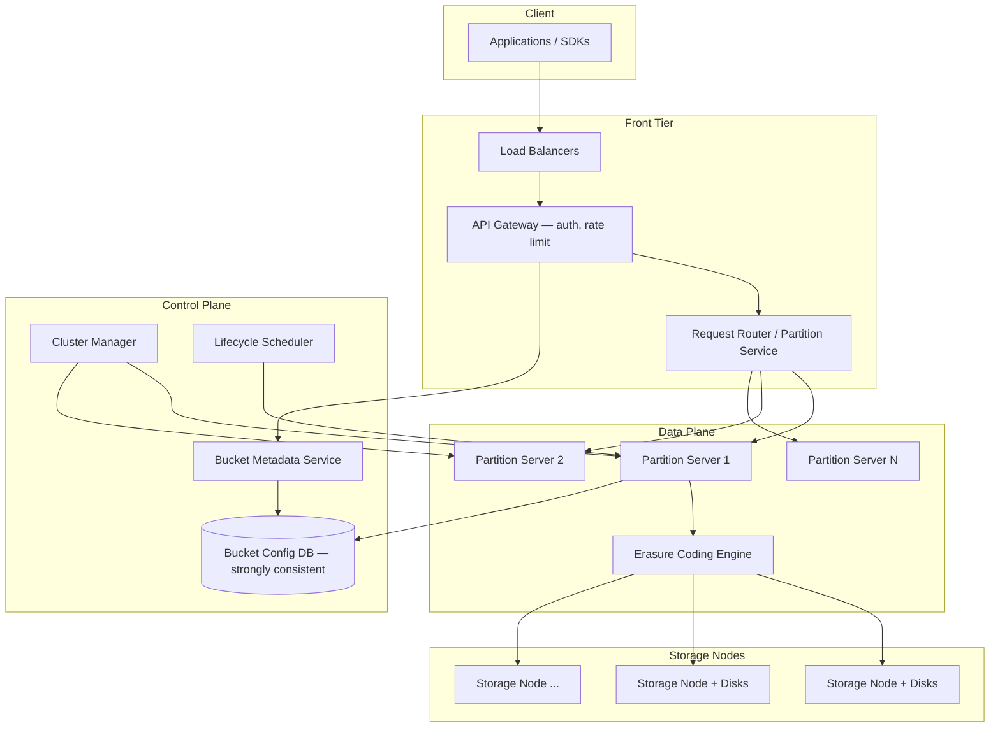
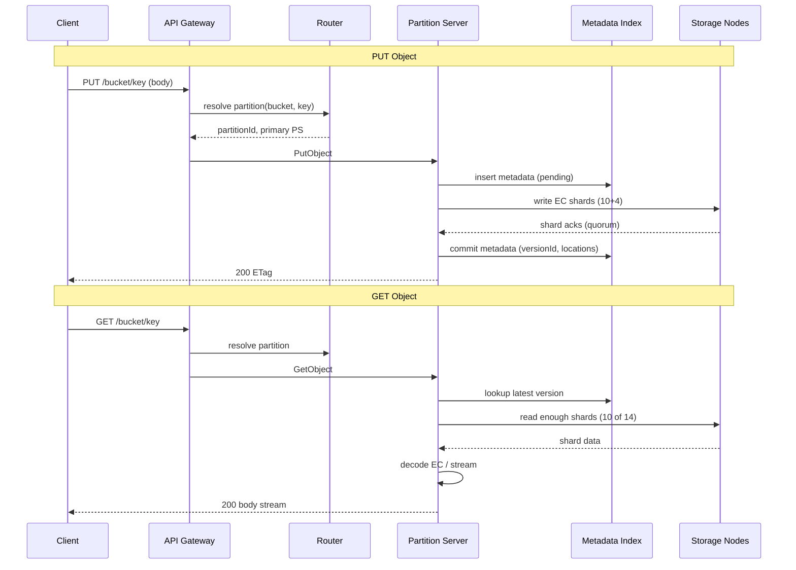

# Case Study 37 — Exabyte-Scale Object Storage

Design an **S3-compatible object storage system** at exabyte scale: store trillions of objects across millions of disks, survive rack/datacenter failures, serve GET/PUT with 11 nines durability, and support lifecycle policies — explaining **erasure coding**, **metadata partitioning**, and **request routing** internals.

> Want the real-world story of how Amazon does this? Read **[Case Study 41 — Amazon S3 Internals](41-amazon-s3-internals.md)** (heat management, ShardStore, EC, public scale numbers).

## 1. Problem

Applications store photos, backups, logs, and ML datasets as **opaque blobs** addressed by bucket + key. Unlike a filesystem, objects are **immutable versions** (overwrite = new version), metadata is separate from bytes, and the system must:

1. Durably persist exabytes on commodity hardware with frequent disk/rack failures  
2. Route a request to the right partition among millions of storage nodes  
3. Balance replication vs **erasure coding** for cost  
4. Enforce lifecycle (IA → Glacier → delete) without blocking hot paths  

The hard part is not storing one object — it is **metadata at trillion-object scale** and **reconstruction under correlated failures** while keeping PUT/GET tail latency bounded.

## 2. Requirements

### Functional (MVP)

- **S3-like API**: CreateBucket, PutObject, GetObject, DeleteObject, ListObjectsV2 (prefix)  
- **Strong read-after-write** for new objects in a bucket (after PUT success)  
- **Versioning** optional per bucket  
- **Multipart upload** for large objects (> 5 GB)  
- **Lifecycle rules**: transition storage class after N days; expire objects  
- **Storage classes**: Standard (hot), Infrequent Access, Archive (async retrieval)  

### Out of scope (initially)

- POSIX filesystem mount (EFS-like)  
- Cross-region active-active writes (CRR async replication is stretch)  
- Object locking / legal hold (compliance add-on)  
- User-facing SQL query (Athena-style separate service)  

### Non-functional

- **Durability 99.999999999% (11 nines)** per object over a year  
- **Availability 99.99%** for Standard class reads  
- **GET p99 latency < 100 ms** for hot objects (excluding first-byte from archive)  
- **PUT throughput**: sustain **millions of PUT/s** globally (aggregate)  
- **Scale**: **1 EB** logical data, **100B+ objects**, **10k+ storage nodes**  
- **Blast radius**: single rack loss must not lose data; AZ loss survivable with EC  

## 3. Back-of-the-envelope

These numbers are **rough order-of-magnitude math** — not an S3 capacity contract. In interviews, the goal is to show you know *what to count* and *which resource breaks first*. A useful shortcut: **1 QPS sustained ≈ 86,400 requests/day** (86,400 seconds in a day). Exabyte object storage is **read-heavy at massive scale** — the surprise is that **metadata**, not disk bytes, is usually the scaling bottleneck.

### Why we estimate

At exabyte scale, you cannot treat object storage like a big filesystem. Estimates tell us:

- Why **3× replication for all data** is cost-prohibitive → erasure coding  
- Whether **metadata indexing** or **PUT throughput** breaks first  
- How many **disks** and **storage nodes** the fleet actually requires  

### Assumptions

| Assumption | Value | Why it matters |
|------------|-------|----------------|
| Total objects | 100B | Metadata index must shard at trillion scale |
| Average object size | 10 MB | Blended (many small, some large multipart) |
| Logical data | 1 EB | Headline scale target |
| PUT rate (global avg) | 500K/s | Ingest from apps, logs, ML pipelines |
| GET rate (global avg) | 10M/s | Read-heavy — CDN origin, analytics, ML training |
| Metadata per object | 1 KB | Key, version, checksum, shard locations |
| Erasure coding | 10+4 (1.4× overhead) | vs 3× replication = 3.0× overhead |
| Drive size | 12 TB | Commodity HDD class |

### Step A — Traffic (QPS / throughput) with labeled arithmetic

**PUT rate:**

```text
Avg PUT QPS       = 500,000 objects/second
Peak PUT QPS      ≈ 2,000,000 objects/second (×4 burst)
```

**GET rate (read-heavy — 20:1 over PUT):**

```text
Avg GET QPS       = 10,000,000 objects/second
  CDN absorbs much client traffic; origin still sees millions/s
```

**PUT ingest bandwidth:**

```text
Avg: 500K PUT/s × 10 MB ≈ 5 TB/s global ingest
Peak: 2M PUT/s × 10 MB ≈ 20 TB/s
  → Wide striping across many independent partition writers
```

**GET egress bandwidth:**

```text
10M GET/s × 10 MB ≈ 100 TB/s theoretical max
  → Most served from CDN/edge cache; origin GET is lower but still enormous
```

### Step B — Storage

**Logical data (user-visible):**

```text
100B objects × 10 MB ≈ 1 EB raw logical data
```

**With 3× replication (too expensive at this scale):**

```text
1 EB × 3 ≈ 3 EB disk — cost-prohibitive for all data
```

**With erasure coding (10+4, 1.4× overhead):**

```text
1 EB × 1.4 ≈ 1.4 EB on disk + parity reconstruction CPU on failure
  Standard class: EC for data; replication for metadata and hot tail
```

**Metadata storage (the hidden giant):**

```text
100B objects × 1 KB metadata ≈ 100 PB of metadata
  → Must shard aggressively — metadata is the scaling bottleneck, not disk bytes
```

**Disk count:**

```text
1.4 EB ÷ 12 TB per drive ≈ 117,000 drives minimum
With system overhead (spares, filesystem, rebalance headroom) → ~150,000 drives
Across 10K+ storage nodes → ~15 drives per node average (many more in practice)
```

### Step C — Bandwidth / other

**ListObjects hot prefix problem:**

```text
A single prefix with 1M keys → pagination mandatory
  Cannot full-scan; need indexed prefix metadata or separate listing service
```

**Durability math (11 nines):**

```text
99.999999999% → ~1 object lost per 10B objects per year
  Requires continuous scrubbing + repair + EC reconstruction on disk failure
  At 150K drives, dozens of drives fail daily — background fleet must keep up
```

**Multipart upload (large objects > 5 GB):**

```text
A 100 GB object → 10K parts × 10 MB
  Metadata tracks part list; commit on CompleteMultipartUpload
```

### Step D — Ratios and capacity table

| Metric | Average | Peak | Notes |
|--------|---------|------|-------|
| PUT QPS | 500K/s | 2M/s | Ingest path |
| GET QPS | 10M/s | — | 20:1 read:write |
| PUT bandwidth | ~5 TB/s | ~20 TB/s | Wide striping required |
| Logical data | 1 EB | — | 100B × 10 MB |
| EC disk (1.4×) | 1.4 EB | — | vs 3 EB with 3× replication |
| Metadata | ~100 PB | — | 100B × 1 KB — the bottleneck |
| Drive count | ~150K | — | 12 TB drives + overhead |

### What the numbers tell us

- **100 PB metadata >> 1 EB data** in management complexity → shard metadata service aggressively  
- **3× replication for 1 EB = 3 EB disk** → cost-prohibitive; **erasure coding (1.4×)** for Standard class  
- **500K PUT/s, 10M GET/s** → GET dominates; CDN + edge cache in front of origin  
- **~150K drives, dozens fail daily** → background repair fleet is as important as the front tier  
- **ListObjects on hot prefix** → indexed prefix metadata, not brute-force scan  
- **11 nines durability** → continuous scrub + EC reconstruction; not "set and forget" replication  

### Common mistake for this problem

Using **3× replication for all exabyte data** — at 1 EB logical, that's 3 EB of disk and ruinous cost. Interviewers want **erasure coding (10+4)** for Standard class with replication reserved for metadata and small hot objects. Another mistake: assuming **disk bytes are the bottleneck** — at 100B objects, the **metadata index (100 PB)** and **request routing to the right partition** dominate design.

## 4. High-Level Design (HLD)



### PUT / GET path



### Components

| Component | Role |
|-----------|------|
| API Gateway | Auth (SigV4), bucket policy, rate limits |
| Request Router | Consistent hash: `(bucket, key)` → partition |
| Partition Server | Owns object metadata shard; coordinates EC writes/reads |
| Metadata Index | Per-partition B-tree / LSM: key → version → shard map |
| Storage Node | Local disk chunks; heartbeat to cluster manager |
| Erasure Engine | Reed-Solomon encode/decode; shard placement |
| Cluster Manager | Detect failed nodes; trigger rebuild; balance |
| Lifecycle Worker | Scan metadata for transitions/expiry; enqueue re-tier jobs |

### Erasure coding vs replication

```text
3-way replication:
  Overhead 3×; rebuild = copy from any replica; simple; good for small/metadata

10+4 Reed-Solomon (n=14, k=10):
  Overhead 1.4×; tolerate 4 shard losses; rebuild reads 10 shards + CPU
  Standard for large objects (> 1 MB typically)

Hybrid policy:
  Objects < 128 KB: replicate 3× (EC overhead not worth it)
  Objects ≥ 128 KB: EC 10+4
  Metadata records: 3× replicated on Paxos/Raft group (small, hot)
```

### Metadata partitioning strategy

```text
Level 1 — Bucket registry (global, replicated):
  bucket_name → bucket_id, owner, region, storage_class_defaults

Level 2 — Object partition (hash bucket_id + key_prefix):
  partition_id = hash(bucket_id, key) mod NUM_PARTITIONS
  Each partition server holds LSM of object keys in range

Level 3 — Blob location (within partition metadata):
  version_id → { size, etag, ec_scheme, shard_locations[], storage_class, ttl }

NUM_PARTITIONS scales with object count (e.g. 1M partitions × 100k objects each)
```

### Trade-offs

| Choice | Pros | Cons |
|--------|------|------|
| Hash partition by key | Even spread | ListObjects needs prefix indexes |
| Partition by bucket only | Easy listing | Hot buckets saturate one server |
| LSM metadata store | Fast writes | Compaction spikes; tuning needed |
| Separate blob store | Clean separation | Two-phase commit complexity |
| Sync EC all shards before ACK | Strong durability | Higher PUT latency |
| Async EC (replicate then encode) | Faster PUT | Window of higher risk |

## 5. Low-Level Design (LLD)

### APIs (S3-compatible subset)

```text
PUT /{bucket}/{key}
Headers: Content-Length, Content-MD5, x-amz-storage-class: STANDARD|IA|GLACIER
→ 200 { ETag, VersionId }

GET /{bucket}/{key}?versionId=
→ 200 stream + Content-Length, ETag
→ 404 NoSuchKey

DELETE /{bucket}/{key}
→ 204 (tombstone version or delete marker)

POST /{bucket}?uploads
→ { UploadId }

PUT /{bucket}/{key}?partNumber=N&uploadId=U
→ { ETag }

POST /{bucket}/{key}?uploadId=U  (CompleteMultipartUpload)
Body: XML list of parts
→ { VersionId, ETag }

GET /{bucket}?list-type=2&prefix=logs/2024/&continuation-token=
→ { Contents[], IsTruncated, NextContinuationToken }

PUT /{bucket}?lifecycle
Body: { rules: [{ prefix, transitionDays, expireDays }] }
```

### Schema

**Bucket registry (Raft group / Spanner)**

```text
buckets (
  bucket_id        UUID PRIMARY KEY,
  bucket_name      TEXT UNIQUE,
  owner_account    TEXT,
  region           TEXT,
  versioning       ENUM('off','on'),
  created_at       TIMESTAMP
)

bucket_lifecycle_rules (
  bucket_id        UUID,
  rule_id          UUID,
  prefix           TEXT,
  transition_days  INT,
  target_class     TEXT,
  expire_days      INT,
  PRIMARY KEY (bucket_id, rule_id)
)
```

**Object metadata (per partition — RocksDB / Cassandra)**

```text
object_index (
  partition_key    (bucket_id, object_key_hash),
  object_key       TEXT,
  version_id       UUID,
  size_bytes       BIGINT,
  etag             TEXT,
  storage_class    TEXT,
  created_at       TIMESTAMP,
  delete_marker    BOOLEAN,
  shard_map        BLOB,  -- compressed [{node_id, shard_idx, checksum}]
  PRIMARY KEY ((partition_key), object_key, version_id)
)

multipart_uploads (
  upload_id        UUID PRIMARY KEY,
  bucket_id        UUID,
  object_key       TEXT,
  parts            MAP<INT, PART_META>,
  initiated_at     TIMESTAMP
)
```

**Prefix listing index (optional secondary)**

```text
prefix_index (
  bucket_id        UUID,
  prefix_hash      BIGINT,
  object_key       TEXT,
  version_id       UUID,
  PRIMARY KEY ((bucket_id, prefix_hash), object_key)
)
-- maintained async on PUT/DELETE; eventually consistent for list
```

**Storage node local**

```text
shards (
  shard_id         UUID PRIMARY KEY,
  object_version   UUID,
  shard_index      SMALLINT,
  disk_path        TEXT,
  checksum         TEXT,
  state            ENUM('active','rebuilding','deleting')
)
```

### Modules

```text
S3ApiHandler
AuthPolicyEngine (SigV4, bucket ACL)
PartitionRouter
PartitionServer
  ├── MetadataStore (LSM)
  ├── BlobCoordinator
  └── ListIndexBuilder
ErasureCodec (ReedSolomon 10+4)
ShardPlacementPolicy (rack/ AZ aware)
RebuilderWorker
LifecycleScanner
ClusterManager (failure detection, rebalancing)
```

### Algorithm — PUT object (EC path)

```text
function putObject(bucket, key, body, storageClass):
  partition = router.resolve(bucket, key)
  versionId = uuid()
  size = body.length

  if size < SMALL_OBJECT_THRESHOLD:
    return putReplicatedSmallObject(partition, bucket, key, body, versionId)

  shards = erasure.encode(body, k=10, m=4)  // 14 shards
  placements = placementPolicy.assign(shards, excludeFailedNodes=true)
  // placements respect: unique racks, max 1 shard per node per object

  metadata = ObjectMeta(versionId, size, pending=true, shard_map=placements)

  metadataStore.insertPending(partition, bucket, key, metadata)

  acks = 0
  for each (shard, node) in placements:
    futures.add(node.writeShard(shard_id, shard.data))
  wait until acks >= 10 OR timeout

  if acks < 10:
    metadataStore.markAborted(versionId)
    enqueueGarbageCollect(shards)
    fail(503)

  metadataStore.commit(partition, bucket, key, versionId)
  return { etag: md5(body), versionId }
```

### Algorithm — GET object (degraded read)

```text
function getObject(bucket, key, versionId):
  meta = metadataStore.getLatest(bucket, key, versionId)
  if meta.delete_marker: return 404

  shardMap = meta.shard_map
  liveShards = selectReadableShards(shardMap, min=10)

  if liveShards.count >= meta.k:
    data = erasure.decode(liveShards)
    return stream(data)

  if liveShards.count >= meta.k but includes rebuilding:
    triggerPriorityRebuild(meta)
    data = erasure.decode(liveShards)
    return stream(data)

  fail(503)  // insufficient shards
```

### Algorithm — shard placement (fault domain aware)

```text
function assignShards(encodedShards[14], topology):
  candidates = storageNodes.filter(healthy, freeDisk > shardSize)
  shuffle(candidates)
  usedRacks = set()
  placements = []

  for shard in encodedShards:
    node = pick candidates where node.rack not in usedRacks OR relax if stuck
    placements.append((shard, node))
    usedRacks.add(node.rack)
  return placements
```

### Algorithm — rebuild on node failure

```text
function onNodeFailure(failedNode):
  affectedShards = catalog.shardsOn(failedNode)
  for shard in affectedShards:
    objectMeta = metadata.lookup(shard.object_version)
    siblingShards = readShards(objectMeta, exclude=failedNode, count=10)
    rebuilt = erasure.decode(siblingShards)
    newShard = erasure.extractShard(rebuilt, shard.index)
    targetNode = placementPolicy.pickReplacement(failedNode.rack)
    targetNode.writeShard(shard.id, newShard)
    metadata.updateLocation(shard.id, targetNode)
  mark failedNode draining; rebalance if needed
```

### Algorithm — lifecycle transition

```text
function lifecycleScannerLoop():
  for partition in ownedPartitions:
    for meta in metadata.scan(storageClass=STANDARD, age > rule.transitionDays):
      if meta.accessPattern.lastRead < 30d:
        enqueueTransition(meta, targetClass=IA)

function transitionWorker(job):
  // IA may use same EC layout; GLACIER = re-pack to tape/cold tier
  coldLocation = coldTier.write(fetchObject(job.versionId))
  metadata.updateStorageClass(job.versionId, GLACIER, coldLocation)
  optionally delete hot shards after verify
```

### ListObjectsV2 (prefix pagination)

```text
function listObjectsV2(bucket, prefix, token, maxKeys=1000):
  prefixHash = hashPrefix(bucket, prefix)
  startKey = decodeToken(token)  // last object_key from previous page
  rows = prefixIndex.query(bucket, prefixHash, startKey, limit=maxKeys+1)
  truncated = len(rows) > maxKeys
  return { Contents: rows[:maxKeys], IsTruncated: truncated, NextToken: ... }
```

### Concurrency & correctness

- **Compare-and-swap on metadata**: PUT with `If-None-Match: *` for create-only semantics  
- **Versioning**: DELETE creates delete marker; GET without versionId returns latest non-marker  
- **Multipart**: complete only if all parts present; idempotent complete with same part ETags  
- **Split-brain prevention**: partition ownership via Raft epoch; stale owners reject writes  
- **Read-after-write**: commit metadata only after EC quorum durable (fsync on storage nodes)  

## 6. Scale evolution

| Stage | Data scale | Design |
|-------|------------|--------|
| MVP | 100 TB | Single region; 3× replication; Postgres metadata; nginx + minio-style nodes |
| Growth | 10 PB | Partition metadata; introduce EC for objects > 1 MB; dedicated router tier |
| Large | 100 PB | 1M+ partitions; separate list index; async lifecycle workers |
| Exabyte | 1 EB | Global namespace; per-region clusters; cross-region async replication (CRR) |
| Metadata pressure | 100B objects | Hierarchical keys; bloom filters per partition; garbage collect tombstones in background |
| Hot bucket | viral object | CDN in front; optional per-object replication boost; rate limit LIST on prefix |

## 7. Recap

- **Bytes are cheap to spread; metadata is hard** — partition by hash(bucket, key), secondary index for prefix listing  
- **Erasure coding (10+4)** makes exabyte economics work; replication reserved for tiny objects and control metadata  
- **PUT quorum = k shards** before commit; rebuild is normal operations, not emergency  
- **Lifecycle and tiering** are metadata-driven background jobs — never block the hot GET/PUT path  
- **Blast-radius placement** (rack/AZ diversity) matters more than raw disk count  

**Practice:** walk through losing **4 storage nodes simultaneously** in one rack — how many objects become unreadable, and what rebuild pipeline steps restore 11-nines durability?
