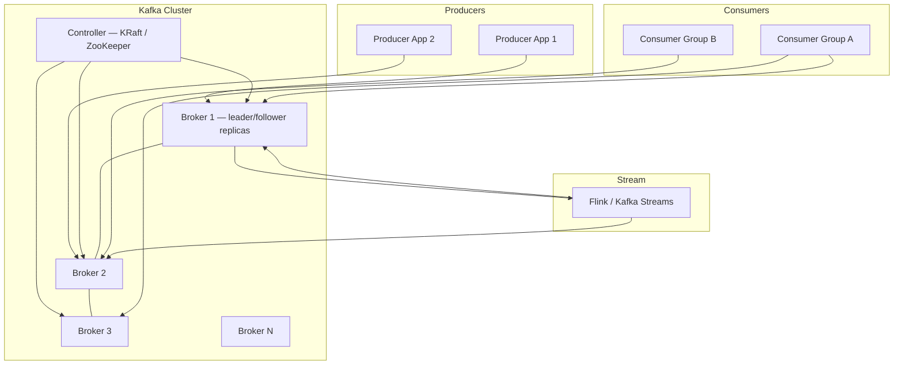
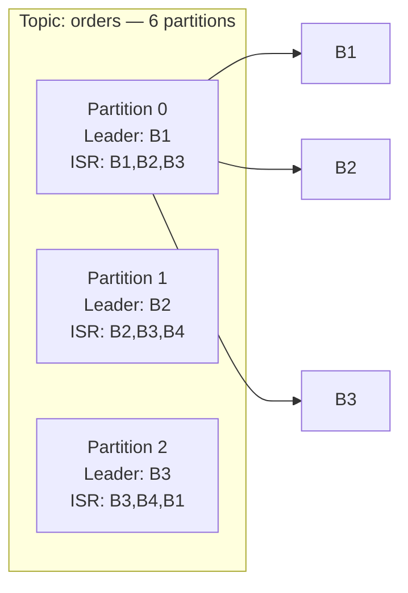
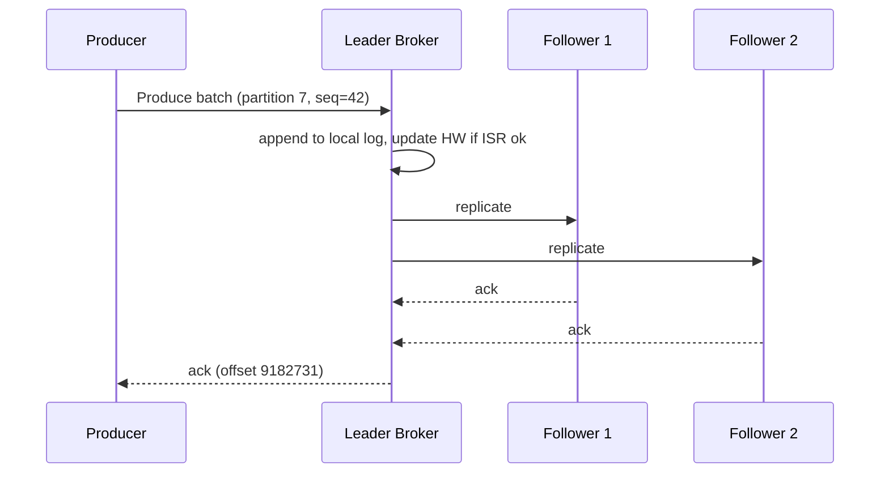

# Case Study 38 — Kafka-Scale Event Streaming

Design a **Kafka-class distributed log** that sustains **millions of writes/sec**, petabytes of retention, consumer groups with minimal rebalance pain, and **exactly-once semantics** for stream processing — explaining **partitions**, **ISR**, **rebalancing**, and the **end-to-end consistency** model.

## 1. Problem

Microservices, analytics, and ML pipelines need a **durable, ordered, replayable event bus**. Producers publish events; consumers process them in parallel; new consumers must join without duplicating work or losing messages. At Kafka scale:

1. A single topic may have **thousands of partitions** across hundreds of brokers  
2. Leader election and **ISR (In-Sync Replicas)** must preserve ordering per partition  
3. Consumer groups rebalance when members join/leave — historically causing **stop-the-world** pauses  
4. Stream processors want **exactly-once** (EOS) despite broker failures and retries  

The hard part is not appending to a log file — it is **coordination under constant membership change** while exposing simple producer/consumer APIs.

## 2. Requirements

### Functional (MVP)

- **Topics & partitions**: configurable partition count; total order **within** partition only  
- **Producer API**: publish with key (optional) → partition by hash(key)  
- **Consumer groups**: each partition consumed by **at most one** consumer in group  
- **Retention**: time-based (7 days) and/or size-based; compacted topics for changelog use  
- **Offset management**: commit consumer offsets; replay from arbitrary offset  
- **Consumer lag metrics** per partition  
- **Exactly-once** (stretch): idempotent producer + transactional consume-transform-produce  

### Out of scope (initially)

- Full Kafka Connect ecosystem, KSQL  
- Cross-datacenter synchronous replication (MirrorMaker async OK)  
- Infinite retention without tiered storage  
- Pub/sub fan-out to unlimited independent subscribers without consumer groups (use separate groups)  

### Non-functional

- **Durability**: no acknowledged writes lost on single broker failure (with acks=all)  
- **Throughput**: **10M messages/s** aggregate per cluster; **1 MB/s** per partition sustainable  
- **Producer p99 latency < 10 ms** under normal load (acks=all, moderate batching)  
- **Availability**: tolerate broker loss; brief unavailability during leader election OK  
- **Scale**: **5k brokers**, **500k topics**, **50M partitions** (large multi-tenant cluster)  
- **Rebalance**: consumer stall **< 5 s** p99 during rolling deploy (with cooperative protocol)  

## 3. Back-of-the-envelope

These numbers are **rough order-of-magnitude math** — not a Kafka cluster sizing worksheet. In interviews, the goal is to show you know *what to count* and *which resource breaks first*. A useful shortcut: **1 QPS sustained ≈ 86,400 requests/day** (86,400 seconds in a day). Kafka-scale streaming is **append-heavy** with **partition count as the central tuning knob** — too few partitions starve consumers; too many cause rebalance storms.

### Why we estimate

A Kafka-class log must sustain **millions of writes/sec** with **ordering per partition**. Estimates tell us:

- Whether **disk append throughput** or **controller metadata** is the real bottleneck  
- How **partition count** trades parallelism vs rebalance overhead  
- Why **7-day retention at 10M msg/s** creates petabytes of storage  

### Assumptions

| Assumption | Value | Why it matters |
|------------|-------|----------------|
| Active partitions | 200K | Unit of parallelism and failure isolation |
| Replicas per partition | 3 | Durability with acks=all |
| Avg message size | 2 KB | Microservice events, click streams |
| Peak write rate | 10M msg/s | Aggregate cluster throughput |
| Retention | 7 days | Time-based; tiered to object store for older |
| Consumer groups | 10K | Independent processing pipelines |
| Avg consumers/group | 50 | 500K total consumer connections |
| Brokers | 200 | Heavy cluster; design doc mentions up to 5K |

### Step A — Traffic (QPS / throughput) with labeled arithmetic

**Peak write throughput:**

```text
Peak write rate   = 10,000,000 messages/second
Bytes/s           = 10M × 2 KB = 20 GB/s ingress (peak)
```

**Per-broker write load (200 brokers):**

```text
20 GB/s ÷ 200 brokers ≈ 100 MB/s per broker
  Heavy but feasible with sequential disk append + compression
  → More brokers or compression if sustained above this
```

**Per-partition throughput limit:**

```text
Practical limit ≈ 1–10 MB/s per partition (sequential append)
10M msg/s × 2 KB = 20 GB/s total
At 1 MB/s/partition → need ~20,000 hot partitions at peak
  → Partition count is a capacity planning knob
```

### Step B — Storage

**7-day retention (raw, before replication):**

```text
10M msg/s × 2 KB × 86,400 s/day × 7 days
  = 10M × 2 KB × 604,800
  ≈ 12 PB raw

With 3× replication ≈ 36 PB on disk
  → Tiered storage: hot SSD for recent segments, object store for old
```

**Controller metadata load:**

```text
200K partitions × 3 replicas = 600K replica states to track
Broker failure → leader election for ~thousands of partitions per dead broker
  → KRaft/ZooKeeper must handle burst of metadata updates
```

### Step C — Bandwidth / other

**Consumer offset commits:**

```text
500K consumer connections
Batch commit every 5 s → 500K ÷ 5 ≈ 100,000 offset commits/second
  → Metadata load on __consumer_offsets topic; batch aggressively
```

**Replication bandwidth per broker:**

```text
If broker leads 1,000 partitions at 1 MB/s each → 1 GB/s replication out
  → Network NIC sizing matters; rack-aware replica placement reduces cross-rack traffic
```

**Rebalance cost:**

```text
Consumer group join/leave → partition reassignment
Cooperative protocol target: stall < 5 s p99 during rolling deploy
  → Too many partitions + too many consumers = rebalance storm
```

### Step D — Ratios and capacity table

| Metric | Value | Notes |
|--------|-------|-------|
| Peak write rate | 10M msg/s | Aggregate cluster |
| Ingress bandwidth | 20 GB/s | 10M × 2 KB |
| Per-broker write | ~100 MB/s | 200 brokers |
| Per-partition limit | 1–10 MB/s | Sequential append bound |
| Hot partitions needed | ~20K | At 1 MB/s/partition peak |
| 7-day storage (raw) | ~12 PB | Before replication |
| 7-day storage (3×) | ~36 PB | Tiered to object store |
| Consumer connections | ~500K | 10K groups × 50 consumers |
| Offset commits/s | ~100K | Batch every 5 s |

### What the numbers tell us

- **Partitions are the unit of parallelism AND failure isolation** — too few → can't scale consumers; too many → metadata + rebalance pain  
- **20 GB/s ingress is heavy** → compression, more brokers, or higher per-partition throughput  
- **36 PB with 3× replication over 7 days** → tiered storage mandatory; don't keep everything on broker SSD  
- **100K offset commits/s** → batch consumer commits; don't commit per message  
- **Broker death → thousands of leader elections** → KRaft controller must be fast; ISR min.insync.replicas=2  
- **Exactly-once (EOS)** → idempotent producer + transactional consume-transform-produce; adds latency  

### Common mistake for this problem

Setting **too few partitions** and wondering why consumers can't keep up — 10M msg/s with 100 partitions = 100K msg/s/partition, far above the 1–10 MB/s practical limit. Interviewers want you to treat **partition count as a first-class capacity knob**. Another mistake: ignoring **rebalance storms** — 500K consumers across 10K groups means cooperative rebalancing and careful `max.poll.interval.ms` tuning are production requirements, not optional optimizations.

## 4. High-Level Design (HLD)



### Partition & replica layout



### Producer → broker write (acks=all)



### Components

| Component | Role |
|-----------|------|
| Broker | Stores log segments; serves produce/fetch; follower replication |
| Controller | Partition leader election, ISR maintenance, metadata (KRaft quorum) |
| Producer | Batches, partition routing, idempotence (PID + sequence) |
| Consumer | Fetch loop, deserialize, invoke handler, commit offsets |
| Group Coordinator | Consumer group membership, offset commits (__consumer_offsets topic) |
| Rebalance Protocol | Assign partitions to consumers (range, sticky, cooperative-sticky) |
| Log Cleaner | Compaction for changelog topics; delete retention for others |
| Tiered Storage | Move sealed segments to S3; broker cache hot tail |

### ISR & leader election

```text
ISR = replicas that are "caught up" (within replica.lag.max.messages)

Produce with acks=all:
  Leader waits for all ISR replicas to ack before responding

Leader fails:
  Controller picks new leader from ISR (preferred leader if synced)
  Unclean leader election (non-ISR) disabled by default — prevents data loss

HW (high watermark):
  Last offset replicated to all ISR → consumers only see up to HW
```

### Trade-offs

| Choice | Pros | Cons |
|--------|------|------|
| More partitions | Higher parallelism | More files, longer rebalance |
| acks=1 | Lower latency | Data loss if leader dies before replicate |
| acks=all + min.insync.replicas=2 | Durable | Higher latency; unavailable if ISR shrinks |
| Range assignor | Simple | Uneven if keyed skew |
| Cooperative-sticky rebalance | Incremental revoke | More complex client |
| Log compaction | Keeps latest key | Not for raw event firehose |
| Transactions | EOS | 20–30% throughput overhead |

## 5. Low-Level Design (LLD)

### Producer / Consumer APIs (conceptual)

```text
// Producer
producer.send({
  topic: "payments",
  key: orderId,           // hash → partition
  value: avroBytes,
  headers: { "trace-id": "..." },
  acks: "all",
  idempotent: true,
  transactionalId: "fraud-svc-1"  // optional EOS
})

// Consumer
consumer.subscribe(["payments", "refunds"])
consumer.poll(timeoutMs=500)
// process records
consumer.commitSync({ partition: { offset: lastProcessed + 1 } })
```

### Admin / metadata

```text
CREATE TOPIC payments partitions=128 replication=3 retention.ms=604800000
DESCRIBE CONSUMER_GROUP fraud-detector
  → members, assignment, lag per partition

GET /metrics
  → bytes-in-rate, under-replicated-partitions, active-controller-count
```

### Schema (internal metadata — KRaft / metadata log)

```text
topics (
  topic_id         UUID,
  topic_name       TEXT,
  partition_count  INT,
  replication      INT,
  config           MAP<TEXT,TEXT>
)

partitions (
  topic_id         UUID,
  partition_id     INT,
  leader           INT,          -- broker id
  isr              LIST<INT>,
  replicas         LIST<INT>,
  PRIMARY KEY (topic_id, partition_id)
)

brokers (
  broker_id        INT PRIMARY KEY,
  rack             TEXT,
  host             TEXT,
  epoch            BIGINT
)

consumer_offsets (
  group_id         TEXT,
  topic            TEXT,
  partition        INT,
  committed_offset BIGINT,
  metadata         TEXT,
  commit_timestamp TIMESTAMP
)
-- stored in compacted topic __consumer_offsets
```

### Log segment storage (per broker disk)

```text
/var/kafka/logs/payments-7/
  00000000000009182731.log      -- message data
  00000000000009182731.index    -- offset → file position
  00000000000009182731.timeindex
  leader-epoch-checkpoint
```

### Modules

```text
BrokerServer
  ├── LogManager (segments, roll, retention)
  ├── ReplicaManager (fetch from leader, HW update)
  └── RequestHandler (Produce, Fetch, Metadata)

Controller (KRaft)
  ├── PartitionStateMachine
  ├── BrokerRegistration
  └── LeaderElection

KafkaProducerClient
  ├── RecordAccumulator (batch per partition)
  ├── IdempotentSequenceManager
  └── TransactionCoordinator

KafkaConsumerClient
  ├── FetchSessionManager
  ├── ConsumerCoordinator
  └── OffsetCommitManager
```

### Algorithm — partition assignment (produce)

```text
function partitionFor(key, topic, partitionCount):
  if key is null:
    return roundRobinNext(topic)  // sticky batching
  else:
    return murmur2(key) mod partitionCount
```

### Algorithm — consumer group rebalance (cooperative-sticky)

```text
// Generation increment on membership change
function onMembersChanged(group):
  generation++
  allPartitions = subscribedTopicPartitions()
  assignment = stickyAssign(allPartitions, members, previousAssignment)
  // Phase 1 — cooperative: revoke only partitions that must move
  for member in members:
    member.revoke(assignment[member].toRevoke)
  wait all revoked callbacks complete
  // Phase 2 — assign new partitions
  for member in members:
    member.assign(assignment[member].final)
  members resume fetch from committed offset
```

Sticky goal: minimize partition movement when consumer-3 leaves and consumer-4 joins.

### Algorithm — fetch & commit (at-least-once)

```text
function consumeLoop():
  records = consumer.poll()
  for record in records:
    process(record)  // must be idempotent
  consumer.commitSync(lastOffsetsPerPartition)

// Failure before commit → redelivery after restart
// Failure after commit but before process complete → may lose if commit early (avoid)
```

Best practice: **process then commit**; store offset with side effect in same DB transaction for effectively-once.

### Algorithm — idempotent producer

```text
// Broker dedupes by (producerId, partition, sequence)
function sendIdempotent(record):
  seq = sequence.next(partition)
  batch = { producerId, seq, records: [record] }
  response = broker.produce(batch)
  if response.duplicate:
    return success  // already written
  if response.outOfOrder:
    fail and reset producer state
```

### Algorithm — exactly-once transaction (consume-process-produce)

```text
function transactionalJob():
  producer.initTransactions()
  producer.beginTransaction()
  records = consumer.poll()
  for r in records:
    out = transform(r)
    producer.send(outTopic, out)
  consumer.sendOffsetsToTransaction(offsets, groupMetadata)
  producer.commitTransaction()
  // atomic: either all outputs + offset commit visible, or none
```

Broker stores **transaction marker** in log; consumers with `isolation.level=read_committed` skip aborted batches.

### Algorithm — leader election on broker failure

```text
function onBrokerDown(brokerId):
  affected = partitions.where(leader == brokerId)
  for p in affected:
    newLeader = electFromISR(p.isr, preferredReplica=p.replicas[0])
    if newLeader is null:
      mark partition offline  // under-replicated, producers fail acks=all
    else:
      p.leader = newLeader
      publishMetadataUpdate()
  trigger preferred leader election when old leader returns (optional)
```

### Handling hot partitions

```text
Symptoms: single partition 100× lag vs others
Mitigations:
  - Salt keys: key = hash(userId + bucket) to spread
  - Add partitions (cannot split existing; dual-write migration)
  - Dedicated topic for hot tenant with own consumer fleet
  - Broker rack awareness + disk isolation for heavy partitions
```

### Concurrency & correctness

- **Ordering**: guaranteed per partition only; global order requires partition=1 (bottleneck)  
- **Duplicates**: at-least-once default; consumers must idempotent-process or dedupe store  
- **Lost messages**: prevented with acks=all + min.insync.replicas=2; producers retry on transient errors  
- **Rebalance race**: cooperative protocol + `max.poll.interval.ms` prevents slow handler eviction storms  
- **Zombie consumer**: static membership or generation check rejects stale commits  

## 6. Scale evolution

| Stage | Scale | Changes |
|-------|-------|---------|
| MVP | 10 brokers, 100 partitions | Single cluster; PLAINTEXT dev; manual ops |
| Growth | 100 brokers, 10k partitions | Rack awareness; monitoring lag; Schema Registry |
| Large | 1k brokers, 100k partitions | KRaft (drop ZK); tiered storage; separate controller nodes |
| Multi-tenant | 5k brokers | Quotas per client; ACLs; federation / cluster linking |
| EOS adoption | stream jobs | Idempotent producers default; transactional API for Flink checkpoint alignment |
| Rebalance pain | frequent deploys | Cooperative-sticky assignor; static group membership; reduce partitions per consumer |

## 7. Recap

- **Partition = parallelism + ordering boundary**; key design drives fairness  
- **ISR + acks=all + min.insync.replicas** is the durability contract — understand when producers fail  
- **Consumer groups** assign partitions 1:1 within a group; lag is per-partition diagnostic  
- **Cooperative rebalance** avoids stop-the-world; still minimize partition churn with sticky assignors  
- **Exactly-once** = idempotent producer + transactions + read_committed consumers — not magic, has cost  

**Practice:** a broker dies holding leader for 500 partitions — list the **controller steps**, how **HW** moves, and what a **read_committed** consumer sees during the failover window.
