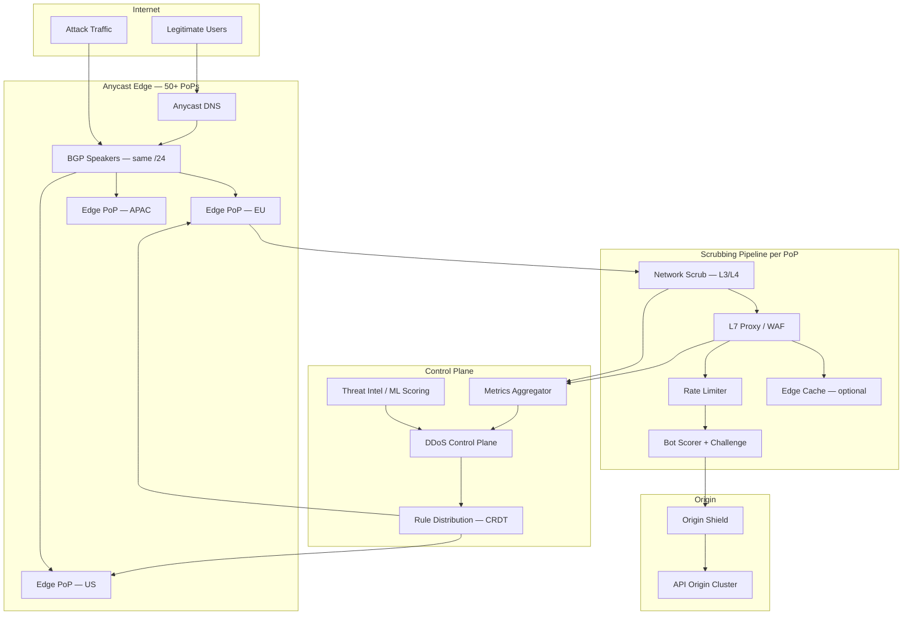
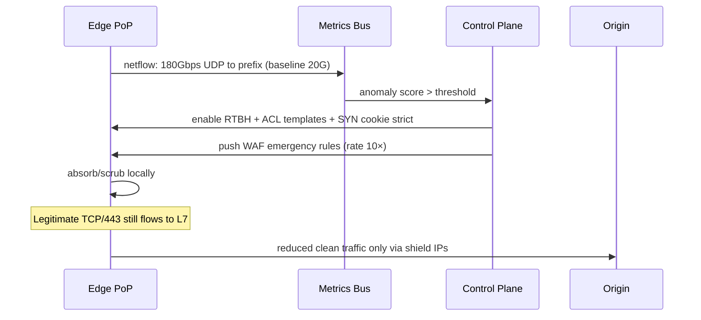

# Case Study 39 — Global DDoS Mitigation & Edge Rate Limiting

Design a **planet-scale DDoS protection layer** in front of a global API: absorb **multi-Tbps volumetric floods**, mitigate **L7 application attacks**, use **Anycast** to steer traffic to scrubbing centers, and enforce **distributed rate limits** at the edge without breaking legitimate users.

## 1. Problem

Your API (e.g. `api.example.com`) is reachable worldwide. Attackers send:

1. **Volumetric L3/L4 floods** (UDP reflection, SYN floods) saturating links  
2. **Protocol attacks** ( malformed TCP, SSL exhaustion)  
3. **Application-layer L7 floods** (HTTP GET/POST storms mimicking real clients)  
4. **Low-and-slow** and **credential stuffing** below naive volume thresholds  

You must **detect and mitigate** within seconds, **scrub** bad traffic close to the source, and apply **per-IP / per-user / per-route rate limits** at PoPs — while keeping p99 latency low for clean traffic.

## 2. Requirements

### Functional (MVP)

- **Anycast DNS + BGP** announce same IP from many scrubbing PoPs; route to nearest healthy edge  
- **Always-on baseline scrubbing** + **on-demand escalation** for large attacks  
- **L3/L4 mitigation**: SYN cookies, UDP rate limit, blackhole (RTBH) with surgical scope  
- **L7 WAF + bot management**: challenge (JS/captcha), signature rules, behavioral scoring  
- **Edge rate limiting**: global token bucket per `(client, route)` with burst allowance  
- **Origin shield**: hide origin IPs; only accept traffic from scrubbing network  
- **Dashboard**: attack visibility, top talkers, rule overrides, allow/block lists  
- **API for automation**: block ASN, country, or JA3 fingerprint during incident  

### Out of scope (initially)

- Full SIEM / SOC playbook automation (integrate via webhooks OK)  
- End-user VPN product  
- Mitigating attacks on non-HTTP protocols you don't proxy (unless network-level)  
- Guaranteed block of nation-state APT zero-days (defense in depth, not perfection)  

### Non-functional

- **Mitigation activation < 30 s** for auto-detected volumetric events  
- **Clean traffic p99 add < 5 ms** at edge (excluding challenge flows)  
- **Scrubbing capacity**: survive **5 Tbps** aggregate attack (multi-PoP)  
- **False positive rate < 0.01%** for rate limit + WAF on logged-in API traffic  
- **Availability 99.99%** for edge (attack must not take origin offline)  
- **Global**: **50+ PoPs**, anycast /24 or /32 prefixes  

## 3. Back-of-the-envelope

These numbers are **rough order-of-magnitude math** — not a Cloudflare contract. In interviews, the goal is to show you know *what to count* and *which resource breaks first*. A useful shortcut: **1 QPS sustained ≈ 86,400 requests/day** (86,400 seconds in a day). DDoS mitigation is measured in **Tbps and millions of rps** — the surprise is that **stateless edge scrubbing** and **rate-limit key cardinality** dominate design, not origin server count.

### Why we estimate

Planet-scale DDoS protection must absorb **multi-Tbps floods** while adding **< 5 ms** for clean traffic. Estimates tell us:

- Whether **scrubbing capacity** or **rate-limit state** is the real bottleneck  
- Why **Anycast** (mitigate close to attacker) beats centralized scrubbing  
- How **challenge flows** create their own capacity problem at scale  

### Assumptions

| Assumption | Value | Why it matters |
|------------|-------|----------------|
| Normal peak traffic | 2 Tbps | Legitimate API aggregate globally |
| Largest attack seen | 4 Tbps volumetric | Must survive above normal peak |
| L7 attack peak | 50M rps | HTTP GET/POST storms |
| Avg HTTP request | 5 KB | API JSON payloads |
| Attack mix | 80% volumetric, 20% L7 | Different mitigation paths |
| PoPs | 50+ | Anycast absorption points |
| Default rate limit | 100 req/s per IP | Auth endpoints |
| Challenge rate | 1% of requests | JS/captcha under suspicion |

### Step A — Traffic (QPS / throughput) with labeled arithmetic

**Normal L7 request rate (upper bound from bandwidth):**

```text
2 Tbps ÷ (5 KB × 8 bits/byte)
  = 2 × 10¹² ÷ 40,000
  ≈ 50 million requests/second (rough upper bound across all PoPs)
```

**Attack L7 peak:**

```text
50M rps during L7 flood
  → WAF + bot scoring + rate limits must filter before origin
```

**Volumetric attack:**

```text
4 Tbps volumetric (UDP reflection, SYN flood)
  Normal capacity 2 Tbps → need 6 Tbps total scrubbing headroom
  80% of attack volume is L3/L4 → SYN cookies, UDP rate limit, RTBH
```

**SYN flood packet rate (example):**

```text
100M packets/second globally during SYN flood
  → SYN cookies + XDP/DPDK kernel bypass; no state table for half-open
```

### Step B — Storage

**Rate-limit counter state (per PoP):**

```text
Active keys per PoP ≈ 1 billion (IPs, user IDs, route combos)
Bytes per key     ≈ 16 B (token bucket state)

Memory per PoP    = 1B × 16 B ≈ 16 GB
  → Sharded across edge nodes; Redis/CRDT for distributed counters
  → During botnet attack: 500M unique IPs may spike → probabilistic structures (Count-Min Sketch)
```

**Attack log / dashboard storage:**

```text
Top talkers, ASN stats, rule hits → streaming to central analytics
  Retention: hours (incident) to days (forensics) — not petabyte scale
```

### Step C — Bandwidth / other

**Scrubbing center sizing:**

```text
Target 200 Gbps clean capacity per PoP × 30 active PoPs
  ≈ 6 Tbps scrubbing headroom (covers 4 Tbps attack + 2 Tbps normal)
```

**Challenge tier capacity:**

```text
1% of 50M rps challenged = 500,000 crypto puzzles/second
  → Dedicated challenge tier (PoW, JS challenge); cannot run on same nodes as clean proxy
```

**Clean traffic latency budget:**

```text
Edge add p99 < 5 ms (excluding challenge flows)
  Anycast routing + WAF signature check + rate limit lookup
  Challenge flow: +200–2000 ms (user-visible; acceptable for suspicious traffic)
```

### Step D — Ratios and capacity table

| Metric | Normal | Attack peak | Notes |
|--------|--------|-------------|-------|
| Aggregate bandwidth | 2 Tbps | 4+ Tbps | Volumetric + L7 combined |
| L7 request rate | ~50M rps | ~50M rps | Upper bound from bandwidth |
| Scrubbing headroom | — | ~6 Tbps | 30 PoPs × 200 Gbps |
| Rate-limit keys/PoP | ~1B | ~500M IPs | Botnet spikes cardinality |
| Counter memory/PoP | ~16 GB | — | Sharded token buckets |
| Challenge rps | — | ~500K/s | 1% of 50M rps |
| False positive target | — | < 0.01% | Logged-in API traffic |

### What the numbers tell us

- **Mitigate as close to the attacker as possible** — Anycast absorbs locally at 50+ PoPs; origin never sees raw Internet  
- **6 Tbps scrubbing headroom** for 4 Tbps attack + 2 Tbps normal — always provision above largest historical attack  
- **50M rps L7** → edge rate limiting + WAF before origin; origin shield accepts only scrubbed traffic  
- **16 GB rate-limit state per PoP** → sharded counters; Count-Min Sketch when IP cardinality explodes during botnet  
- **500K challenge rps** → dedicated tier; 1% challenge rate × 50M rps is its own massive workload  
- **Origin hidden** → only accept connections from scrubbing network; RTBH for surgical blackhole  

### Common mistake for this problem

Trying to **scale the origin** to absorb a 4 Tbps attack — no origin fleet can survive that. Interviewers want **Anycast edge scrubbing** that drops bad traffic before it reaches you, plus **origin shield** so attackers never learn your real IPs. Another mistake: **per-IP rate limits alone** against a 500M-IP botnet — you need behavioral scoring, JA3 fingerprinting, and probabilistic data structures when key cardinality explodes.

## 4. High-Level Design (HLD)



### Attack detection & escalation



### Volumetric vs application-layer paths

```text
Volumetric (L3/L4):
  Detect: NetFlow/sFlow spikes, SNMP interface saturation, BGP UPDATE anomalies
  Mitigate: RTBH at provider, ACL drop obvious garbage, SYN cookies, UDP null routing
  Where: Provider edge + your scrubbing routers (before stateful firewall)

Application (L7):
  Detect: request rate per URI, error rate, JWT failure burst, TLS fingerprint clusters
  Mitigate: token bucket rate limits, WAF rules, JS challenge, CAPTCHA escalation, geo/ASN throttle
  Where: HTTP reverse proxy fleet (full connection termination)
```

### Components

| Component | Role |
|-----------|------|
| Anycast BGP | Same IP globally; BGP steers to nearest PoP; withdraw on PoP failure |
| Network scrubbers | DPDK/XDP fast path; sampled flow analysis |
| L7 reverse proxy | TLS termination, HTTP/2, WAF inspection |
| Rate limit service | Distributed counters; syncs via gossip or Redis Cluster |
| Bot/score engine | JA3/JA4, IP reputation, behavioral velocity, device attestation |
| Challenge service | Issue signed cookie after JS proof-of-work |
| Control plane | Central policy; pushes rules in < 1 s to all PoPs |
| Origin shield | Second hop; only accepts edge mTLS; collapses connections |

### Trade-offs

| Choice | Pros | Cons |
|--------|------|------|
| Always-on scrubbing | Fast response | Cost at rest |
| On-demand scrub (BGP divert) | Cheaper idle | Activation delay |
| Sync rate limits (Redis) | Accurate global cap | Cross-region latency |
| Local approximate counters | Ultra fast | Slight overshoot |
| JS challenge | Blocks dumb bots | Hurts UX, accessibility |
| Block whole ASN | Stops botnet | Collateral damage |
| Allowlist VIP partners | Zero false positives | Manual toil |

## 5. Low-Level Design (LLD)

### Edge configuration APIs

```text
POST /v1/policies/rate-limits
Body: {
  "route": "POST /v1/auth/login",
  "keyBy": ["ip", "account_id"],
  "limit": { "rate": 20, "burst": 40, "windowSec": 60 },
  "action": "429" | "challenge" | "block"
}
→ { "policyId": "rl_8821" }

POST /v1/mitigation/events
Body: { "prefix": "203.0.113.0/24", "action": "blackhole", "ttlSec": 3600, "reason": "udp-flood" }

GET /v1/attacks/active
→ [{ "id", "type": "volumetric|l7", "peakGbps", "peakRps", "startedAt", "mitigations": [] }]

POST /v1/allowlist
Body: { "cidr": "198.51.100.0/24", "note": "partner webhook" }
```

### Client-facing (implicit)

```text
Normal:
  GET https://api.example.com/v1/resource
  Headers: Authorization: Bearer ...
  → 200

Rate limited:
  → 429 Retry-After: 12
  Headers: X-RateLimit-Remaining: 0

Challenged:
  → 403 + HTML JS challenge OR 307 to challenge.example.com
  Set-Cookie: _edge_ch=... after success
```

### Schema

**Rate limit policy (control plane Postgres + edge cache)**

```text
rate_limit_policies (
  policy_id        TEXT PRIMARY KEY,
  host             TEXT,
  route_pattern    TEXT,
  key_fields       TEXT[],
  rate_per_sec     FLOAT,
  burst            INT,
  window_sec       INT,
  action           TEXT,
  version          BIGINT,
  updated_at       TIMESTAMPTZ
)
```

**Distributed counter shard (Redis / custom)**

```text
Key: rl:{policyVersion}:{routeHash}:{clientKey}
Value: { tokens: FLOAT, last_refill_ts: INT }
TTL: window_sec × 2
```

**Attack event log (ClickHouse)**

```text
attack_events (
  event_id         UUID,
  pop_id           TEXT,
  attack_type      ENUM('udp','syn','http','tls'),
  peak_bps         BIGINT,
  peak_pps         BIGINT,
  peak_rps         BIGINT,
  mitigations      ARRAY<TEXT>,
  started_at       TIMESTAMP,
  ended_at         TIMESTAMP
)
```

**IP reputation (Bloom + detail store)**

```text
// Fast path: bloom filter "probably bad"
ip_reputation_bloom (in-memory per edge node, synced hourly)

ip_reputation_detail (
  ip               INET PRIMARY KEY,
  score            SMALLINT,   -- 0 good, 100 bad
  sources          TEXT[],
  expires_at       TIMESTAMP
)
```

### Modules

```text
BgpAnycastController
NetflowAnalyzer
ScrubbingPipeline
  ├── L4Filter (XDP)
  ├── SynCookieHandler
  └── AclEngine
L7ProxyWorker (nginx/envoy module)
WafRuleEngine (ModSecurity-style + custom)
RateLimitMiddleware
BotScoringPipeline
ChallengeIssuer
ControlPlaneApi
RuleSyncAgent (subscribes to policy stream)
OriginShieldProxy
```

### Algorithm — token bucket rate limit (edge)

```text
function allowRequest(policy, clientKey):
  key = "rl:" + policy.version + ":" + hash(route) + ":" + clientKey
  state = localCache.get(key)
  now = currentTimeSec()

  if state is null:
    state = { tokens: policy.burst, last: now }
  elapsed = now - state.last
  state.tokens = min(policy.burst, state.tokens + elapsed * policy.rate)
  state.last = now

  if state.tokens >= 1:
    state.tokens -= 1
    localCache.set(key, state, ttl=policy.windowSec * 2)
    // async replicate to regional Redis for global policies
    replicateAsync(key, state)
    return ALLOW
  else:
    return DENY_429
```

### Algorithm — global rate limit (sliding window log approximate)

For strict global caps (e.g. 1M writes/min company-wide):

```text
function globalSlidingWindow(key, limit, windowSec):
  // Redis sorted set: score=timestamp, member=uniqueReqId
  pipe.zremrangebyscore(key, 0, now - windowSec)
  count = pipe.zcard(key)
  if count >= limit:
    return DENY
  pipe.zadd(key, now, reqId)
  pipe.expire(key, windowSec)
  return ALLOW
```

### Algorithm — volumetric detection

```text
function analyzeNetflow(samples):
  baseline = timeseries.get(prefix, metric="bps", lag=7d sameHour)
  current = sum(sample.bytes * 8 / sample.duration for sample in samples)
  if current > baseline.p99 * 5:
    emit(AttackSuspected(type=VOLUMETRIC, bps=current))
  if sample.protocol == UDP and sample.dstPort in REFLECTION_PORTS:
    score += 10
  if synAckRatio abnormal:
    emit(AttackSuspected(type=SYN_FLOOD))
```

### Algorithm — L7 bot score

```text
function botScore(request):
  score = 0
  score += ipReputation(request.clientIp)
  score += ja3Mismatch(request.tlsFingerprint, request.userAgent)
  score += velocity(request.clientIp, window=60s)  // req count gradient
  score += headerAnomaly(request)  // missing Accept-Language, etc.
  if request.path in SENSITIVE_ROUTES:
    score += 20
  return score

function handleRequest(request):
  if allowlist.contains(request.clientIp): return PASS
  bs = botScore(request)
  if bs > 80: return BLOCK
  if bs > 50: return CHALLENGE
  if not rateLimit.allow(request): return RATE_LIMIT
  if waf.match(request): return BLOCK
  return PASS_TO_ORIGIN
```

### Algorithm — SYN cookie (conceptual)

```text
function onSynPacket(pkt):
  if underSynFloodMode:
    cookie = computeSynCookie(pkt.srcIp, pkt.srcPort, pkt.dstPort, secret)
    sendSynAck(seq=cookie)  // no TCB allocated
  else:
    createSessionTableEntry(pkt)

function onAck(pkt):
  if validateCookie(pkt):
    createSessionAndContinueHandshake()
```

### Algorithm — Anycast PoP selection (BGP)

```text
// Each PoP announces 203.0.113.0/24 with same AS_PATH length
// BGP picks nearest (hot-potato or cold-potato per design)
// Health: withdraw route if PoP fails health check (scrub capacity < threshold)

function popHealthCheck():
  if scrubUtilization > 0.95 for 30s: signal control plane to shift via BGP prepending
  if l7ErrorRate > threshold: drain connections, withdraw after grace period
```

### Origin shield

```text
// Origin firewall: allow ONLY edge shield IP ranges + mTLS client cert
// Edge maintains persistent connections to origin (connection pooling)
// Benefits: hide origin, absorb slowloris at edge, collapse 10k client conns → 100 origin conns
```

### Concurrency & correctness

- **Rule propagation**: versioned policies; edge applies atomic swap of rule snapshot  
- **Rate limit race**: local burst OK; global limits use centralized store — accept ~1% overshoot  
- **Challenge bypass**: signed HttpOnly cookie bound to IP + UA hash + expiry  
- **False positives**: monitor 429/challenge rates per ASN; auto-rollback rules via canary PoP  
- **RTBH collateral**: narrow prefix scope; timed TTL; require human ack for /16 blocks  

## 6. Scale evolution

| Stage | Threat | Architecture |
|-------|--------|--------------|
| MVP | < 10 Gbps | Cloud WAF + CDN; simple IP rate limit; origin behind load balancer |
| Growth | 100 Gbps | Anycast DNS; multi-region L7 proxy; Redis rate limits |
| Large | 1 Tbps | Dedicated scrubbing centers; NetFlow analytics; SYN cookie at router |
| Global | 5+ Tbps | 50 PoPs; BGP anycast /24; origin shield; ML bot scoring |
| Advanced | L7 100M rps | eBPF/XDP custom; CRDT counters; partner upstream mitigation (ISP) |
| Incident ops | — | Runbooks: escalate challenge → geo throttle → ASN block; postmortem feed into WAF |

## 7. Recap

- **Anycast + scrubbing close to source** keeps volumetric floods off your origin links  
- **L3/L4 vs L7** need different detectors and mitigations — one WAF is not enough for Tbps UDP  
- **Edge rate limiting** is approximate and keyed (`IP`, `user`, `route`) — define action on exceed (429 vs challenge)  
- **Origin shield + hidden IPs** prevent attackers from bypassing the edge  
- **Balance false positives** with tiered response: score → challenge → throttle → block  

**Practice:** sketch traffic flow when a **4 Tbps UDP reflection** hits your anycast prefix while **legitimate HTTPS** must stay up — which components absorb what, and where do SYN cookies vs WAF rules apply?
