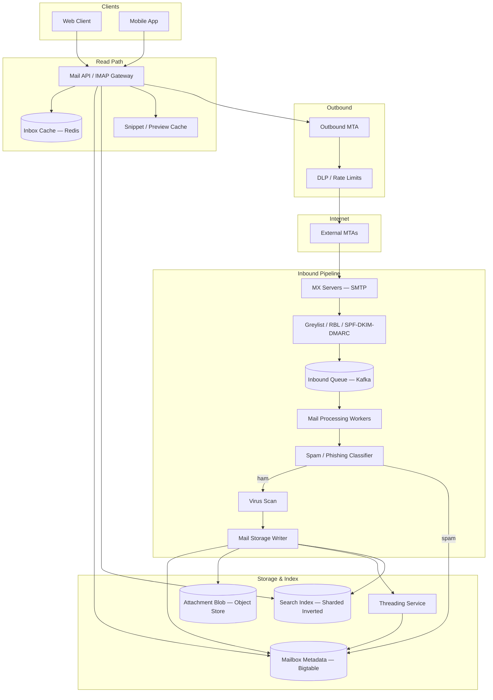
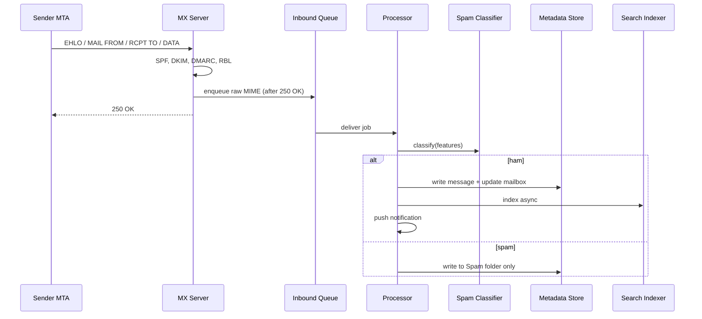

# Case Study 40 — Email at Scale (Gmail-Class)

Design a **planet-scale email platform** like Gmail: ingest mail via **SMTP**, store billions of messages, **index for search**, build **conversation threads**, filter **spam/phishing** at high accuracy, and serve **sub-second inbox loads** for hundreds of millions of users.

## 1. Problem

Email is deceptively simple (send text A → B) but operationally brutal:

1. **SMTP ingestion** from arbitrary Internet hosts — malformed messages, backscatter, greylisting  
2. **Storage** of petabytes with per-user mailbox semantics and quotas  
3. **Search** full-text across entire mailbox history in milliseconds  
4. **Threading** messages into conversations despite broken clients (missing headers)  
5. **Spam/abuse** — adaptive adversaries; false positives destroy trust  

The hard part is not delivering one email — it is **reliable pipeline orchestration + inverted indexes at billion-user scale** with strong abuse resistance.

## 2. Requirements

### Functional (MVP)

- **Send/receive** via SMTP (inbound MX, outbound MTA) and REST/IMAP-like API for clients  
- **Mailbox folders**: Inbox, Sent, Drafts, Trash, Spam, user labels  
- **Threading**: group by `Message-ID`, `In-Reply-To`, `References`, subject fallback  
- **Full-text search** subject/body/attachments metadata; filters (from:, has:attachment)  
- **Spam classification** + user report/override; phishing link detection  
- **Attachments** stored in object storage; virus scan  
- **Read/unread**, stars, archive; **undo send** (5 s window)  

### Out of scope (initially)

- End-to-end encryption (PGP) as default  
- Full Exchange ActiveSync compatibility layer  
- Calendar/contacts (separate services)  
- Legal e-discovery UI (enterprise add-on)  

### Non-functional

- **Inbox load p99 < 500 ms** (first page, 50 threads)  
- **Search p99 < 300 ms** for typical queries  
- **SMTP ingest**: process **1M+ messages/sec** globally (aggregate)  
- **Durability**: zero accepted inbound mail loss after 250 OK  
- **Spam precision**: **< 0.05%** false positive on ham; **> 99%** spam recall  
- **Scale**: **1.5B users**, **300B+ stored messages**, **50 PB** mail storage  
- **Availability 99.99%** for read path  

## 3. Back-of-the-envelope

These numbers are **rough order-of-magnitude math** — not a Gmail SRE runbook. In interviews, the goal is to show you know *what to count* and *which resource breaks first*. A useful shortcut: **1 QPS sustained ≈ 86,400 requests/day** (86,400 seconds in a day). Email at scale is **extreme ingest volume** with a **read path that must feel instant** — the surprise is that inbox load and search indexing dominate, not SMTP wire protocol.

### Why we estimate

Gmail-class email must **ingest ~1M msg/s**, **store petabytes**, and serve **sub-second inbox loads**. Estimates tell us:

- Whether **SMTP ingest pipeline** or **inbox read cache** is the real bottleneck  
- Why **search is an inverted index problem** separate from mail storage  
- How **spam filtering at ingest scale** requires its own GPU/CPU fleet  

### Assumptions

| Assumption | Value | Why it matters |
|------------|-------|----------------|
| Active mailboxes | 1.5B | Global user base |
| Emails received/user/day | 50 | Includes spam filtered before inbox |
| Avg message body+headers | 50 KB | Text + headers (attachments separate) |
| Messages with attachments | 30% | 500 KB avg attachment |
| Blended stored size/msg | 200 KB | Body + attachment share |
| Stored messages (total) | 300B | Historical archive |
| Inbox opens/user/day | 3 | Read path driver |
| Peak ingest multiplier | 3× average | Morning email rush worldwide |

### Step A — Traffic (QPS / throughput) with labeled arithmetic

**Inbound SMTP ingest:**

```text
Messages/day      = 1.5B mailboxes × 50 emails = 75,000,000,000/day
Avg inbound SMTP  = 75B ÷ 86,400
                  ≈ 870,000 messages/second

Peak (×3 morning rush worldwide):
                  ≈ 3,000,000 messages/second
  (Before spam drop — spam filter removes a large fraction before inbox)
```

**Inbox read QPS:**

```text
Inbox opens/day = 1.5B × 3 = 4.5B reads/day
Avg read QPS    = 4.5B ÷ 86,400 ≈ 52,000 reads/second
Peak (×5)       ≈ 250,000 reads/second
```

**Search QPS (assume 10% of inbox opens trigger search):**

```text
450M searches/day → ~5,200 searches/second average
```

### Step B — Storage

**Daily storage growth:**

```text
870K msg/s × 200 KB × 86,400 s/day
  = 870,000 × 200 KB × 86,400
  ≈ 15 PB/day raw

With dedupe/compression/index overhead ×1.5 ≈ 22 PB/day gross
  → Tiered: hot (recent) vs warm vs cold; not all on SSD
```

**Total stored mail (historical):**

```text
300B messages × 200 KB blended ≈ 60 PB logical
  Requirement says 50 PB — same order of magnitude
```

**Inverted index for search:**

```text
300B messages × 200 B doc-id/terms pointer ≈ 60 TB inverted index (compressed)
  → Sharded by userId; each shard serves search for its user partition
```

**Thread metadata hot cache:**

```text
500 active threads/user × 200 B ≈ 100 KB/user
1.5B users × 100 KB ≈ 150 TB if all resident
  → LRU cache; only active users hot (~100M DAU → ~10 TB hot thread cache)
```

### Step C — Bandwidth / other

**Spam model inference at ingest:**

```text
3M msg/s peak × 2 ms per GPU batch inference
  → Large CPU/GPU fleet OR heavy feature caching + lightweight first-pass filter
  Two-stage: cheap rules → expensive ML on suspicious subset
```

**Attachment blob store:**

```text
30% of 870K msg/s × 500 KB ≈ 130 GB/s attachment ingest (peak higher)
  → Object storage (S3-like); dedupe by content hash
```

**Inbox API response (read path):**

```text
50 threads × ~2 KB per thread snippet ≈ 100 KB per inbox page
250K peak read QPS × 100 KB ≈ 25 GB/s inbox egress
  → Precomputed thread list + snippet cache; not DB join at read time
```

### Step D — Ratios and capacity table

| Metric | Average | Peak | Notes |
|--------|---------|------|-------|
| SMTP ingest | ~870K msg/s | ~3M msg/s | Before spam filter |
| Inbox read QPS | ~52K/s | ~250K/s | Precomputed thread list |
| Search QPS | ~5.2K/s | ~26K/s | Inverted index shards |
| Storage growth/day | ~15 PB | — | ×1.5 with index overhead |
| Total stored mail | ~50–60 PB | — | 300B messages |
| Inverted index | ~60 TB | — | Compressed term pointers |
| Ingest:read ratio | ~17:1 | — | Pipeline vs read path |

### What the numbers tell us

- **Separate mail pipeline (async ingest) from read path (cached views)** — never query raw store for inbox load  
- **870K msg/s ingest is the write monster** → async pipeline: MX → spam → store → index → notify  
- **250K inbox read QPS peak** → precomputed thread list + snippet cache; p99 < 500 ms  
- **60 TB inverted index** → sharded search; p99 < 300 ms for typical queries  
- **Spam at 3M msg/s peak** → two-stage filter; ML only on suspicious subset  
- **15 PB/day growth** → tiered storage; attachments in object store with content-hash dedupe  

### Common mistake for this problem

Designing inbox load as **SQL JOIN across messages table** — at 250K read QPS, you need **precomputed thread views** cached per user. Interviewers want: ingest pipeline writes thread metadata asynchronously; read path hits cache. Another mistake: running **full ML spam classification on every one of 3M msg/s** — use cheap rules first, ML on the suspicious ~10–20% subset.

## 4. High-Level Design (HLD)



### Inbound SMTP sequence



### Components

| Component | Role |
|-----------|------|
| MX / SMTP gateway | TLS, recipient validation, backpressure, 250 OK only after durable enqueue |
| Auth checks | SPF, DKIM, DMARC alignment; reject/warn/quarantine policy |
| Processing workers | MIME parse, extract bodies, normalize charset, strip dangerous HTML |
| Spam classifier | Ensemble: rules + ML (logistic/GBDT) + URL reputation + user signals |
| Mail storage | Immutable message blobs; mailbox pointers per user |
| Threading service | Build conversation graph; update thread summary |
| Search index | Sharded inverted index; per-user ACL filter |
| Inbox cache | Materialized thread list sorted by last activity |
| Outbound MTA | Queue, retry, bounce generation, IP reputation pools |

### Threading model

```text
Primary: Message-ID graph
  In-Reply-To → parent Message-ID
  References → chain of Message-IDs

Fallback (broken clients):
  normalized_subject + participant set hash within 7-day window

Thread record:
  thread_id, user_id, subject, participant_ids[], last_message_at, snippet, unread_count
```

### Trade-offs

| Choice | Pros | Cons |
|--------|------|------|
| Accept then async process | Fast SMTP handshake; no loss after OK | Spam hits storage before filter |
| Reject spam at SMTP | Saves storage | False reject is catastrophic |
| Per-user inverted index | Fast scoped search | 1.5B indexes impossible — shared shards with ACL |
| Global index + user filter | Fewer shards | Query must filter by user_id |
| Strong thread precompute | Fast inbox | Write amplification on new reply |
| Eventual thread consistency | Cheaper writes | Brief mis-order in UI OK |

## 5. Low-Level Design (LLD)

### Mail APIs (REST-style)

```text
GET /v1/users/me/threads?label=INBOX&maxResults=50&pageToken=
→ {
     "threads": [
       { "threadId": "t_991", "snippet": "...", "unread": true, "participants": ["a@x.com"],
         "lastMessageAt": "2024-07-20T10:00:00Z", "messageCount": 4 }
     ],
     "nextPageToken": "..."
   }

GET /v1/users/me/threads/t_991/messages
→ { "messages": [ { "messageId", "from", "to", "subject", "bodyHtml", "attachments": [] } ] }

POST /v1/users/me/messages/send
Body: { "to": [], "subject", "body", "threadId": optional, "attachments": [] }
→ { "messageId", "threadId" }

GET /v1/users/me/search?q=from:boss subject:review after:2024/07/01
→ { "messageIds": ["m_1", "m_2"], "estimateTotal": 42 }

POST /v1/users/me/messages/m_991/modify
Body: { "addLabels": ["STARRED"], "removeLabels": ["UNREAD"] }

POST /v1/users/me/spam/report
Body: { "messageId": "m_991" }
```

### SMTP (inbound — simplified dialog)

```text
S: EHLO mx.example.com
M: 250-STARTTLS
S: STARTTLS
S: MAIL FROM:<sender@external.com>
M: 250 OK
S: RCPT TO:<user@gmail.com>
M: 250 OK
S: DATA
M: 354 Go ahead
S: [RFC 5322 MIME message]
S: .
M: 250 queued abc123   // only after durable write to Kafka/S3
```

### Schema

**Message store (immutable — object storage + pointer)**

```text
messages (
  message_id       TEXT PRIMARY KEY,
  raw_mime_key     TEXT,          -- S3 path
  size_bytes       BIGINT,
  internal_date    TIMESTAMP,
  parsed_headers   JSONB,
  body_text_key    TEXT,
  body_html_key    TEXT,
  checksum         TEXT
)
```

**Mailbox metadata (Bigtable / Cassandra — partitioned by user)**

```text
user_messages (
  user_id          BIGINT,
  mailbox_key      TEXT,          -- folder_label + sort_key
  message_id       TEXT,
  thread_id        TEXT,
  labels           SET<TEXT>,
  is_read          BOOLEAN,
  is_starred       BOOLEAN,
  received_at      TIMESTAMP,
  PRIMARY KEY ((user_id), mailbox_key, received_at, message_id)
)

threads (
  user_id          BIGINT,
  thread_id        TEXT,
  subject_norm     TEXT,
  participant_hash TEXT,
  last_msg_at      TIMESTAMP,
  snippet          TEXT,
  unread_count     INT,
  message_ids      LIST<TEXT>,
  PRIMARY KEY ((user_id), thread_id)
)
```

**Search index shard (Elasticsearch-like concept)**

```text
// Document ID = message_id; sharded by hash(message_id)
search_doc {
  message_id,
  user_id,              // ACL filter field
  thread_id,
  from_addr,
  to_addrs[],
  subject,
  body_tokens[],        // stemmed terms
  received_at,
  has_attachment,
  labels[]
}
```

**Spam training store**

```text
spam_features (
  message_id       TEXT,
  feature_vector   BLOB,
  label            ENUM('ham','spam','phishing'),
  user_override    BOOLEAN,
  model_version    TEXT
)
```

**Outbound queue**

```text
outbound_queue (
  job_id           UUID PRIMARY KEY,
  from_addr        TEXT,
  to_addrs         TEXT[],
  mime_key         TEXT,
  attempts         INT,
  next_retry_at    TIMESTAMP,
  status           ENUM('pending','sent','bounced')
)
```

### Modules

```text
SmtpSessionHandler
InboundAuthValidator (SPF/DKIM/DMARC)
MimeParser
MailPipelineWorker
SpamClassifier
  ├── RuleEngine (RBL, bulk score)
  ├── MLInferenceService
  └── UrlReputationClient
ThreadingEngine
MailboxWriter
SearchIndexer (async)
InboxMaterializer
MailApiController
OutboundMtaScheduler
AttachmentStore
VirusScannerAdapter
```

### Algorithm — inbound processing pipeline

```text
function processInbound(rawMime, rcptUser):
  msg = mimeParser.parse(rawMime)
  auth = validateSpfDkimDmarc(msg)
  if auth.failHardPolicy: return quarantineOrDrop()

  features = extractSpamFeatures(msg, auth, rcptUser)
  spamScore = classifier.predict(features)

  messageId = msg.headers.messageId or generate()
  storage.writeImmutable(msg)

  threadId = threadingEngine.resolve(rcptUser, msg)

  if spamScore > SPAM_THRESHOLD:
    mailbox.addMessage(rcptUser, messageId, labels=[SPAM], threadId)
  else:
    mailbox.addMessage(rcptUser, messageId, labels=[INBOX], threadId)
    inboxCache.invalidate(rcptUser)
    searchIndexer.enqueue(messageId, rcptUser)
    pushNotifier.notify(rcptUser, threadId, snippet)
```

### Algorithm — threading

```text
function resolveThread(userId, msg):
  if msg.inReplyTo:
    parent = mailbox.findByMessageId(userId, msg.inReplyTo)
    if parent: return parent.threadId

  if msg.references:
    for ref in reverse(msg.references):
      parent = mailbox.findByMessageId(userId, ref)
      if parent: return parent.threadId

  // fallback heuristic
  key = hash(normalizeSubject(msg.subject) + sortedParticipants(msg))
  candidate = threadIndex.lookup(userId, key, window=7days)
  if candidate: return candidate.threadId

  return createNewThread(userId, msg)
```

### Algorithm — inbox materialized view

```text
function getInbox(userId, pageToken, limit):
  cached = redis.get("inbox:" + userId)
  if cached and not stale(pageToken):
    return paginate(cached, pageToken, limit)

  rows = db.query(
    "SELECT * FROM threads WHERE user_id=? AND has_label INBOX ORDER BY last_msg_at DESC LIMIT ?",
    userId, limit + 1
  )
  redis.set("inbox:" + userId, rows, ttl=300)
  return paginate(rows, pageToken, limit)

function onNewMessage(userId, threadId):
  inboxCache.invalidate(userId)
  // or incremental: prepend thread if INBOX label
```

### Algorithm — search query

```text
function search(userId, queryAst):
  // Parse: from:boss subject:review → structured filters + free text
  shardQueries = routeToAllSearchShards(queryAst.freeText)
  results = []
  for shard in shardQueries:
    hits = shard.search(
      must=[{ term: user_id = userId }],   // mandatory ACL
      filter=queryAst.filters,
      text=queryAst.freeText,
      limit=100
    )
    results.merge(hits)
  return rankByRecency(results).take(50)
```

User_id filter **must** be first-class — never leak cross-tenant results.

### Algorithm — spam classification (ensemble)

```text
function predict(features):
  ruleScore = 0
  if features.senderInRbl: ruleScore += 50
  if features.dmarcFail: ruleScore += 30
  if features.urlReputationMax > 0.8: ruleScore += 40

  mlScore = gbdtModel.predict(features.toVector())  // 0..1

  final = max(ruleScore / 100, mlScore)
  if userHasSenderInContacts(features.from): final *= 0.3
  if userReportedSpamSender(features.from): final = max(final, 0.95)
  return final
```

### Algorithm — outbound send with undo window

```text
function sendMessage(userId, draft):
  jobId = outboundQueue.schedule(draft, deliverAfter=now+5s)
  redis.set("undo:" + jobId, draft, ttl=5)
  return { messageId, undoToken: jobId }

function undoSend(userId, undoToken):
  if outboundQueue.cancel(undoToken):
    return OK
  return TOO_LATE

function outboundWorker(job):
  mta.deliver(job.mime)
  mailbox.addSent(userId, job.messageId)
  onFailure: exponentialBackoff; generate DSN bounce after N tries
```

### Concurrency & correctness

- **250 OK only after enqueue durable** — Kafka acks=all or write to replicated storage  
- **Exactly-once mailbox writes**: idempotent on `message_id` — SMTP retries must not duplicate  
- **Label changes**: optimistic concurrency on thread row version  
- **Search eventual lag**: typically < 30 s; UI may show "indexing" state  
- **Quota enforcement**: check cumulative bytes before accept DATA; reject 552 if over limit  

## 6. Scale evolution

| Stage | Scale | Architecture |
|-------|-------|--------------|
| MVP | 1M users | Single region; Postfix + MySQL; Elasticsearch; rules-only spam |
| Growth | 100M users | Sharded metadata; Kafka pipeline; ML spam; object storage attachments |
| Large | 1B users | Bigtable mailbox; global MX anycast; regional search shards |
| Gmail-class | 1.5B+ | Custom storage (Colossus-like); per-DC pipelines; GPU spam retrain daily |
| Search pressure | long-tail queries | Query caching; popular terms CDN; cap deep pagination |
| Hot user | viral thread | Dedicated cache slice; rate limit notifications |

## 7. Recap

- **SMTP is async by nature**: OK fast, process in pipeline — durability at enqueue, not at classify  
- **Mailbox ≠ message blob**: immutable messages + per-user labels/threads; enables dedupe and threading  
- **Threading** uses headers first, heuristics second — real-world clients break pure graph approaches  
- **Search requires user-scoped ACL** on every query — shard by message, filter by user_id  
- **Spam is adversarial ML** — ensemble rules + models + user feedback loop; optimize for low false positives  

**Practice:** trace one inbound message from **TCP connect to MX** through to **inbox notification**; identify three idempotency keys that prevent duplicates under SMTP retries.
