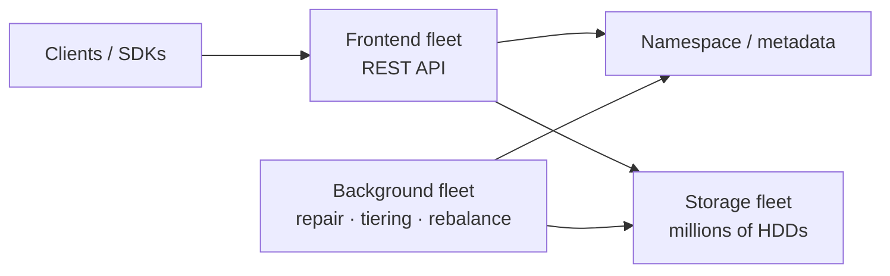
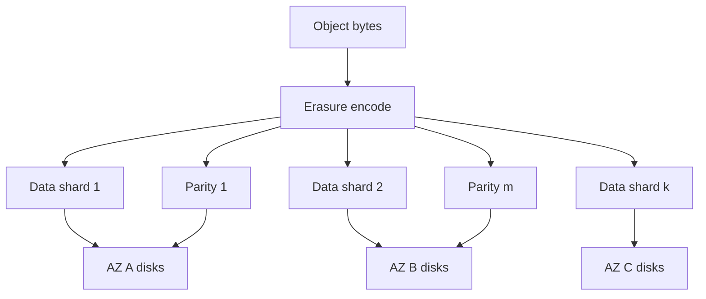
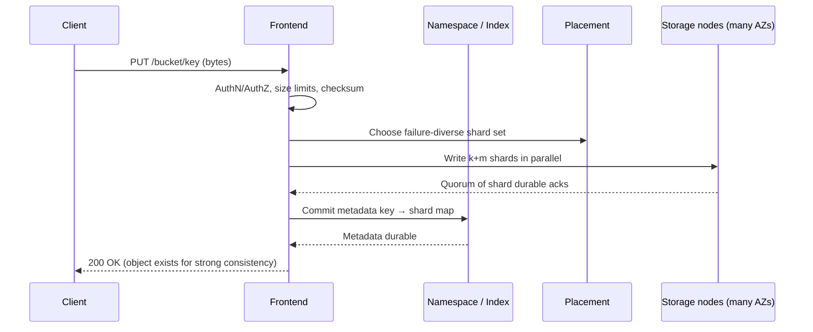

# Case Study 41 — How Amazon S3 Stores Trillions of Files

A deep dive into **how Amazon S3 stores so many files** — not a beginner “PUT to a bucket” tutorial, but the internal design that lets one service hold **hundreds of trillions of objects**, absorb **tens of millions of requests per second**, and still promise **11 nines of durability**.

> This lesson synthesizes public engineering material, especially Andy Warfield’s FAST ’23 talk / [All Things Distributed post](https://www.allthingsdistributed.com/2023/07/building-and-operating-a-pretty-big-storage-system.html), plus community write-ups of S3’s architecture. Exact AWS internals are proprietary; numbers evolve over time. Treat this as an **interview-grade mental model**, not a leak of private design docs.

Related: [Case Study 37 — Exabyte Object Storage](37-exabyte-object-storage.md) (how *you* would build S3-like storage). This chapter explains **why S3 works the way it does at planetary scale**.

---

## 1. Problem — Why “just a filesystem” fails

People say “S3 is a hard drive in the cloud.” That intuition is wrong in three ways:

1. **Not a filesystem** — There are no real directories, inodes, or POSIX locks. Objects live in a **flat keyspace** inside a **bucket**. “Folders” are only key prefixes (`photos/2024/a.jpg`).
2. **Not one machine** — A single customer bucket can be spread across **millions of disks**.
3. **Not replication-only** — Storing every byte three times would be ruinously expensive at S3’s size. Durability comes from **erasure coding** + continuous repair.

### The scale that forces a different design

Public ballpark figures (order of magnitude; they grow every year):

| Metric | Approximate scale |
|--------|-------------------|
| Objects stored | **100T → 280T+** reported over recent years |
| Request rate | **Tens of millions+/sec** aggregate |
| Disks | **Millions** of HDDs |
| Microservices | **Hundreds** inside S3’s org |
| Durability target | **99.999999999%** (11 nines) per year |
| Consistency (since 2020) | **Strong read-after-write** for new objects |

The paradox Andy Warfield highlights: HDDs keep getting **bigger** (capacity ↑ millions of times since the 1950s), but **random I/O per disk stays ~100–120 IOPS**. So every year you store more bytes per disk while each disk can answer fewer random asks per byte of capacity. S3’s whole architecture exists to survive that physics.

---

## 2. Requirements (what S3 must deliver)

### Functional (what the API looks like)

- Store and retrieve opaque **objects** via HTTP: `PUT` / `GET` / `DELETE` / `LIST`
- Address by `(bucket, key)` — unlimited-looking keyspace per bucket
- Optional **versioning**, **multipart upload**, **lifecycle** (Standard → IA → Glacier)
- Multi-tenant: millions of customers share the same disk fleet

### Non-functional (why internals get hard)

| Property | Meaning for design |
|----------|-------------------|
| **Durability** | Survive disk, rack, AZ failures without silent data loss |
| **Availability** | Stay up even while disks and nodes constantly die |
| **Tail latency** | p99 matters more than average — one hot disk ruins UX |
| **Cost** | Prefer erasure coding over 3× replication for capacity |
| **Heat balance** | Spread I/O so no single disk becomes a hotspot |
| **Operability** | Hundreds of teams ship continuously without breaking 11 nines |

---

## 3. The mental model — four fleets

At the whiteboard level (from Warfield), S3 looks “simple”:



| Fleet | Job |
|-------|-----|
| **Frontend** | Auth, request validation, orchestration of PUT/GET |
| **Namespace / metadata** | Map `(bucket, key)` → where bytes live (shard locations, version, checksum) |
| **Storage nodes** | Persist **shards** of object data on disk (not whole objects on one drive) |
| **Background / data services** | Rebuild after failures, rebalance heat, lifecycle tiering, scrubbing |

AWS “ships its org chart”: each box is many teams and many microservices with API contracts between them. That organizational modularity matches the software modularity.

---

## 4. How S3 stores “so many files” — the key tricks

### 4.1 Separate **name** from **bytes**

Never put object names on the same machine that holds all the bytes.

```text
Client thinks:     bucket/my-video.mp4
Metadata thinks:   key → { version, size, etag, shard_set_id, encryption, … }
Storage thinks:    shard_id → opaque bytes on disk XYZ
```

Benefits:

- Metadata can be cached and scaled independently  
- Storage nodes stay simple key→blob engines  
- Renames / ACL changes don’t rewrite terabytes  

### 4.2 Flat namespace + partitioned index

Buckets are **not** directories on a single volume. The index that maps keys to locations is itself a **massive distributed store**, partitioned (historically by key/prefix hash).

**Old advice:** randomize key prefixes (`a1f3/photo.jpg`) to avoid hot partitions.  
**Modern reality (post ~2018):** S3 auto-scales hot index partitions; sequential prefixes are less catastrophic — but **I/O heat on disks** is still a design concern.

Listing (`ListObjects`) is a **prefix scan over the index**, not a filesystem walk. Huge prefixes need pagination; the design assumes list is secondary to GET/PUT.

### 4.3 Erasure coding instead of “copy everything 3×”

For durability *and* capacity efficiency, S3 uses **Reed-Solomon-style erasure coding**:

```text
Object → split into k data shards + m parity shards
Any k of (k + m) shards reconstruct the object
Shards placed across failure domains (disks / racks / AZs)
```



**Why this stores more files cheaply:**

| Scheme | Capacity overhead | Read flexibility | Cost at EB scale |
|--------|-------------------|------------------|------------------|
| 3× replication | 3.0× | Read any copy | Too expensive |
| EC (e.g. ~1.2–1.5×) | Much lower | Need k shards | Practical |

Replication is great for **read I/O** (any copy works) but burns disk. Erasure coding saves disk while still surviving multiple failures — if shards are spread correctly.

### 4.4 Place **different objects on different disk sets**

Critical insight from Warfield:

> Individual objects may be encoded across tens of drives, but **different objects** are placed on **different sets of drives**.

So a single bucket’s objects fan out across **millions** of disks.

**Payoff:**

1. One customer can’t melt one disk — their data is a thin slice of each drive  
2. A burst (genomics + thousands of Lambdas) can draw I/O from a **million disks at once**  
3. Multitenancy **smooths aggregate demand** — individual workloads are bursty; the fleet aggregate is surprisingly flat  

That aggregation is why S3 can offer performance that would be unaffordable as a dedicated appliance for one customer.

### 4.5 Heat management — the hidden boss fight

**Heat** = request rate hitting a disk.

HDDs ≈ **120 random IOPS**. Hotspots don’t always “crash” S3 — they create **queues → stragglers → terrible p99 latency**. Those stalls amplify through metadata lookups and erasure-coded multi-shard reads.

S3 continuously works to:

- Spread new object placement broadly  
- Use redundancy to **steer reads away from busy disks** (fetch alternate shards)  
- Rebalance / background move data when imbalance appears  

At extreme scale, predicting future access at write time is nearly impossible for one workload — but **aggregate multitenancy** makes the global pattern manageable.

### 4.6 Storage engine on the node (ShardStore intuition)

Public talks describe storage nodes evolving toward engines like **ShardStore** (Rust): an **append-oriented / LSM-style** design optimized for shard persistence, with data layout chosen to reduce write amplification.

Mental model for interviews:

```text
Storage node = many disks + local KV/shard store
              + heartbeats to control plane
              + scrubbing / rebuild helpers
```

Nodes don’t need to understand “buckets” or customer ACLs — the frontend + namespace own that.

---

## 5. Request paths (HLD → LLD)

### 5.1 PUT object (write path)



**Correctness rules (interview gold):**

1. Don’t advertise success until enough shards **and** metadata are durable  
2. Orphans (shards without metadata) are GC’d by background jobs  
3. Overwrite = new version (or replace pointer); immutability simplifies replication  

### 5.2 GET object (read path)

```text
1. Frontend authenticates request
2. Namespace lookup: key → shard locations + etag
3. Fetch any k available shards (skip hot / failed disks)
4. Reconstruct object, verify checksum
5. Stream to client (or 304 if If-None-Match matches)
```

**Hedged / parallel reads:** start more shard fetches than strictly needed; cancel extras when k arrive — reduces tail latency when one disk is slow.

### 5.3 DELETE

Usually a **metadata tombstone** first; bytes reclaimed asynchronously. Instant “space free” at multi-EB scale is a lie — it’s a background process.

### 5.4 Multipart upload (large files)

```text
CreateMultipartUpload → Upload Part 1..N (each part EC’d independently)
→ CompleteMultipartUpload (namespace commits part list as one object)
```

Why: you can’t hold a 5 TB PUT open as one TCP stream forever; parts retry independently.

---

## 6. Durability engineering (beyond coding theory)

### 6.1 The statistical claim

**11 nines** ≈ expected loss of one object among **10 billion** objects over **100,000 years** — marketing shorthand for “loss is dominated by software bugs and ops mistakes, not random disk fails,” if repair stays healthy.

### 6.2 Continuous scrubbing & repair

Disks fail **all the time**. Background systems:

- Detect missing/corrupt shards  
- Reconstruct from survivors  
- Re-place new shards into healthy failure domains  

If repair lags growth of failures → durability collapses. Capacity planning includes **rebuild bandwidth**.

### 6.3 Human process: durability reviews

Warfield describes **durability reviews** (like security threat models): any change that could affect durability gets a written threat analysis. This is part of the “system” — software + people.

Interview takeaway: at S3 scale, **process is an availability/durability feature**.

---

## 7. Consistency model

| Era | Behavior |
|-----|----------|
| Classic S3 | **Read-after-write** for new keys in many cases; **eventual** for overwrites / lists in edge cases |
| Since Dec 2020 | **Strong consistency** for all PUT/overwrite/DELETE — read after write sees latest |

Strong consistency requires the **metadata/index path** to serialize visibility carefully (and keep caches coherent). That’s why the metadata subsystem sits on the critical path and uses resilient caching designs described in public talks.

---

## 8. LLD sketch — data structures you’d invent in an interview

### Metadata record

```text
ObjectMeta {
  bucket_id
  key
  version_id
  size
  etag / checksum
  storage_class
  shard_set: [ { shard_id, node_id, az, checksum } × (k+m) ]
  created_at
  delete_marker?
}
```

### Placement constraints

```text
function placeShards(objectId, k, m):
  candidates = healthyNodes()
  pick (k+m) nodes maximizing diversity:
    - distinct disks
    - distinct racks
    - ≥ 3 AZs when required by class
  return shardTargets
```

### Heat-aware read

```text
function readObject(meta):
  targets = sort(meta.shard_set, byEstimatedQueue)
  inflight = fetch first k+hedge from coolest targets
  wait until k valid shards OR timeout → try more
  return reconstruct(shards)
```

### Bucket → disk fanout

```text
// Not: one bucket → one volume
// Yes: hash(objectId or placementKey) → many shard groups across fleet
for each new object:
  shardGroup = pickFreshDiverseGroup(fleet)
  // so LIST of keys is index work; GET fans to many disks
```

---

## 9. Why HDDs still win for S3

From the FAST talk’s physics lesson:

- Capacity/$ and W/$ still favor HDD for **cold/warm bulk**  
- Flash wins latency and random IOPS — used where it pays  
- Jim Gray’s line still fits: *“Disk is tape”* for archival-ish bulk; S3 Standard is the sophisticated bulk layer  

S3’s bet: **software + aggregation + EC** turns “slow big disks” into a global service with good enough latency for most apps (and CloudFront for the rest).

---

## 10. Failure modes & mitigations

| Failure | Symptom | Mitigation |
|---------|---------|------------|
| Disk dies | Missing shards | EC reconstruct + re-place |
| Hot disk | p99 latency spike | Steer reads; rebalance; hedge requests |
| AZ impaired | Many shards unreachable | AZ-diverse placement; quorum k from survivors |
| Metadata partition hot | Slow PUT/GET for key range | Split partitions; cache; admission control |
| Slow repair | Durability risk rises | Prioritize rebuild I/O; capacity headroom |
| Buggy deploy | Systemic risk | Durability reviews, staged rollouts, invariants |

---

## 11. Scale evolution (how you’d grow a baby S3)

| Stage | Design |
|-------|--------|
| MVP | 3× replication, single region, Postgres metadata |
| Growth | Shard metadata; object storage nodes; multipart |
| Cost pressure | Move cold/standard data to EC; keep metadata replicated |
| Multi-AZ | Shard placement across AZs; stronger durability story |
| Multi-tenant hyperscale | Heat management, millions of disks, background repair fleets |
| Planetary | Hundreds of microservices, per-team APIs, durability culture |

---

## 12. Interview talking points (use these)

1. **S3 is not a filesystem** — flat object namespace + metadata plane + byte plane.  
2. **HDD capacity ↑ but IOPS flat** → must spread every bucket across huge disk sets.  
3. **Erasure coding** for capacity-efficient durability; replication alone doesn’t scale economically.  
4. **Heat management** is as important as durability math — hotspots create stragglers.  
5. **Multitenancy is a feature** — aggregate load smooths so individuals can burst.  
6. **Strong consistency** is a metadata problem, not a “disk sync” slogan.  
7. **Background repair** is on the critical path of the durability story.  

---

## 13. Recap

Amazon S3 stores “so many files” by refusing to put many files on one disk the way a NAS would. Instead it:

1. Indexes names in a distributed **namespace**  
2. Breaks bytes into **erasure-coded shards**  
3. Scatters shards across **failure-diverse**, **heat-balanced** disks  
4. Lets **millions of workloads share millions of drives** so bursts amortize  
5. Runs relentless **repair, scrubbing, and operational reviews** to keep 11 nines real  

**Practice:** On a whiteboard, draw PUT and GET with EC, then explain what happens when 2 disks and 1 AZ fail at once — which reads still succeed, and what background work starts?

**Sources to read next:**

- [Building and operating a pretty big storage system called S3](https://www.allthingsdistributed.com/2023/07/building-and-operating-a-pretty-big-storage-system.html) (Andy Warfield)  
- [High Scalability — Behind AWS S3’s Massive Scale](https://highscalability.com/behind-aws-s3s-massive-scale/)  
- Companion design exercise: [Case Study 37 — Exabyte Object Storage](37-exabyte-object-storage.md)
