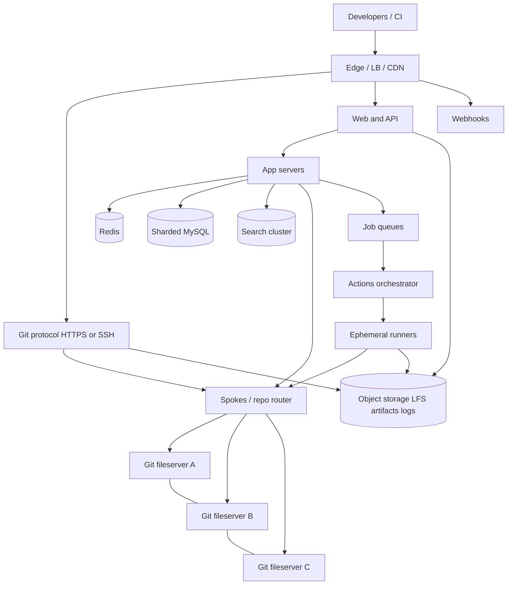
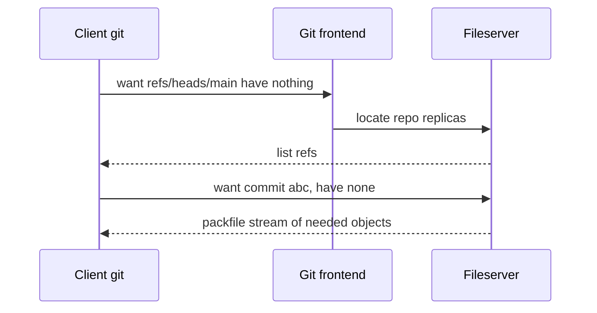

# Case Study 42 — How GitHub Stores Hundreds of Millions of Repos

A deep dive into **how GitHub handles such a large volume of data** — Git objects, clones, forks, issues, search, Actions, and large files — without treating `git` like a normal filesystem or Dropbox.

> This lesson uses **public Octoverse / engineering-talk ballparks**. Exact GitHub internals and live capacity are proprietary and change yearly. Treat numbers as **interview-grade order of magnitude**, not leaked SRE dashboards.

Related: [Case Study 18 — File Storage](18-file-storage.md), [Case Study 37 — Exabyte Object Storage](37-exabyte-object-storage.md), [Case Study 41 — Amazon S3 Internals](41-amazon-s3-internals.md).

> **Practice first:** After §2, pause. Name the **core verb**, the **hot paths** (`git clone` vs `git push` vs the website), and what you think is stored as **Git bytes** vs **application metadata**. Then come back to the math.

---

## 1. Problem — Why “a giant disk of Git folders” fails

Beginners picture GitHub as:

```text
/data/github/user/repo/.git
```

That mental model dies for five independent reasons:

1. **Git is a content-addressed DAG, not a folder of files.** A commit points at a tree; a tree points at blobs (file bytes) and other trees. Identity is a **hash** (historically SHA-1; moving to SHA-256). The same `README.md` in 10,000 forks can be the **same blob**.
2. **Traffic is wildly skewed.** Linux, VS Code, and similar clones dwarf a student’s homework repo. One “hot repo” can generate more bandwidth than millions of cold ones.
3. **Forks look like copies but must not cost a full copy** if you can avoid it — otherwise fork storms multiply storage linearly.
4. **The website is not Git.** Issues, PRs, stars, permissions, Actions logs, Packages, and search are **different systems** with different QPS and consistency needs.
5. **Clone is a bulk download.** A naive “send the whole `.git` every time” would melt the network. Git already has **packfiles, deltas, and negotiation**; GitHub must run that protocol at planetary scale.

### The scale that forces a different design

Public ballpark figures (order of magnitude; they grow every year):

| Metric | Approximate scale |
|--------|-------------------|
| Developers | **100M–150M+** accounts |
| Repositories (incl. forks) | **400M–500M+** |
| Contributions / year | **Billions** |
| Git data on disk | **Many petabytes** (replicated) |
| Hot operations | `git fetch` / `clone` / `push`, web UI, API, Actions |
| Durability | Lose a repo = lose customer trust; replication is mandatory |

The paradox: **most repos are tiny and idle**, but **a few repos and a few operations** (clone of a huge repo, `git push` to a busy default branch, code search, CI) dominate cost.

---

## 2. Requirements (what GitHub must deliver)

### Functional

| Surface | What users think it does |
|---------|--------------------------|
| **Git hosting** | `clone`, `fetch`, `pull`, `push` over HTTPS/SSH |
| **Web UI** | File browser, blame, diffs, history |
| **Collaboration** | Issues, PRs, reviews, discussions, projects |
| **Social** | Stars, watches, follows, notifications |
| **Search** | Code, issues, users, commits |
| **CI** | GitHub Actions: workflow YAML → jobs on runners |
| **Artifacts** | Releases, Packages, Git LFS, Pages |
| **AuthZ** | Org/team/repo permissions, SSO, tokens, rate limits |

### Non-functional

| Property | Why it matters |
|----------|----------------|
| **Durability of Git** | A corrupted object or lost branch is catastrophic |
| **Clone/fetch latency and throughput** | Developers sit waiting on `git clone` |
| **Push availability** | Broken push = broken deploys worldwide |
| **Read-your-writes on push** | After `git push`, `git clone` and the UI must see it |
| **Multi-tenant isolation** | One noisy repo must not starve others |
| **Cost** | Storing every fork as a full copy is unaffordable |

---

## 3. Back-of-the-envelope estimates

These numbers are **rough order-of-magnitude math**. In interviews, the goal is to show you know **what to count**. Cheat sheet: **1 QPS ≈ 86,400 requests/day**. Peak is often **2–5×** average, but GitHub also has **weekday / timezone bursts** (US morning + EU morning).

### Why we estimate

GitHub is several systems glued together. Estimates tell us:

- Whether **Git bytes**, **clone bandwidth**, or **MySQL metadata** break first
- Why **dedup + packfiles + 3× replica placement** beat “copy every repo three times as loose files”
- Why **Issues/PRs** are a classic OLTP problem, while **clone** is a bulk storage/network problem
- Why **Actions** can rival Git storage in *compute* cost even if logs are smaller than Git objects

### Assumptions (say these out loud)

| Assumption | Value | Why it matters |
|------------|-------|----------------|
| Registered developers | 150M | Account/metadata floor |
| Monthly active developers | 50M | Drives Git and web QPS |
| Repositories including forks | 500M | Namespace + routing table size |
| Active repos / day (any Git op) | 20M | Fileserver working set |
| Forks as share of repos | ~40% | Dedup / alternate-object opportunity |
| Average *logical* Git size / repo | 5 MB | Skewed: many empty, few huge |
| Average *on-disk pack* after Git compression | 1.5 MB | Packs + deltas beat loose objects |
| Replication factor for Git | 3 | DGit-style copies on different fileservers |
| Clones + fetches / active user / day | 8 | CI clones inflate this |
| Average clone/fetch download | 8 MB | Pack negotiation; not full history every time |
| Pushes / active user / day | 2 | Write path |
| Average push pack | 200 KB | Incremental |
| Issues+PRs created / day | 5M | Metadata writes |
| Web/API page views / active user / day | 40 | HTML/JSON, not Git |

**Skew reminder:** Averages hide Linux-sized repos. Design for **p99**, not the mean. We still use means to size *fleets*, then add a **hot-repo** story.

---

### Step A — Traffic (QPS)

**Git fetch / clone (the bandwidth hog):**

```text
Git downloads/day
  = 50M active users × 8 fetch/clone-like ops
  = 400,000,000 / day

Avg Git download QPS
  = 400M / 86,400
  ≈ 4,630 ops/s

Peak (5×, weekday morning + CI):
  ≈ 23,000 Git download ops/s

These are sessions, not tiny HTTP GETs.
Many last seconds and stream megabytes.
```

**Git push:**

```text
Pushes/day = 50M × 2 = 100,000,000
Avg push QPS = 100M / 86,400 ≈ 1,160/s
Peak (5×) ≈ 5,800/s
```

Insight: **Downloads outnumber pushes ~4:1 in ops**, and **far more in bytes** (next section). Push is still the *correctness* hot path (auth, hooks, updating refs).

**Web + API (the website GitHub.com):**

```text
Page/API calls/day = 50M × 40 = 2,000,000,000
Avg ≈ 2B / 86,400 ≈ 23,000/s
Peak (5×) ≈ 115,000/s
```

This looks like a normal large web app: LB → app → cache → MySQL/search. It is **not** the same pool as Git fileservers.

**Issue / PR writes:**

```text
5M new issues+PRs/day / 86,400 ≈ 58/s avg, peak a few hundred/s
Comments/reactions are 10–50× that → still easy for sharded MySQL
```

Metadata QPS is **not** why GitHub is hard. **Git bytes + clone fan-out + search + CI** are.

---

### Step B — Git storage (the surprising math)

**Logical Git corpus (if every repo were unique and uncompressed):**

```text
500M repos × 5 MB logical
  = 2,500,000,000 MB
  = 2.5 PB logical
```

**After Git pack compression (~3× on typical source trees):**

```text
2.5 PB / 3 ≈ 0.83 PB unique packed Git
  (order of 1 PB of unique Git objects)
```

**If you naively 3×-replicate every repo as a full copy (no cross-repo dedup):**

```text
0.83 PB × 3 = 2.5 PB on fileservers
```

That already sounds “only a few PB” — **too small** compared with public “petabytes of Git” talk. Three corrections beginners miss:

**Correction 1 — Averages lie (heavy tail).**

```text
Suppose:
  90% of repos × 0.2 MB packed = 450M × 0.2 MB ≈ 90 TB
  9% of repos  × 8 MB   packed = 45M  × 8 MB   ≈ 360 TB
  0.9% of repos × 80 MB packed = 4.5M × 80 MB  ≈ 360 TB
  0.1% of repos × 2 GB  packed = 500k × 2 GB   ≈ 1,000 TB = 1 PB

Sum ≈ 1.8 PB packed unique-ish data before extra copies
```

A few hundred thousand large repos dominate disk.

**Correction 2 — Forks and copies.**

If 40% of repos are forks and you **physically copy** all objects:

```text
Extra fork copies could add tens of percent to 2× disk
unless you use object alternates / copy-on-write / shared object stores
```

GitHub historically invested in **not paying full price per fork** (shared object pools / efficient fork storage). Interview phrase: **“fork is a metadata pointer plus copy-on-write objects, not cp -r.”**

**Correction 3 — Replication + packing overhead + GC garbage.**

```text
Unique packed ≈ 2 PB (heavy tail, realistic)
× 3 replicas                               ≈ 6 PB
+ loose objects, stale packs, LFS pointers, indexes
+ headroom for compaction/GC
→ plan ~10 PB class Git fileserver fleet (order of magnitude)
```

Plus **Git LFS and release binaries** live in **object storage**, not in Git packs — they can rival or exceed Git object bytes.

**LFS / releases (often forgotten):**

```text
Assume 5% of active repos use LFS or fat releases
20M active repos × 5% = 1M repos
Average LFS/release payload 200 MB (skewed!)
1M × 200 MB = 200 TB logical
× 3 (or EC ~1.4× in blob store) ≈ 0.3–0.6 PB

Hot games/ML repos with multi-GB assets blow this up.
LFS is why "GitHub storage" ≠ ".git folder size".
```

**What the storage numbers tell us**

- Git fileservers are a **petabyte-class, replica-3, highly skewed** fleet.
- **Object storage** (LFS, zipballs, Actions caches, Packages) is a **second petabyte-class** problem.
- **MySQL** stores pointers, not blobs — gigabytes-to-low-terabytes of rows, not petabytes of source code.

---

### Step C — Bandwidth (this is the scary number)

**Git download egress:**

```text
400M fetch/clone ops/day × 8 MB avg
  = 3,200,000,000 MB/day
  = 3.2 PB/day egress

Average:
  3.2 PB / 86,400 s ≈ 37 GB/s
  ≈ 300 Gbps average Git egress

Peak (5×):
  ≈ 1.5 Tbps Git egress
```

**Sanity check:** CI systems clone the same repos thousands of times per day. Without **caching, CDN, and pack reuse**, you pay that 1.5 Tbps from origin fileservers.

**Push ingress:**

```text
100M pushes/day × 200 KB = 20 TB/day
Avg ≈ 20 TB / 86,400 ≈ 230 MB/s  → ~2 Gbps
```

Push is **tiny** compared with clone/fetch. Optimize **read/egress** and **hot-repo cache**.

**Web UI / API:**

```text
2B requests/day × 20 KB avg response ≈ 40 TB/day
Avg ≈ 460 MB/s — large but much smaller than Git pack egress
```

**CI clone multiplier (beginner trap):**

```text
If Actions runs 100M jobs/day and 30% start with a checkout of 50 MB:
  30M × 50 MB = 1.5 PB/day extra
That alone is hundreds of Gbps unless:
  - jobs use shallow clone (--depth 1)
  - runner cache / checkout optimizations
  - regional Git caches
```

---

### Step D — Metadata, search, and Actions (the other planets)

**Repo routing table (must be fast):**

```text
500M repos × ~200 B locator (repo_id → fileserver set)
  ≈ 100 GB
Fits in sharded MySQL + Redis cache of hot repos.
Every git operation: "which 3 fileservers own this repo?"
```

**Issues / PRs / comments (OLTP):**

```text
Assume 20B historical issue/comment rows × 1 KB
  ≈ 20 TB raw (+ indexes → 40–80 TB)
Shard by repository_id or issue_id.
This is "big MySQL", not "big Git".
```

**Code search index:**

```text
Indexing 2 PB of Git text is impossible as one inverted index.
You index:
  - default branch of reachable public/active repos
  - maybe HEAD blobs only, not all history
  - skip vendored/minified junk

If 50M repos × 1 MB searchable text:
  50 TB corpus → compressed inverted index tens of TB
  Query QPS: thousands to tens of thousands (search is bursty)
→ Elasticsearch-style cluster, partitioned by repo, with ingestion pipeline
```

**GitHub Actions compute (not disk, but volume):**

```text
Suppose 100M jobs/day × 5 min average = 500M job-minutes/day
  = 500M / 1,440 ≈ 347,000 concurrent vCPU-minutes worth of runners
    (very rough: ~100k–1M cores depending on job mix)

Logs: 100M jobs × 200 KB log ≈ 20 TB/day → object storage + TTL
```

Actions can cost more than Git storage even when logs are smaller than Git packs.

---

### Step E — Ratios and capacity table

| Path | Approx share | Implication |
|------|--------------|-------------|
| **Git fetch/clone** | Most **bytes** | Fileservers, pack cache, CDN, shallow clone |
| **Git push** | Low bytes, high **correctness** | Auth, hooks, 3-copy commit, ref update |
| **Web/API** | Most **request count** | Normal web stack + cache |
| **Search** | Spiky CPU/IO | Separate index; never grep fileservers live |
| **Actions** | Most **compute** | Queue + ephemeral VMs; cache checkouts |
| **LFS/releases** | Fat objects | Object store + CDN; not Git DAG |

| Metric | Order of magnitude |
|--------|-------------------|
| Repos | ~500M |
| Unique packed Git | ~1–2 PB |
| Git with 3 replicas + overhead | ~5–10 PB class |
| Git egress average | ~300 Gbps |
| Git egress peak | ~1 Tbps+ |
| Push QPS peak | ~6k/s |
| Web/API peak | ~100k/s |
| Issue rows | tens of billions |
| Search corpus | tens of TB of *indexed* text, not full history |

### What the numbers tell us

- **Split Git storage from application metadata.** Never put issue text and Git blobs in one “repo row.”
- **Clone/fetch is a CDN + pack-cache problem**; push is a **consistency + routing** problem.
- **Heavy tail:** design placement and caching around hot repos (linux, kubernetes, popular templates).
- **Forks must share objects** or storage grows with social virality, not with unique code.
- **CI will DDoS your Git fleet** unless checkouts are shallow and cached.
- **Search is a derived index**, rebuilt asynchronously — not `git grep` on fileservers.
- **LFS exists because Git’s delta DAG is a bad fit for 2 GB videos.**

### Common mistake for this problem

Treating GitHub as **one database of files**. Interviewers want: **content-addressed Git on a replicated fileserver fleet (DGit/Spokes)**, **MySQL for issues/PRs/auth**, **object storage for LFS/releases**, **search index**, **Actions queue** — plus math showing **egress >> push**, and **hot repos >> average repos**.

---

## 4. High-Level Design (HLD)

GitHub is a **front door** (web/API/git protocol) in front of **four data planes**.



### The four data planes (beginner map)

| Plane | Stores | Example |
|-------|--------|---------|
| **Git fileservers** | Packfiles, refs, objects | `refs/heads/main`, blob hashes |
| **OLTP metadata** | Users, repos, issues, PRs, ACL | “PR #812 is open” |
| **Object storage** | LFS, release zips, Actions logs, Packages | installers, jars |
| **Derived indexes** | Search, recommendations, analytics | Code search hits |

Losing this split is how designs collapse into “put Kubernetes YAML in MySQL LONGBLOB.”

### Components

| Component | Role |
|-----------|------|
| Edge / CDN | TLS, DDoS, cache archive zipballs / raw blobs / Pages |
| Git protocol frontends | HTTP smart protocol / SSH; auth; rate limit |
| **Spokes / router** | `repo_id → fileserver replicas`; pick a healthy copy |
| **Git fileservers (DGit-style)** | On-disk Git repo; replicate updates to 3 hosts |
| App servers | Issues, PRs, UI, REST/GraphQL |
| MySQL | Source of truth for metadata; shard by id |
| Redis | Sessions, rate limits, hot repo locators, notifications fan-in |
| Search cluster | Async ingest of default-branch trees + issues |
| Object storage | LFS, releases, artifacts |
| Actions | Workflow parse → queue → leased runners → logs to blob store |
| Webhooks | At-least-once delivery queue; retries; signing |

---

## 5. How Git actually stores “so much code”

### 5.1 Content-addressed objects

```text
blob   = file bytes          hashed → sha
tree   = directory listing   hashed → sha
commit = parent + tree + msg hashed → sha
tag    = annotated pointer
```

**Payoff:** Identical files collapse to one blob **inside a repo** (and potentially across forks if you share an object store). History is a DAG of hashes — great for integrity, awkward for rewriting (force-push) and for huge binaries.

### 5.2 Packfiles and deltas (why 5 MB becomes 1.5 MB)

Git does not keep every historical file version as a full copy. **Packfiles** store objects with **delta compression** against similar objects.

```text
loose objects → git gc → pack-*.pack + pack-*.idx
fetch/clone sends a thin pack of only missing objects
```

Interview talking point: **Git’s compression is the first scale lever**; distributed fileservers are the second.

### 5.3 Clone is a negotiation, not “download the folder”



Optimizations GitHub relies on:

| Trick | Effect |
|-------|--------|
| **Have/want negotiation** | Send only missing objects |
| **Shallow clone** `--depth 1` | CI default; slashes history bytes |
| **Partial clone / sparse** | Skip unused directories |
| **Bundle / archive CDN** | Download ZIP should not hit origin Git |
| **Hot pack cache** | linux.git pack sitting in RAM/SSD/CDN |

### 5.4 DGit-style replication (three copies, not one NFS)

Public GitHub engineering: each repository lives on **multiple fileservers**. A routing layer (Spokes) knows the map.

**On push:**

```text
1. AuthN/AuthZ, size limits, pre-receive hooks
2. Accept pack on the primary fileserver for that repo
3. Replicate objects + ref update to the other replicas
4. Ack to client only when enough copies are durable
5. Invalidate caches; enqueue search index; enqueue webhooks
```

**Why not one NAS?** Single NAS is a hotspot and a SPOF. Hashing repos onto many machines spreads Linux clones *and* 500M tiny repos.

**Failure:** If fileserver A dies, Spokes sends reads/writes to B/C and repairs A later — similar in spirit to “keep 3 copies, repair in background.”

### 5.5 Forks, mirrors, and “don’t copy the world”

Naive fork:

```text
fork = duplicate 2 GB of objects  → storage × viral coefficient
```

Smarter fork:

```text
fork metadata row (owner, permissions, default branch)
objects: share parent object pool until the fork diverges
(copy-on-write / alternates / deduped blob store)
```

When the student changes one file, you store **that blob + new commits**, not a second Linux kernel.

### 5.6 Monorepos and the p99 repo

A 20 GB monorepo with 20 years of history:

- Full clone from origin is a **weapon** against your network
- Force **shallow / partial clone**, **LFS for binaries**, **split submodules** as product advice
- Pin those repos to **beefy SSD fileservers** and dedicated rate limits
- UI file browser must **not** render a 50,000-file tree in one query — paginate trees

### 5.7 Garbage collection

Deleted branches and force-pushes leave unreachable objects. `git gc` reclaims space **per repo**, carefully, without blocking fetch. At GitHub scale GC is a **background fleet** with throttling so GC of a huge repo doesn’t stall pushes.

---

## 6. The website is a different system

### 6.1 MySQL as source of truth for collaboration

```text
users, repositories, issues, pull_requests, issue_comments,
stars, permissions, oauth_tokens, workflow_runs (pointers)
```

Classic techniques:

- **Shard** by `id` / `repository_id`
- **Read replicas** for issue listings
- **Cache** repo landing pages and permission checks
- **Do not** store file contents here

**Read-your-writes after push:** the web file browser must ask the **Git fileserver** (or a cache filled from it) for tree contents — MySQL only knows `default_branch = main`.

### 6.2 Notifications and timelines

Stars, reviews, CI failures → **fan-out**. Same pattern as [News Feed](06-news-feed.md) / [Notification System](14-notification-system.md): enqueue events, don’t write to 10,000 watchers inside the push request.

### 6.3 Search

```text
Push or default-branch update
  → queue
  → extractor (tree walk, skip binaries)
  → bulk index
Query path hits search cluster, not fileservers
```

Code search is **eventually consistent** (seconds to minutes). That is acceptable; Git fetch is not.

### 6.4 Auth, abuse, rate limits

Public Git hosting is a DDoS magnet (`git clone` of a huge repo in a loop). Need:

- Per-user / per-IP / per-repo rate limits ([Rate Limiter](03-rate-limiter.md))
- Token auth for Git HTTPS
- Abuse detection on clone storms and crypto-mining Actions

---

## 7. LFS, Releases, Packages, Pages, Actions

| Feature | Where bytes live | Why not Git objects |
|---------|------------------|---------------------|
| **Git LFS** | Object storage; Git stores a **pointer** file | Binaries delta-poor, blow up packs |
| **Releases** | Object storage + CDN | Download ZIP/tarball once, cache forever (immutable tag) |
| **Packages** | Artifact registry (blob + metadata) | NuGet/npm/container layers |
| **Pages** | Built static site on CDN | Read-heavy, cacheable |
| **Actions logs/artifacts** | Object storage + TTL | High volume, low value over time |
| **Actions cache** | Object storage keyed by repo+hash | Stops npm install from hitting Git/npm every job |

**Actions control plane (simplified):**

```text
push → workflow YAML from Git
     → enqueue jobs
     → runner leases job
     → checkout (shallow) from Git cache
     → upload logs/artifacts
     → update check-run in MySQL
     → notify PR UI
```

Never run `npm ci` on the Git fileserver. Runners are **cattle**.

---

## 8. APIs (interview-sized)

```text
# Git Smart HTTP (simplified)
GET  /{owner}/{repo}.git/info/refs?service=git-upload-pack
POST /{owner}/{repo}.git/git-upload-pack     # fetch/clone
POST /{owner}/{repo}.git/git-receive-pack    # push

# Website / REST-ish
GET  /repos/{owner}/{repo}
GET  /repos/{owner}/{repo}/issues
POST /repos/{owner}/{repo}/issues
GET  /repos/{owner}/{repo}/contents/{path}
GET  /search/code?q=

# LFS
POST /{owner}/{repo}.git/info/lfs/objects/batch
```

**Idempotency:** Git push is not quite HTTP-idempotent (refs move). Protect with auth, compare-and-swap on ref (`old_sha → new_sha`), and reject non-fast-forward unless forced.

---

## 9. Schema sketches

**Metadata (MySQL):**

```text
repositories(id, owner_id, name, visibility, default_branch, fileserver_set_id, created_at)
issues(id, repo_id, number, author_id, title, state, updated_at)
pull_requests(id, issue_id, head_sha, base_sha, ...)
stars(user_id, repo_id)
```

**Routing:**

```text
repo_replicas(repo_id, fileserver_id, role, healthy)
```

**Git on disk (fileserver):**

```text
/git/{repo_id}/objects/pack/pack-....pack
/git/{repo_id}/refs/heads/main
```

**LFS:**

```text
lfs_objects(oid_sha256, size, blob_key, repo_id)
```

---

## 10. Failure modes

| Failure | Symptom | First fix |
|---------|---------|-----------|
| One fileserver dies | Some repos slow/fail | Spokes fail over to other replicas; repair |
| Hot repo clone storm | High latency, CPU on 3 disks | Cache packs; rate limit; CDN archives; extra replicas |
| MySQL primary down | Issues/PRs fail; Git may still work | Failover replica; Git plane independent |
| Search lag | Stale code search | Accept eventual; catch-up workers |
| Actions queue backlog | Yellow checks | Autoscale runners; priority for public vs private |
| LFS origin overload | Slow binary checkout | CDN; separate bandwidth quotas |
| Force-push / GC race | Missing objects | Coordinate GC with ref updates; never delete reachable SHAs |
| Corrupt pack | Fetch errors | Checksums; replicate from healthy copy; fsck jobs |

**Important availability insight:** Git fetch and the Issues UI should **degrade independently**. A search outage must not block `git push`.

---

## 11. Scale evolution

| Stage | Design |
|-------|--------|
| MVP | One Git server, one MySQL, repos as bare Git directories |
| Growth | NFS or extra disks — becomes hotspot |
| Real GitHub-scale | Hash repos onto many fileservers; 3× replicate; routing service |
| Cost / forks | Shared objects for forks; pack GC fleet |
| Global developers | Regional replicas / caches for fetch; still careful about push primary |
| CI explosion | Shallow clone defaults, checkout cache, isolate Actions bandwidth |
| Huge binaries | LFS + object store + CDN |
| Search | Dedicated index pipeline, never live grep |

---

## 12. Interview talking points

1. **GitHub ≠ Dropbox.** Content-addressed DAG + pack negotiation vs file sync.
2. **Two hot paths:** `git fetch/clone` (bytes) and `git push` (correctness).
3. **Three copies of Git on fileservers**, routed by a map — not one giant filesystem.
4. **MySQL for issues/PRs/ACL**; Git for blobs/trees/commits.
5. **Forks are copy-on-write**, or storage follows social graphs off a cliff.
6. **Averages lie** — linux.git and CI clones set the network bill.
7. **LFS and Actions** are object-storage + queue problems wearing a Git costume.
8. **Search is derived and async.**
9. **Back-of-the-envelope:** show **PB disk**, **Tbps-class peak egress**, **tiny push QPS**, **huge CI multiplier**.

---

## 13. Recap

GitHub handles “so much data” by **not storing the product as one pile of files**:

1. **Git objects** live on a **sharded, 3-copy fileserver fleet** with packfiles and clone negotiation
2. **Collaboration data** lives in **sharded MySQL**
3. **Fat binaries and CI output** live in **object storage + CDN**
4. **Search** is a **pipeline + index**, not a live scan
5. **Math** says egress and hot repos dominate; issue QPS does not
6. **Forks, shallow clones, and LFS** are economic features, not nice-to-haves

**Practice:** Whiteboard a `git push` to a huge public repo and a `git clone` from a GitHub Actions runner. Where do bytes flow, what is replicated, and what must **not** happen on that request (search index, email, zipball)?

**Previous:** [Amazon S3 Internals](41-amazon-s3-internals.md). Also revisit [Exabyte Object Storage](37-exabyte-object-storage.md) for LFS/release bytes, and [Distributed Coordination](32-distributed-coordination.md) for leases and routing health.

**Next:** [Zomato / Food Delivery](43-zomato-food-delivery.md)
