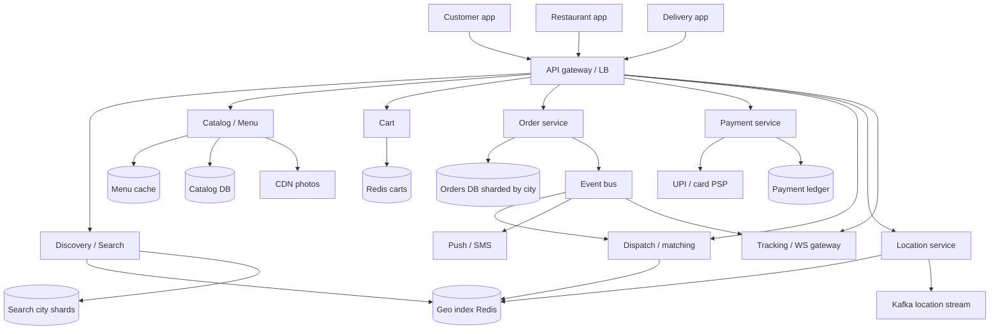
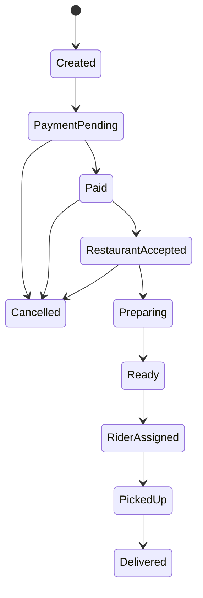

# Case Study 43 — Zomato / Food Delivery Marketplace

Design a **Zomato-class food delivery** system: discover nearby restaurants, browse menus, place an order, get a restaurant to accept it, match a delivery partner, and track the meal until it arrives.

This is **not** “Uber but for food.” It is three marketplaces glued together:

1. **Customer ↔ restaurant** (catalog, cart, kitchen SLA)
2. **Restaurant ↔ delivery partner** (pickup when food is ready)
3. **Customer ↔ delivery partner** (live tracking, cash/online pay)

Related: [Ride Sharing](10-ride-sharing.md) (geo matching), [E-commerce](16-ecommerce.md) (catalog + cart), [Hotel Booking](22-hotel-booking.md) (inventory), [Payment / Wallet](15-payment-wallet.md).

> **Practice first:** After §2, sketch the **order state machine** and say which step must be strongly consistent (assignment) vs eventual (map dots). Then do the estimates.

---

## 1. Problem

A hungry user opens the app at 1:05 pm. The system must:

- Show **restaurants that deliver to this pin** in under a second
- Show an **accurate menu** (price, veg, “out of stock”)
- Take an **order** that the restaurant can actually cook
- **Match a rider** who can pick up when food is ready — not 20 minutes early, not 20 minutes late
- Stream **location** to the customer
- Collect **payment** (UPI / card / wallet / cash) without double-charge
- Survive **lunch and dinner spikes** (the whole country’s peak is the same two windows)

Naive design: one Postgres, `SELECT * FROM restaurants WHERE city = 'Delhi'`, assign any free rider. That dies on peak QPS, stale menus, and double-assigning riders.

---

## 2. Requirements

### Functional (MVP)

| Actor | Needs |
|-------|--------|
| **Customer** | Search/browse nearby, menu, cart, coupon, place order, track, rate |
| **Restaurant** | Receive order, accept/reject, mark preparing / ready, 86 a dish |
| **Delivery partner** | Go online, see offers, navigate pickup → drop, cash collection |
| **Platform** | Match rider, ETA, support, payouts |

### Out of scope (initially)

- Dining-out table booking (Zomato Gold / dining is a **different** product)
- Hyperpure / grocery B2B
- Full ads auction
- Kitchen IoT printers as a hard requirement (nice adapter later)

### Non-functional

- Home feed / restaurant list **p99 < 300 ms**
- Place-order **p99 < 1 s** (payment may be extra round trip)
- Match rider **p95 < 30 s** after restaurant accept (food-delivery SLA, not Uber’s 5 s)
- **No double-assign** of a rider; **no lost orders** after payment success
- **99.9%** availability in live cities; degrade search before degrade checkout
- Scale: **India-wide**, city-sharded, **lunch/dinner peaks ~5–8×** average

---

## 3. Back-of-the-envelope estimates

Rough math, **order of magnitude**. Cheat sheet: **1 QPS ≈ 86,400 / day**. Food delivery peaks are **sharper** than social apps — two daily cliffs, not a smooth 3×.

### Why we estimate

We need to know whether **browse**, **GPS**, or **checkout** breaks first — they are different machines.

### Assumptions (say these out loud)

| Assumption | Value | Why it matters |
|------------|-------|----------------|
| Monthly active customers | 40M | India food-delivery class |
| Orders / day | 5M | Completed deliveries |
| Restaurants live | 250,000 | Catalog size |
| Average dishes / restaurant | 80 | Menu rows |
| Delivery partners online at peak | 250,000 | GPS write load |
| GPS ping interval | 4 s | Tracking QPS |
| Browse sessions / order | 8 | People window-shop |
| Average session restaurant-list views | 6 | Feed QPS |
| Peak factor lunch/dinner | 6× | 12:30–14:00 and 19:00–22:00 |
| Average order ticket | ₹400 | Not needed for QPS; useful for money path |
| Average items / order | 3 | Order-line storage |
| Rider search radius | 3 km | Matching |

India timezone: **one lunch peak for the whole country** (unlike global Uber). Design for **national simultaneous spike**.

---

### Step A — Traffic (QPS)

**Completed orders:**

```text
Avg order QPS     = 5M / 86,400 ≈ 58/s
Peak (6×)         ≈ 350 orders/s

Place-order attempts > completes (abandoned carts, payment fails):
  Assume 3× attempts → peak checkout ~1,000/s
```

Checkout at 1k/s is **easy for sharded OLTP** if you don’t hold global locks.

**Browse / discovery (the real read storm):**

```text
Sessions/day ≈ 5M orders × 8 browse sessions = 40M
List views/day ≈ 40M × 6 = 240M
Avg list QPS ≈ 240M / 86,400 ≈ 2,800/s
Peak (6×) ≈ 17,000/s

Menu opens: ~1/3 of list taps → peak ~5,000/s
Search typeahead: another few thousand/s in metros
```

**Insight:** **Read QPS on restaurant feed >> order QPS.** Cache + geo index + CDN for images. Do not hit MySQL for every scroll.

**Restaurant accept / kitchen events:**

```text
~1 event per order × a few status updates (5)
Peak status writes ≈ 350 × 5 ≈ 1,750/s  → fine
```

**GPS from riders (the write storm, same as Uber):**

```text
250,000 online riders / 4 s ≈ 62,500 location writes/s peak
  → Redis GEO / in-memory, not SQL
Customers watching a live order (~5–10 min of an order):
  Concurrent tracked orders at peak ≈ 350/s × 40 min cycle / wait
  Rough: 5M × 40 min / 1440 min ≈ 140k concurrent orders average;
  peak fraction in dinner hour could be 3–4× in metros → ~100k–200k live tracks
  Each map polls or websocket ~1 Hz → 100k–200k location reads/s
```

**Search vs match:**

```text
Ride-sharing match is “now”.
Food match is “when kitchen says ready” (10–25 min later).
Don’t assign a rider at checkout — they’ll idle at the gate.
```

---

### Step B — Storage

**Restaurant + menu catalog:**

```text
250k restaurants × 2 KB profile ≈ 500 MB
250k × 80 dishes × 500 B ≈ 10 GB
+ photos in object storage (CDN): 250k × 20 images × 200 KB ≈ 1 TB images
Search index ≈ 250k docs × 2 KB ≈ 500 MB (tiny; shard by city anyway)
```

Catalog is **small**. The hard part is **freshness** (price, stock, open/closed) not petabytes.

**Orders:**

```text
5M orders/day × 2 KB header ≈ 10 GB/day
Line items: 5M × 3 × 300 B ≈ 4.5 GB/day
90 days hot: ~1.3 TB
Years in warehouse / object store
```

**GPS (do not store every ping forever):**

```text
62,500 pings/s × 100 B ≈ 6.3 MB/s ≈ 540 GB/day raw
Keep last location in Redis; sample trail to Kafka → cold store
SQL only: trip polyline summary (~1 KB) at end
```

**Users / addresses / payments pointers:**

```text
40M users × 1 KB + 80M addresses × 300 B ≈ 40 GB + 24 GB
Fits one sharded MySQL fleet
```

---

### Step C — Bandwidth / other

**Images (menu, restaurant hero):**

```text
Peak 17k list views/s × 8 thumbnails × 30 KB
  ≈ 17,000 × 240 KB ≈ 4 GB/s if uncached
  → CDN + small thumbs; origin barely sees it
```

**Live map:**

```text
150k websocket clients × 80 B location / s ≈ 12 MB/s
Modest if you fan-out from a location service, not from SQL
```

**Payments:** ~350 captures/s peak — PSP handles cards/UPI; you store intents + idempotency keys.

---

### Step D — Read:write ratio

| Path | Share | Implication |
|------|--------|-------------|
| Restaurant feed / menu | Vast majority of **reads** | Cache by `geo_hash + meal_slot`; CDN images |
| Place order / pay | Tiny QPS, high **correctness** | OLTP + idempotency |
| Rider GPS | Huge **writes** | Redis GEO; not MySQL |
| Order status | Medium pub/sub | WebSocket / FCM |
| Search | Spiky reads | City-sharded search |

### What the numbers tell us

- **Split catalog (read-heavy)** from **orders (write-correct)** from **location (ephemeral)**.
- **City shard** everything: Delhi lunch should not lock Bangalore rows.
- **Don’t assign delivery at pay time** — assign near **ready for pickup**.
- **Peak is a product constraint:** autoscale before 12:00 and 19:00; pre-warm cache.
- **Menus must be cacheable with short TTL + push invalidation** when restaurant 86’s a dish.

### Common mistake for this problem

Copying **Uber matching at request time**, or putting **GPS pings in MySQL**, or one **global restaurant table** without city + open-hours filters. Food delivery’s scarce resource is **kitchen time + rider proximity at pickup**, not “nearest car right now.”

---

## 4. High-Level Design (HLD)



### Components

| Component | Role |
|-----------|------|
| Discovery | Nearby restaurants: open now, deliver to pin, cuisine, rating, ETA |
| Catalog | Menus, prices, item availability; cache + invalidation |
| Cart | Per-user cart in Redis; price snapshot at checkout |
| Order | State machine; source of truth after pay |
| Payment | Idempotent capture; wallet/UPI/cash-on-delivery flag |
| Dispatch | Offer order to riders; accept lease; re-offer on timeout |
| Location | Redis GEO; last-known; stream to tracking |
| Tracking | WebSocket/FCM: order status + rider dot |
| Notifications | Restaurant ringtone, rider ping, customer updates |
| Search | Typo-tolerant dish/restaurant search, city-scoped |

### City as the shard key (beginner gold)

Almost every hot query is **“this lat/lng, this city, this hour.”**

```text
Shard orders, restaurants, riders by city_id
Never run a pan-India SQL scan for a Delhi feed
```

---

## 5. Order state machine (LLD heart)

```text
CREATED  → PAYMENT_PENDING → PAID
         → RESTAURANT_ACCEPTED → PREPARING → READY
         → RIDER_ASSIGNED → PICKED_UP → DELIVERED
         → CANCELLED (from several states, with rules)
```



**Who is allowed to move the state:** only the owning service with **optimistic version** or DB transaction. Restaurant cannot mark `DELIVERED`. Rider cannot mark `PAID`.

**Assign rider when `READY` (or a few minutes before, using kitchen ETA)** — not at `PAID`.

---

## 6. Discovery: “restaurants near me”

### Filter pipeline

```text
1. city_id from pin / GPS
2. geohash / GEO radius (e.g. 5–8 km) ∩ serviceable polygons
3. is_open_now (hours + monsoon / surge close)
4. delivers_to_this_building (some kitchens have holes in the map)
5. rank: ETA, rating, conversion, ads
6. page of ~20 cards + image URLs
```

**Open-now** is not a SQL `WHERE` on every request. Precompute a Redis set `open:{city}:{slot}` refreshed every minute, or keep a bit on the cached document.

**ETA** ≈ prep time (restaurant p50) + rider travel (distance / city speed). Cache ETA buckets; don’t run a full router per card on the feed.

---

## 7. Menu and cart

**Menu cache key:** `menu:{restaurant_id}:{version}`

When chef marks “Chicken biryani out of stock”:

```text
bump menu version → invalidate cache → next GET misses to DB
optional: push to open cart sessions "item unavailable"
```

**Checkout snapshot:** freeze price, taxes, packing, delivery fee, surge into `order_quotes` so a 3-minute-old cart cannot pay yesterday’s fee.

```text
POST /v1/quotes  { cart_id, address_id, slot }
→ quote_id, expires_at (2–5 min), payable_amount
POST /v1/orders  { quote_id, payment_method, idempotency_key }
```

---

## 8. Dispatch / rider matching (food-specific)

Unlike Uber, the rider must **arrive when food is ready**.

```text
On READY (or PREP with ETA):
  GEOSEARCH riders available in 2–3 km of restaurant
  Score: distance, rating, current bag count, vehicle, batching
  Offer to top 1–3 riders with 15–20 s TTL
  On accept: compare-and-swap rider.status = BUSY
  On timeout: next riders
```

**Batching:** one rider, two orders from nearby kitchens if both ready — extra constraint (bag space, opposite directions). MVP: no batching.

**Double-assign prevention:**

```text
UPDATE riders SET status='BUSY', order_id=?
WHERE id=? AND status='AVAILABLE'
Rows updated = 1 → win; else retry
```

Same pattern as [Ride Sharing](10-ride-sharing.md) assignment.

---

## 9. Tracking and notifications

- **Customer:** WebSocket if app open; FCM for background (“Rider assigned”, “Out for delivery”)
- **Restaurant:** persistent connection or polling every 2–3 s on the order screen (kitchens are lossy Wi-Fi)
- **Location:** Location service publishes `rider_id → lat/lng`; Tracking service fans out only to customers of **that rider’s active order** (not global broadcast)

---

## 10. Payments (India)

| Method | Note |
|--------|------|
| UPI | Redirect/intent; webhook `payment_id`; **idempotency_key = order_id** |
| Card / netbanking | PSP; same webhook model |
| Wallet | Internal ledger; see [Payment / Wallet](15-payment-wallet.md) |
| COD | Mark `collect_cash`; rider confirms amount; recon later |

**Rule:** never create `PAID` from the client. Only from **verified PSP webhook** (or wallet debit in your ledger). Client can show “processing.”

Failed pay: order stays `PAYMENT_PENDING` then expires; inventory (if you decrement stock) must **release**.

---

## 11. APIs (interview-sized)

```text
GET  /v1/restaurants?lat=&lng=&cursor=
GET  /v1/restaurants/{id}/menu
POST /v1/cart/items
POST /v1/quotes
POST /v1/orders                    # Idempotency-Key header
GET  /v1/orders/{id}
GET  /v1/orders/{id}/track         # or WS /ws/orders/{id}

# Restaurant
GET  /v1/partner/orders?status=NEW
POST /v1/partner/orders/{id}/accept
POST /v1/partner/orders/{id}/ready
POST /v1/partner/menu/{item_id}/availability

# Rider
POST /v1/rider/location            { lat, lng, heading }
POST /v1/rider/offers/{id}/accept
POST /v1/rider/orders/{id}/picked
POST /v1/rider/orders/{id}/delivered
```

---

## 12. Schema sketches

```text
restaurants(id, city_id, name, lat, lng, geohash, hours_json, is_open)
dishes(id, restaurant_id, name, price_paise, in_stock, updated_at)
service_areas(restaurant_id, polygon or geohash_set)

orders(id, city_id, user_id, restaurant_id, rider_id, status, quote_id,
       address_snapshot, payable_paise, version, created_at)
order_items(order_id, dish_id, qty, price_paise_snapshot)
order_events(order_id, from_status, to_status, actor, ts)

riders(id, city_id, status, vehicle)          -- AVAILABLE / BUSY / OFFLINE
-- last location in Redis GEO, not here

payments(id, order_id, psp_ref, status, amount_paise)
```

Shard `orders` by `city_id` (or `city_id + hash(id)` if a city is huge — Delhi/Mumbai).

---

## 13. Failure modes

| Failure | User sees | First fix |
|---------|-----------|-----------|
| Menu cache stale | Pays for 86’d item | Versioned menu; restaurant can reject; auto-refund |
| PSP webhook delayed | “Paying…” forever | Poll PSP; timeout + cancel quote |
| Restaurant never accepts | Hungry and angry | SLA timer (2–3 min) → auto-cancel / switch kitchen |
| No rider nearby | Food getting cold | Widen radius; surge fee; stack orders; staff delivery |
| Rider double-assigned | Two apps, one human | CAS on rider status |
| GPS into MySQL | Site-wide latency | Redis GEO only |
| Lunch spike | Timeouts | Pre-scale; feed cache; shed search before checkout |
| City DB hotspot | One metro down | Shard; isolate cities |

---

## 14. Scale evolution

| Stage | Design |
|-------|--------|
| MVP city | One Postgres, one Redis, one city |
| Multi-city | Shard by `city_id`; separate dispatch loops |
| Peak lunch | Read replicas + menu cache; GPS off SQL |
| Dense metros | Split city into zones for dispatch |
| Catalog ads | Ranker + ads auction **after** geo filter |
| Batching | Multi-order bags; extra ETA math |
| Dining-out | Separate booking service — don’t overload delivery orders |

---

## 15. Interview talking points

1. **Three-sided marketplace**, not a store and not pure ride-hailing.
2. **Browse QPS dwarfs order QPS** — cache the feed.
3. **GPS is Redis**, orders are **OLTP**, photos are **CDN**.
4. **Assign rider at READY**, not at PAY.
5. **City shard** — India peaks at the same clock time.
6. **Idempotent payments** and **CAS rider assignment**.
7. **Quote snapshot** so prices don’t change mid-pay.
8. Show the **state machine** on the whiteboard before boxes.

---

## 16. Recap

Zomato-style delivery works when you:

1. **Filter restaurants by pin + open-now + geo**, then rank  
2. **Cache menus**, invalidate on stock/price  
3. **Freeze a quote**, pay **idempotently**, persist **order states**  
4. **Dispatch riders late**, with **leases** so two riders don’t get one bag  
5. **Stream location** from memory, not from the orders DB  
6. **Plan 6× lunch/dinner**, not a flat 24 h average  

**Practice:** Draw `PAID → READY → RIDER_ASSIGNED` for a Delhi 1:15 pm order. What is stored in Redis vs MySQL vs Kafka at each arrow?

**Previous:** [GitHub at Scale](42-github-at-scale.md) · **Also:** [Ride Sharing](10-ride-sharing.md), [E-commerce](16-ecommerce.md)
