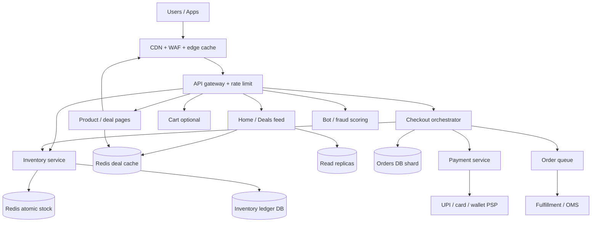
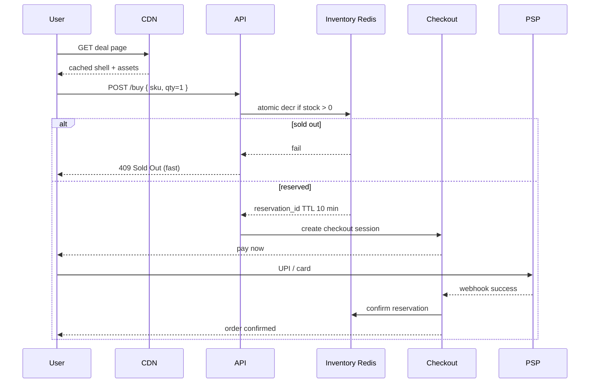

# Case Study 44 — Big Billion Days / Great Indian Festival (Flash Sale)

Design how **Flipkart Big Billion Days (BBD)** or **Amazon Great Indian Festival (GIF)** survive a **national shopping spike**: millions of users hit deal pages at the same second, carts explode, inventory vanishes in minutes, and payments must not double-charge.

This is **not** normal e-commerce from [Case Study 16](16-ecommerce.md). A sale day is a **planned DDoS you invite** — 10–50× traffic, **hot SKUs**, and **inventory correctness** under extreme contention.

Related: [Ticket Booking](11-ticket-booking.md) (flash holds), [E-commerce Catalog](16-ecommerce.md), [Rate Limiter](03-rate-limiter.md), [Caching](08-caching.md), [Payment / Wallet](15-payment-wallet.md), [Global DDoS Mitigation](39-global-ddos-mitigation.md).

> **Practice first:** After §2, name the **three bottlenecks** you expect: browse, **inventory**, or **checkout/pay**. Then read the estimates and see if you were right.

---

## 1. Problem — Why “scale the servers 2×” fails

On a normal Tuesday, Flipkart/Amazon look like:

```text
Browse catalog → add to cart → checkout → pay → order confirmed
```

On **BBD / GIF opening night**:

1. **Everyone arrives at once** — 8 PM IST, not a smooth curve  
2. **10 SKUs get 80% of clicks** — iPhone, TV, detergent mega-packs  
3. **Inventory is finite** — 5,000 units, 500,000 people clicking “Buy Now”  
4. **Bots and resellers** hammer APIs  
5. **Payments spike** — UPI/card gateways have their own limits  
6. **One bad deploy** becomes national news  

The system must:

- Keep **deal pages and home feed up** (even if degraded)  
- **Never oversell** inventory (legal + trust)  
- **Not melt** the primary database on hot SKU rows  
- **Checkout fairly** — first successful payment wins, not random errors  
- **Recover** when a dependency blips (PSP timeout, cache miss storm)  

---

## 2. Requirements

### Functional (sale-specific)

| Flow | Must work |
|------|-----------|
| **Deal discovery** | Home takeover, category deals, countdown, “Coming Soon” |
| **Buy Now / Add to cart** | For lightning deals; often **Buy Now** skips cart |
| **Inventory** | Show “X left”, sell out honestly, no ghost stock |
| **Checkout** | Address, payment, order confirmation |
| **Waitlist / notify** | Optional when sold out |
| **Seller / marketplace** | Many SKUs are FBA / Flipkart Assured — split fulfillment later |

### Non-functional (the hard part)

| Property | Target |
|----------|--------|
| Home + deal page availability | **99.95%+** during sale window |
| Browse p99 | **< 500 ms** (degraded OK: stale counts) |
| Buy / reserve attempt | **Fail fast** if OOS (< 200 ms), don’t hang |
| **Zero oversell** on deal SKUs | Strong inventory invariant |
| Payment | **Idempotent**; no double charge on retry |
| Peak vs normal | **10–50×** read; **100×+** on hero SKUs |
| Bot abuse | Rate limits, device attestation (awareness) |

### Out of scope (MVP interview)

- Full ads auction for deal slots  
- Dynamic pricing ML during the hour  
- Cross-border tax  

---

## 3. Back-of-the-envelope estimates

Numbers are **India sale-night ballparks**, not leaked Flipkart/Amazon capacity plans. Cheat sheet: **1 QPS ≈ 86,400/day**. Sale peaks are **cliff-shaped**, not 5× average — use **10–50×** for the first 30–60 minutes.

### Why we estimate

Sale night tells you **which layer dies first**:

- CDN + cache → browse  
- Redis + atomic counters → inventory  
- Queue + idempotency → checkout  
- PSP → external ceiling  

### Assumptions (say out loud)

| Assumption | Normal day | Sale night (first hour) |
|------------|------------|-------------------------|
| Active users trying to shop | 2M/day spread | **20M in 60 min** |
| Page views / user | 15 | 25 (refreshing deals) |
| “Buy Now” clicks / user | 0.3 | 2 (many failures) |
| Hero deal SKUs | — | **20 SKUs**, 5k units each |
| Catalog SKUs total | 50M+ | same |
| Successful orders / hour at peak | ~50k/hour normal | **500k–1M/hour** class |
| Payment success rate | 95% | 85% (gateway stress) |
| Average order metadata | 3 KB | same |

Flipkart BBD and Amazon GIF differ in branding and seller mix; **engineering shape is the same**: spike + hot keys + inventory.

---

### Step A — Traffic (QPS)

**Browse / API reads (home, deal pages, product detail):**

```text
Sale hour page views = 20M users × 25 views = 500M views/hour
                     = 500M / 3,600 ≈ 139,000 page views/s

API calls per page ≈ 3–8 (home feed, deals, recommendations, images)
  → 139k × 5 ≈ 695,000 API reads/s (order of 700k/s)

Without CDN/cache this is impossible at origin.
With CDN on static + 90% cache hit on deal JSON:
  Origin ≈ 70k/s still brutal → pre-warm, edge cache, read replicas
```

**Compare to normal:**

```text
2M DAU × 15 views = 30M/day ≈ 350/s average
Sale peak ≈ 700k/s → ~2,000× average browse API (cliff, not smooth 5×)
```

**Buy Now / add-to-cart attempts:**

```text
20M users × 2 clicks = 40M attempts/hour ≈ 11,000/s

Hero SKU subset:
  5 hero phones × 11,000/s × 40% traffic share ≈ 4,400/s on ONE sku_id
  → classic hot-key problem
```

**Successful checkout / order create:**

```text
Target 500k orders in peak hour ≈ 140/s sustained success
With 85% pay success → ~165 order creates/s
Peak minute might be 3× → ~500 orders/s

This is SMALL compared to browse QPS — important insight!
Sale night is NOT 700k order writes/s; it's 700k reads/s + 11k inventory fights/s
```

**Payment webhooks / captures:**

```text
~500 peak orders/s × 1.2 retries ≈ 600 payment events/s
PSP scale — you queue and idempotize, don't sync-block UI
```

---

### Step B — Storage & inventory math

**Hero deal inventory:**

```text
20 SKUs × 5,000 units = 100,000 units total across heroes
Contention: 4,400 attempts/s on one SKU, 5,000 units
  → sells out in ~1–2 seconds if every attempt succeeded
  → most attempts MUST fail fast with "Sold Out"
```

**Inventory row design:**

```text
Do NOT: SELECT stock FROM products WHERE id=? FOR UPDATE  (4,400/s on one row)

DO: Redis DECR or Lua script on stock:{sku_id}
    or sharded counter with async reconcile to DB
```

**Orders storage:**

```text
500k orders/hour × 3 KB ≈ 1.5 GB/hour metadata
Day of sale 5–10M orders → tens of GB — trivial for sharded OLTP
```

**Cart (if used):**

```text
Flash "Buy Now" often bypasses long-lived cart
If 5M active carts × 1 KB ≈ 5 GB Redis — fine
```

---

### Step C — Bandwidth

**Images / deal banners:**

```text
700k API/s × 200 KB image if uncached = 140 GB/s → CDN mandatory
Deal hero images pushed to CDN days before; immutable URLs
```

**Static deal HTML fragments:**

```text
Edge cache "deal page shell" with client-side hydrate
Reduces origin HTML generation
```

---

### Step D — Ratios & capacity table

| Path | Sale-night share | Plan |
|------|------------------|------|
| Browse / feed | **~95% of requests** | CDN, cache, pre-warm, degrade recommendations |
| Inventory decrement | **Hottest writes** | Redis atomic, per-SKU isolation |
| Order create | Moderate | Sharded DB, async fulfillment msg |
| Payment | Spiky, external | Idempotency keys, webhook queue |
| Search | High but cacheable | Freeze index updates during peak minute optional |

| Metric | Order of magnitude |
|--------|-------------------|
| Peak API reads | **500k–1M/s** (with CDN: origin **50k–100k/s**) |
| Buy attempts | **~11k/s** |
| Hot SKU writes | **~4k/s on one key** |
| Successful orders | **~140–500/s** |
| Oversell tolerance | **0** |

### What the numbers tell us

- **Optimize read path first** — CDN + cache warming + deal page as mostly static  
- **Inventory is a specialized counter service**, not generic SQL row locks  
- **Checkout QPS is modest**; fairness and idempotency matter more than raw throughput  
- **Hero SKU is a micro flash sale inside the mega sale** — same pattern as [Ticket Booking](11-ticket-booking.md)  
- **Degrade gracefully**: drop recommendations before drop buy button  
- **Load test at 2× expected** weeks before; **game day** runbooks  

### Common mistake for this problem

“Add 50 app servers.” Without **CDN + inventory isolation + hot-key plan**, servers only die slower. Another mistake: **overselling** because async inventory sync lagged behind Redis.

---

## 4. High-Level Design (HLD)



### Sale-night control plane (how teams “operate” the sale)

| Lever | Purpose |
|-------|---------|
| **Cache warm** | Load hero deal JSON into Redis/CDN T-24h, T-1h |
| **Feature flags** | Turn off heavy reco, reviews, non-critical widgets |
| **Traffic shedding** | Queue page for “soft wait room” if origin unhealthy |
| **Read-only mode** | Browse only if checkout catching fire (last resort) |
| **Frozen deploys** | Code freeze 72h before; only roll-forward fixes |
| **War room** | SLO dashboard: CDN hit %, Redis latency, oversell alarms |

Flipkart/Amazon run **months of rehearsal** — load tests, failure injection, runbooks — not just bigger VMs.

---

## 5. Timeline — what happens when the sale opens

```text
T-7 days   Deal SKUs ingested; inventory allocated; prices locked
T-48h      CDN preload images; cache warm scripts
T-1h       Scale out app + Redis clusters; disable non-critical jobs
T-0        Countdown ends → traffic cliff
T+0–5m     Hero SKUs sell out; Redis DECR storm; "Sold Out" UX
T+5–60m    Long tail browse + checkout for non-hero items
T+days     Reconcile inventory ledger; refunds for edge cases
```



---

## 6. LLD — Inventory (the heart of the sale)

### Two-phase inventory (like ticket holds)

```text
Phase 1 RESERVE (on Buy Now click):
  Lua: if stock[sku] >= qty then stock -= qty; create reservation_id TTL 600s

Phase 2 CONFIRM (on payment success):
  mark reservation CONFIRMED; write order line; async persist to InvDB

Phase 3 RELEASE (TTL or payment fail):
  stock += qty; reservation EXPIRED
```

**Why TTL reservation?** Stops hoarding: user clicks Buy but never pays — stock returns in 10 minutes.

**Redis Lua sketch (conceptual):**

```text
-- keys: stock:{sku}, res:{reservation_id}
if GET stock:{sku} >= qty then
  DECRBY stock:{sku} qty
  SET res:{id} {sku, qty, user} EX 600
  return OK
else
  return SOLD_OUT
end
```

**Reconcile to DB:** async worker batches confirmed decrements to `inventory_ledger` for audit. Source of truth during sale minute is **Redis**; DB catches up.

### Hero SKU sharding (advanced)

One Redis key `stock:iphone16` still serializes 4k ops/s. Options:

- **Pre-split buckets**: `stock:sku:000..127` random bucket decrement (sum = total)  
- **Token bucket units**: 5,000 tokens in list `LPOP` (each token = one unit)  
- **Accept serialization** if 4k/s is within single Redis node limit (~100k ops/s) — often enough  

Interview: mention **single hot key** and at least one mitigation.

---

## 7. LLD — Checkout & payments

```text
POST /v1/deals/{sku}/buy
  Headers: Idempotency-Key (device + user + sku + sale_window)
  → reservation_id OR 409 sold out

POST /v1/checkout/sessions
  Body: { reservation_id, address_id }
  → session_id, payable_amount (frozen)

POST /v1/checkout/sessions/{id}/pay
  → redirect to PSP / UPI intent

Webhook POST /v1/payments/webhook
  → verify signature
  → idempotent on psp_payment_id
  → confirm reservation → create order → enqueue fulfillment
```

**Idempotency:** Same user double-taps Buy → same `Idempotency-Key` → same reservation or same error, never two decrements.

**Payment pending:** Show “Processing”; poll or webhook; **never** decrement twice on retry.

See [Payment / Wallet](15-payment-wallet.md) for ledger patterns.

---

## 8. Read path — CDN, cache warming, degradation

| Asset | Strategy |
|-------|----------|
| Product images | CDN; immutable URL `.../iphone16-bbd2026.jpg` |
| Deal listing JSON | Redis `deals:bbd:wave1` TTL 5s during peak; longer pre-open |
| Home feed | Precomputed modules; disable personalization first |
| Stock count on PDP | **Eventual** — show “Few left” bands; exact count from Redis with 1–2s cache |
| Search | Cache top queries; optional read-only index snapshot |

**Cache stampede:** Single-flight on hero keys — [Caching](08-caching.md).

**Soft wait room (optional):** If origin error rate > threshold, queue users with token before HTML (Ticketmaster pattern). Flipkart has used **app-only** deals to reduce web blast — product + capacity trade-off.

---

## 9. Bot abuse & fairness

- **Rate limit** per IP / user / device on `POST /buy` ([Rate Limiter](03-rate-limiter.md))  
- **Captcha** on suspicious velocity  
- **Logged-in only** for hero deals (reduces anonymous bots)  
- **One unit per user** flag on hero SKU (`max_qty_per_user=1`) stored in reservation service  

Fairness > perfect UX for the first 60 seconds.

---

## 10. Flipkart BBD vs Amazon GIF (same engine, different skin)

| Dimension | Flipkart BBD | Amazon GIF |
|-----------|--------------|------------|
| Traffic shape | National cliff, app-heavy | Same; Prime early access window |
| Inventory | Marketplace + Flipkart Assured | FBA + marketplace |
| Payments | UPI-heavy India | UPI + cards + COD (where enabled) |
| Early access | Plus / loyalty tiers | Prime early deals |
| Engineering | CDN + Redis inventory + sharded checkout | Same class of systems |

Interview answer: **“Same flash-sale architecture; differences are business rules and seller mix, not magic databases.”**

---

## 11. Schema sketches

```text
sale_events(id, name, start_at, end_at, status)
deal_skus(sale_id, sku_id, deal_price_paise, stock_allocated, max_per_user)

-- audit / source after reconcile
inventory_ledger(sku_id, delta, reason, reservation_id, ts)

reservations(id, sku_id, user_id, qty, status, expires_at)
orders(id, user_id, sale_id, status, payable_paise, ...)
order_items(order_id, sku_id, qty, price_paise_snapshot)

payments(id, order_id, psp_ref, status, idempotency_key)
```

Redis (ephemeral during sale):

```text
stock:{sku_id}           → integer
res:{reservation_id}     → hash, TTL
user_limit:{sale}:{user}:{sku} → 1 if max_per_user
```

---

## 12. Failure modes

| Failure | Symptom | Mitigation |
|---------|---------|------------|
| Redis down | Cannot trust stock | Fail closed: disable Buy; browse only; restore from DB snapshot |
| Oversell bug | Orders > stock | Reconciliation job; cancel + refund; legal incident |
| PSP slow | Stuck on “Paying” | Async webhook; reservation TTL releases stock |
| CDN miss storm | Origin overload | Pre-warm; raise TTL; shed widgets |
| Hot key Redis CPU | Latency on one SKU | Bucket split; local cache on app for read stock |
| DB primary hot | Checkout errors | Shard orders by user_id; queue order create |
| Bad deploy | National outage | Freeze; rollback; feature flags |

**Golden rule:** **Never oversell.** Better to show “Try again” than sell 6,000 of 5,000 units.

---

## 13. Scale evolution

| Stage | Design |
|-------|--------|
| Normal ecommerce | Catalog + cart + SQL stock — Case 16 |
| First sale | Redis counters + CDN |
| National sale | Reservations + idempotent checkout + war room |
| Hero SKU wars | Bucketed inventory + rate limits |
| Multi-wave sale | `wave2` cache keys; reset traffic between waves |

---

## 14. Interview talking points

1. **Sale night = read avalanche + write hot keys**, not uniform scale-up.  
2. **CDN + cache warm** is as important as app servers.  
3. **Two-phase inventory** (reserve → confirm) like tickets.  
4. **Checkout QPS is lower than browse** — don’t optimize the wrong layer.  
5. **Idempotency** on buy and pay.  
6. **Degrade features** before dropping purchase path.  
7. **Flipkart and Amazon** share the same flash-sale playbook.  
8. Quote **BOE**: ~700k read/s cliff, ~11k buy attempts/s, **~4k/s on one SKU**, ~500 order/s success.

---

## 15. Recap

Big Billion Days / Great Indian Festival engineering is **planned overload**:

1. **Push reads to CDN and Redis** — origin sees survivable QPS  
2. **Fight inventory with atomic counters + reservations**, not row locks  
3. **Checkout is orchestrated, idempotent, and queued**  
4. **Hero SKUs are mini ticket sales** inside a national event  
5. **Operate the sale** — freeze, warm, flag, war room, reconcile  

**Practice:** A hero phone has **5,000 units** and **4,000 Buy clicks per second** for 3 seconds. Walk through Redis DECR, reservation TTL, and payment webhook — how many orders confirm, and when does “Sold Out” appear?

**Previous:** [Zomato / Food Delivery](43-zomato-food-delivery.md) · **Also:** [Ticket Booking](11-ticket-booking.md), [E-commerce](16-ecommerce.md)
